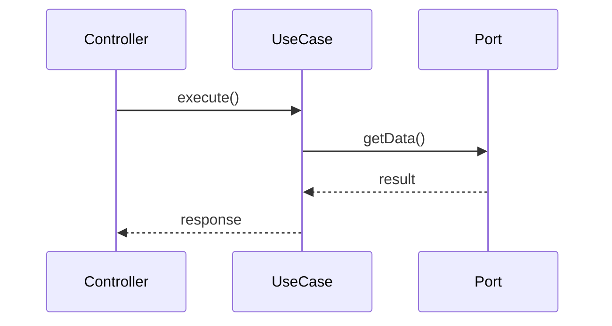

# Copilot Instructions — KeyGo Server

Responde en **español (es-MX/es)** por defecto, salvo que el usuario pida otro idioma.

## Flujo de trabajo obligatorio del agente

> Aplica a **toda** acción que implique generar o modificar código, configuración o estructura.

### 1 · Planificar primero, implementar después

Antes de escribir cualquier línea de código o hacer cualquier cambio, el agente **debe**:

1. Leer y considerar los documentos de referencia obligatorios (ver sección siguiente).
2. Presentar un **plan explícito** que incluya:
   - Módulos afectados y justificación arquitectónica.
   - Clases/archivos a crear o modificar.
   - Flujo de datos / secuencia de llamadas.
   - Tests a agregar.
3. Esperar confirmación implícita (continuar el chat) o explícita antes de implementar.

### 2 · Documentación: solo cuando se ordene explícitamente

- **Dentro de un mismo contexto de chat, NO generar documentación automáticamente.**
- Generar o actualizar archivos `.md` únicamente cuando el usuario lo indique con una orden explícita (p. ej. "documenta esto", "actualiza el README").
- Cuando se genere documentación, colocarla **siempre en la ruta que corresponde** (ver tabla de ubicaciones en `ARCHITECTURE.md` o `docs/`).

#### Diagramas en documentación

Cuando sea necesario incluir un diagrama, usar el siguiente orden de preferencia:

| Prioridad | Herramienta | Cuándo usarla |
|---|---|---|
| 1 | **Mermaid** | Primera opción siempre — soportado nativamente en GitHub, GitLab, Notion y la mayoría de editores Markdown |
| 2 | **PlantUML** | Si el tipo de diagrama no es expresable con Mermaid (p. ej. diagramas de componentes complejos, C4, timing) |
| 3 | **ASCII art** | Último recurso — solo si ni Mermaid ni PlantUML son viables en el contexto |

Ejemplo de bloque Mermaid:
````markdown

````

### 3 · Documentos de referencia obligatorios

Antes de cualquier acción, el agente debe consultar:

| Documento | Ruta | Para qué sirve |
|---|---|---|
| Contexto general AI | `AI_CONTEXT.md` | Estado del proyecto, bugs conocidos, convenciones |
| Lecciones aprendidas | `docs/ai/lecciones.md` | Errores resueltos y buenas prácticas — **leer para no repetir errores** |
| Propuestas de mejoras | `docs/ai/propuestas.md` | Estado de propuestas T-NNN/F-NNN activas y completadas |
| Inconsistencias conocidas | `docs/ai/inconsistencias.md` | Centralizador de inconsistencias detectadas |
| Arquitectura | `ARCHITECTURE.md` | Decisiones de diseño y estructura de módulos |
| Guía de agentes | `AGENTS.md` | Quick-start: módulos, comandos, patrones y flujos concretos |
| Historial de cambios | `docs/ai/agents-registro.md` | Registro detallado de cambios al quick-start |
| Reglas de agentes | `CLAUDE.md` | Reglas de oro y flujo de trabajo |
| Instrucciones Copilot | `.github/copilot-instructions.md` | Este mismo archivo |
| Roadmap de mejoras | `ROADMAP.md` | Propuestas técnicas (T-NNN) y funcionales (F-NNN) activas y completadas |

Adicionalmente, consultar los documentos específicos de los módulos involucrados en la tarea (p. ej. `docs/keygo-api/`, `docs/keygo-run/`).

### 4 · Aprendizaje continuo y retroalimentación obligatoria

Al concluir **cualquier tarea** (feature, corrección, refactor, configuración, etc.), el agente **debe** evaluar si ocurrió alguno de los eventos listados a continuación y, si es así, actualizar el documento correspondiente **antes de cerrar la tarea**:

| Evento | Documento a actualizar | Sección destino |
|---|---|---|
| Error de compilación encontrado y resuelto | `docs/ai/lecciones.md` | `## Lecciones` |
| Test fallido detectado y corregido | `docs/ai/lecciones.md` | `## Lecciones` |
| Comportamiento inesperado descubierto (bug, quirk del framework) | `docs/ai/lecciones.md` | `## Lecciones` |
| Mejor forma de implementar un patrón ya existente | `docs/ai/lecciones.md` | `## Lecciones` |
| Cambio de versión de dependencia o tecnología relevante | `docs/ai/lecciones.md` | `## Lecciones` |
| Nueva convención establecida o patrón acordado | `docs/ai/lecciones.md` | `## Lecciones` |
| Inconsistencia detectada entre docs y código/DB | `docs/ai/inconsistencias-<cat>.md` + `docs/ai/inconsistencias.md` | Agregar detalle + actualizar índice |
| Propuesta recurrente o de alto valor para el proyecto | `docs/ai/propuestas.md` + `ROADMAP.md` | `## Propuestas de mejoras futuras` + tabla técnica o funcional |
| Propuesta técnica concreta generada al concluir tarea | `ROADMAP.md` | Tabla **Propuestas técnicas** (horizonte correspondiente) con ID `T-NNN` |
| Propuesta funcional nueva o aclaración de épica | `ROADMAP.md` | Tabla **Propuestas funcionales** con ID `F-NNN` |
| Propuesta completada / implementada | `docs/ai/propuestas.md` + `ROADMAP.md` | Marcar ✅ + tabla **Historial de propuestas completadas** |
| Cambio en módulos, rutas, comandos o URLs del quick-start | `AGENTS.md` + `docs/ai/agents-registro.md` | Sección correspondiente + entrada en registro |
| Nuevo endpoint REST creado o modificado | `postman/KeyGo-Server.postman_collection.json` | Agregar o actualizar request con método, URL, headers, body y `pm.test()` |
| Nueva migración Flyway creada (`V{n}__*.sql`) | `docs/data/DATA_MODEL.md` | Agregar diccionario de la(s) nueva(s) tabla(s) con campos, tipos, constraints y reglas de negocio |
| Nueva migración Flyway creada (`V{n}__*.sql`) | `docs/data/ENTITY_RELATIONSHIPS.md` | Actualizar diagramas de contexto y relaciones afectadas |
| Nueva migración Flyway creada (`V{n}__*.sql`) | `docs/data/MIGRATIONS.md` | Actualizar sección "Próximas migraciones" y cualquier referencia relevante |

> ⚠️ Esta actualización **no está sujeta** a la regla del punto 2 (solo bajo orden explícita), ya que
> los documentos de base de conocimiento AI (`AI_CONTEXT.md`, `AGENTS.md`) son parte del ciclo de
> trabajo del agente, no documentación de producto.

**Formato obligatorio para entradas en `## Lecciones aprendidas`:**

```markdown
### [YYYY-MM-DD] Título descriptivo de la lección
**Contexto:** Breve descripción de la tarea o escenario que generó el aprendizaje.
**Problema:** Qué falló, qué comportamiento inesperado se detectó o qué patrón mejoró.
**Solución / Buena práctica:** Cómo se resolvió o qué debe hacerse en el futuro.
**Archivos clave:** (opcional) Rutas relevantes para contextualizar la solución.
```

### 5 · Git — prohibición de ejecución directa

- El agente **nunca debe ejecutar comandos `git`** (commit, push, merge, rebase, etc.) directamente.
- Si un flujo requiere operaciones de git, listar los comandos sugeridos para que el usuario los ejecute manualmente.

### 6 · Propuesta de mejoras futuras

Al concluir cualquier tarea (feature, corrección, refactor, configuración, etc.), el agente **debe** incluir una sección de propuestas organizadas en tres horizontes temporales:

| Horizonte | Criterio orientativo | Ejemplos |
|---|---|---|
| **Corto plazo** | Mejoras directamente relacionadas con lo que se acaba de implementar; bajo esfuerzo | Agregar validaciones, ampliar tests, limpiar TODOs |
| **Mediano plazo** | Evoluciones naturales de la funcionalidad actual; esfuerzo moderado | Nuevos endpoints relacionados, caché, paginación |
| **Largo plazo** | Capacidades estratégicas del sistema; alto esfuerzo o dependencias externas | Autenticación OAuth2, multi-tenancy, observabilidad avanzada |

- Las propuestas deben ser **concretas y accionables**, no genéricas.
- No es necesario implementarlas; solo describirlas para orientar la hoja de ruta.
- Si una propuesta es recurrente o relevante para el proyecto, registrarla también en `AI_CONTEXT.md` bajo `## Propuestas de mejoras futuras`.

## Contexto del repositorio

- Monorepo Maven multi-módulo (Java 21, Spring Boot).
- Módulo ejecutable: `keygo-run`.
- Arquitectura: **Hexagonal / Ports & Adapters**.
- Base path en runtime: `context-path=/keygo-server` (todos los endpoints lo incluyen).
- DB opcional: `keygo-supabase` con Spring Data JPA + Flyway + PostgreSQL (perfil `supabase`).

## Reglas de implementación

- **NO** pongas dependencias de Spring en `keygo-domain`.
- Los endpoints REST van **solo** en `keygo-api` y devuelven `BaseResponse<T>`.
- Sigue el versionado `/api/v1/...` para endpoints nuevos.
- La lógica de negocio va en usecases dentro de `keygo-app`.
- Implementaciones concretas (repos, clients externos) van en `keygo-infra` o `keygo-supabase`.
- **Al crear o modificar cualquier endpoint REST**, agregar o actualizar el request correspondiente en `postman/KeyGo-Server.postman_collection.json` **antes de cerrar la tarea**. Incluir: método, URL con variables de entorno, headers necesarios, body de ejemplo (si aplica) y scripts `pm.test()` que validen status code y estructura `BaseResponse`. Esta actualización **no requiere orden explícita** del usuario.
- Si necesitas DB:
  - Perfil `supabase` debe estar activo (`SPRING_PROFILES_ACTIVE`).
  - Variables requeridas: `SUPABASE_URL`, `SUPABASE_USER`, `SUPABASE_PASSWORD`.
- Seguridad:
  - **Nunca** incluyas secretos, tokens ni passwords en el código o commits.
  - El filtro `BootstrapAdminKeyFilter` protege `/api/**` con header `X-KEYGO-ADMIN`.
  - Validar siempre el comportamiento con `context-path` activo antes de asumir que funciona.

## Convenciones de calidad

- Cambios pequeños y coherentes por commit.
- Siempre incluir en las respuestas:
  - Tests unitarios (JUnit 5 + AssertJ + Mockito).
  - Comandos de verificación (`./mvnw test`, `./mvnw clean package`).
- **No** actualizar documentación de forma automática; esperar orden explícita del usuario.
- Si falla un intento de implementación, registrar el aprendizaje en `docs/ai/lecciones.md` (sección `## Lecciones`) antes de continuar.

## Comandos de referencia

```bash
# Build
./mvnw clean package

# Tests
./mvnw test

# Correr app
./mvnw spring-boot:run -pl keygo-run

# Correr módulo específico de tests
./mvnw -pl keygo-api test
./mvnw -pl keygo-supabase test
```

## Alcance de estas instrucciones

Aplican a **Copilot Chat y agent mode**. No afectan las sugerencias inline mientras se escribe código.

