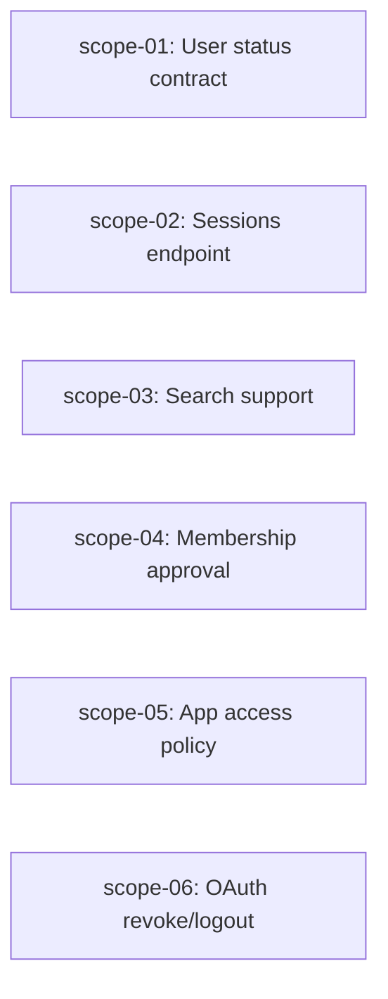

# 🚀 EXPANSION: BACK-003 — Marcha Blanca Backend P1

> **Status:** DONE
> [← README.md](README.md) | [← planning/README.md](../../README.md)

---

## Scope Summary

| # | Scope | Fases SDLC | Depende de | Estado |
|---|-------|-----------|------------|--------|
| 01 | Contrato suspend/activate de usuarios | V, T, S | — | DONE |
| 02 | Endpoint admin de sesiones de usuario | V, T | — | DONE |
| 03 | Búsqueda remota usuarios y apps | V, T | — | DONE |
| 04 | Política de aprobación de memberships | V, T | — | DONE |
| 05 | Política de acceso/registro por app | V, T, S, M | — | DONE |
| 06 | Contrato revocación OAuth y logout | V, T | — | DONE |

---

## Dependency Map

*Todos los scopes son independientes entre sí en este planning.*

---

## Impact per SDLC Phase

| Fase | Afectada | Qué cambia |
|------|---------|------------|
| D | ☐ | — |
| R | ☐ | — |
| S | ✅ | Contratos de acción de usuario (scope-01), política de acceso (scope-05), revocación (scope-06) |
| M | ✅ | Migración Flyway: campo `access_policy` en `client_app` (scope-05) |
| P | ☐ | — |
| V | ✅ | Implementación en todos los scopes |
| T | ✅ | Tests de integración y contrato |
| B | ☐ | — |
| O | ☐ | — |
| N | ☐ | — |
| F | ☐ | — |
| G | ☐ | — |
| W | ✅ | Este planning |

---

## Notes

- scope-05 requiere Flyway migration (V24 o siguiente disponible).
- scope-02 tiene alternativa B (ocultar en UI) si no existe persistencia real de sesiones; documentar decisión en scope antes de implementar.
- scope-04 tiene dos caminos (simple: crear memberships directamente ACTIVE; completo: flujo PENDING); documentar decisión en scope.

---

> [← README.md](README.md) | [← planning/README.md](../../README.md)
