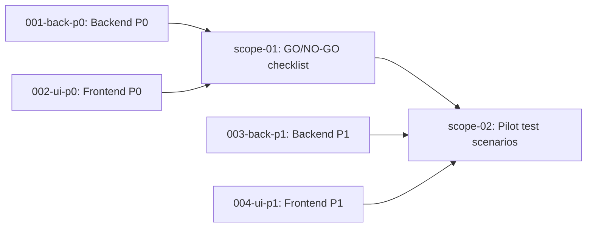

# 🚀 EXPANSION: QA-005 — Marcha Blanca Quality Gates

> **Status:** DEEPENING
> [← README.md](README.md) | [← planning/README.md](../../README.md)

---

## Scope Summary

| # | Scope | Fases SDLC | Depende de | Estado |
|---|-------|-----------|------------|--------|
| 01 | Checklist GO/NO-GO marcha blanca | T | BACK-001 (P0 completo), UI-002 (P0 completo) | PENDING |
| 02 | Escenarios de prueba piloto guiado | T, B, O | BACK-003, UI-004 (P1 completo) | PENDING |

---

## Dependency Map

---

## Impact per SDLC Phase

| Fase | Afectada | Qué cambia |
|------|---------|------------|
| D | ☐ | — |
| R | ☐ | — |
| S | ☐ | — |
| M | ☐ | — |
| P | ☐ | — |
| V | ☐ | — |
| T | ✅ | Ejecución de checklist y escenarios de prueba E2E |
| B | ✅ | Despliegue a ambiente piloto para validación |
| O | ✅ | Operación inicial del piloto guiado |
| N | ☐ | — |
| F | ☐ | — |
| G | ☐ | — |
| W | ✅ | Este planning |

---

## Notes

- scope-01 (GO/NO-GO) debe ejecutarse al terminar P0 backend + P0 frontend como mínimo.
- scope-02 (escenarios piloto) requiere todo el sistema P1 desplegado.
- El resultado de scope-01 determina si se puede proceder con el piloto; si hay condiciones NO-GO deben resolverse antes de continuar.

---

> [← README.md](README.md) | [← planning/README.md](../../README.md)
