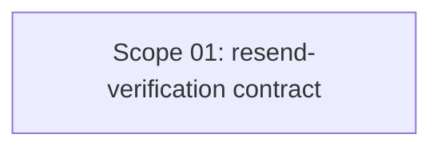

# 🚀 EXPANSION: BACK-006 — Fix contrato resend-verification

> **Status:** DEEPENING
> [← README.md](README.md) | [← planning/README.md](../../README.md)

---

## Scope Summary

| # | Scope | Fases SDLC | Depende de | Estado |
|---|-------|-----------|------------|--------|
| 01 | Contrato resend-verification: registration_id como identificador | V, T | — | PENDING |

---

## Dependency Map

*Scope único, sin dependencias externas.*

---

## Impact per SDLC Phase

| Fase | Afectada | Qué cambia |
|------|---------|------------|
| D | ☐ | — |
| R | ☐ | — |
| S | ✅ | Contrato del endpoint: `email` pasa a opcional, `registration_id` se agrega como identificador primario |
| M | ☐ | Sin cambios de datos ni migraciones |
| P | ☐ | — |
| V | ✅ | `ResendVerificationRequest`, `ResendVerificationCommand`, `ResendVerificationEmailUseCase`, `RegistrationController` |
| T | ✅ | `ResendVerificationEmailUseCaseTest`, `RegistrationControllerTest` |
| B | ☐ | — |
| O | ☐ | — |
| N | ☐ | — |
| F | ☐ | — |
| G | ☐ | — |
| W | ✅ | Este planning |

---

## Notes

- No requiere Flyway migration.
- El contrato de `verify-email` (`VerifyEmailRequest` + `VerifyEmailUseCase`) es el modelo de referencia: prioriza `registration_id` sobre `email` cuando ambos están presentes.
- Problema secundario detectado durante el análisis: `VerifyEmailUseCase` lanza `IllegalArgumentException` en lugar de una excepción de la jerarquía keygo. Registrado como residual en scope-01.

---

> [← README.md](README.md) | [← planning/README.md](../../README.md)
