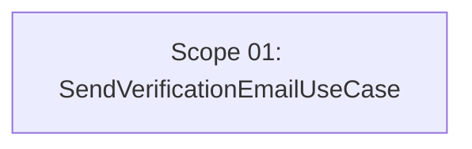

# 🚀 EXPANSION: BACK-007 — Refactor envío de email de verificación

> **Status:** DEEPENING
> [← README.md](README.md) | [← planning/README.md](../../README.md)

---

## Scope Summary

| # | Scope | Fases SDLC | Depende de | Estado |
|---|-------|-----------|------------|--------|
| 01 | Extracción de SendVerificationEmailUseCase | S, V, T | — | PENDING |

---

## Dependency Map

*Scope único, sin dependencias externas.*

---

## Impact per SDLC Phase

| Fase | Afectada | Qué cambia |
|------|---------|------------|
| D | ☐ | — |
| R | ☐ | — |
| S | ✅ | Nuevo componente `SendVerificationEmailUseCase`; contrato de parámetros definido en un único lugar |
| M | ☐ | Sin cambios de datos ni migraciones |
| P | ☐ | — |
| V | ✅ | `SendVerificationEmailUseCase` nuevo; `RegisterTenantUserUseCase` y `ResendVerificationEmailUseCase` refactorizados; `ApplicationConfig` actualizado |
| T | ✅ | Tests del componente extraído; tests existentes adaptados |
| B | ☐ | — |
| O | ☐ | — |
| N | ☐ | — |
| F | ☐ | — |
| G | ☐ | — |
| W | ✅ | Este planning |

---

## Notes

- **Opción de diseño a decidir antes de implementar:** ver análisis en `scope-01`. Las alternativas principales son (a) nuevo use case inyectable, (b) método estático en helper interno, (c) método en `EmailNotificationPort`.
- No requiere Flyway migration ni cambio de contrato HTTP.
- El refactoring es transparente para el frontend: la firma de los endpoints no cambia.
- Prerrequisito implícito: planning 006 completado (contrato de `resend-verification` estabilizado).

---

> [← README.md](README.md) | [← planning/README.md](../../README.md)
