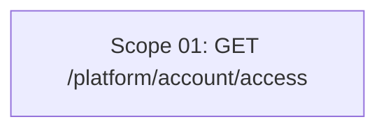

# 🚀 EXPANSION: BACK-008 — Platform account /access endpoint

> **Status:** DEEPENING
> [← README.md](README.md) | [← planning/README.md](../../README.md)

---

## Scope Summary

| # | Scope | Fases SDLC | Depende de | Estado |
|---|-------|-----------|------------|--------|
| 01 | GET /platform/account/access | S, V, T | — | PENDING |

---

## Dependency Map

*Scope único, sin dependencias externas.*

---

## Impact per SDLC Phase

| Fase | Afectada | Qué cambia |
|------|---------|------------|
| D | ☐ | — |
| R | ☐ | — |
| S | ✅ | Nuevo endpoint `GET /api/v1/platform/account/access`; respuesta agrupada por tenant sin paginación |
| M | ☐ | Sin cambios de datos ni migraciones |
| P | ☐ | — |
| V | ✅ | `GetAccountAccessUseCase` (nuevo); DTOs `AccountAccessData`, `TenantAccessData`, `AppAccessData`; método en `PlatformAccountController` |
| T | ✅ | Test de use case + test de controlador (happy path, usuario sin membresías) |
| B | ☐ | — |
| O | ☐ | — |
| N | ☐ | — |
| F | ☐ | — |
| G | ☐ | — |
| W | ✅ | Este planning |

---

## Notes

- No requiere nuevos métodos en ports existentes (`findByUserId`, `findById` en ClientApp y Tenant ya existen).
- Respuesta no paginada — válido para el piloto donde el volumen de tenants/apps por usuario es bajo.
- Los endpoints tenant-scoped existentes no se tocan (sin regresión).
- `GetAccountAccessUseCase` vive en `keygo-app` para respetar la arquitectura hexagonal.

---

> [← README.md](README.md) | [← planning/README.md](../../README.md)
