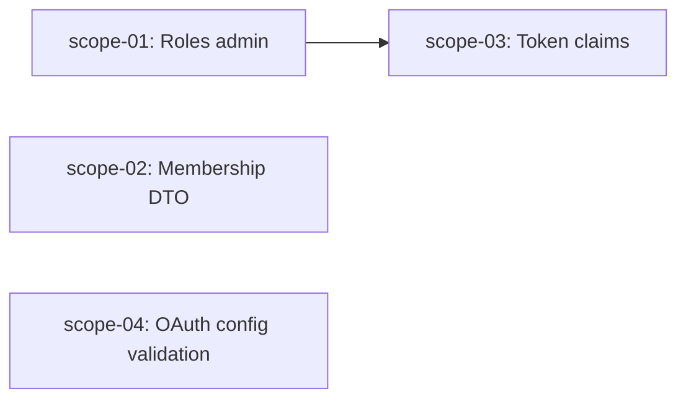

# 🚀 EXPANSION: BACK-001 — Marcha Blanca Backend P0

> **Status:** COMPLETED
> [← README.md](README.md) | [← planning/README.md](../../README.md)

---

## Scope Summary

| # | Scope | Fases SDLC | Depende de | Estado |
|---|-------|-----------|------------|--------|
| 01 | Unificar nomenclatura roles admin | V, T, M | — | DONE |
| 02 | DTO memberships con roles legibles y fecha | V, T | — | DONE |
| 03 | Claims mínimos funcionales en tokens | V, T, S | 01 | DONE |
| 04 | Validación OAuth config apps | V, T, S | — | DONE |

---

## Dependency Map

---

## Impact per SDLC Phase

| Fase | Afectada | Qué cambia |
|------|---------|------------|
| D | ☐ | — |
| R | ☐ | — |
| S | ✅ | Contratos de token (scope-03), validación OAuth (scope-04) |
| M | ✅ | Posible migración Flyway si `KEYGO_TENANT_ADMIN` tiene datos persistidos (scope-01) |
| P | ☐ | — |
| V | ✅ | Implementación en todos los scopes |
| T | ✅ | Tests de seguridad, mapeo, token y validación |
| B | ☐ | — |
| O | ☐ | — |
| N | ☐ | — |
| F | ☐ | — |
| G | ☐ | — |
| W | ✅ | Este planning |

---

## Notes

- scope-01 debe ejecutarse antes que scope-03 para garantizar que los roles del token sean los definitivos.
- scope-02 y scope-04 son independientes entre sí y pueden ejecutarse en paralelo.
- Si `KEYGO_TENANT_ADMIN` tiene datos persistidos en DB se requiere Flyway migration; de lo contrario solo reemplazo de código.

---

> [← README.md](README.md) | [← planning/README.md](../../README.md)
