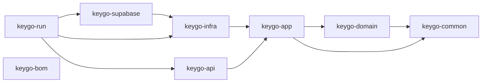
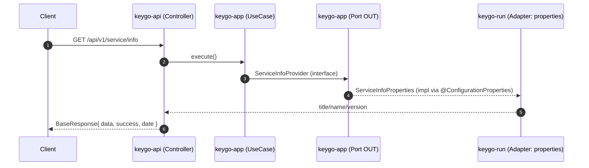
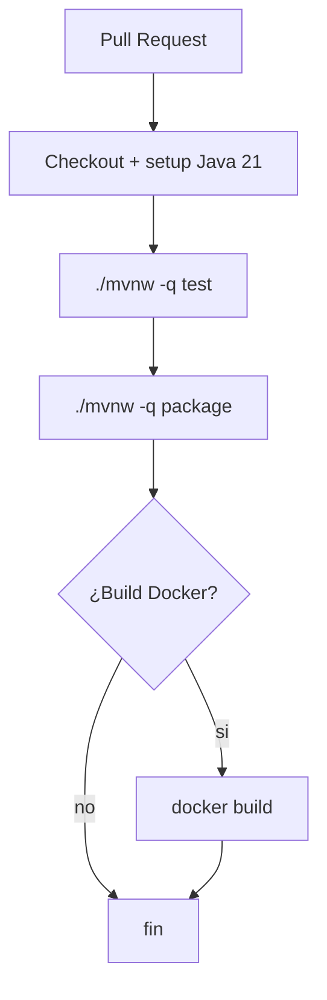

# Arquitectura de KeyGo Server

## Propósito de este documento

Este documento centraliza la arquitectura y "cómo encaja todo" para:
- mantener consistencia entre módulos,
- acelerar onboarding,
- y mejorar la calidad de cambios generados por agentes (Copilot/Claude).

## Resumen técnico

- Build: Maven multi-módulo (monorepo).
- Runtime: Spring Boot (arranque en `keygo-run`).
- Arquitectura lógica: Hexagonal / Ports & Adapters.
- Persistencia (en progreso): `keygo-supabase` con Spring Data JPA + Flyway + PostgreSQL.

## Módulos y dependencias

### Mapa de módulos



### Responsabilidades por módulo

| Módulo | Responsabilidad |
|---|---|
| **keygo-domain** | Dominio puro (idealmente sin Spring). Entidades, value objects, reglas de negocio. |
| **keygo-app** | Casos de uso + puertos (interfaces OUT). Define qué hace el sistema, no cómo. |
| **keygo-infra** | Implementaciones de puertos (repositorios, adaptadores externos). |
| **keygo-api** | REST controllers + DTOs + manejo de errores. Entrada HTTP al sistema. |
| **keygo-supabase** | Config de datasource/JPA/Flyway + entidades y repositorios Supabase. |
| **keygo-run** | Spring Boot main + wiring + configuración (`application.yml`). Módulo ejecutable. |
| **keygo-bom** | Bill of Materials — gestión centralizada de versiones de dependencias. |

### Regla de dependencias

```
domain  ←  app  ←  infra
                ←  api
                ←  supabase
                       ↑
                      run (cablea todo)
```

> **Regla de oro:** `keygo-domain` no puede depender de Spring ni de ningún otro módulo del proyecto.

## Flujo HTTP típico

Ejemplo: `GET /keygo-server/api/v1/service/info`



## Convención de respuestas API

Todas las respuestas REST usan `BaseResponse<T>` como envelope:

```java
// Respuesta exitosa
BaseResponse.success(data, ResponseCode.OK)

// Respuesta de error
BaseResponse.failure(message, ResponseCode.ERROR_CODE)
```

Campos del envelope:
- `date` — timestamp automático
- `success` / `failure` — `MessageResponse` con código y mensaje
- `data` — payload tipado `<T>`

Los códigos de negocio (`ResponseCode`) son independientes del HTTP status code.

## Configuración y perfiles

### keygo-run: configuración base (`application.yml`)

- `server.servlet.context-path` es `/${keygo.info.name}` (normalmente `/keygo-server`).
- `spring.profiles.active` se lee desde `SPRING_PROFILES_ACTIVE`.
- `keygo.bootstrap.*` define `admin-key` y prefijos para rutas protegidas.
- Usa Maven resource filtering con `@project.*@` para interpolar versión/nombre.

### keygo-supabase: perfil `supabase`

`application-supabase.yml` contiene:
- `supabase.*` (url/user/password, api urls, keys)
- `spring.datasource.*` (PostgreSQL)
- `spring.jpa.*` (ddl-auto validate, schema default)
- `spring.flyway.*` (migraciones)

**Regla práctica:** para habilitar DB, incluir `supabase` en `SPRING_PROFILES_ACTIVE`.

## Seguridad y observabilidad

### Bootstrap Admin Key (modelo actual)

- Intención: proteger `/api/**` con header `X-KEYGO-ADMIN`.
- Actuator se usa para health/diagnóstico (revisar qué endpoints se exponen en prod).
- Recomendación en producción:
  - Limitar `management.endpoints.web.exposure.include`
  - Usar `KEYGO_ADMIN_KEY` fuerte (no `changeMe`)
  - Validar el matching del filtro con `context-path` activo

> ⚠️ Con `context-path=/keygo-server`, el `requestURI` inicia con `/keygo-server/...`, lo que puede afectar el matching de prefijos configurados en el filtro.

### Actuator

Actualmente `management.endpoints.web.exposure.include: "*"` expone todos los endpoints. En producción, restringir a los necesarios (p. ej. `health,info`).

## Infra local: DB + herramientas

`keygo-supabase/docker-compose.yml` levanta:
- `postgres:15-alpine` en puerto `5432` (DB `keygo`)
- `dpage/pgadmin4` en puerto `5050` (admin UI)

Se controlan via scripts en `keygo-supabase/scripts/*.sh`.

```bash
# Levantar
cd keygo-supabase && ./scripts/dev-start.sh

# Detener
cd keygo-supabase && ./scripts/dev-stop.sh
```

## Testing

Estrategia recomendada:

| Tipo | Módulos | Herramientas |
|---|---|---|
| Unit | domain, app, api, run | JUnit 5 + AssertJ + Mockito (sin Spring) |
| Integration | supabase | Testcontainers PostgreSQL |
| API | api, run | `@SpringBootTest` + MockMvc |

Comandos:
```bash
# todos los módulos
./mvnw test

# solo supabase (con Testcontainers)
./mvnw -pl keygo-supabase test

# solo api
./mvnw -pl keygo-api test
```

## CI/CD (propuesto)

El repo aún no tiene workflows CI. Propuesta mínima para PRs:



Regla de merge recomendada:
- Build verde (`./mvnw clean package`)
- Todos los tests pasan (`./mvnw test`)
- Documentación actualizada si cambian APIs o configuración

## "Definition of Done" para cambios

- [ ] Compila: `./mvnw clean package`
- [ ] Tests pasan: `./mvnw test`
- [ ] Sin secretos en commits (ni `.env`, ni keys)
- [ ] Endpoints documentados en README/ARCHITECTURE si cambian
- [ ] Si hay migraciones nuevas: documentar y validar con Flyway
- [ ] PR description completa (qué cambió, cómo se probó, riesgos)

