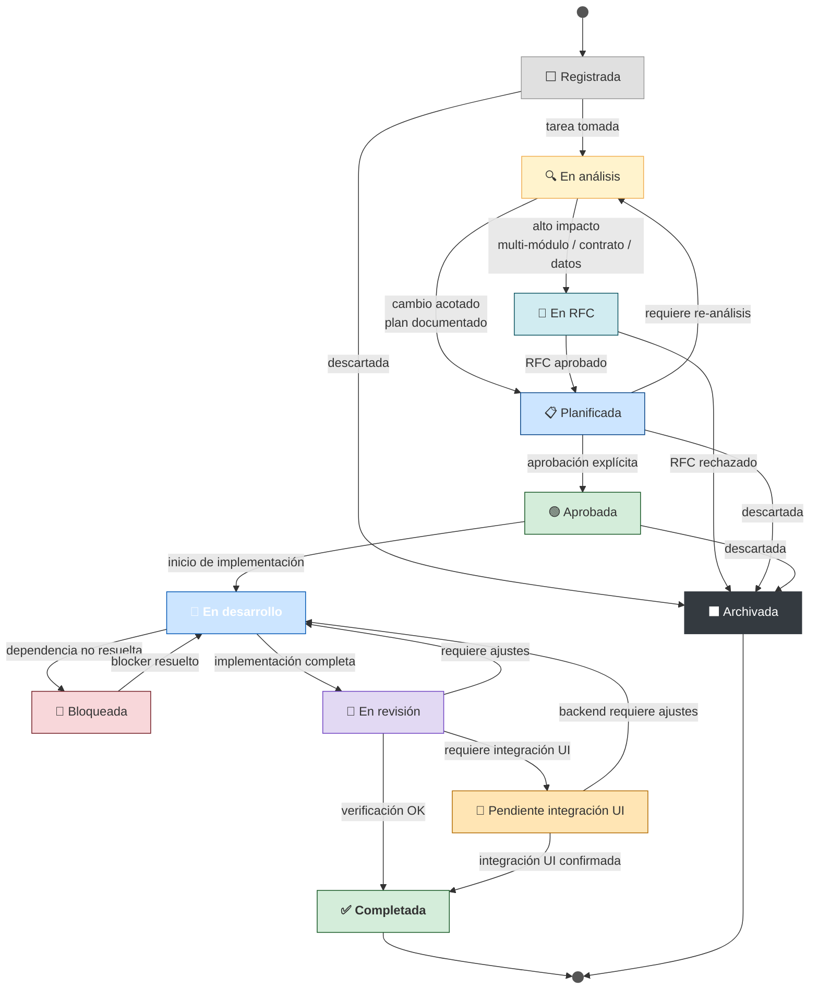
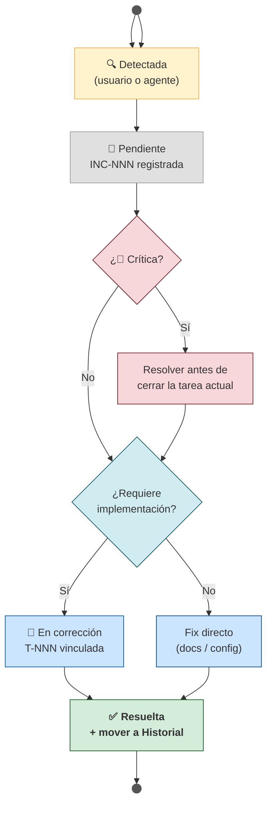

# Workflow de Features y Tareas Técnicas

Define los estados del ciclo de vida de una tarea (`T-NNN` / `F-NNN`) desde que se registra
hasta que se completa o descarta.

---

## Estados

| Estado | Emoji | Significado |
|---|---|---|
| Registrada | ⬜ | Mínima descripción. Sin análisis ni plan aún. |
| En análisis | 🔍 | Alguien tomó la tarea: leyendo código y documentación para determinar impacto. |
| Planificada | 📋 | Plan completo en el archivo de tarea. Esperando aprobación explícita. |
| En RFC | 📄 | Cambio de alto impacto. RFC creado en `04-decisions/rfc/`. Pendiente de aprobación. |
| Aprobada | 🟢 | Aprobación explícita recibida. Lista para implementar. |
| En desarrollo | 🔵 | Implementación en curso. |
| Bloqueada | 🚫 | No puede avanzar por una dependencia o blocker externo. |
| En revisión | 🔄 | Implementación completa. Verificando contra los criterios del plan. |
| Pendiente integración UI | 🧩 | Backend listo, pero la tarea depende de integración o confirmación desde UI. |
| Completada | ✅ | Verificada y cerrada. |
| Archivada | ⬛ | Cancelada, descartada o absorbida por otra tarea. |

---

## Diagrama de transiciones



---

## Criterios de transición

> **Quién activa** — 👤 usuario | 🤖 agente | 👤🤖 cualquiera.
> El prompt pattern es el texto **exacto o equivalente** que debe aparecer en la conversación para que la transición sea válida. Sin ese patrón, el agente no cambia el estado.

---

## Regla transversal — contenido por etapa

Cambiar el estado de una tarea **no basta por sí solo**. En cada etapa, el agente debe
persistir en el archivo `T-NNN` el contenido generado durante esa fase, dejando trazabilidad
útil para retomar el trabajo después.

### Ubicación del contenido de transiciones

El contenido generado en cada cambio de estado debe quedar **al final de la documentación
inicial de la tarea**, en orden cronológico, como historial acumulado de transiciones.

Reglas:

- La documentación inicial de la tarea (requisito, análisis base, solución, pasos,
  verificación, etc.) se mantiene al inicio del archivo.
- Cada transición agrega su contenido nuevo **al final**, no reemplaza ni dispersa el
  historial en distintas partes del documento.
- El objetivo es que la tarea conserve no solo el estado actual, sino también el
  contenido producido en cada cambio de estado.
- Si una sección base necesita actualización, puede ajustarse, pero el contenido propio de
  la transición debe igual quedar registrado al final como trazabilidad.
- Se recomienda usar secciones cronológicas claras, por ejemplo:
  `## Historial de transiciones`, `### 2026-04-13 — 🔍 En análisis`,
  `### 2026-04-13 — 📋 Planificada`, etc.

### Contenido mínimo esperado por etapa

| Etapa | Contenido que debe agregarse o actualizarse en la tarea |
|---|---|
| `🔍 En análisis` | Sección `## Análisis realizado` con hallazgos, impacto técnico, riesgos, drift detectado y decisiones preliminares. |
| `📋 Planificada` | Solución propuesta consolidada, pasos ordenados de implementación y guía de verificación. |
| `📄 En RFC` | Referencia al RFC creado, motivo del RFC y resumen del impacto detectado. |
| `🟢 Aprobada` | Nota breve de aprobación explícita recibida y alcance aprobado si hubo ajustes. |
| `🔵 En desarrollo` | Progreso real de implementación: pasos marcados `APPLIED`, decisiones tomadas y cualquier ajuste relevante al plan. |
| `🚫 Bloqueada` | Descripción concreta del blocker, dependencia o decisión faltante, y condición de desbloqueo. |
| `🔄 En revisión` | Resultado de verificación, pendientes detectados y alcance realmente implementado. |
| `🧩 Pendiente integración UI` | Qué debe integrar la UI, artefactos/notas entregadas al frontend y condición para dar la tarea por cerrada. |
| `✅ Completada` | Cierre de tarea con resultado final, referencias a validación/documentación actualizada y fecha de cierre si aplica. |
| `⬛ Archivada` | Motivo del descarte, absorción o cancelación, con referencia cruzada si fue absorbida por otra tarea/RFC. |

Si el contenido detallado vive mejor en otro artefacto (por ejemplo un RFC), la tarea debe
igual dejar un resumen y el link correspondiente; nunca debe quedar solo el cambio de estado.

---

## Relaciones entre tareas

Cuando una tarea referencie otra (`T-NNN`, `F-NNN`, `RFC-NNN`, `INC-NNN`), no basta con nombrarla:
se debe indicar explícitamente el **tipo de relación**.

### Regla

Cada tarea que tenga dependencias, afinidad funcional o impacto cruzado debe incluir una sección
`## Relaciones` con una tabla como esta:

| Artefacto relacionado | Tipo de relación | Descripción |
|---|---|---|
| `T-NNN` | `bloqueante` | Esta tarea no puede avanzar o cerrarse hasta que la otra se resuelva. |
| `T-MMM` | `habilitadora` | Esta tarea habilita trabajo posterior en la otra. |
| `T-PPP` | `complementaria` | Ambas cubren partes distintas de una misma capacidad y conviene tratarlas coordinadamente. |

### Tipos de relación permitidos

| Tipo | Significado |
|---|---|
| `bloqueante` | La tarea relacionada impide avanzar o cerrar la actual. |
| `habilitadora` | La tarea actual o la relacionada habilita a la otra como prerequisito técnico o funcional. |
| `complementaria` | Ambas tareas se refuerzan, pero ninguna bloquea estrictamente a la otra. |
| `derivada de` | La tarea nace como consecuencia directa de otra tarea, RFC o inconsistencia. |
| `absorbe a` | La tarea actual incorpora el alcance de otra, que luego puede archivarse. |
| `absorbida por` | La tarea actual deja de avanzar por separado y su alcance pasa a otra. |
| `relacionada con UI` | La tarea depende de integración, validación o coordinación con frontend/UI. |
| `relacionada con RFC` | La tarea implementa, detalla o depende de una decisión formalizada en RFC. |
| `relacionada con INC` | La tarea corrige o nace desde una inconsistencia documentada. |

### Criterios

- No usar solo “relacionada con” sin tipificar la relación.
- Si la relación afecta el orden de ejecución, usar `bloqueante` o `habilitadora`, no
  `complementaria`.
- Si una tarea pasa a depender de otra durante la ejecución, actualizar también su archivo y no
  solo el estado.
- Si una tarea queda bloqueada por otra, la relación debe aparecer tanto en `## Relaciones` como
  en la documentación del bloqueo.

---

### ⬜ Registrada → 🔍 En análisis

**Quién activa:** 👤 usuario

**Criterios:**
- El usuario decide tomar la tarea.
- El agente actualiza `**Estado:**` en el archivo de la tarea y en `tasks/README.md`.
- El agente agrega o actualiza la sección `## Análisis realizado` con el contenido producido.

**Prompt pattern:**
```
Analiza T-NNN
```
```
Quiero trabajar en T-NNN
```
```
Toma T-NNN y analízala
```

---

### 🔍 En análisis → 📋 Planificada

**Quién activa:** 🤖 agente (al invocar `/plan`)

**Criterios:**
- Análisis completado: cambio acotado, no requiere RFC.
- El archivo de la tarea tiene: requisito claro, módulos afectados, pasos ordenados y guía de verificación.
- Estado actualizado en el archivo y en `tasks/README.md`.
- El contenido generado durante el análisis queda persistido en la tarea; no se reemplaza solo con el plan.

**Prompt pattern:**
```
/plan T-NNN
```
```
Planifica T-NNN
```

---

### 🔍 En análisis → 📄 En RFC

**Quién activa:** 🤖 agente (al invocar `/plan` cuando detecta alto impacto)

**Criterios:**
- El análisis determina que el cambio afecta múltiples módulos, contratos públicos, modelo de datos o arquitectura.
- El agente crea el RFC en `doc/04-decisions/rfc/` con estado `BORRADOR` y lo referencia en el archivo de la tarea.
- La tarea conserva el análisis y agrega el resumen del RFC generado.

**Prompt pattern:** el mismo que para Planificada — el agente decide la ruta según el impacto detectado:
```
/plan T-NNN
```
```
Planifica T-NNN
```

---

### 📄 En RFC → 📋 Planificada

**Quién activa:** 👤 usuario (aprueba el RFC) + 🤖 agente (detalla el plan)

**Criterios:**
- Usuario aprueba el RFC explícitamente.
- El agente actualiza el RFC a `APROBADO`, detalla los pasos en el archivo de la tarea y cambia el estado a `📋 Planificada`.
- La tarea agrega el contenido nuevo producido en la etapa RFC/aprobación, no solo la referencia.

**Prompt pattern:**
```
Apruebo RFC-NNN, detalla el plan de T-NNN
```
```
RFC-NNN aprobado, procede con el plan
```

---

### 📋 Planificada → 🟢 Aprobada

**Quién activa:** 👤 usuario **exclusivamente**

**Criterios:**
- El usuario indica de forma explícita que el plan debe aplicarse.
- Sin este prompt, el agente **no inicia implementación bajo ninguna circunstancia**.
- La tarea deja registrada la aprobación explícita o el ajuste de alcance aprobado si existió.

**Prompt pattern:**
```
Aplica T-NNN
```
```
Implementa T-NNN
```
```
Apruebo T-NNN, procede
```

---

### 🟢 Aprobada → 🔵 En desarrollo

**Quién activa:** 🤖 agente (automático al iniciar implementación)

**Criterios:**
- El agente actualiza el estado al comenzar el primer paso de implementación.
- No requiere prompt adicional — es consecuencia directa de la aprobación.
- El agente comienza a reflejar en la tarea el avance real (`APPLIED`, decisiones, ajustes).

---

### 🔵 En desarrollo → 🚫 Bloqueada

**Quién activa:** 👤🤖 cualquiera

**Criterios:**
- Se detecta una dependencia no resuelta (otra tarea, decisión pendiente, recurso externo).
- El blocker debe quedar documentado en el archivo de la tarea: qué bloquea y por qué.
- Debe agregarse explícitamente la condición para desbloquear la tarea.

**Prompt pattern:**
```
T-NNN está bloqueada por [razón]
```
```
Bloquea T-NNN, depende de T-MMM
```

---

### 🚫 Bloqueada → 🔵 En desarrollo

**Quién activa:** 👤 usuario

**Criterios:**
- El blocker fue resuelto.
- El agente retoma la implementación desde el último paso pendiente.
- La tarea debe registrar cómo se resolvió el bloqueo antes de seguir.

**Prompt pattern:**
```
El blocker de T-NNN está resuelto, continúa
```
```
Continúa T-NNN, [razón de desbloqueo]
```

---

### 🔵 En desarrollo → 🔄 En revisión

**Quién activa:** 🤖 agente (automático al completar implementación)

**Criterios:**
- Todos los pasos de implementación marcados como `APPLIED`.
- El código compila y los tests pasan.
- El agente actualiza el estado y notifica al usuario que está listo para verificación.
- La tarea resume el resultado implementado y la verificación realizada.
- Si la implementación reveló trabajo adicional, el agente puede registrar una o más tareas
  derivadas antes o durante esta transición.

---

### 🔄 En revisión → 🧩 Pendiente integración UI

**Quién activa:** 👤🤖 cualquiera

**Criterios:**
- El backend ya quedó implementado y verificado desde su lado.
- Falta que la UI consuma, adapte o confirme la integración para poder cerrar la tarea.
- La tarea documenta explícitamente qué debe hacer UI, qué contrato queda disponible y cuál es la condición de cierre.

**Prompt pattern:**
```
Deja T-NNN pendiente de integración UI
```
```
T-NNN depende de integración UI
```
```
Pasa T-NNN a pendiente UI
```

---

### 🧩 Pendiente integración UI → ✅ Completada

**Quién activa:** 👤 usuario

**Criterios:**
- La integración o confirmación desde UI ya ocurrió.
- La tarea deja trazabilidad de la confirmación recibida o del criterio cumplido.

**Prompt pattern:**
```
UI confirmó T-NNN, ciérrala
```
```
Cierra T-NNN, integración UI completa
```

---

### 🧩 Pendiente integración UI → 🔵 En desarrollo

**Quién activa:** 👤 usuario

**Criterios:**
- La integración UI detectó ajustes necesarios en backend.
- La tarea documenta qué hallazgo de UI obliga a retomar desarrollo.

**Prompt pattern:**
```
UI detectó ajustes en T-NNN
```
```
Vuelve T-NNN a desarrollo por integración UI
```

---

### 🔄 En revisión → ✅ Completada

**Quién activa:** 👤 usuario

**Criterios:**
- Criterios de verificación del plan cumplidos.
- Documentación actualizada según el tipo de cambio (migrations, OpenAPI, frontend guide, etc.).
- `roadmap.md` actualizado si aplica.
- La tarea incorpora el cierre con el resultado final y deja trazabilidad suficiente para consulta futura.
- Si quedaron extensiones, complementos o deuda técnica fuera del alcance, deben quedar
  registradas como tareas derivadas antes del cierre o dentro del mismo cierre.

**Prompt pattern:**
```
T-NNN verificada, ciérrala
```
```
Cierra T-NNN
```
```
T-NNN completada
```

---

### 🔄 En revisión → 🔵 En desarrollo

**Quién activa:** 👤 usuario

**Criterios:**
- La verificación detectó un fallo o caso no cubierto.
- El usuario debe indicar qué falló para que el agente retome desde el paso correcto.
- La tarea documenta qué falló en revisión antes de volver a desarrollo.

**Prompt pattern:**
```
T-NNN requiere ajustes: [descripción del problema]
```
```
Vuelve a desarrollo en T-NNN, [qué falló]
```

---

### Cualquier estado → ⬛ Archivada

**Quién activa:** 👤 usuario

**Criterios:**
- La tarea fue cancelada, descartada o absorbida por otra.
- El agente documenta la razón en el archivo de la tarea y actualiza el estado.
- El archivo **no se elimina** — mantiene el historial.
- La tarea deja persistido el motivo y la referencia cruzada correspondiente si aplica.

**Prompt pattern:**
```
Archiva T-NNN
```
```
Descarta T-NNN por [razón]
```
```
T-NNN absorbida por T-MMM, archívala
```

---

---

## Ciclo de vida de inconsistencias (INC-NNN)

Define el flujo desde que se detecta una inconsistencia hasta que se resuelve.
Índice completo en [`inconsistencies/README.md`](inconsistencies/README.md).

### Estados de una INC

| Estado | Emoji | Significado |
|---|---|---|
| Pendiente | 🔲 | Detectada, sin corrección en curso |
| En corrección | 🔧 | Tiene tarea T-NNN asociada en desarrollo |
| Resuelta | ✅ | Fix verificado, documentado y movido a Historial |

### Diagrama



---

### Detección y registro

**Quién activa:** 👤 usuario | 🤖 agente

**Criterios:**
- Cualquiera puede detectar una inconsistencia durante análisis, revisión de código o documentación.
- El agente crea el archivo `INC-NNN-<slug>.md` y lo registra en `inconsistencies/README.md`.
- Si es 🔴 Crítica, debe resolverse antes de cerrar la tarea en curso.

**Prompt pattern (usuario):**
```
Registra inconsistencia: [descripción breve]
```
```
Detecté una inconsistencia en [área]: [descripción]
```

**Prompt pattern (agente — al detectarla durante una tarea):**
> El agente crea la INC automáticamente sin esperar prompt explícito.

**Resultado esperado del agente:**
1. Crear `doc/09-ai/inconsistencies/INC-NNN-<slug>.md` usando la plantilla.
2. Agregar fila en la tabla **Abiertas** de `inconsistencies/README.md`.

---

### 🔲 Pendiente → 🔧 En corrección (vía tarea)

**Quién activa:** 👤 usuario

**Criterios:**
- La INC requiere trabajo de código, migración o esfuerzo mayor a una corrección documental.
- El agente crea `T-NNN-<slug>.md`, lo registra en `tasks/README.md` y vincula ambos archivos.

**Prompt pattern:**
```
Crea tarea para INC-NNN
```
```
Registra INC-NNN como tarea
```
```
INC-NNN necesita una tarea, créala
```

**Resultado esperado del agente:**
1. Crear `doc/09-ai/tasks/T-NNN-<slug>.md` con el requisito extraído de la INC.
2. Registrar en `doc/09-ai/tasks/README.md` con estado `⬜ Registrada`.
3. Actualizar `**Estado:**` de la INC a `🔧 En corrección`.
4. Actualizar `**Tarea relacionada:**` en `INC-NNN-<slug>.md` con el link `[T-NNN](../tasks/T-NNN-slug.md)`.

---

### 🔧 En corrección → ✅ Resuelta (al cerrar la tarea vinculada)

**Quién activa:** 🤖 agente (automático al ejecutar cierre de T-NNN)

**Criterios:**
- La tarea `T-NNN` vinculada a la INC transiciona a `✅ Completada`.
- El agente verifica si la tarea tiene `**Inconsistencia relacionada:**` o si la INC tiene la tarea vinculada y actualiza la INC automáticamente.

**Prompt pattern:** el mismo que cierra la tarea:
```
T-NNN verificada, ciérrala
```
```
Cierra T-NNN
```

**Resultado esperado del agente al cerrar T-NNN:**
1. Marcar `**Estado:** ✅ Resuelta` en la INC vinculada.
2. Completar `**Resuelta:** YYYY-MM-DD` en la INC.
3. Mover la fila de **Abiertas** a **Historial** en `inconsistencies/README.md`.

---

### 🔲 Pendiente → ✅ Resuelta (fix directo, sin tarea)

**Quién activa:** 👤 usuario

**Criterios:**
- El fix es solo documental o de configuración; no requiere una tarea formal.
- El agente aplica el fix, actualiza la INC y la mueve a Historial.

**Prompt pattern:**
```
Resuelve INC-NNN
```
```
Aplica fix de INC-NNN
```
```
Marca INC-NNN como resuelta
```

---

## Reglas generales

- El estado vive en el campo `**Estado:**` del archivo de la tarea y en la columna de estado de `tasks/README.md`. Ambos deben mantenerse sincronizados.
- Solo el usuario puede mover una tarea de `📋 Planificada` → `🟢 Aprobada`. El agente no aprueba por cuenta propia.
- Una tarea `🚫 Bloqueada` debe tener documentado el blocker. Sin esa nota, el bloqueo no es válido.
- Las tareas `✅ Completadas` no se eliminan de `tasks/README.md` — se mueven a la sección **Historial** al final del archivo.
- `🧩 Pendiente integración UI` no reemplaza a `🚫 Bloqueada`: se usa cuando el backend ya está listo
  y la dependencia restante es la adopción/confirmación desde frontend, no un bloqueo técnico del backend.
- Una tarea implementada puede originar **una o más tareas derivadas**. Esto incluye tareas
  de tipo derivada, complementaria, extensión funcional o correctiva cuando queda deuda técnica.
- Si durante `🔵 En desarrollo`, `🔄 En revisión` o `✅ Completada` se detecta trabajo nuevo que no
  corresponde mezclar en la tarea actual, el agente debe crear `T-NNN-<slug>.md`, registrarla en
  `tasks/README.md` y referenciarla explícitamente desde la tarea origen.
- La tarea origen debe dejar ese registro en su historial de transiciones al final del documento,
  indicando el tipo de derivación, la razón y el/los links a las tareas creadas.
