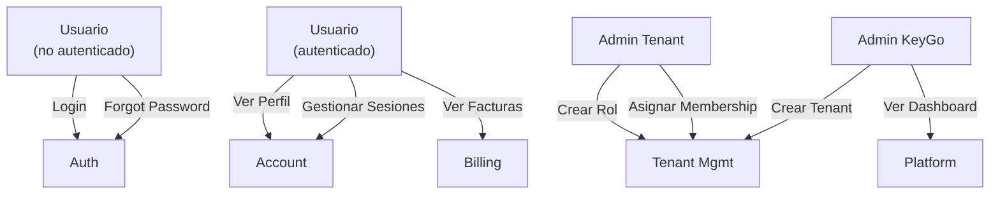

# Plan de Documentación Completa — KeyGo Server

**Fecha:** 2026-04-05  
**Objetivo:** Reorganizar y generar documentación funcional y de diseño del proyecto completo para alinear el conocimiento disperso con el roadmap actual.

---

## 1. Diagnóstico del Estado Actual

### ✅ Documentación existente (bien ubicada)
- `AGENTS.md` — Quick-start técnico (módulos, comandos, endpoints)
- `AI_CONTEXT.md` — Resumen ejecutivo y contexto del proyecto
- `ARCHITECTURE.md` — Decisiones de diseño (resumido, referencia a `docs/design/ARCHITECTURE.md`)
- `ROADMAP.md` — Propuestas T-NNN/F-NNN activas y completadas
- `docs/ai/` — Lecciones, propuestas, inconsistencias, historial

### ⚠️ Documentación dispersa o incompleta
- **Funcional dispersa:** RFC para account UI, email templates, billing (en `docs/archive/research/`)
- **Diseño fragmentado:** ARCHITECTURE.md resumido (detalle en `docs/design/ARCHITECTURE.md` sin leer completamente)
- **Casos de uso:** No hay documento centralizado de casos de uso (use cases)
- **Análisis de dolores:** No documentado explícitamente
- **Requerimientos funcionales:** Distribuidos entre propuestas.md, ROADMAP.md, RFCs, code comments
- **Diagramas de secuencia/estado:** Parciales o en ASCII (no Mermaid)
- **Modelo de datos:** Existe `docs/data/DATA_MODEL.md`, `ENTITY_RELATIONSHIPS.md` pero sin diagrama ER visual
- **Flujos OAuth2/OIDC:** Documentado en `docs/api/AUTH_FLOW.md`, pero sin diagrama de flujo completo

### 🚫 Documentación faltante
- **Documento de situación actual:** qué existe, qué falta, estado de completitud
- **Análisis de dolores/problemas:** por qué existen las propuestas actuales
- **Matriz de requerimientos:** mapeo funcional vs. técnico vs. estado
- **Diagramas funcionales:** casos de uso Mermaid completos, secuencias, máquinas de estado
- **Propuesta de solución unificada:** hoja de ruta con dependencias explícitas
- **Bounded contexts:** por dominio (Auth, Tenants, Billing, Account)
- **Glosario de términos:** entidades, conceptos, roles

---

## 2. Propuesta de Estructura Nueva

Crear un nuevo apartado bajo `docs/` llamado `docs/product-design/` que centralice **documentación funcional y de diseño**:

```
docs/product-design/
├── README.md                                  # Índice y navegación
├── SITUACION_ACTUAL.md                       # Estado completo del proyecto
├── ANALISIS_DOLORES.md                       # Problemas a resolver, restricciones
├── REQUERIMIENTOS.md                         # Levantamiento funcional completo
├── PROPUESTA_SOLUCION.md                     # Roadmap consolidado + dependencias
├── BOUNDED_CONTEXTS.md                       # Dominios: Auth, Tenants, Billing, Account
├── GLOSARIO.md                                # Términos, entidades, conceptos
├── CASOS_DE_USO.md                           # Narrativas y listado
├── DIAGRAMAS/
│   ├── CASOS_DE_USO.md                       # Mermaid: diagrama de casos de uso
│   ├── FLUJO_AUTENTICACION.md                # Mermaid: OAuth2/OIDC completo
│   ├── FLUJO_BILLING.md                      # Mermaid: suscripción y facturación
│   ├── FLUJO_TENANT_MANAGEMENT.md            # Mermaid: creación, roles, memberships
│   ├── FLUJO_ACCOUNT.md                      # Mermaid: self-service (perfil, sesiones, passwd)
│   ├── SECUENCIAS/
│   │   ├── LOGIN_CODE_GRANT.md               # Sequence: auth code flow
│   │   ├── CLIENT_CREDENTIALS.md             # Sequence: M2M flow
│   │   ├── TENANT_CREATION.md                # Sequence: crear tenant + seed
│   │   ├── CONTRACT_ACTIVATION.md            # Sequence: suscribirse a plan
│   │   └── PASSWORD_RESET.md                 # Sequence: forgot → reset → change
│   ├── ESTADOS/
│   │   ├── USUARIO.md                        # State machine: ACTIVE, RESET_PASSWORD, etc.
│   │   ├── SESION.md                         # State machine: ACTIVE, REVOKED, EXPIRED
│   │   ├── SUSCRIPCION.md                    # State machine: DRAFT, ACTIVE, CANCELLED, EXPIRED
│   │   └── TENANT.md                         # State machine: ONBOARDING, ACTIVE, SUSPENDED
│   └── ARQUITECTURA_VISUAL.md                # C4/componentes (opcional PlantUML)
├── EPICAS/
│   ├── AUTENTICACION.md                      # E1: OAuth2/OIDC completo
│   ├── TENANT_MANAGEMENT.md                  # E2: Multi-tenant core
│   ├── BILLING.md                            # E3: Subscripciones + facturación
│   ├── ACCOUNT_SELF_SERVICE.md               # E4: Gestión de cuenta del usuario
│   └── INTEGRACIONES.md                      # E5: KMS, email, SCIM, webhooks (futuro)
└── DEPENDENCIAS.md                           # Mapa de dependencias entre features

```

---

## 3. Contenido de Cada Documento

### 3.1 **SITUACION_ACTUAL.md**
- **Módulos del proyecto:** descripción, responsabilidad, estado
- **Capacidades implementadas:** lista por dominio (Auth, Tenants, Billing, Account)
- **Estado de completitud:** % por feature según propuestas.md
- **Deuda técnica identificada:** de `docs/ai/lecciones.md` + inconsistencias
- **Decisiones arquitectónicas activas:** hexagonal, multi-tenant, Spring Boot 4.x
- **Dependencias externas:** PostgreSQL, Supabase, Spring, Jackson 3

### 3.2 **ANALISIS_DOLORES.md**
- **Problema 1: Conocimiento disperso** → solución: este plan
- **Problema 2: Falta alineación roadmap-código** → causas, impacto
- **Problema 3: Inconsistencias entre docs y código** → listado de inconsistencias actuales
- **Problema 4: Curva de aprendizaje alta** → nuevos devs pierden tiempo entendiendo estructura
- **Restricciones técnicas:** Java 21, Spring Boot 4.x, migraciones Flyway, Jackson 3
- **Restricciones funcionales:** GDPR (TODO), cumplimiento regulatorio (CFDI México futuro)

### 3.3 **REQUERIMIENTOS.md**
- **Requerimientos funcionales por dominio:**
  - **Auth:** OAuth2/OIDC, PKCE, refresh tokens, revocación, userinfo, client_credentials
  - **Tenants:** creación, RBAC granular, roles jerárquicos, memberships
  - **Billing:** planes, suscripciones, facturas, renovación automática, dunning (futuro)
  - **Account:** perfil, sesiones, reset de contraseña, cambio de contraseña, conexiones (futuro)
  
- **Requerimientos no-funcionales:**
  - Seguridad: Bearer tokens, HTTPS obligatorio, rate limiting (TODO)
  - Performance: caché (Caffeine), paginación JPA Specifications
  - Observabilidad: i18n, traceId/requestId, logs estructurados
  - Escalabilidad: multi-tenant aislado, stateless sessions (JWT)

### 3.4 **PROPUESTA_SOLUCION.md**
- **Consolidación del roadmap:** horizonte actual (abril 2026)
- **Mapa de dependencias:** qué propuestas bloquean a otras
- **Priorización:** P0 (hosted login seguro ✅), P1 (multi-dominio, BFF), P2 (federated session), P3 (integraciones)
- **Hitos:** próximas 4 semanas, 8 semanas, 16 semanas
- **Propuestas críticas a validar:** T-064 (i18n catalog), T-074 (caché dashboard), T-108 (geoip sesiones)

### 3.5 **BOUNDED_CONTEXTS.md**
Define los 4 dominios principales con bordes claros:

#### **Bounded Context 1: Authentication (Autenticación)**
- Responsable de: OAuth2/OIDC, JWT, refresh tokens, revocación
- Entidades: `SigningKey`, `RefreshToken`, `Session`
- Puertos: `PasswordHasherPort`, `TokenSignerPort`, `EmailNotificationPort`
- Casos de uso: LoginWithCode, ExchangeRefreshToken, RevokeToken, ValidateUserCredentials
- Dependencias externas: RSA keys (KMS eventual), email (SMTP/SES)

#### **Bounded Context 2: Tenant Management (Gestión de Tenants)**
- Responsable de: creación, roles, memberships, RBAC, aislamiento
- Entidades: `Tenant`, `TenantUser`, `AppRole`, `Membership`, `RoleHierarchy`
- Puertos: `TenantRepositoryPort`, `MembershipRepositoryPort`
- Casos de uso: CreateTenant, AssignRole, CreateMembership, GrantPermission
- Dependencias externas: — (interno)

#### **Bounded Context 3: Billing (Facturación y Suscripciones)**
- Responsable de: planes, suscripciones, facturas, renovación
- Entidades: `AppPlan`, `AppBillingContract`, `Invoice`, `BillingOption`
- Puertos: `BillingRepositoryPort`, `PaymentGatewayPort` (eventual)
- Casos de uso: ActivateContract, GenerateInvoice, RenewSubscription (eventual)
- Dependencias externas: Gateway de pago (Stripe/MercadoPago eventual)

#### **Bounded Context 4: Account (Cuenta de Usuario)**
- Responsable de: perfil, sesiones, reset de contraseña, conexiones (futuro)
- Entidades: `TenantUser`, `AccountSession`, `PasswordRecoveryToken`
- Puertos: `SessionRepositoryPort`, `PasswordRecoveryPort`
- Casos de uso: UpdateProfile, ListSessions, RevokeSession, ForgotPassword, ResetPassword
- Dependencias externas: email (SMTP/SES)

**Ejemplo de frontera:** si un usuario intenta crear tenant sin email verificado → **Auth** verifica status, **Tenant** crea si authorized

### 3.6 **GLOSARIO.md**
```
- **Tenant:** organización o cliente que usa KeyGo (p. ej. "Acme Corp")
- **TenantUser:** usuario dentro de un tenant específico
- **App / ClientApp:** aplicación OAuth2 dentro de un tenant (ej. "MobileApp", "WebSPA")
- **AppRole:** rol definido por el tenant para su app (ej. "Admin", "Viewer")
- **Membership:** relación entre TenantUser y AppRole (ej. "user1 es Admin en MobileApp")
- **Signing Key:** par RSA usado para firmar JWTs
- **RefreshToken:** token de larga vida para obtener nuevos access tokens
- **Contract / BillingContract:** suscripción activa a un plan
- **Invoice:** documento de facturación emitido por contrato
- **Bounded Context:** dominio independiente con sus propias entidades y puertos
- ... (más términos según sea necesario)
```

### 3.7 **CASOS_DE_USO.md**
Listado narrativo de los principales casos de uso por contexto:

**Authentication:**
1. Login con Authorization Code (PKCE)
2. Intercambiar refresh token por access token
3. Revocar refresh token
4. Obtener información de usuario (userinfo)
5. Validar credenciales (admin)

**Tenant Management:**
1. Crear nuevo tenant (onboarding)
2. Listar tenants (admin)
3. Crear rol en app
4. Asignar rol a usuario (membership)
5. Cambiar rol (reassign)

**Billing:**
1. Listar planes disponibles
2. Activar suscripción a plan
3. Ver contrato activo
4. Ver facturas
5. (Futuro) Renovar automáticamente

**Account:**
1. Ver y actualizar perfil de usuario
2. Listar sesiones activas
3. Revocar sesión específica
4. Iniciar reset de contraseña (forgot password)
5. Completar reset de contraseña
6. Cambiar contraseña (authenticated)

### 3.8 **DIAGRAMAS/ (Mermaid)**

#### **CASOS_DE_USO.md**


#### **FLUJO_AUTENTICACION.md**
Diagrama OAuth2/OIDC con:
- Authorization Code + PKCE flow
- Token exchange
- Refresh token rotation
- Logout/revoke

#### **FLUJOS en SECUENCIAS/**
Sequence diagrams de:
- LoginCodeGrant: SPA → KeyGo → IDP → SPA
- ClientCredentials: M2M service → KeyGo → service
- TenantCreation: Admin → KeyGo → seed DB
- PasswordReset: User → email link → form → KeyGo

#### **ESTADOS en ESTADOS/**
State machines de:
- Usuario: ACTIVE, RESET_PASSWORD, SUSPENDED, DELETED
- Sesión: ACTIVE, REVOKED, EXPIRED
- Suscripción: DRAFT, ACTIVE, EXPIRED, CANCELLED
- Tenant: ONBOARDING, ACTIVE, SUSPENDED, DELETED

---

## 4. Priorización y Fases de Implementación

### **Fase 1: Análisis y Documentación Base (ESTA TAREA)**
- [ ] Crear estructura de carpetas `docs/product-design/`
- [ ] Generar SITUACION_ACTUAL.md
- [ ] Generar ANALISIS_DOLORES.md
- [ ] Generar REQUERIMIENTOS.md (en borrador, revisar con user)

### **Fase 2: Diseño Estratégico (con user feedback)**
- [ ] Generar PROPUESTA_SOLUCION.md (consolidar roadmap actual)
- [ ] Generar BOUNDED_CONTEXTS.md (4 contextos principales)
- [ ] Generar GLOSARIO.md
- [ ] Generar DEPENDENCIAS.md (grafo de dependencias T-NNN)

### **Fase 3: Diagrama Funcionales (Mermaid)**
- [ ] CASOS_DE_USO.md (diagrama principal + detalle por BC)
- [ ] FLUJO_AUTENTICACION.md
- [ ] FLUJO_BILLING.md
- [ ] FLUJO_TENANT_MANAGEMENT.md
- [ ] FLUJO_ACCOUNT.md

### **Fase 4: Diagramas de Secuencia**
- [ ] LOGIN_CODE_GRANT.md
- [ ] CLIENT_CREDENTIALS.md
- [ ] TENANT_CREATION.md
- [ ] CONTRACT_ACTIVATION.md
- [ ] PASSWORD_RESET.md

### **Fase 5: Máquinas de Estado**
- [ ] USUARIO.md
- [ ] SESION.md
- [ ] SUSCRIPCION.md
- [ ] TENANT.md

### **Fase 6: Alineación y Limpieza**
- [ ] Consolidar referencias entre docs/product-design/ y ROADMAP.md
- [ ] Eliminar/deprecar documentación redundante en docs/archive/research/
- [ ] Actualizar AGENTS.md con referencias a product-design
- [ ] Crear índice unificado en docs/README.md

---

## 5. Checklist de Decisiones Previas a Ejecutar

Antes de comenzar la Fase 1, revisar y confirmar:

- [ ] **¿Quién es el propietario de cada bounded context?** (para asignación futura de responsabilidades)
- [ ] **¿Nivel de detalle en diagramas?** (¿C4 completo o solo casos de uso + secuencias?)
- [ ] **¿Incluir propuestas futuras (Largo plazo) en documentación?** O enfocarse solo en Corto/Mediano plazo
- [ ] **¿Dónde ubicar documentación de integración de terceros** (KMS, email, SCIM)? ¿En bounded contexts o doc separado?
- [ ] **¿Qué sucede con docs/archive/research/?** ¿Deprecar, mover a docs/product-design/historical, o mantener?

---

## 6. Entregables Finales

Al completar todas las fases:

✅ **Documentación única y centralizada** bajo `docs/product-design/`  
✅ **Índice navegable** en `docs/product-design/README.md`  
✅ **Alineación con ROADMAP.md** — cada propuesta T-NNN/F-NNN tiene sección en la doc  
✅ **Diagramas Mermaid completos** — casos de uso, secuencias, máquinas de estado  
✅ **Glosario y bounded contexts** para onboarding de nuevos devs  
✅ **Referencias limpias** sin círculos de referencias rotos  

---

## 7. Próximos Pasos

1. **Usuario revisa este plan** y aprueba estructura
2. **Usuario aclara decisiones** del § 5 (propietarios, nivel de detalle, etc.)
3. **Ejecutamos Fase 1-6** en orden secuencial o paralelo según carga

---

**Nota:** Este plan es el **resultado del análisis actual**. Si durante la ejecución de Fase 1 surgen descubrimientos (inconsistencias, capacidades no documentadas), se actualiza el plan y se re-prioriza si es necesario.

