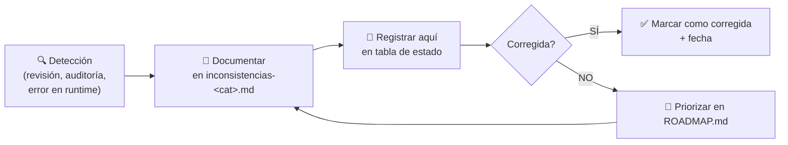

# INCONSISTENCIAS — KeyGo Server

> **Centralizador de inconsistencias** detectadas durante revisiones de código, documentación
> y auditorías del proyecto.
>
> Cada categoría tiene su propio sub-documento con el detalle completo. Este archivo sirve
> de **índice rápido de estado**.

---

## ¿Qué es una inconsistencia?

Una inconsistencia es cualquier diferencia detectada entre:
- Lo que dice la **documentación** vs. lo que hay en el **código/DB**.
- Lo que dice la **especificación** vs. lo que hay **implementado**.
- Lo que dice un **módulo** vs. lo que espera **otro módulo**.
- Lo que dicen las **instrucciones del agente** vs. lo que se hizo en la práctica.

---

## Proceso de gestión

---

## Índice de sub-documentos

| Documento | Categoría | Inconsistencias | Estado |
|---|---|---|---|
| [`inconsistencias-datos.md`](inconsistencias-datos.md) | Modelo de datos / DB schema | 12 | ✅ Todas corregidas |
| [`inconsistencias-seguridad.md`](inconsistencias-seguridad.md) | Seguridad / autenticación / docs operativas | 2 | 🔲 Pendientes |

---

## Resumen de estado

| Categoría | Total | ✅ Corregidas | 🔲 Pendientes | 🔴 Críticas |
|---|---|---|---|---|
| Modelo de datos | 12 | 12 | 0 | 0 |
| Seguridad / autenticación | 2 | 0 | 2 | 0 |
| **Total** | **14** | **12** | **2** | **0** |

---

## Reglas para el agente

1. **Al encontrar una inconsistencia durante cualquier tarea** → documentarla en el sub-documento
   correspondiente a su categoría y registrar en la tabla de estado de este archivo.

2. **Nombrar sub-documentos** como `inconsistencias-<categoria>.md` donde `<categoria>` refleja el área:
   - `datos` — modelo de datos, schema DB, migraciones Flyway
   - `api` — contratos REST, DTOs, endpoints documentados vs. implementados
   - `tests` — tests que no reflejan el comportamiento real
   - `seguridad` — comportamiento de filtros, autenticación
   - `configuracion` — application.yml, properties, valores incorrectos

3. **Inconsistencias críticas** (que pueden causar fallo en runtime) deben marcarse con 🔴 y
   resolverse antes de cerrar la tarea que las detectó.

4. **Inconsistencias no críticas** (documentación, naming) pueden quedar pendientes y
   priorizarse en [`ROADMAP.md`](../../ROADMAP.md) si el esfuerzo de corrección es alto.

---

## Historial de auditorías

| Fecha | Alcance | Detectó | Corrigió |
|---|---|---|---|
| 2026-03-25 | Seguridad Bearer-only vs documentación operativa (`ARCHITECTURE.md`, `docs/api/BOOTSTRAP_FILTER.md`) | 2 inconsistencias de documentación sobre autenticación admin | Pendiente |
| 2026-03-22 | Migraciones SQL V1–V9 vs `DATA_MODEL.md`, `ENTITY_RELATIONSHIPS.md`, `DATA_DICTIONARY.md`, `AUTH_FLOW.md` | 12 inconsistencias en modelo de datos | Mismo día — AI Agent (corrección en docs) |
| 2026-03-22 | Re-auditoría: inconsistencias "resueltas" — docs vs DB real | Tablas V7 en singular (`app_role`, `membership`, `membership_role`) — corrección docs-only era insuficiente | Mismo día — AI Agent via `V10__rename_membership_tables_to_plural.sql` |

---

**Última actualización:** 2026-03-22 | **Responsable:** AI Agent

