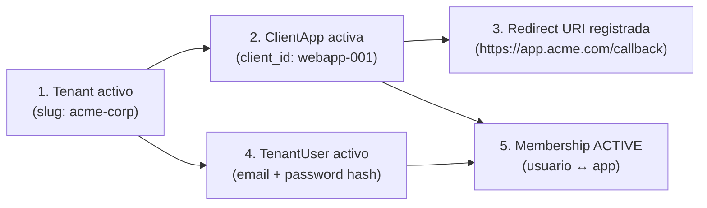
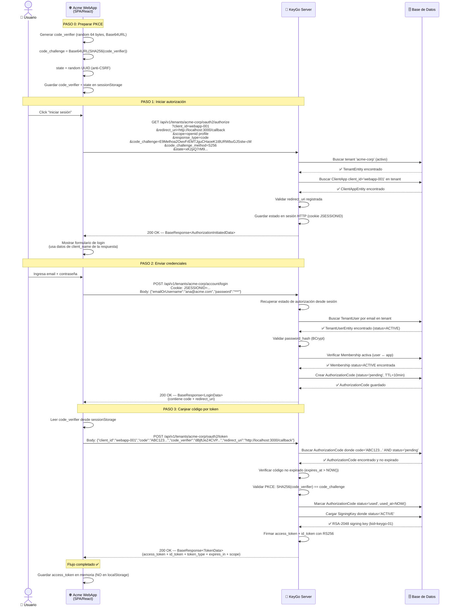
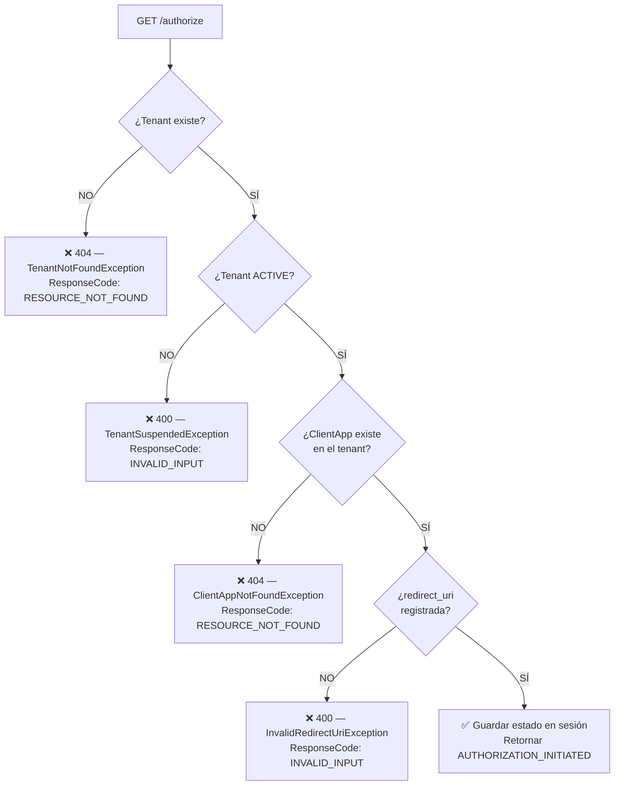
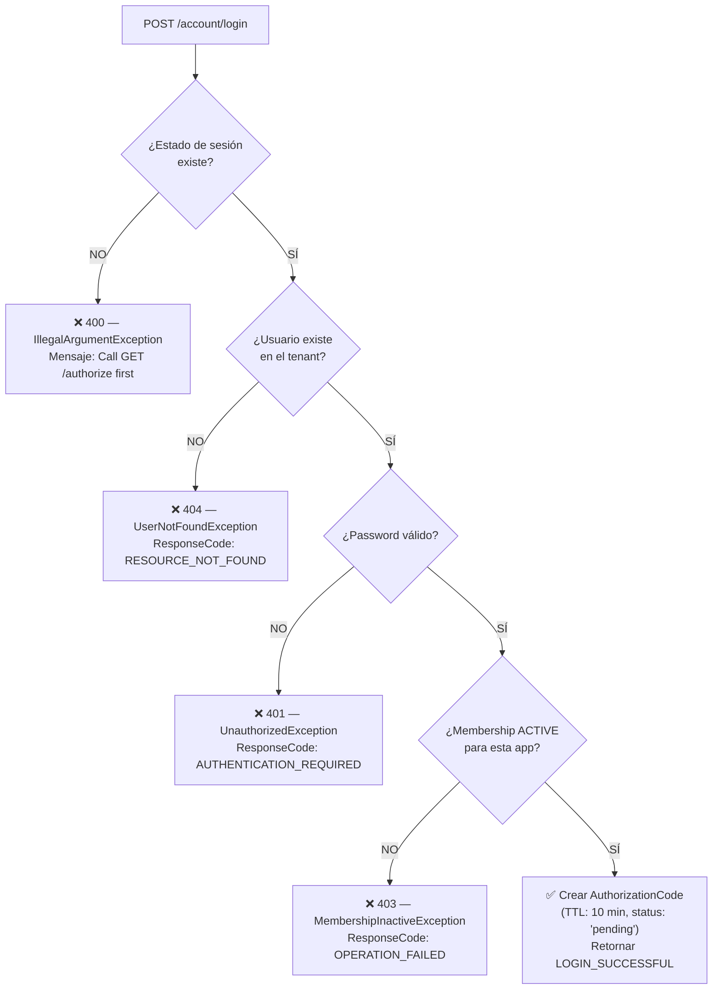
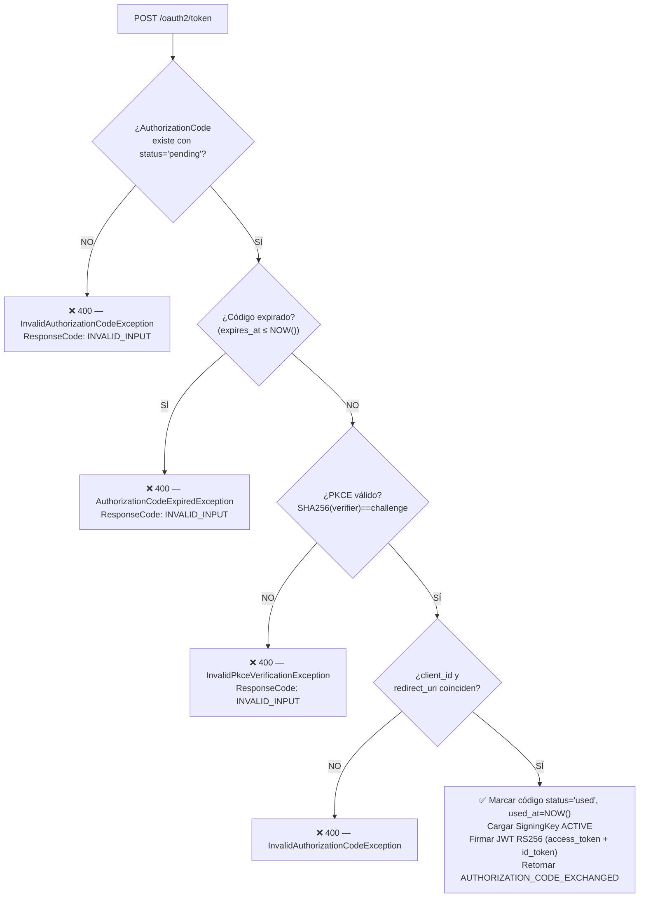
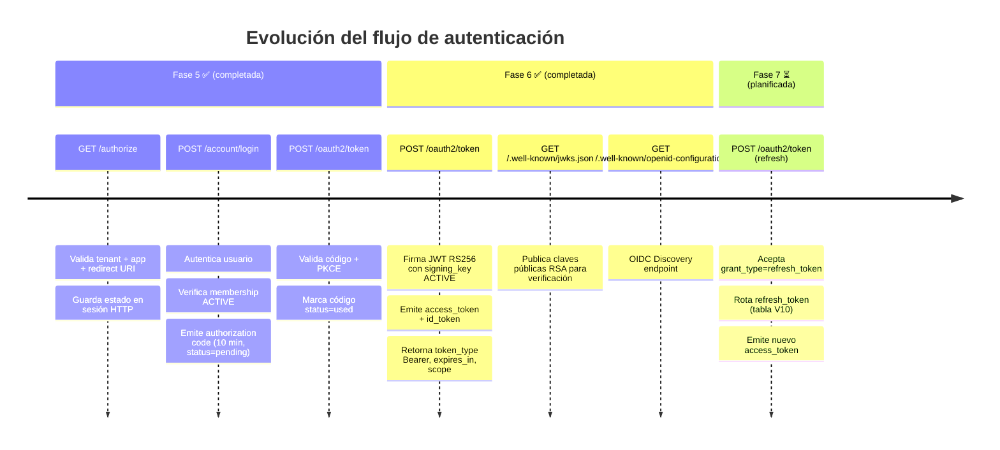

# Flujo de Autenticación — KeyGo Server

> Guía de referencia para implementar el flujo OAuth 2.0 Authorization Code + PKCE
> en una **aplicación cliente** (SPA, Mobile o Web tradicional) que usa **KeyGo Server** como proveedor de identidad.
>
> Fecha de actualización: **2026-03-22** | Estado: **Fases 5 y 6 implementadas** ✅ (JWT RS256 + JWKS + OIDC Discovery)

---

## Tabla de contenidos

1. [Resumen ejecutivo](#resumen-ejecutivo)
2. [Prerrequisitos del sistema](#prerrequisitos-del-sistema)
3. [Diagrama de secuencia completo](#diagrama-de-secuencia-completo)
4. [Paso 0 — Generar PKCE en el cliente](#paso-0--generar-pkce-en-el-cliente)
5. [Paso 1 — Iniciar autorización](#paso-1--iniciar-autorización)
6. [Paso 2 — Enviar credenciales (Login)](#paso-2--enviar-credenciales-login)
7. [Paso 3 — Canjear el código por token](#paso-3--canjear-el-código-por-token)
8. [Manejo de errores](#manejo-de-errores)
9. [Estado actual vs. Fases futuras](#estado-actual-vs-fases-futuras)
10. [Guía de implementación para el cliente](#guía-de-implementación-para-el-cliente)
11. [Checklist de seguridad](#checklist-de-seguridad)

---

## Resumen ejecutivo

KeyGo Server implementa el flujo **OAuth 2.0 Authorization Code + PKCE** (RFC 7636) como mecanismo
central de autenticación. Es el flujo recomendado para aplicaciones públicas (SPA, mobile) porque
**elimina la necesidad de un `client_secret`** y protege contra el robo del código de autorización
mediante el par `code_verifier` / `code_challenge`.

| Característica | Valor |
|---|---|
| Grant type | `authorization_code` |
| PKCE soportado | ✅ S256 y plain |
| Duración del authorization code | **10 minutos** (no renovable) |
| Uso del authorization code | **Una sola vez** (`pending` → `used` tras el canje) |
| Sesión HTTP entre pasos 1 y 2 | Cookie de sesión (JSESSIONID) |
| Access token (JWT RS256) | ✅ Implementado (Fase 6) |
| ID token (OIDC) | ✅ Implementado (Fase 6) |
| JWKS endpoint | ✅ Implementado — `GET /.well-known/jwks.json` |
| OIDC Discovery | ✅ Implementado — `GET /.well-known/openid-configuration` |
| Refresh token | ⏳ Planificado (Fase 7) |

---

## Prerrequisitos del sistema

Antes de que un usuario pueda autenticarse, **deben existir** los siguientes recursos en KeyGo Server:



| Recurso | Endpoint de creación | Campo clave |
|---|---|---|
| Tenant | `POST /api/v1/tenants` | `slug` |
| ClientApp | `POST /api/v1/tenants/{slug}/apps` | `clientId`, `redirectUris` |
| TenantUser | `POST /api/v1/tenants/{slug}/users` | `email`, `username`, `password` |
| Membership | `POST /api/v1/tenants/{slug}/apps/{clientId}/memberships` | `userId` |

> ⚠️ Si cualquiera de estos recursos no existe o está inactivo, el flujo fallará con un error específico.
> Ver [Manejo de errores](#manejo-de-errores).

---

## Diagrama de secuencia completo

Escenario: **usuario inicia sesión en `Acme WebApp`** (SPA React corriendo en `http://localhost:3000`).



---

## Paso 0 — Generar PKCE en el cliente

PKCE (Proof Key for Code Exchange) se debe generar **antes** de iniciar el flujo. El cliente
almacena el `code_verifier` y envía solo el `code_challenge` al servidor.

### Algoritmo S256 (recomendado)

```
code_verifier  = Base64URL(random(64 bytes))  ← guardar en sessionStorage
code_challenge = Base64URL(SHA256(code_verifier))  ← enviar al server
```

### Implementación JavaScript (navegador)

```javascript
// Generar code_verifier aleatorio
function generateCodeVerifier() {
  const array = new Uint8Array(64);
  crypto.getRandomValues(array);
  return btoa(String.fromCharCode(...array))
    .replace(/\+/g, '-').replace(/\//g, '_').replace(/=/g, '');
}

// Calcular code_challenge con SHA-256
async function generateCodeChallenge(verifier) {
  const encoder = new TextEncoder();
  const data = encoder.encode(verifier);
  const digest = await crypto.subtle.digest('SHA-256', data);
  return btoa(String.fromCharCode(...new Uint8Array(digest)))
    .replace(/\+/g, '-').replace(/\//g, '_').replace(/=/g, '');
}

// Generar state anti-CSRF
function generateState() {
  return crypto.randomUUID();
}

// Uso
const codeVerifier  = generateCodeVerifier();
const codeChallenge = await generateCodeChallenge(codeVerifier);
const state         = generateState();

// Guardar para usar en Paso 3
sessionStorage.setItem('pkce_code_verifier', codeVerifier);
sessionStorage.setItem('oauth_state', state);
```

### Implementación Swift (iOS/macOS)

```swift
import CryptoKit
import Foundation

func generateCodeVerifier() -> String {
    var buffer = [UInt8](repeating: 0, count: 64)
    _ = SecRandomCopyBytes(kSecRandomDefault, buffer.count, &buffer)
    return Data(buffer).base64EncodedString()
        .replacingOccurrences(of: "+", with: "-")
        .replacingOccurrences(of: "/", with: "_")
        .replacingOccurrences(of: "=", with: "")
}

func generateCodeChallenge(from verifier: String) -> String {
    let data = Data(verifier.utf8)
    let hash = SHA256.hash(data: data)
    return Data(hash).base64EncodedString()
        .replacingOccurrences(of: "+", with: "-")
        .replacingOccurrences(of: "/", with: "_")
        .replacingOccurrences(of: "=", with: "")
}
```

---

## Paso 1 — Iniciar autorización

### Request

```http
GET /keygo-server/api/v1/tenants/{tenantSlug}/oauth2/authorize HTTP/1.1
Host: localhost:8080
```

| Query param | Requerido | Descripción |
|---|---|---|
| `client_id` | ✅ | ID de la aplicación cliente |
| `redirect_uri` | ✅ | URI de redirección registrada en la app |
| `scope` | ✅ | Permisos solicitados (ej. `openid profile`) |
| `response_type` | ✅ | Debe ser `code` |
| `code_challenge` | Recomendado | PKCE challenge (Base64URL SHA256 del verifier) |
| `code_challenge_method` | Recomendado | `S256` o `plain` |
| `state` | Recomendado | Token aleatorio para protección CSRF |

**Ejemplo:**

```http
GET /keygo-server/api/v1/tenants/acme-corp/oauth2/authorize
    ?client_id=webapp-001
    &redirect_uri=http://localhost:3000/callback
    &scope=openid%20profile
    &response_type=code
    &code_challenge=E9Melhoa2OwvFrEMTJguCHaoeK1t8URWbuGJSstw-cM
    &code_challenge_method=S256
    &state=xK2pQ7rM9vLs3nT1
Host: localhost:8080
```

### Response exitosa — `200 OK`

```json
{
  "date": "2026-03-22T14:30:00.000Z",
  "success": {
    "code": "AUTHORIZATION_INITIATED",
    "message": "Authorization initiated"
  },
  "data": {
    "client_id": "webapp-001",
    "client_name": "Acme WebApp",
    "redirect_uri": "http://localhost:3000/callback"
  }
}
```

> **⚠️ Nota importante:** El servidor guarda el estado de autorización en la **sesión HTTP** (cookie `JSESSIONID`).
> El cliente **debe enviar esta cookie** en el Paso 2 para que el servidor pueda recuperar el estado.
> En navegadores esto es automático. En apps mobile, usar la misma instancia de `URLSession`/`OkHttpClient` con gestión de cookies habilitada.

### Qué valida KeyGo en este paso



---

## Paso 2 — Enviar credenciales (Login)

### Request

```http
POST /keygo-server/api/v1/tenants/{tenantSlug}/account/login HTTP/1.1
Host: localhost:8080
Content-Type: application/json
Cookie: JSESSIONID=<cookie-del-paso-1>
```

**Body:**

```json
{
  "emailOrUsername": "ana@acme.com",
  "password": "mi-contraseña-segura"
}
```

| Campo | Requerido | Descripción |
|---|---|---|
| `emailOrUsername` | ✅ | Email o username del usuario en el tenant |
| `password` | ✅ | Contraseña en texto plano (se compara contra hash) |

> **La cookie de sesión es obligatoria.** Sin ella el servidor no puede recuperar el estado de autorización
> guardado en el Paso 1 y retornará `IllegalArgumentException`.

### Response exitosa — `200 OK`

```json
{
  "date": "2026-03-22T14:30:05.000Z",
  "success": {
    "code": "LOGIN_SUCCESSFUL",
    "message": "Login successful"
  },
  "data": {
    "message": "Login successful",
    "code": "dBjftJeZ4CVP-mB92K27uhbUJU1p1r_wW1gFWFOEjXk",
    "redirect_uri": "http://localhost:3000/callback"
  }
}
```

| Campo | Descripción |
|---|---|
| `data.code` | Authorization code temporal — válido **10 minutos**, uso **único** |
| `data.redirect_uri` | URI de redirección donde el cliente debe navegar con el código |
| `data.message` | Mensaje de confirmación |

> **Comportamiento actual (Fase 5):** El código se retorna directamente en el JSON de respuesta.
> En Fase 6 se implementará la redirección HTTP real (`302 Found` a `redirect_uri?code=...&state=...`),
> que es el comportamiento estándar OAuth2 para flujos basados en navegador.

### Qué valida KeyGo en este paso



---

## Paso 3 — Canjear el código por token

### Request

```http
POST /keygo-server/api/v1/tenants/{tenantSlug}/oauth2/token HTTP/1.1
Host: localhost:8080
Content-Type: application/json
```

**Body:**

```json
{
  "client_id": "webapp-001",
  "code": "dBjftJeZ4CVP-mB92K27uhbUJU1p1r_wW1gFWFOEjXk",
  "code_verifier": "M25iVXpKU3puUjFaYWg3T1NDTDQtcW1ROUY5YXlwalNoc0hhakxifmZHag",
  "redirect_uri": "http://localhost:3000/callback"
}
```

| Campo | Requerido | Descripción |
|---|---|---|
| `client_id` | ✅ | Mismo `client_id` del Paso 1 |
| `code` | ✅ | Authorization code recibido en Paso 2 |
| `code_verifier` | Si se usó PKCE | El verifier original que generó el `code_challenge` |
| `redirect_uri` | ✅ | Debe coincidir **exactamente** con la del Paso 1 |

### Response exitosa — `200 OK`

```json
{
  "date": "2026-03-22T14:30:08.000Z",
  "success": {
    "code": "AUTHORIZATION_CODE_EXCHANGED",
    "message": "Authorization code exchanged"
  },
  "data": {
    "access_token": "eyJhbGciOiJSUzI1NiIsImtpZCI6ImtleWdvLTAxIn0.eyJzdWIiOiJ1c2VyLXV1aWQiLCJpc3MiOiJodHRwOi8vbG9jYWxob3N0OjgwODAva2V5Z28tc2VydmVyIiwiYXVkIjoid2ViYXBwLTAwMSIsInNjb3BlIjoib3BlbmlkIHByb2ZpbGUiLCJleHAiOjE3NDI2NTcwMDgsImlhdCI6MTc0MjY1MzQwOH0.signature",
    "id_token": "eyJhbGciOiJSUzI1NiIsImtpZCI6ImtleWdvLTAxIn0.eyJzdWIiOiJ1c2VyLXV1aWQiLCJlbWFpbCI6ImFuYUBhY21lLmNvbSIsIm5hbWUiOiJBbmEgR2FyY8OtYSIsImlhdCI6MTc0MjY1MzQwOCwiZXhwIjoxNzQyNjU3MDA4fQ.signature",
    "token_type": "Bearer",
    "expires_in": 3600,
    "scope": "openid profile"
  }
}
```

| Campo | Descripción |
|---|---|
| `data.access_token` | JWT firmado con RS256. Incluir como `Authorization: Bearer <token>` en APIs protegidas |
| `data.id_token` | JWT con claims de identidad del usuario (OIDC) |
| `data.token_type` | Siempre `Bearer` |
| `data.expires_in` | Segundos de validez del access token (3600 = 1 hora) |
| `data.scope` | Scopes autorizados efectivamente concedidos |

> **Verificar el JWT:** la clave pública para verificar la firma está en `GET /keygo-server/api/v1/tenants/{slug}/.well-known/jwks.json`.  
> El campo `kid` del header del JWT identifica qué clave usar del JWKS.

### Qué valida KeyGo en este paso



---

## Manejo de errores

Todos los errores siguen el envelope `BaseResponse<Void>`:

```json
{
  "date": "2026-03-22T14:30:00.000Z",
  "failure": {
    "code": "RESOURCE_NOT_FOUND",
    "message": "Tenant not found"
  }
}
```

### Tabla de errores por paso

| Paso | Excepción | HTTP | ResponseCode | Causa |
|---|---|---|---|---|
| 1 | `TenantNotFoundException` | `404` | `RESOURCE_NOT_FOUND` | Tenant no existe |
| 1 | `TenantSuspendedException` | `400` | `INVALID_INPUT` | Tenant suspendido |
| 1 | `ClientAppNotFoundException` | `404` | `RESOURCE_NOT_FOUND` | App no existe en el tenant |
| 1 | `InvalidRedirectUriException` | `400` | `INVALID_INPUT` | redirect_uri no registrada |
| 1 | `IllegalArgumentException` | `400` | `INVALID_INPUT` | response_type != "code" |
| 2 | `IllegalArgumentException` | `400` | `INVALID_INPUT` | Sesión sin estado de autorización (Paso 1 no ejecutado) |
| 2 | `UserNotFoundException` | `404` | `RESOURCE_NOT_FOUND` | Usuario no existe en el tenant |
| 2 | `UnauthorizedException` | `401` | `AUTHENTICATION_REQUIRED` | Password incorrecto |
| 2 | `MembershipInactiveException` | `500` | `OPERATION_FAILED` | Usuario sin membership activa en la app |
| 3 | `InvalidAuthorizationCodeException` | `400` | `INVALID_INPUT` | Código no encontrado, ya usado o inválido |
| 3 | `AuthorizationCodeExpiredException` | `400` | `INVALID_INPUT` | Código expirado (> 10 min) |
| 3 | `InvalidPkceVerificationException` | `400` | `INVALID_INPUT` | PKCE verification falló |
| 3 | `NoActiveSigningKeyException` | `503` | `OPERATION_FAILED` | No hay clave de firma activa en DB |

---

## Estado actual vs. Fases futuras



| Característica | Fase 5 ✅ | Fase 6 ✅ | Fase 7 ⏳ |
|---|---|---|---|
| Validación de tenant/app | ✅ | ✅ | ✅ |
| Autenticación de usuario | ✅ | ✅ | ✅ |
| Verificación de membership | ✅ | ✅ | ✅ |
| Authorization code (10 min) | ✅ | ✅ | ✅ |
| Validación PKCE (S256/plain) | ✅ | ✅ | ✅ |
| Access token JWT (RS256) | ❌ | ✅ | ✅ |
| ID token (OIDC) | ❌ | ✅ | ✅ |
| JWKS endpoint | ❌ | ✅ | ✅ |
| OIDC Discovery | ❌ | ✅ | ✅ |
| Refresh token | ❌ | ❌ | ✅ |
| Redirect HTTP 302 real | ❌ | ❌ | ✅ |

---

## Guía de implementación para el cliente

### SPA (React / Vue / Angular)

```typescript
// auth.ts — Servicio de autenticación KeyGo

const KEYGO_BASE = 'http://localhost:8080/keygo-server';
const TENANT    = 'acme-corp';
const CLIENT_ID = 'webapp-001';
const REDIRECT  = 'http://localhost:3000/callback';

// ------------------------------------------------------------------
// PASO 0: Generar PKCE + state
// ------------------------------------------------------------------
async function startLogin(): Promise<void> {
  const codeVerifier  = generateCodeVerifier();
  const codeChallenge = await generateCodeChallenge(codeVerifier);
  const state         = generateState();

  sessionStorage.setItem('pkce_code_verifier', codeVerifier);
  sessionStorage.setItem('oauth_state', state);

  const params = new URLSearchParams({
    client_id:             CLIENT_ID,
    redirect_uri:          REDIRECT,
    scope:                 'openid profile',
    response_type:         'code',
    code_challenge:        codeChallenge,
    code_challenge_method: 'S256',
    state,
  });

  // ------------------------------------------------------------------
  // PASO 1: Iniciar autorización
  // ------------------------------------------------------------------
  const res = await fetch(
    `${KEYGO_BASE}/api/v1/tenants/${TENANT}/oauth2/authorize?${params}`,
    { credentials: 'include' }  // ← importante: enviar/recibir cookies
  );
  const body = await res.json();

  if (!res.ok) throw new Error(body.failure?.message ?? 'Error al iniciar autorización');

  // Mostrar formulario de login con los datos de la app
  showLoginForm({
    clientName:  body.data.client_name,
    redirectUri: body.data.redirect_uri,
  });
}

// ------------------------------------------------------------------
// PASO 2: Enviar credenciales
// ------------------------------------------------------------------
async function submitLogin(emailOrUsername: string, password: string): Promise<string> {
  const res = await fetch(
    `${KEYGO_BASE}/api/v1/tenants/${TENANT}/account/login`,
    {
      method:      'POST',
      credentials: 'include',  // ← importante: enviar cookie de sesión
      headers:     { 'Content-Type': 'application/json' },
      body:        JSON.stringify({ emailOrUsername, password }),
    }
  );
  const body = await res.json();

  if (!res.ok) throw new Error(body.failure?.message ?? 'Credenciales inválidas');

  return body.data.code; // authorization code
}

// ------------------------------------------------------------------
// PASO 3: Canjear código por token
// ------------------------------------------------------------------
async function exchangeCode(code: string): Promise<void> {
  const codeVerifier = sessionStorage.getItem('pkce_code_verifier');
  if (!codeVerifier) throw new Error('PKCE verifier no encontrado en sesión');

  const res = await fetch(
    `${KEYGO_BASE}/api/v1/tenants/${TENANT}/oauth2/token`,
    {
      method:  'POST',
      headers: { 'Content-Type': 'application/json' },
      body:    JSON.stringify({
        client_id:     CLIENT_ID,
        code,
        code_verifier: codeVerifier,
        redirect_uri:  REDIRECT,
      }),
    }
  );
  const body = await res.json();

  if (!res.ok) throw new Error(body.failure?.message ?? 'Error al canjear código');

  // Fase 6: access_token + id_token reales (JWT RS256)
  const { access_token, id_token, token_type, expires_in, scope } = body.data;

  // Guardar en memoria (NO en localStorage — riesgo XSS)
  this.accessToken = access_token;
  this.idToken     = id_token;
  this.tokenExpiry = Date.now() + expires_in * 1000;

  console.log('Token scope:', scope);
  console.log('Token type:', token_type);   // siempre "Bearer"

  sessionStorage.removeItem('pkce_code_verifier');
  sessionStorage.removeItem('oauth_state');
}
```

### Mobile (Kotlin/Android con OkHttp)

```kotlin
// AuthRepository.kt — Repositorio de autenticación

class AuthRepository(private val client: OkHttpClient) {
    private val base   = "http://10.0.2.2:8080/keygo-server"
    private val tenant = "acme-corp"
    private val clientId = "webapp-001"
    private val redirectUri = "com.acme.app://callback"

    // PASO 1: Iniciar autorización
    suspend fun authorize(codeChallenge: String, state: String): AuthInitResult {
        val url = HttpUrl.Builder()
            .scheme("http").host("10.0.2.2").port(8080)
            .addPathSegments("keygo-server/api/v1/tenants/$tenant/oauth2/authorize")
            .addQueryParameter("client_id", clientId)
            .addQueryParameter("redirect_uri", redirectUri)
            .addQueryParameter("scope", "openid profile")
            .addQueryParameter("response_type", "code")
            .addQueryParameter("code_challenge", codeChallenge)
            .addQueryParameter("code_challenge_method", "S256")
            .addQueryParameter("state", state)
            .build()

        val request = Request.Builder().url(url).get().build()
        // OkHttp maneja cookies automáticamente si se configura CookieJar
        val response = client.newCall(request).await()
        return response.parseBody()
    }

    // PASO 2: Login
    suspend fun login(emailOrUsername: String, password: String): String {
        val body = """{"emailOrUsername":"$emailOrUsername","password":"$password"}"""
            .toRequestBody("application/json".toMediaType())

        val request = Request.Builder()
            .url("$base/api/v1/tenants/$tenant/account/login")
            .post(body)
            .build()

        val response = client.newCall(request).await()
        return response.parseBody<LoginResponse>().data.code
    }

    // PASO 3: Canjear código
    suspend fun exchangeCode(code: String, codeVerifier: String): TokenResponse {
        val bodyJson = """
          {
            "client_id":     "$clientId",
            "code":          "$code",
            "code_verifier": "$codeVerifier",
            "redirect_uri":  "$redirectUri"
          }
        """.trimIndent().toRequestBody("application/json".toMediaType())

        val request = Request.Builder()
            .url("$base/api/v1/tenants/$tenant/oauth2/token")
            .post(bodyJson)
            .build()

        val response = client.newCall(request).await()
        return response.parseBody()
    }
}
```

---

## Checklist de seguridad

Antes de pasar a producción, verificar que la aplicación cliente cumple con:

| # | Control | SPA | Mobile | Descripción |
|---|---|---|---|---|
| 1 | ✅ Usar PKCE S256 | ✅ | ✅ | Nunca usar `plain`; usar SHA-256 siempre |
| 2 | ✅ Generar `state` aleatorio | ✅ | ✅ | Verificar que el `state` recibido coincide con el enviado |
| 3 | ✅ Validar `state` en callback | ✅ | ✅ | Protege contra CSRF |
| 4 | ✅ No guardar tokens en `localStorage` | ✅ | N/A | Usar memoria o httpOnly cookies |
| 5 | ✅ Limpiar `sessionStorage` tras el canje | ✅ | N/A | Eliminar `code_verifier` y `state` |
| 6 | ✅ Enviar cookie de sesión entre pasos 1 y 2 | ✅ | ✅ | `credentials: 'include'` en fetch / CookieJar en OkHttp |
| 7 | ✅ Canjear código una sola vez | ✅ | ✅ | El código se invalida automáticamente al canjearse |
| 8 | ✅ Usar HTTPS en producción | ✅ | ✅ | Nunca exponer `code` ni tokens en HTTP plain |
| 9 | ✅ `redirect_uri` exacta sin wildcards | ✅ | ✅ | Registrar URIs explícitas en la app |
| 10 | ✅ No incluir `client_secret` en apps públicas | ✅ | ✅ | PKCE reemplaza al secret para SPAs y mobile |

---

## Referencias cruzadas

| Documento | Contenido relacionado |
|---|---|
| [`AGENTS.md`](../../AGENTS.md) | Lista de endpoints, URLs base, headers requeridos |
| [`ENTITY_RELATIONSHIPS.md`](./ENTITY_RELATIONSHIPS.md) | Diagrama de entidades `AuthorizationCode`, `RefreshToken`, flujos OAuth2 |
| [`DATA_MODEL.md`](./DATA_MODEL.md) | Tabla `authorization_codes`, campos y constraints |
| [`ARCHITECTURE.md`](./ARCHITECTURE.md) | Capas hexagonales, UseCases, Ports involucrados |
| [`postman/KeyGo-Server.postman_collection.json`](../../postman/KeyGo-Server.postman_collection.json) | Carpeta `🔐 OAuth2 Authorization` con 3 requests listos para ejecutar |
| [`docs/arch/keygo_server_implementation_plan.md`](../arch/keygo_server_implementation_plan.md) | Fases 5 y 6 del plan de implementación |

---

**Última actualización:** 2026-03-22 | **Responsable:** AI Agent | **Alcance:** Fases 5 y 6 implementadas ✅

