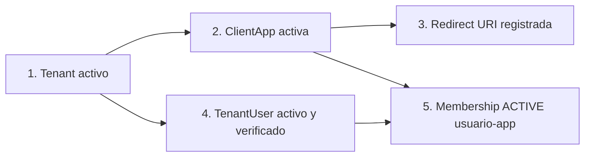
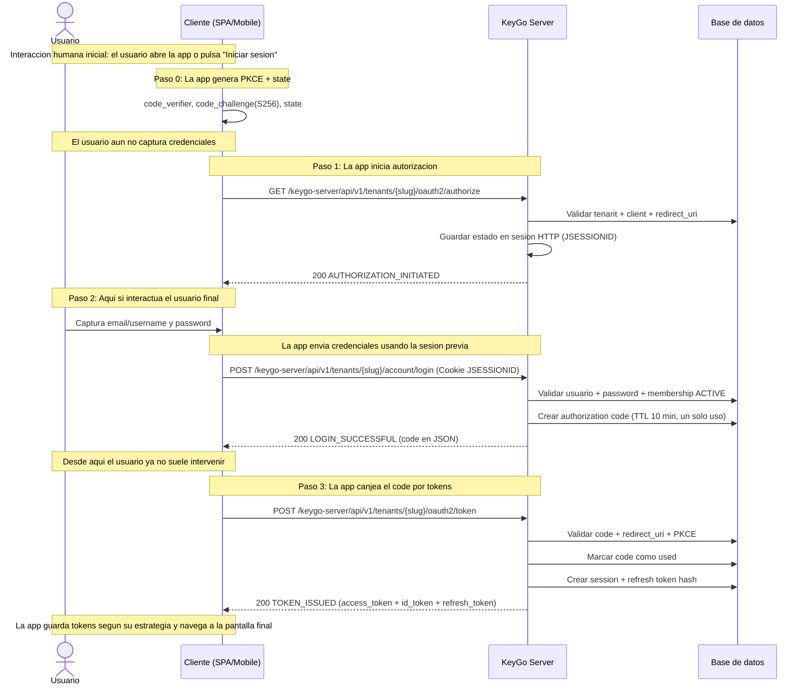

# Flujo de Autenticacion — KeyGo Server

> Guia de referencia del flujo OAuth2/OIDC implementado actualmente en KeyGo Server para clientes SPA, mobile y server-to-server.
>
> Fecha de actualizacion: **2026-03-25** | Estado: **Fases 5, 6, 7, 8 y 9b implementadas**

---

## Tabla de contenidos

1. [Resumen ejecutivo](#resumen-ejecutivo)
2. [Prerrequisitos del sistema](#prerrequisitos-del-sistema)
3. [Seguridad de endpoints (publico vs protegido)](#seguridad-de-endpoints-publico-vs-protegido)
4. [Flujo principal: Authorization Code + PKCE](#flujo-principal-authorization-code--pkce)
5. [Endpoint de tokens: grants soportados](#endpoint-de-tokens-grants-soportados)
6. [Manejo de errores](#manejo-de-errores)
7. [Checklist para clientes](#checklist-para-clientes)
8. [Referencias cruzadas](#referencias-cruzadas)

---

## Resumen ejecutivo

KeyGo Server implementa el flujo **OAuth 2.0 Authorization Code + PKCE** como flujo principal para usuarios finales, y tambien soporta **refresh token rotation** y **client_credentials** para M2M.

| Caracteristica | Estado actual |
|---|---|
| Authorization Code + PKCE | Implementado |
| Login con sesion HTTP intermedia (JSESSIONID) | Implementado |
| Access token JWT RS256 | Implementado |
| ID token (OIDC) | Implementado |
| Refresh token (emision + rotacion) | Implementado |
| Client Credentials (M2M) | Implementado |
| Revocacion de token (`/oauth2/revoke`) | Implementado |
| OIDC Discovery + JWKS + UserInfo | Implementado |

Notas relevantes del estado actual:
- El `grant_type` en `POST /oauth2/token` es opcional; si no se envia, el backend asume `authorization_code`.
- `POST /account/login` **retorna el authorization code en JSON** (`BaseResponse<LoginData>`), no hace redirect `302`.
- El `context-path` activo es `/keygo-server`; todas las URLs deben incluirlo.

### ¿Cuando interactua realmente el usuario final?

En este flujo hay **tres actores distintos** que conviene no mezclar:

| Actor | Rol en el flujo | Ejemplos en KeyGo actual |
|---|---|---|
| **Usuario final** | Persona que toma decisiones y captura datos | Hace clic en "Iniciar sesion", escribe usuario/password, espera entrar a la app |
| **Cliente SPA/Mobile** | La app frontend que orquesta el flujo OAuth2 | Genera PKCE, llama `/authorize`, conserva `JSESSIONID`, llama `/account/login`, canjea el code en `/oauth2/token`, renueva tokens |
| **KeyGo Server** | Backend que valida y emite artefactos OAuth2/OIDC | Valida tenant/app/redirect URI, autentica credenciales, emite `authorization_code`, `access_token`, `id_token`, `refresh_token` |

Regla practica para leer el resto del documento:
- Si el paso habla de **capturar credenciales** o de que alguien "ve" la pantalla, la interaccion es del **usuario final**.
- Si el paso habla de **hacer requests HTTP**, **guardar PKCE**, **reenviar cookies** o **canjear tokens**, la interaccion es de la **SPA/Mobile**.
- Si el paso habla de **validar**, **persistir** o **emitir** codigos/tokens, la accion es de **KeyGo Server**.

---

## Prerrequisitos del sistema

Antes de iniciar autenticacion de usuario, deben existir y estar activos:



| Recurso | Endpoint de creacion (referencia) | Campo clave |
|---|---|---|
| Tenant | `POST /api/v1/tenants` | `slug` |
| ClientApp | `POST /api/v1/tenants/{slug}/apps` | `clientId`, `redirectUris` |
| TenantUser | `POST /api/v1/tenants/{slug}/users` | `email`, `username`, `password` |
| Membership | `POST /api/v1/tenants/{slug}/memberships` | `userId`, `clientAppId`, `roleCodes` |

---

## Seguridad de endpoints (publico vs protegido)

Con el filtro `BootstrapAdminKeyFilter` actual:

- Rutas `/api/**` estan protegidas por Bearer **excepto** ciertos sufijos/public paths.
- Estos endpoints de flujo OAuth2/OIDC son **publicos** (el filtro no exige Bearer en el borde):
  - `GET /api/v1/tenants/{tenantSlug}/oauth2/authorize`
  - `POST /api/v1/tenants/{tenantSlug}/account/login`
  - `POST /api/v1/tenants/{tenantSlug}/oauth2/token`
  - `POST /api/v1/tenants/{tenantSlug}/oauth2/revoke`
  - `GET /api/v1/tenants/{tenantSlug}/userinfo`
  - `GET /api/v1/tenants/{tenantSlug}/.well-known/openid-configuration`
  - `GET /api/v1/tenants/{tenantSlug}/.well-known/jwks.json`

> Publico en este contexto significa "sin autenticacion exigida por el filtro de borde". Algunos endpoints validan credenciales propias (por ejemplo `refresh_token`, `client_secret`, Bearer token de usuario, etc.) dentro del caso de uso/controlador.

---

## Flujo principal: Authorization Code + PKCE

Escenario: autenticacion de usuario final (SPA/mobile/web).

### Vista rapida: quien hace que en cada paso

| Paso | Usuario final | Cliente SPA/Mobile | KeyGo Server |
|---|---|---|---|
| 0. Preparacion | Aun no interactua | Genera `code_verifier`, `code_challenge` y `state` | — |
| 1. Inicio de autorizacion | Hace clic en login o entra a una ruta protegida | Llama `GET /oauth2/authorize` | Valida tenant/app/redirect URI y guarda estado en sesion HTTP |
| 2. Login | Escribe usuario/email y password | Renderiza formulario, envia `POST /account/login` y preserva `JSESSIONID` | Valida credenciales y emite `authorization_code` |
| 3. Canje del code | Ya no interactua directamente | Llama `POST /oauth2/token` con `code` + `code_verifier` | Valida code/PKCE y emite tokens |
| 4. Sesion activa | Usa la app normalmente | Adjunta Bearer token a llamadas API | Valida token en endpoints protegidos |
| 5. Renovacion | Normalmente no interactua | Llama `POST /oauth2/token` con `grant_type=refresh_token` | Rota refresh token y emite nuevos tokens |

> Punto clave: en el backend actual **el usuario final solo interactua de forma directa en el inicio de login y en la captura de credenciales**. El resto del flujo lo ejecuta la **SPA/Mobile** de forma programatica.



### Lectura funcional del flujo

1. **El usuario inicia la autenticacion desde la app**, no llamando el endpoint manualmente.
2. **La SPA/Mobile prepara el contexto tecnico** (`state`, PKCE, almacenamiento temporal y manejo de cookie de sesion).
3. **El usuario solo participa activamente en el login**: captura credenciales y confirma entrar.
4. **La SPA/Mobile retoma el control** en cuanto recibe `data.code` desde `POST /account/login`.
5. **La obtencion y renovacion de tokens es responsabilidad del cliente**, no del usuario final.

### Particularidad importante del backend actual

En una implementacion OAuth2 "clasica" con login hospedado, el navegador suele terminar en un `302` hacia la `redirect_uri`.
En **KeyGo Server hoy no ocurre eso**:

- `GET /oauth2/authorize` devuelve `200` con datos de la app cliente.
- `POST /account/login` devuelve `200` con `data.code` en JSON.
- Por lo tanto, la **SPA/Mobile** debe decidir que hacer con ese `code`:
  - canjearlo de inmediato en `POST /oauth2/token`, o
  - navegar manualmente a su callback si quiere modelar una UX mas parecida al redirect tradicional.

Esto explica por que, al leer el flujo, puede parecer ambiguo "quien interactua":
- **el usuario** interactua con la interfaz visual;
- **la SPA/Mobile** interactua con los endpoints OAuth2;
- **KeyGo** solo responde a las llamadas del cliente y aplica validaciones/reglas.

### Paso 0 — Generar PKCE

- Generar `code_verifier` aleatorio (Base64URL).
- Generar `code_challenge` usando `S256`.
- Guardar `code_verifier` y `state` en almacenamiento de sesion del cliente.
- **Actor principal:** Cliente SPA/Mobile.
- **Intervencion del usuario:** ninguna todavia.

### Paso 1 — `GET /oauth2/authorize`

URL completa (ejemplo local):

```http
GET /keygo-server/api/v1/tenants/acme-corp/oauth2/authorize?client_id=webapp-001&redirect_uri=http://localhost:3000/callback&scope=openid%20profile&response_type=code&code_challenge=...&code_challenge_method=S256&state=...
```

Valida:
- Tenant existe y esta ACTIVE.
- Client app existe en tenant.
- `redirect_uri` registrada.
- `response_type=code`.

Respuesta exitosa:
- HTTP `200`
- `success.code = AUTHORIZATION_INITIATED`
- `data`: `client_id`, `client_name`, `redirect_uri`

Lectura por actor:
- **Usuario final:** normalmente solo ve que la app entra al modo "login".
- **SPA/Mobile:** dispara la request, conserva la cookie `JSESSIONID` y prepara la UI de autenticacion.
- **KeyGo Server:** valida parametros y deja guardado `authorizationState` en la sesion HTTP.

### Paso 2 — `POST /account/login`

URL completa (ejemplo local):

```http
POST /keygo-server/api/v1/tenants/acme-corp/account/login
Content-Type: application/json
Cookie: JSESSIONID=<cookie-del-paso-1>
```

Body ejemplo:

```json
{
  "emailOrUsername": "ana@acme.com",
  "password": "mi-password"
}
```

Valida:
- Sesion con estado de autorizacion previo.
- Credenciales del usuario.
- Usuario activo/verificado.
- Membership ACTIVE del usuario para la app.

Respuesta exitosa:
- HTTP `200`
- `success.code = LOGIN_SUCCESSFUL`
- `data.code` (authorization code), `data.redirect_uri`

Lectura por actor:
- **Usuario final:** captura `emailOrUsername` y `password`.
- **SPA/Mobile:** renderiza el formulario, envia el body JSON y reenvia la cookie `JSESSIONID` obtenida en el paso 1.
- **KeyGo Server:** autentica al usuario y emite el `authorization_code` temporal.

> Importante: despues de este paso el usuario no tiene que copiar ni pegar el code. Ese trabajo le corresponde al cliente SPA/Mobile.

### Paso 3 — `POST /oauth2/token` con `authorization_code`

URL completa (ejemplo local):

```http
POST /keygo-server/api/v1/tenants/acme-corp/oauth2/token
Content-Type: application/json
```

Body ejemplo:

```json
{
  "grant_type": "authorization_code",
  "client_id": "webapp-001",
  "code": "abc123...",
  "code_verifier": "verifier-original",
  "redirect_uri": "http://localhost:3000/callback"
}
```

Respuesta exitosa:
- HTTP `200`
- `success.code = TOKEN_ISSUED`
- `data`: `access_token`, `id_token`, `refresh_token`, `token_type`, `expires_in`, `scope`, `authorization_code_id`

Lectura por actor:
- **Usuario final:** normalmente ya no interactua; solo espera que la app termine el login.
- **SPA/Mobile:** envia `code`, `code_verifier`, `client_id` y `redirect_uri`; despues guarda/usa los tokens segun su estrategia.
- **KeyGo Server:** valida PKCE, marca el code como usado, abre sesion y emite tokens.

---

## Endpoint de tokens: grants soportados

`POST /keygo-server/api/v1/tenants/{tenantSlug}/oauth2/token`

| Grant | Requisitos minimos | ResponseCode de exito | Tokens devueltos |
|---|---|---|---|
| `authorization_code` (default) | `client_id`, `code`, `redirect_uri` (+ `code_verifier` si aplica PKCE) | `TOKEN_ISSUED` | `access_token`, `id_token`, `refresh_token` |
| `refresh_token` | `client_id`, `refresh_token` | `REFRESH_TOKEN_ROTATED` | `access_token`, `id_token`, `refresh_token` (nuevo) |
| `client_credentials` | `client_id`, `client_secret` | `CLIENT_CREDENTIALS_TOKEN_ISSUED` | `access_token` (sin `id_token`, sin `refresh_token`) |

### Refresh token rotation

Ejemplo:

```json
{
  "grant_type": "refresh_token",
  "client_id": "webapp-001",
  "refresh_token": "rt_old_...",
  "scope": "openid profile"
}
```

Comportamiento:
- Valida refresh token (vigencia, estado, pertenencia tenant/client).
- Revoca/consume token anterior segun reglas de rotacion.
- Emite nuevo `access_token`, nuevo `id_token` y nuevo `refresh_token`.

Actor esperado:
- **Usuario final:** usualmente no participa.
- **SPA/Mobile:** hace la renovacion silenciosa o al detectar expiracion.
- **KeyGo Server:** rota el refresh token y mantiene la sesion.

### Client credentials (M2M)

Ejemplo:

```json
{
  "grant_type": "client_credentials",
  "client_id": "backend-job-01",
  "client_secret": "secret-plano",
  "scope": "service.read service.write"
}
```

Comportamiento:
- Autentica cliente por `client_id` + `client_secret`.
- Emite `access_token` para app-to-app (sin usuario final).

Actor esperado:
- **No hay usuario final**.
- El actor que interactua es exclusivamente el **cliente tecnico** (backend, job, worker, integracion server-to-server).

---

## Manejo de errores

Todos los errores devuelven `BaseResponse<Void>` con `failure.code` y `failure.message`.

Ejemplo:

```json
{
  "date": "2026-03-25T10:00:00.000Z",
  "failure": {
    "code": "INVALID_INPUT",
    "message": "Invalid input data provided"
  }
}
```

### Errores frecuentes por paso

| Paso | Excepcion | HTTP | ResponseCode |
|---|---|---|---|
| 1 (`/authorize`) | `TenantNotFoundException` | `404` | `RESOURCE_NOT_FOUND` |
| 1 (`/authorize`) | `TenantSuspendedException` | `403` | `BUSINESS_RULE_VIOLATION` |
| 1 (`/authorize`) | `ClientAppNotFoundException` | `404` | `RESOURCE_NOT_FOUND` |
| 1 (`/authorize`) | `InvalidRedirectUriException` | `400` | `INVALID_INPUT` |
| 1 (`/authorize`) | `IllegalArgumentException` (response_type invalido) | `400` | `INVALID_INPUT` |
| 2 (`/account/login`) | `IllegalArgumentException` (sin sesion previa) | `400` | `INVALID_INPUT` |
| 2 (`/account/login`) | `UserNotFoundException` | `404` | `RESOURCE_NOT_FOUND` |
| 2 (`/account/login`) | `UnauthorizedException` / `InvalidCredentialsException` | `401` | `AUTHENTICATION_REQUIRED` |
| 2 (`/account/login`) | `MembershipInactiveException` | `403` | `BUSINESS_RULE_VIOLATION` |
| 2 (`/account/login`) | `UserPendingVerificationException` | `403` | `EMAIL_NOT_VERIFIED` |
| 3 (`/oauth2/token` auth code) | `InvalidAuthorizationCodeException` | `400` | `INVALID_INPUT` |
| 3 (`/oauth2/token` auth code) | `AuthorizationCodeExpiredException` | `400` | `INVALID_INPUT` |
| 3 (`/oauth2/token` auth code) | `InvalidPkceVerificationException` | `400` | `INVALID_INPUT` |
| 3 (`/oauth2/token`) | `NoActiveSigningKeyException` | `503` | `OPERATION_FAILED` |
| token (`refresh_token`) | `InvalidRefreshTokenException` | `401` | `AUTHENTICATION_REQUIRED` |
| token (`refresh_token`) | `RefreshTokenExpiredException` | `401` | `AUTHENTICATION_REQUIRED` |
| token (grant invalido) | `UnsupportedGrantTypeException` | `400` | `INVALID_INPUT` |

---

## Checklist para clientes

| Control | Estado recomendado |
|---|---|
| Usar PKCE `S256` | Obligatorio para clientes publicos |
| Enviar/recibir cookie de sesion entre Paso 1 y 2 | Obligatorio en flujo interactivo |
| No guardar tokens en `localStorage` | Recomendado (evitar XSS) |
| Validar `state` anti-CSRF | Obligatorio |
| Usar HTTPS en produccion | Obligatorio |
| Registrar `redirect_uri` exactas (sin wildcards) | Obligatorio |
| Manejar rotacion de refresh token | Obligatorio si se usa sesion persistente |
| Verificar JWT contra JWKS (`kid`) | Obligatorio para consumidores de tokens |

---

## Referencias cruzadas

| Documento | Contenido relacionado |
|---|---|
| `AGENTS.md` | Estado operativo de endpoints, context-path y seguridad |
| `docs/api/BOOTSTRAP_FILTER.md` | Comportamiento detallado del filtro de autenticacion |
| `docs/data/ENTITY_RELATIONSHIPS.md` | Relaciones entre entidades OAuth2/OIDC |
| `docs/data/DATA_MODEL.md` | Modelo de tablas (`authorization_codes`, `sessions`, `refresh_tokens`, `signing_keys`) |
| `ARCHITECTURE.md` | Arquitectura hexagonal y ubicacion de use cases/puertos |
| `docs/design/IMPLEMENTATION_PLAN.md` | Historial de fases implementadas |
| `postman/KeyGo-Server.postman_collection.json` | Requests de OAuth2/OIDC para pruebas |

---

**Ultima actualizacion:** 2026-03-25  
**Responsable:** AI Agent  
**Alcance:** Flujo OAuth2/OIDC alineado con backend actual (auth code + PKCE, refresh rotation, client credentials, JWKS/OIDC)
