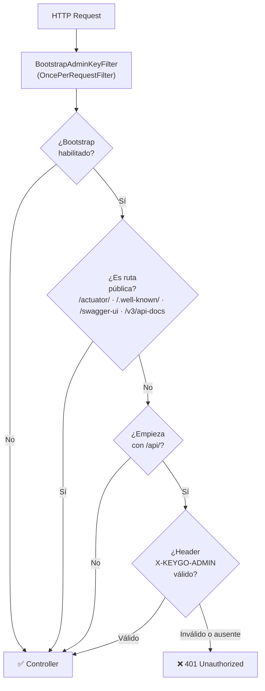

# Bootstrap Admin Key Filter — Configuración y Seguridad

> **Última actualización:** 2026-03-22  
> Fusiona: `BOOTSTRAP_SECURITY_FILTER.md` + `BOOTSTRAP_PROPERTIES.md`  
> **T-001 ✅ RESUELTO (2026-03-21)** — el filtro usa `getServletPath()` correctamente con `context-path`.

---

## 1. Descripción general

El **Bootstrap Admin Key Filter** protege los endpoints `/api/**` con un header `X-KEYGO-ADMIN`
configurable. Es un `OncePerRequestFilter` de Spring que intercepta todas las peticiones HTTP
antes de llegar a los controllers.

**Clase:** `BootstrapAdminKeyFilter` — módulo `keygo-run`  
**Propiedades:** `KeyGoBootstrapProperties` (`@ConfigurationProperties(prefix = "keygo.bootstrap")`)

---

## 2. Configuración

### application.yml

```yaml
keygo:
  bootstrap:
    enabled: true
    admin-key: "${KEYGO_ADMIN_KEY:changeMe}"
    api-path-prefix: "/api/"
    actuator-path-prefix: "/actuator/"
    service-info-path-prefix: "/service/info"
    swagger-ui-path-prefix: "/swagger-ui"
    api-docs-path-prefix: "/v3/api-docs"
    well-known-path-prefix: "/.well-known"
```

### Variables de entorno

```bash
export KEYGO_ADMIN_KEY="tu-clave-segura-aqui"  # nunca usar "changeMe" en producción
```

### Propiedades disponibles

| Propiedad | Tipo | Default | Descripción |
|---|---|---|---|
| `keygo.bootstrap.enabled` | `boolean` | `true` | Habilita/deshabilita el filtro |
| `keygo.bootstrap.admin-key` | `String` | — | Clave de administrador |
| `keygo.bootstrap.api-path-prefix` | `String` | `/api/` | Rutas protegidas |
| `keygo.bootstrap.actuator-path-prefix` | `String` | `/actuator/` | Público — health checks |
| `keygo.bootstrap.service-info-path-prefix` | `String` | `/service/info` | Público (no coincide con rutas reales, `/api/v1/service/info` es protegido) |
| `keygo.bootstrap.swagger-ui-path-prefix` | `String` | `/swagger-ui` | Público — Swagger UI |
| `keygo.bootstrap.api-docs-path-prefix` | `String` | `/v3/api-docs` | Público — OpenAPI spec |
| `keygo.bootstrap.well-known-path-prefix` | `String` | `/.well-known` | Público — OIDC Discovery + JWKS |

### Anotaciones en `KeyGoBootstrapProperties`

- `@Component` — bean de Spring
- `@ConfigurationProperties(prefix = "keygo.bootstrap")` — vincula propiedades
- `@Validated` — activa validación Bean Validation
- `@AssertTrue` — validación personalizada: si `enabled=true`, `adminKey` no puede ser null/blank

> ⚠️ **La aplicación falla al arrancar** si `keygo.bootstrap.enabled=true` y `adminKey` es null o blank.  
> En tests, usar `keygo.bootstrap.enabled=false` para evitar tanto el filtro como esta validación.

---

## 3. Flujo de autenticación



> ✅ **T-001 resuelto (2026-03-21):** El filtro usa `request.getServletPath()` en lugar de
> `request.getRequestURI()`. Con `context-path=/keygo-server`, `getRequestURI()` devolvía
> `/keygo-server/api/...` que nunca coincidía con el prefijo `/api/`. `getServletPath()` 
> devuelve `/api/...` directamente, sin el context-path.

---

## 4. Categorías de rutas

| Prefijo configurado | Comportamiento | Ejemplo |
|---|---|---|
| `/api/` | **Protegido** — requiere `X-KEYGO-ADMIN` | `/api/v1/tenants` |
| `/actuator/` | Público | `/actuator/health` |
| `/.well-known` | Público — OIDC discovery + JWKS | `/.well-known/jwks.json` |
| `/swagger-ui` | Público | `/swagger-ui/index.html` |
| `/v3/api-docs` | Público | `/v3/api-docs` |

---

## 5. Uso

### Request protegida (con autenticación)

```bash
# Sin header → 401
curl -X GET http://localhost:8080/keygo-server/api/v1/tenants

# Con header válido → 200
curl -X GET http://localhost:8080/keygo-server/api/v1/tenants \
  -H "X-KEYGO-ADMIN: changeMe"
```

### Endpoints públicos (sin autenticación)

```bash
curl http://localhost:8080/keygo-server/actuator/health
curl http://localhost:8080/keygo-server/api/v1/tenants/acme/.well-known/jwks.json
```

---

## 6. Respuesta de error

```json
{
  "date": "2026-03-22T10:00:00",
  "failure": {
    "code": "AUTHENTICATION_REQUIRED",
    "message": "Authentication is required"
  }
}
```

---

## 7. Manejo de errores — GlobalExceptionHandler

`keygo-api` tiene un `@RestControllerAdvice` que convierte excepciones en `BaseResponse<Void>`:

| Excepción | HTTP | ResponseCode |
|---|---|---|
| `UnauthorizedException` | 401 | `AUTHENTICATION_REQUIRED` |
| `NoResourceFoundException` | 404 | `RESOURCE_NOT_FOUND` |
| `IllegalArgumentException` | 400 | `INVALID_INPUT` |
| `Exception` (catch-all) | 500 | `OPERATION_FAILED` |

Para señalar error de autenticación desde cualquier capa, lanzar `UnauthorizedException`
(ubicada en `keygo-api/error/`).

---

## 8. Testing

### Cobertura actual

| Test class | Tests | Módulo |
|---|---|---|
| `BootstrapAdminKeyFilterTest` | 13 | `keygo-run` |
| `GlobalExceptionHandlerTest` | 6 | `keygo-api` |
| `KeyGoBootstrapPropertiesTest` | 18 | `keygo-run` |

**Casos cubiertos en `BootstrapAdminKeyFilterTest`:**
- ✅ Allow cuando bootstrap deshabilitado
- ✅ Allow rutas de actuator sin auth
- ✅ Allow rutas `.well-known` sin auth
- ✅ Allow rutas `/api` con admin key válida
- ✅ Reject rutas `/api` sin admin key
- ✅ Reject rutas `/api` con admin key inválida
- ✅ Reject rutas `/api` con admin key en blanco
- ✅ Allow rutas no-API sin auth
- ✅ Handle null/blank admin key en properties
- ✅ 2 tests de regresión con context-path simulado (T-001)

**Convención para tests del filtro:**

```java
// ✅ Correcto — simula getServletPath() (sin context-path)
request.setServletPath("/api/v1/resource");

// ❌ Incorrecto — no usar setRequestURI con context-path
// request.setRequestURI("/keygo-server/api/v1/resource");
```

---

## 9. Seguridad en producción

```bash
# Generar clave segura
openssl rand -base64 32
```

| Recomendación | Detalle |
|---|---|
| Clave fuerte | Mínimo 32 caracteres aleatorios — nunca `changeMe` |
| HTTPS obligatorio | El header se transmite en texto plano |
| Variables de entorno | Nunca commitear claves en el repo |
| Deshabilitar tras arranque | Considerar `enabled=false` una vez el sistema está inicializado |
| Rotar periódicamente | Actualizar `KEYGO_ADMIN_KEY` en el sistema de secretos |

---

## 10. Inyección en componentes Spring

```java
@Service
public class MyService {
    private final KeyGoBootstrapProperties bootstrapProperties;

    public MyService(KeyGoBootstrapProperties bootstrapProperties) {
        this.bootstrapProperties = bootstrapProperties;
    }

    public void check() {
        if (bootstrapProperties.isEnabled()) {
            String key = bootstrapProperties.getAdminKey();
            // ...
        }
    }
}
```

---

## 11. Troubleshooting

| Problema | Solución |
|---|---|
| 401 en todas las rutas | Verificar que `KEYGO_ADMIN_KEY` está exportada y el header se envía correctamente |
| Rutas públicas bloqueadas | Verificar prefijos en `application.yml`; el filtro usa `getServletPath()` (sin `/keygo-server/`) |
| App no arranca | Si `enabled=true`, `adminKey` no puede ser null/blank — revisar variable de entorno |
| Tests fallan con filtro | Usar `keygo.bootstrap.enabled=false` en `application-test.yml` |

```bash
# Verificar configuración activa
grep -A5 "bootstrap:" keygo-run/src/main/resources/application.yml
echo $KEYGO_ADMIN_KEY
```

---

## Referencias

- [`ARCHITECTURE.md`](../../ARCHITECTURE.md) — Resumen de arquitectura del proyecto
- [`docs/design/ARCHITECTURE.md`](../design/ARCHITECTURE.md) — Arquitectura completa
- [`docs/api/RESPONSE_CODES.md`](RESPONSE_CODES.md) — Catálogo de ResponseCode

