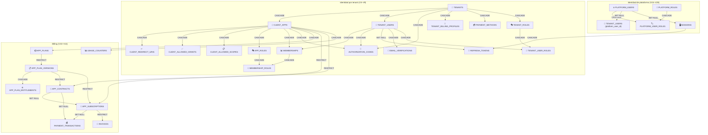

# Data Model — KeyGo Server

> Documentación del **diccionario de datos** y **modelo de entidades** (E/R) del sistema KeyGo Server.
>
> Fecha de actualización: **2026-04-09** | Estado: ✅ Sincronizado con migraciones V1–V33 + diseño de datos v2 + identidad de plataforma + verification codes para tenant y plataforma

---

## Tabla de contenidos

1. [Tablas activas (multi-tenancy)](#tablas-activas-multi-tenancy)
2. [Tablas de identidad de plataforma (V24–V29)](#tablas-de-identidad-de-plataforma-v24v29)
3. [Tablas legado (V1/V3)](#tablas-legado-v1v3)
4. [Tablas planificadas (fases futuras)](#tablas-planificadas-fases-futuras)
5. [Modelo E/R (Diagrama Mermaid)](#modelo-er-diagrama-mermaid)
6. [Relaciones de dependencia](#relaciones-de-dependencia)
7. [Guías de consulta común](#guías-de-consulta-común)
8. [Notas sobre enumeraciones](#notas-sobre-enumeraciones)
9. [Referencia rápida de constraints únicos](#referencia-rápida-de-constraints-únicos)

---

## Tablas activas (multi-tenancy)

> Estas tablas forman el núcleo del sistema.
> **Identidad y autenticación:** V3–V9, V31 | **Billing:** V10–V14, V30 | **Seeds:** V15–V18 | **Identidad de plataforma:** V24–V29.

### Tabla: `tenants` — V3

| Campo | Tipo | Clave | Nulable | Descripción |
|---|---|---|---|---|
| `id` | UUID | PK | NO | Identificador único del tenant (`uuid_generate_v4()`) |
| `slug` | VARCHAR(100) | UNIQUE | NO | Identificador URL-friendly (solo minúsculas, números y guiones). Mín. 3 chars. |
| `name` | VARCHAR(255) | | NO | Nombre legal/comercial del tenant |
| `owner_email` | VARCHAR(255) | | NO | Email del propietario/administrador del tenant |
| `status` | VARCHAR(20) | | NO | Estado: `ACTIVE`, `SUSPENDED`, `PENDING`, `DELETED` |
| `contractor_id` | UUID | FK → `contractors.id` | SÍ | Contratante propietario (NULL para tenants de sistema). Se fija al crear el tenant. |
| `created_at` | TIMESTAMPTZ | | NO | Marca de tiempo de creación (UTC) |
| `updated_at` | TIMESTAMPTZ | | NO | Marca de tiempo de última actualización (UTC — auto-actualizado por trigger) |

**Constraints:**
- `UNIQUE(slug)`, `slug ~ '^[a-z0-9][a-z0-9\-]*[a-z0-9]$'`, `char_length(slug) >= 3`
- `status IN ('ACTIVE', 'SUSPENDED', 'PENDING', 'DELETED')`
- FK opcional: `contractor_id` → `contractors(id)` ON DELETE SET NULL

**Reglas de negocio:**
- El `slug` es único globalmente; no puede repetirse entre tenants.
- Un tenant `SUSPENDED` no debe permitir operaciones normales (login, emisión de tokens).
- `contractor_id IS NULL` indica un tenant de sistema/plataforma (p. ej. `keygo`, `demo`).
- `contractor_id IS NOT NULL` indica un tenant creado por un contratante usando el plan activo.
- El límite de tenants por contratante se controla vía el entitlement `MAX_TENANTS` del plan activo: `COUNT(*) FROM tenants WHERE contractor_id = :id AND status != 'DELETED'`.
- Toda entidad con `tenant_id` pertenece lógicamente a este tenant.

---

### Tabla: `client_apps` — V4

| Campo | Tipo | Clave | Nulable | Descripción |
|---|---|---|---|---|
| `id` | UUID | PK | NO | Identificador único de la aplicación cliente |
| `tenant_id` | UUID | FK | NO | Referencia al tenant propietario |
| `client_id` | VARCHAR(255) | UNIQUE | NO | ID OAuth2/OIDC único globalmente; usado en requests de autorización |
| `name` | VARCHAR(255) | | NO | Nombre legible de la aplicación |
| `description` | TEXT | | SÍ | Descripción opcional de la app |
| `type` | VARCHAR(20) | | NO | Tipo de cliente: `PUBLIC` (SPA, mobile) o `CONFIDENTIAL` (servidor backend) |
| `hashed_secret` | VARCHAR(255) | | SÍ | Hash del secret (solo si `CONFIDENTIAL`); nunca se expone en claro |
| `status` | VARCHAR(20) | | NO | Estado: `ACTIVE`, `SUSPENDED`, `PENDING` |
| `created_at` | TIMESTAMPTZ | | NO | Marca de tiempo de creación |
| `updated_at` | TIMESTAMPTZ | | NO | Marca de tiempo de última actualización |

**Constraints:**
- `type IN ('PUBLIC', 'CONFIDENTIAL')`
- `status IN ('ACTIVE', 'SUSPENDED', 'PENDING')`

**Reglas de negocio:**
- `type = PUBLIC` no debe tener `hashed_secret` (o ignorarlo en validación).
- `type = CONFIDENTIAL` requiere validar `hashed_secret` en algunos flows.
- Un cliente solo puede usar grants (`client_allowed_grants`) y scopes (`client_allowed_scopes`) registrados.

---

### Tabla: `client_redirect_uris` — V4

| Campo | Tipo | Clave | Nulable | Descripción |
|---|---|---|---|---|
| `id` | UUID | PK | NO | Identificador único |
| `client_app_id` | UUID | FK | NO | Referencia al cliente propietario |
| `uri` | VARCHAR(2048) | | NO | URI exacta permitida (sin wildcards) |
| `created_at` | TIMESTAMPTZ | | NO | Marca de tiempo de creación |

**Reglas de negocio:**
- La redirect URI en un `authorize` request debe coincidir exactamente con una entrada aquí.
- No se permiten wildcards; la validación es literal.
- Un cliente puede tener múltiples redirect URIs (dev, staging, producción).

---

### Tabla: `client_allowed_grants` — V4

| Campo | Tipo | Clave | Nulable | Descripción |
|---|---|---|---|---|
| `id` | UUID | PK | NO | Identificador único |
| `client_app_id` | UUID | FK | NO | Referencia al cliente propietario |
| `grant_type` | VARCHAR(50) | | NO | Tipo de grant permitido (p. ej. `authorization_code`, `client_credentials`, `refresh_token`) |

**Reglas de negocio:**
- Un cliente solo puede usar grants registrados aquí.
- El servidor debe validar contra esta tabla antes de emitir un token por ese flujo.

---

### Tabla: `client_allowed_scopes` — V4

| Campo | Tipo | Clave | Nulable | Descripción |
|---|---|---|---|---|
| `id` | UUID | PK | NO | Identificador único |
| `client_app_id` | UUID | FK | NO | Referencia al cliente propietario |
| `scope` | VARCHAR(100) | | NO | Scope permitido (p. ej. `openid`, `profile`, `email`, `custom:admin`) |

**Reglas de negocio:**
- Un cliente solo puede solicitar scopes registrados aquí.
- El servidor filtra los scopes autorizados contra esta lista.

---

### Tabla: `tenant_users` — V5 (modificada V28)

| Campo | Tipo | Clave | Nulable | Descripción |
|---|---|---|---|---|
| `id` | UUID | PK | NO | Identificador único del usuario |
| `tenant_id` | UUID | FK | NO | Referencia al tenant propietario |
| `platform_user_id` | UUID | FK → `platform_users.id` | SÍ | Vínculo a la identidad global de plataforma. `NULL` = usuario legacy sin cuenta de plataforma. |
| `username` | VARCHAR(100) | UNIQUE (tenant) | NO | Username único dentro del tenant |
| `email` | VARCHAR(255) | UNIQUE (tenant) | NO | Email único dentro del tenant |
| `password_hash` | VARCHAR(255) | | NO | Hash seguro de contraseña (BCrypt) |
| `first_name` | VARCHAR(100) | | SÍ | Nombre de pila |
| `last_name` | VARCHAR(100) | | SÍ | Apellido |
| `status` | VARCHAR(20) | | NO | Estado: `ACTIVE`, `SUSPENDED`, `PENDING` |
| `created_at` | TIMESTAMPTZ | | NO | Marca de tiempo de creación |
| `updated_at` | TIMESTAMPTZ | | NO | Marca de tiempo de última actualización |

**Constraints:**
- `UNIQUE(tenant_id, email)` — email único por tenant
- `UNIQUE(tenant_id, username)` — username único por tenant
- `status IN ('ACTIVE', 'SUSPENDED', 'PENDING')`
- FK: `tenant_id` → `tenants(id)` ON DELETE CASCADE
- FK: `platform_user_id` → `platform_users(id)` (nullable — permite usuarios legacy sin cuenta de plataforma)

**Reglas de negocio:**
- Email y username son únicos por tenant, no globalmente.
- La contraseña nunca se almacena en claro; siempre como hash BCrypt.
- Un usuario `SUSPENDED` no puede autenticarse.
- `platform_user_id IS NOT NULL` vincula esta identidad de tenant a una cuenta de plataforma global (`platform_users`).
- `platform_user_id IS NULL` indica un usuario legacy o creado antes del RFC `restructure-multitenant`.

---

### Tabla: `app_roles` — V6

| Campo | Tipo | Clave | Nulable | Descripción |
|---|---|---|---|---|
| `id` | UUID | PK | NO | Identificador único del rol |
| `client_app_id` | UUID | FK | NO | Referencia a la aplicación propietaria del rol |
| `code` | VARCHAR(50) | UNIQUE (app) | NO | Código del rol en minúsculas (p. ej. `admin`, `user`, `viewer`). Patrón: `^[a-z][a-z0-9_-]*$` |
| `display_name` | VARCHAR(255) | | SÍ | Nombre legible del rol |
| `description` | TEXT | | SÍ | Descripción de responsabilidades/permisos |
| `created_at` | TIMESTAMPTZ | | NO | Marca de tiempo de creación |
| `updated_at` | TIMESTAMPTZ | | NO | Marca de tiempo de última actualización |

**Constraints:**
- `UNIQUE(client_app_id, code)` — código único dentro de la app
- `code ~ '^[a-z][a-z0-9_-]*$'` — solo minúsculas, números, guiones y underscores
- FK: `client_app_id` → `client_apps(id)` ON DELETE CASCADE

**Reglas de negocio:**
- Un rol siempre pertenece a una app específica; los roles no son globales.
- El `code` es el identificador funcional dentro de la app (p. ej. en JWT claims).
- Diferentes apps pueden tener roles con el mismo código, pero son entidades distintas.

---

### Tabla: `memberships` — V6

| Campo | Tipo | Clave | Nulable | Descripción |
|---|---|---|---|---|
| `id` | UUID | PK | NO | Identificador único de la membership |
| `user_id` | UUID | FK | NO | Referencia al usuario (`tenant_users`) |
| `client_app_id` | UUID | FK | NO | Referencia a la aplicación cliente |
| `status` | VARCHAR(20) | | NO | Estado: `ACTIVE`, `SUSPENDED`, `PENDING` |
| `created_at` | TIMESTAMPTZ | | NO | Marca de tiempo de creación |
| `updated_at` | TIMESTAMPTZ | | NO | Marca de tiempo de última actualización |

**Constraints:**
- `UNIQUE(user_id, client_app_id)` — no hay memberships duplicadas
- `status IN ('ACTIVE', 'SUSPENDED', 'PENDING')`
- FK: `user_id` → `tenant_users(id)` ON DELETE CASCADE
- FK: `client_app_id` → `client_apps(id)` ON DELETE CASCADE

**Reglas de negocio:**
- Una membership define si el usuario puede acceder a esa app.
- Un usuario **debe** tener membership `ACTIVE` en una app para autenticarse en ella.
- Estado `SUSPENDED` deniega temporalmente el login.
- `PENDING` = invitación pendiente de aceptación.

---

### Tabla: `membership_roles` — V6

> ⚠️ **PK compuesta** `(membership_id, role_id)` — NO hay columna `id` independiente. La columna FK al rol es `role_id` (no `app_role_id`).

| Campo | Tipo | Clave | Nulable | Descripción |
|---|---|---|---|---|
| `membership_id` | UUID | PK (parte) + FK | NO | Referencia a la membership |
| `role_id` | UUID | PK (parte) + FK | NO | Referencia al rol (`app_role`) |
| `assigned_at` | TIMESTAMPTZ | | NO | Marca de tiempo de asignación |

**Constraints:**
- PK compuesta: `(membership_id, role_id)`
- FK: `membership_id` → `memberships(id)` ON DELETE CASCADE
- FK: `role_id` → `app_roles(id)` ON DELETE CASCADE

**Reglas de negocio:**
- Una membership puede tener múltiples roles dentro de la misma app.
- El rol de una membership debe pertenecer a la misma app que la membership.
- Al revocar/eliminar una membership, se eliminan implícitamente todos sus roles (CASCADE).

---

### Tabla: `authorization_codes` — V7

| Campo | Tipo | Clave | Nulable | Descripción |
|---|---|---|---|---|
| `id` | UUID | PK | NO | Identificador único del código |
| `code` | VARCHAR(256) | UNIQUE | NO | Valor opaco del código de autorización |
| `client_app_id` | UUID | FK | NO | Referencia al cliente que lo solicitó |
| `tenant_id` | UUID | FK | NO | Referencia al tenant |
| `user_id` | UUID | FK | NO | Referencia al usuario autenticado |
| `code_challenge` | VARCHAR(256) | | NO | Challenge PKCE (valor hash SHA-256 o plain) |
| `code_challenge_method` | VARCHAR(10) | | NO | Método PKCE: `plain` o `S256` |
| `requested_scopes` | TEXT | | NO | Scopes solicitados (serializado) |
| `redirect_uri` | VARCHAR(2048) | | NO | URI de redirección autorizada |
| `status` | VARCHAR(20) | | NO | Estado: `pending`, `used`, `expired`, `revoked` |
| `expires_at` | TIMESTAMPTZ | | NO | Marca de tiempo de expiración (~10 min tras creación) |
| `created_at` | TIMESTAMPTZ | | NO | Marca de tiempo de emisión |
| `used_at` | TIMESTAMPTZ | | SÍ | Marca de tiempo de canje (se llena al marcar `used`) |

**Constraints:**
- `UNIQUE(code)`
- `code_challenge_method IN ('plain', 'S256')`
- `status IN ('pending', 'used', 'expired', 'revoked')`
- FK: `client_app_id` → `client_apps(id)` ON DELETE CASCADE
- FK: `tenant_id` → `tenants(id)` ON DELETE CASCADE
- FK: `user_id` → `tenant_users(id)` ON DELETE CASCADE

**Reglas de negocio:**
- Solo se puede canjear una vez: `pending` → `used` (inmutable después).
- Debe expirar rápidamente (~10 min). `expires_at > NOW()` se valida al canjear.
- El `client_app_id` que canjea debe ser el mismo que lo solicitó.
- Si PKCE fue usado en `/authorize`, se debe validar `code_verifier` contra `code_challenge`.

---

### Tabla: `signing_keys` — V7

| Campo | Tipo | Clave | Nulable | Descripción |
|---|---|---|---|---|
| `id` | UUID | PK | NO | Identificador único |
| `kid` | VARCHAR(100) | UNIQUE | NO | Key ID usado en el header `kid` del JWT |
| `algorithm` | VARCHAR(20) | | NO | Algoritmo de firma: `RS256`, `RS384`, `RS512` |
| `status` | VARCHAR(20) | | NO | Estado: `ACTIVE`, `RETIRED`, `REVOKED` |
| `public_material` | TEXT | | NO | Clave pública en formato PEM |
| `private_material` | TEXT | | SÍ | Clave privada en formato PEM (cifrada en reposo recomendada) |
| `activated_at` | TIMESTAMPTZ | | NO | Marca de tiempo de activación |
| `retired_at` | TIMESTAMPTZ | | SÍ | Marca de tiempo de retiro (`null` si sigue activa) |
| `created_at` | TIMESTAMPTZ | | NO | Marca de tiempo de creación |

**Constraints:**
- `UNIQUE(kid)`
- `status IN ('ACTIVE', 'RETIRED', 'REVOKED')`

**Reglas de negocio:**
- Debe existir al menos una clave `ACTIVE` para emitir tokens.
- Las claves `RETIRED` se mantienen para validación de tokens ya emitidos.
- La clave privada se almacena en DB en PEM cifrado — en producción debe migrar a KMS/bóveda.
- Solo una clave `ACTIVE` a la vez; al rotar, la anterior pasa a `RETIRED`.

---

---

## Tablas de identidad de plataforma (V24–V29)

> Estas tablas implementan la **identidad global de plataforma** (RFC `restructure-multitenant`).
> La identidad de plataforma es **independiente de cualquier tenant**: un `platform_user` puede tener múltiples
> `tenant_users` vinculados en distintos tenants. Los roles de plataforma (`platform_roles`) controlan
> el acceso a operaciones administrativas globales, mientras que los roles de tenant (`tenant_roles`)
> controlan permisos dentro de un tenant específico.
>
> **Migraciones:** V24 (platform_roles seed), V25 (tenant_roles + tenant_user_roles), V26 (seed tenant_roles),
> V27 (platform_users), V28 (platform_user_roles refactor + sessions/refresh_tokens refactor + tenant_users.platform_user_id),
> V29 (seed platform_users + rename platform_roles).

### Tabla: `platform_users` — V27

Tabla de identidad global, **NO** asociada a ningún tenant. Representa la cuenta única de plataforma de un usuario.

| Campo | Tipo | Clave | Nulable | Descripción |
|---|---|---|---|---|
| `id` | UUID | PK | NO | Identificador único (`gen_random_uuid()`) |
| `email` | VARCHAR(255) | UNIQUE | NO | Email globalmente único en la plataforma |
| `username` | VARCHAR(100) | UNIQUE | NO | Username globalmente único en la plataforma |
| `password_hash` | VARCHAR(255) | — | NO | Hash seguro de contraseña (BCrypt) |
| `first_name` | VARCHAR(100) | — | SÍ | Nombre de pila |
| `last_name` | VARCHAR(100) | — | SÍ | Apellido |
| `status` | VARCHAR(30) | — | NO | Estado: `ACTIVE`, `SUSPENDED`, `PENDING`, `RESET_PASSWORD` (default `ACTIVE`) |
| `email_verified_at` | TIMESTAMPTZ | — | SÍ | Timestamp de verificación de email (`NULL` = no verificado) |
| `phone_number` | VARCHAR(30) | — | SÍ | Número de teléfono (OIDC phone scope) |
| `locale` | VARCHAR(10) | — | SÍ | Locale del usuario (BCP47, e.g. `es-MX`, `en-US`) |
| `zoneinfo` | VARCHAR(50) | — | SÍ | Zona horaria IANA (e.g. `America/Mexico_City`) |
| `profile_picture_url` | TEXT | — | SÍ | URL externa de foto de perfil |
| `created_at` | TIMESTAMPTZ | — | NO | Timestamp de creación (`DEFAULT now()`) |
| `updated_at` | TIMESTAMPTZ | — | NO | Timestamp de última actualización (auto-actualizado por trigger) |

**Índices:** `idx_platform_users_email(email)`, `idx_platform_users_username(username)`, `idx_platform_users_status(status)`

**Constraints:**
- `UNIQUE(email)` — email globalmente único
- `UNIQUE(username)` — username globalmente único
- `CHECK(status IN ('ACTIVE', 'SUSPENDED', 'PENDING', 'RESET_PASSWORD'))`

**Reglas de negocio:**
- A diferencia de `tenant_users`, esta tabla es **global**: email y username son únicos en toda la plataforma.
- Un `platform_user` puede estar vinculado a múltiples `tenant_users` en distintos tenants vía `tenant_users.platform_user_id`.
- Los campos OIDC (`phone_number`, `locale`, `zoneinfo`, `profile_picture_url`) permiten el enriquecimiento del perfil sin depender de un tenant.
- `email_verified_at IS NOT NULL` indica que el email ha sido verificado.
- `status = RESET_PASSWORD` bloquea el login hasta completar el restablecimiento.

---

### Tabla: `platform_roles` — V24 (seed V26, renombrado V29)

Catálogo de roles de plataforma. Define permisos administrativos globales independientes de cualquier tenant.

| Campo | Tipo | Clave | Nulable | Descripción |
|---|---|---|---|---|
| `id` | UUID | PK | NO | Identificador único |
| `code` | VARCHAR(50) | UNIQUE | NO | Código del rol (e.g. `keygo_admin`, `keygo_tenant_admin`, `keygo_user`) |
| `name` | VARCHAR(255) | — | NO | Nombre legible del rol |
| `description` | TEXT | — | SÍ | Descripción de responsabilidades/permisos |
| `created_at` | TIMESTAMPTZ | — | NO | Timestamp de creación |
| `updated_at` | TIMESTAMPTZ | — | NO | Timestamp de última actualización |

**Índices:** `idx_platform_roles_code(code)`

**Constraints:**
- `UNIQUE(code)` — código de rol globalmente único

**Datos semilla (V26, renombrados V29):**

| `code` | `name` | Descripción |
|---|---|---|
| `keygo_admin` | KeyGo Admin | Acceso completo a la plataforma |
| `keygo_tenant_admin` | KeyGo Tenant Admin | Onboarding de tenants y billing |
| `keygo_user` | KeyGo User | Acceso básico autenticado |

**Reglas de negocio:**
- Los roles de plataforma son globales y no pertenecen a ningún tenant.
- Se asignan a `platform_users` a través de `platform_user_roles`.
- El rol `keygo_admin` otorga acceso total al panel de administración de la plataforma.
- El rol `keygo_tenant_admin` permite gestionar onboarding de tenants y operaciones de billing.

---

### Tabla: `platform_user_roles` — V24 (refactorizada V28)

Tabla de asignación N:N entre usuarios de plataforma y roles de plataforma.

| Campo | Tipo | Clave | Nulable | Descripción |
|---|---|---|---|---|
| `id` | UUID | PK | NO | Identificador único |
| `platform_user_id` | UUID | FK → `platform_users.id` | NO | Usuario de plataforma |
| `platform_role_id` | UUID | FK → `platform_roles.id` | NO | Rol de plataforma asignado |
| `assigned_at` | TIMESTAMPTZ | — | NO | Timestamp de asignación (`DEFAULT now()`) |
| `created_at` | TIMESTAMPTZ | — | NO | Timestamp de creación |
| `updated_at` | TIMESTAMPTZ | — | NO | Timestamp de última actualización |

**Constraints:**
- `UNIQUE(platform_user_id, platform_role_id)` — no hay asignaciones duplicadas
- FK: `platform_user_id` → `platform_users(id)` ON DELETE CASCADE
- FK: `platform_role_id` → `platform_roles(id)` ON DELETE CASCADE

**Datos semilla (V29, UUIDs estables):**

| Platform User | Email | Roles asignados |
|---|---|---|
| `keygo_admin` (`00000000-0000-4000-a000-000000000001`) | `admin@keygo.local` | `keygo_admin`, `keygo_user` |
| `keygo_tenant_admin` (`00000000-0000-4000-a000-000000000002`) | `tenant-admin@keygo.local` | `keygo_tenant_admin`, `keygo_user` |
| `keygo_user` (`00000000-0000-4000-a000-000000000003`) | `user@keygo.local` | `keygo_user` |
| `keygo_contractor` (`00000000-0000-4000-a000-000000000004`) | `contractor@keygo.local` | `keygo_tenant_admin`, `keygo_user` |

**Reglas de negocio:**
- Al eliminar un `platform_user`, se eliminan en cascada todas sus asignaciones de roles.
- Al eliminar un `platform_role`, se eliminan en cascada todas las asignaciones de ese rol.
- Un usuario puede tener múltiples roles de plataforma simultáneamente.

---

### Tabla: `tenant_roles` — V25

Catálogo de roles a nivel de tenant. Define permisos dentro de un tenant específico.

| Campo | Tipo | Clave | Nulable | Descripción |
|---|---|---|---|---|
| `id` | UUID | PK | NO | Identificador único |
| `tenant_id` | UUID | FK → `tenants.id` | NO | Tenant propietario del rol |
| `code` | VARCHAR(50) | UNIQUE (tenant) | NO | Código del rol, único dentro del tenant |
| `name` | VARCHAR(255) | — | NO | Nombre legible del rol |
| `description` | TEXT | — | SÍ | Descripción de responsabilidades/permisos |
| `active` | BOOLEAN | — | NO | Si el rol está activo (`DEFAULT true`) |
| `created_at` | TIMESTAMPTZ | — | NO | Timestamp de creación |
| `updated_at` | TIMESTAMPTZ | — | NO | Timestamp de última actualización |

**Constraints:**
- `UNIQUE(tenant_id, code)` — código de rol único dentro del tenant
- FK: `tenant_id` → `tenants(id)`

**Datos semilla (V26):**

| Tenant | `code` | `name` |
|---|---|---|
| `keygo` | `KEYGO_ADMIN_INTERNAL` | KeyGo Admin Interno |
| `keygo` | `KEYGO_EDITOR` | KeyGo Editor |
| `keygo` | `KEYGO_VIEWER` | KeyGo Viewer |
| `demo` | `DEMO_ADMIN` | Demo Admin |
| `demo` | `DEMO_USER` | Demo User |

**Reglas de negocio:**
- Los roles de tenant son independientes de las apps: aplican a nivel de tenant completo.
- Diferentes tenants pueden tener roles con el mismo `code` sin conflicto (scoped por `tenant_id`).
- `active = false` desactiva el rol sin eliminarlo (soft disable).
- No confundir con `app_roles` (V6): aquellos están scoped a una `ClientApp`, estos al `Tenant`.

---

### Tabla: `tenant_user_roles` — V25

Asignación N:N entre usuarios de tenant y roles de tenant. Soporta **soft-delete** con auditoría de remoción.

| Campo | Tipo | Clave | Nulable | Descripción |
|---|---|---|---|---|
| `id` | UUID | PK | NO | Identificador único |
| `tenant_user_id` | UUID | FK → `tenant_users.id` | NO | Usuario del tenant |
| `tenant_role_id` | UUID | FK → `tenant_roles.id` | NO | Rol de tenant asignado |
| `assigned_at` | TIMESTAMPTZ | — | NO | Timestamp de asignación (`DEFAULT now()`) |
| `removed_at` | TIMESTAMPTZ | — | SÍ | Timestamp de remoción (`NULL` = asignación activa, soft-delete) |
| `created_at` | TIMESTAMPTZ | — | NO | Timestamp de creación |
| `updated_at` | TIMESTAMPTZ | — | NO | Timestamp de última actualización |

**Índices:** Índice único parcial: `UNIQUE(tenant_user_id, tenant_role_id) WHERE removed_at IS NULL`

**Constraints:**
- Índice único parcial: `(tenant_user_id, tenant_role_id) WHERE removed_at IS NULL` — no hay asignaciones activas duplicadas
- FK: `tenant_user_id` → `tenant_users(id)`
- FK: `tenant_role_id` → `tenant_roles(id)`

**Reglas de negocio:**
- `removed_at IS NULL` indica una asignación activa.
- `removed_at IS NOT NULL` indica una asignación revocada (soft-delete) — se conserva para auditoría.
- El índice parcial permite reasignar un rol previamente removido sin violar unicidad.
- Las consultas de roles activos **deben** filtrar por `WHERE removed_at IS NULL`.

---

## Tablas legado (V1/V3)

> Estas tablas existen en la DB por las migraciones iniciales pero **no se usan** en el sistema multi-tenancy actual. Se conservan por compatibilidad; no crear nuevos endpoints sobre ellas.

| Tabla | Migración | Descripción | Estado |
|---|---|---|---|
| `users` | V1 | Usuarios globales (sin tenant). Estructura diferente a `tenant_users`. | 🚧 Legado |
| `roles` | V1 | Roles globales del sistema. Sin relación con `app_role`. | 🚧 Legado |
| `user_roles` | V1 | Join table `users ↔ roles`. PK compuesta `(user_id, role_id)`. | 🚧 Legado |
| `permissions` | V1 | Permisos globales con acciones: `CREATE`, `READ`, `UPDATE`, `DELETE`, `EXECUTE`. | 🚧 Legado |
| `role_permissions` | V1 | Join table `roles ↔ permissions`. PK compuesta. | 🚧 Legado |
| `sessions` | V1 | Sesiones de usuario global (token JWT crudo, no multi-tenant). | 🚧 Legado |
| `audit_logs` | V1 | Log de auditoría global por acción + recurso + `user_id`. | 🚧 Legado |
| `oauth_providers` | V3 | Configuración de proveedores OAuth externos (Google, GitHub, etc.). | 🚧 Legado |
| `oauth_tokens` | V3 | Tokens de acceso de proveedores externos por usuario global. | 🚧 Legado |

---

## Tablas planificadas / futuras

> Estas tablas estan en diseno o reservadas para fases futuras. **No tienen migracion aplicada aun.**

| Tabla | Descripción | Migración pendiente |
|---|---|---|
| `token_blacklist` | Lista negra de JTI de access tokens revocados (opcionalmente en Redis) | futura |
| `audit_events` | Registro de eventos de auditoría por tenant (login, token emitido, revocación) | futura |

> ℹ️ Las tablas activas de billing ya estan registradas en [`docs/data/MIGRATIONS.md`](MIGRATIONS.md).

---

## Modelo E/R — Identidad y Autenticación (V3–V9, V24–V29)

> Tablas del núcleo de identidad: plataforma (platform_users, platform_roles), tenants, apps, usuarios,
> roles de tenant, auth codes, signing keys, sesiones, refresh tokens y verificación de email.
> Las tablas del modelo legacy anterior (V1: `users`, `roles`, `permissions`) se omiten — ver sección §3.
> Para las tablas de billing ver el diagrama de la sección siguiente (V10–V14).
>
> **V28 refactor:** las sesiones (`sessions`) y refresh tokens (`refresh_tokens`) ya no dependen directamente
> de `tenants`/`tenant_users`. Las sesiones se vinculan a `platform_users`; los refresh tokens a `tenant_users`
> (para lookup rápido de roles). `client_app_id` es nullable en ambas tablas (NULL = sesión de plataforma).

```mermaid
erDiagram
    %% Identidad de plataforma (V24–V29)
    PLATFORM_USERS ||--o{ PLATFORM_USER_ROLES : "has (platform_user_id)"
    PLATFORM_ROLES ||--o{ PLATFORM_USER_ROLES : "assigned (platform_role_id)"
    PLATFORM_USERS ||--o{ TENANT_USERS : "linked (platform_user_id)"
    PLATFORM_USERS ||--o{ SESSIONS : "owns (platform_user_id)"

    %% Tenancy
    TENANTS ||--o{ CLIENT_APPS : "owns (tenant_id)"
    TENANTS ||--o{ TENANT_USERS : "contains (tenant_id)"
    TENANTS ||--o{ AUTHORIZATION_CODES : "issues (tenant_id)"
    TENANTS ||--o{ TENANT_ROLES : "defines (tenant_id)"

    CLIENT_APPS ||--o{ CLIENT_REDIRECT_URIS : "registers (client_app_id)"
    CLIENT_APPS ||--o{ CLIENT_ALLOWED_GRANTS : "permits (client_app_id)"
    CLIENT_APPS ||--o{ CLIENT_ALLOWED_SCOPES : "permits (client_app_id)"
    CLIENT_APPS ||--o{ APP_ROLES : "defines (client_app_id)"
    CLIENT_APPS ||--o{ MEMBERSHIPS : "accessed-by (client_app_id)"
    CLIENT_APPS ||--o{ AUTHORIZATION_CODES : "requests (client_app_id)"
    CLIENT_APPS ||--o{ SESSIONS : "used-in (client_app_id, nullable)"
    CLIENT_APPS ||--o{ REFRESH_TOKENS : "issued-to (client_app_id, nullable)"

    TENANT_USERS ||--o{ MEMBERSHIPS : "has (user_id)"
    TENANT_USERS ||--o{ AUTHORIZATION_CODES : "authenticates (user_id)"
    TENANT_USERS ||--o{ REFRESH_TOKENS : "owns (tenant_user_id)"
    TENANT_USERS ||--o{ EMAIL_VERIFICATIONS : "has (tenant_user_id)"
    TENANT_USERS ||--o{ TENANT_USER_ROLES : "has (tenant_user_id)"

    TENANT_ROLES ||--o{ TENANT_USER_ROLES : "assigned (tenant_role_id)"

    MEMBERSHIPS ||--o{ MEMBERSHIP_ROLES : "assigned (membership_id)"
    APP_ROLES ||--o{ MEMBERSHIP_ROLES : "grants (role_id)"

    SESSIONS ||--o{ REFRESH_TOKENS : "contains (session_id)"
    REFRESH_TOKENS ||--o| REFRESH_TOKENS : "replaced-by (replaced_by_id)"

    PLATFORM_USERS {
        UUID id PK
        VARCHAR email UK
        VARCHAR username UK
        VARCHAR password_hash
        VARCHAR first_name
        VARCHAR last_name
        VARCHAR status
        TIMESTAMPTZ email_verified_at
        VARCHAR phone_number
        VARCHAR locale
        VARCHAR zoneinfo
        TEXT profile_picture_url
        TIMESTAMPTZ created_at
        TIMESTAMPTZ updated_at
    }

    PLATFORM_ROLES {
        UUID id PK
        VARCHAR code UK
        VARCHAR name
        TEXT description
        TIMESTAMPTZ created_at
        TIMESTAMPTZ updated_at
    }

    PLATFORM_USER_ROLES {
        UUID id PK
        UUID platform_user_id FK
        UUID platform_role_id FK
        TIMESTAMPTZ assigned_at
        TIMESTAMPTZ created_at
        TIMESTAMPTZ updated_at
    }

    TENANTS {
        UUID id PK
        VARCHAR slug UK
        VARCHAR name
        VARCHAR owner_email
        VARCHAR status
        UUID contractor_id FK
        TIMESTAMPTZ created_at
        TIMESTAMPTZ updated_at
    }

    CLIENT_APPS {
        UUID id PK
        UUID tenant_id FK
        VARCHAR client_id UK
        VARCHAR name
        VARCHAR type
        VARCHAR hashed_secret
        VARCHAR status
        TIMESTAMPTZ created_at
        TIMESTAMPTZ updated_at
    }

    CLIENT_REDIRECT_URIS {
        UUID id PK
        UUID client_app_id FK
        VARCHAR uri
        TIMESTAMPTZ created_at
    }

    CLIENT_ALLOWED_GRANTS {
        UUID id PK
        UUID client_app_id FK
        VARCHAR grant_type
    }

    CLIENT_ALLOWED_SCOPES {
        UUID id PK
        UUID client_app_id FK
        VARCHAR scope
    }

    TENANT_USERS {
        UUID id PK
        UUID tenant_id FK
        UUID platform_user_id FK
        VARCHAR username
        VARCHAR email
        VARCHAR password_hash
        VARCHAR first_name
        VARCHAR last_name
        VARCHAR status
        TIMESTAMPTZ created_at
        TIMESTAMPTZ updated_at
    }

    TENANT_ROLES {
        UUID id PK
        UUID tenant_id FK
        VARCHAR code
        VARCHAR name
        TEXT description
        BOOLEAN active
        TIMESTAMPTZ created_at
        TIMESTAMPTZ updated_at
    }

    TENANT_USER_ROLES {
        UUID id PK
        UUID tenant_user_id FK
        UUID tenant_role_id FK
        TIMESTAMPTZ assigned_at
        TIMESTAMPTZ removed_at
        TIMESTAMPTZ created_at
        TIMESTAMPTZ updated_at
    }

    APP_ROLES {
        UUID id PK
        UUID client_app_id FK
        VARCHAR code
        VARCHAR display_name
        TIMESTAMPTZ created_at
        TIMESTAMPTZ updated_at
    }

    MEMBERSHIPS {
        UUID id PK
        UUID user_id FK
        UUID client_app_id FK
        VARCHAR status
        TIMESTAMPTZ created_at
        TIMESTAMPTZ updated_at
    }

    MEMBERSHIP_ROLES {
        UUID membership_id PK_FK
        UUID role_id PK_FK
        TIMESTAMPTZ assigned_at
    }

    AUTHORIZATION_CODES {
        UUID id PK
        VARCHAR code UK
        UUID client_app_id FK
        UUID tenant_id FK
        UUID user_id FK
        VARCHAR code_challenge
        VARCHAR code_challenge_method
        TEXT requested_scopes
        VARCHAR redirect_uri
        VARCHAR status
        TIMESTAMPTZ expires_at
        TIMESTAMPTZ created_at
        TIMESTAMPTZ used_at
    }

    SIGNING_KEYS {
        UUID id PK
        VARCHAR kid UK
        VARCHAR algorithm
        VARCHAR status
        TEXT public_material
        TEXT private_material
        TIMESTAMPTZ activated_at
        TIMESTAMPTZ retired_at
        TIMESTAMPTZ created_at
    }

    SESSIONS {
        UUID id PK
        UUID platform_user_id FK
        UUID client_app_id FK
        VARCHAR status
        TIMESTAMPTZ expires_at
        TIMESTAMPTZ last_accessed_at
        TEXT user_agent
        VARCHAR ip_address
        TIMESTAMPTZ created_at
    }

    REFRESH_TOKENS {
        UUID id PK
        VARCHAR token_hash UK
        UUID session_id FK
        UUID tenant_user_id FK
        UUID client_app_id FK
        TEXT requested_scopes
        VARCHAR status
        TIMESTAMPTZ expires_at
        TIMESTAMPTZ used_at
        UUID replaced_by_id FK
        TIMESTAMPTZ created_at
    }

    EMAIL_VERIFICATIONS {
        UUID id PK
        UUID tenant_user_id FK
        VARCHAR code
        TIMESTAMPTZ expires_at
        TIMESTAMPTZ used_at
        TIMESTAMPTZ created_at
    }
```



---

## Modelo E/R — Billing (V10–V14, modelo v2)

> Tablas de billing: catálogo de planes, contratos, suscripciones, facturas, contadores de uso, perfiles de facturación y métodos de pago.
> **V10:** catálogo (planes, versiones, entitlements) | **V11:** contratos | **V12:** suscripciones + transacciones | **V13:** facturas + contadores de uso | **V14:** perfiles fiscales + métodos de pago.
> **Modelo v2:** el suscriptor es siempre un `CONTRACTOR`; las columnas polimorficas `subscriber_tenant_id` / `subscriber_tenant_user_id` ya no forman parte del modelo vigente.

```mermaid
erDiagram
    TENANT_USERS ||--o| CONTRACTORS : "representa (tenant_user_id UNIQUE)"
    TENANTS ||--o{ TENANTS : "creados por contractor (contractor_id)"
    TENANTS ||--o{ TENANT_BILLING_PROFILES : "perfil fiscal (tenant_id)"
    TENANTS ||--o{ PAYMENT_METHODS : "métodos de pago (tenant_id)"

    CONTRACTORS ||--o{ APP_CONTRACTS : "historial de contratos"
    CONTRACTORS ||--o{ APP_SUBSCRIPTIONS : "suscrito a (contractor_id)"
    CONTRACTORS ||--o{ USAGE_COUNTERS : "acumula uso (contractor_id)"

    CLIENT_APPS ||--o{ APP_PLANS : "owns (client_app_id)"
    CLIENT_APPS ||--o{ APP_CONTRACTS : "scope (client_app_id)"
    CLIENT_APPS ||--o{ APP_SUBSCRIPTIONS : "scope (client_app_id)"
    CLIENT_APPS ||--o{ USAGE_COUNTERS : "scope (client_app_id)"

    APP_PLANS ||--o{ APP_PLAN_VERSIONS : "versiones (app_plan_id)"
    APP_PLAN_VERSIONS ||--o{ APP_PLAN_ENTITLEMENTS : "entitlements (app_plan_version_id)"
    APP_PLAN_VERSIONS ||--o{ APP_CONTRACTS : "seleccionada (selected_plan_version_id)"
    APP_PLAN_VERSIONS ||--o{ APP_SUBSCRIPTIONS : "activa (app_plan_version_id)"

    APP_CONTRACTS ||--o| APP_SUBSCRIPTIONS : "origina (contract_id)"
    APP_CONTRACTS ||--o{ PAYMENT_TRANSACTIONS : "genera (contract_id)"
    APP_SUBSCRIPTIONS ||--o{ PAYMENT_TRANSACTIONS : "tiene (subscription_id)"
    APP_SUBSCRIPTIONS ||--o{ INVOICES : "factura por período (subscription_id)"

    CONTRACTORS {
        UUID id PK
        UUID tenant_user_id FK_UK
        VARCHAR status
        TIMESTAMPTZ created_at
        TIMESTAMPTZ updated_at
    }

    APP_PLANS {
        UUID id PK
        UUID client_app_id FK
        VARCHAR code
        VARCHAR name
        VARCHAR subscriber_type
        VARCHAR status
        BOOLEAN is_public
        INT sort_order
        TIMESTAMPTZ created_at
        TIMESTAMPTZ updated_at
    }

    APP_PLAN_VERSIONS {
        UUID id PK
        UUID app_plan_id FK
        VARCHAR version
        VARCHAR currency
        VARCHAR billing_period
        NUMERIC base_price
        NUMERIC setup_fee
        INT trial_days
        DATE effective_from
        DATE effective_to
        VARCHAR status
        TIMESTAMPTZ created_at
    }

    APP_PLAN_ENTITLEMENTS {
        UUID id PK
        UUID app_plan_version_id FK
        VARCHAR metric_code
        VARCHAR metric_type
        BIGINT limit_value
        VARCHAR period_type
        VARCHAR enforcement_mode
        BOOLEAN is_enabled
    }

    APP_CONTRACTS {
        UUID id PK
        UUID client_app_id FK
        UUID contractor_id FK
        UUID selected_plan_version_id FK
        VARCHAR billing_period
        VARCHAR status
        VARCHAR contractor_email
        VARCHAR contractor_first_name
        VARCHAR contractor_last_name
        VARCHAR company_name
        VARCHAR company_tax_id
        TEXT company_address
        VARCHAR verification_code
        TIMESTAMPTZ email_verified_at
        TIMESTAMPTZ payment_verified_at
        TIMESTAMPTZ expires_at
        TIMESTAMPTZ created_at
        TIMESTAMPTZ updated_at
    }

    APP_SUBSCRIPTIONS {
        UUID id PK
        UUID client_app_id FK
        UUID app_plan_version_id FK
        UUID contract_id FK
        UUID contractor_id FK
        VARCHAR status
        TIMESTAMPTZ current_period_start
        TIMESTAMPTZ current_period_end
        BOOLEAN cancel_at_period_end
        TIMESTAMPTZ cancelled_at
        TIMESTAMPTZ next_billing_at
        BOOLEAN auto_renew
        TIMESTAMPTZ created_at
        TIMESTAMPTZ updated_at
    }

    PAYMENT_TRANSACTIONS {
        UUID id PK
        UUID contract_id FK
        UUID subscription_id FK
        VARCHAR provider
        VARCHAR provider_reference
        NUMERIC amount
        VARCHAR currency
        VARCHAR status
        TIMESTAMPTZ paid_at
        TIMESTAMPTZ created_at
    }

    INVOICES {
        UUID id PK
        UUID subscription_id FK
        VARCHAR invoice_number UK
        VARCHAR status
        DATE issue_date
        DATE due_date
        DATE period_start
        DATE period_end
        VARCHAR currency
        NUMERIC subtotal
        NUMERIC tax_amount
        NUMERIC total
        VARCHAR billing_name_snapshot
        VARCHAR billing_tax_id_snapshot
        VARCHAR plan_name_snapshot
        VARCHAR plan_version_snapshot
        TEXT pdf_url
        TIMESTAMPTZ created_at
    }

    USAGE_COUNTERS {
        UUID id PK
        UUID client_app_id FK
        UUID contractor_id FK
        VARCHAR metric_code
        TIMESTAMPTZ period_start
        TIMESTAMPTZ period_end
        BIGINT used_value
        TIMESTAMPTZ updated_at
    }

    TENANT_BILLING_PROFILES {
        UUID id PK
        UUID tenant_id FK
        VARCHAR billing_type
        VARCHAR billing_name
        VARCHAR tax_id
        VARCHAR tax_regime
        VARCHAR address_line1
        VARCHAR address_line2
        VARCHAR city
        VARCHAR state
        VARCHAR country
        VARCHAR postal_code
        VARCHAR contact_email
        VARCHAR contact_phone
        BOOLEAN is_default
        TIMESTAMPTZ created_at
        TIMESTAMPTZ updated_at
    }

    PAYMENT_METHODS {
        UUID id PK
        UUID tenant_id FK
        VARCHAR provider
        VARCHAR method_type
        VARCHAR provider_token
        VARCHAR last_four
        VARCHAR card_brand
        SMALLINT expiry_month
        SMALLINT expiry_year
        VARCHAR paypal_email
        VARCHAR display_label
        BOOLEAN is_default
        VARCHAR status
        TIMESTAMPTZ created_at
        TIMESTAMPTZ updated_at
    }
```

---

## Relaciones de dependencia

### Jerarquía de cascade



**Implicaciones:**
- Si se elimina un **platform_user**: se eliminan en cascada sus `platform_user_roles`; se pone a `NULL` `platform_user_id` en `tenant_users` y `sessions`.
- Si se elimina un **tenant**: se eliminan en cascada apps, usuarios, auth codes, tenant_roles, perfiles de facturación y métodos de pago.
- Si se elimina una **app**: se eliminan redirect URIs, grants, scopes, roles, memberships y auth codes. Las relaciones de billing usan `ON DELETE RESTRICT`.
- Si se elimina un **tenant_user**: se eliminan sus memberships, auth codes, verificaciones de email y `tenant_user_roles`; se pone a `NULL` `tenant_user_id` en `refresh_tokens`.
- Si se elimina una **sesión**: se eliminan en cascada sus refresh tokens.
- `SIGNING_KEYS` **no tiene FK hacia tenants** — son claves globales del servidor.
- **Sesiones (V28):** ya no dependen de `tenants`/`tenant_users` directamente. Dependen de `platform_users` (nullable) y `client_apps` (nullable).
- **Refresh tokens (V28):** ya no dependen de `tenants` directamente. Dependen de `sessions` (cascade), `tenant_users` (nullable, para lookup de roles) y `client_apps` (nullable).
- Las tablas de billing (`app_contracts`, `app_subscriptions`, `invoices`) usan `ON DELETE RESTRICT` para proteger el historial financiero.

---

## Guías de consulta común

### 1. Obtener todas las apps activas de un tenant

```sql
SELECT ca.* FROM client_apps ca
WHERE ca.tenant_id = :tenantId
  AND ca.status = 'ACTIVE';
```

### 2. Buscar usuario por email en un tenant

```sql
SELECT tu.* FROM tenant_users tu
WHERE tu.tenant_id = :tenantId
  AND tu.email = :email
  AND tu.status = 'ACTIVE';
```

### 3. Verificar si un usuario tiene membership activa en una app

```sql
SELECT COUNT(1) FROM memberships m
WHERE m.user_id = :userId
  AND m.client_app_id = :clientAppId
  AND m.status = 'ACTIVE';
-- Si count = 1, el usuario tiene acceso
```

### 4. Obtener roles asignados a un usuario en una app

```sql
SELECT ar.code, ar.display_name
FROM app_roles ar
JOIN membership_roles mr ON mr.role_id = ar.id
JOIN memberships m ON m.id = mr.membership_id
WHERE m.user_id = :userId
  AND ar.client_app_id = :clientAppId
  AND m.status = 'ACTIVE';
```

### 5. Listar todos los usuarios de un tenant

```sql
SELECT tu.* FROM tenant_users tu
WHERE tu.tenant_id = :tenantId
ORDER BY tu.created_at DESC;
```

### 6. Canjear authorization code (búsqueda + validación)

```sql
SELECT ac.* FROM authorization_codes ac
WHERE ac.code = :code
  AND ac.client_app_id = :clientAppId
  AND ac.status = 'pending'
  AND ac.expires_at > NOW();
```

### 7. Obtener claves de firma activas (JWKS)

```sql
SELECT id, kid, algorithm, public_material
FROM signing_keys
WHERE status = 'ACTIVE'
ORDER BY activated_at DESC;
```

### 8. Marcar authorization code como usado

```sql
UPDATE authorization_codes
SET status = 'used', used_at = NOW()
WHERE id = :id;
```

### 9. Obtener roles de plataforma de un platform_user

```sql
SELECT pr.code, pr.name
FROM platform_roles pr
JOIN platform_user_roles pur ON pur.platform_role_id = pr.id
WHERE pur.platform_user_id = :platformUserId;
```

### 10. Obtener los tenant_users vinculados a un platform_user

```sql
SELECT tu.*, t.slug AS tenant_slug, t.name AS tenant_name
FROM tenant_users tu
JOIN tenants t ON t.id = tu.tenant_id
WHERE tu.platform_user_id = :platformUserId
  AND tu.status = 'ACTIVE';
```

### 11. Crear una sesión de plataforma (sin client_app)

```sql
INSERT INTO sessions (platform_user_id, status, expires_at, last_accessed_at, user_agent, ip_address)
VALUES (:platformUserId, 'ACTIVE', :expiresAt, NOW(), :userAgent, :ipAddress);
-- client_app_id = NULL indica sesión de plataforma (no vinculada a una app de tenant)
```

### 12. Obtener roles de tenant activos de un usuario

```sql
SELECT tr.code, tr.name
FROM tenant_roles tr
JOIN tenant_user_roles tur ON tur.tenant_role_id = tr.id
WHERE tur.tenant_user_id = :tenantUserId
  AND tur.removed_at IS NULL
  AND tr.active = true;
```

### 13. Obtener platform_user a partir de un tenant_user

```sql
SELECT pu.*
FROM platform_users pu
JOIN tenant_users tu ON tu.platform_user_id = pu.id
WHERE tu.id = :tenantUserId;
```

---

## Notas sobre enumeraciones

> Los valores de `status` en las tablas multi-tenancy siguen la convención que define cada CHECK constraint en la migración SQL correspondiente.

| Tabla | Campo | Valores permitidos | Convención |
|---|---|---|---|
| `tenants` | `status` | `ACTIVE`, `SUSPENDED`, `PENDING`, `DELETED` | UPPERCASE |
| `client_apps` | `type` | `PUBLIC`, `CONFIDENTIAL` | UPPERCASE |
| `client_apps` | `status` | `ACTIVE`, `SUSPENDED`, `PENDING` | UPPERCASE |
| `platform_users` | `status` | `ACTIVE`, `SUSPENDED`, `PENDING`, `RESET_PASSWORD` | UPPERCASE |
| `tenant_users` | `status` | `ACTIVE`, `SUSPENDED`, `PENDING` | UPPERCASE |
| `memberships` | `status` | `ACTIVE`, `SUSPENDED`, `PENDING` | UPPERCASE |
| `authorization_codes` | `status` | `pending`, `used`, `expired`, `revoked` | **lowercase** |
| `authorization_codes` | `code_challenge_method` | `plain`, `S256` | mixto |
| `signing_keys` | `status` | `ACTIVE`, `RETIRED`, `REVOKED` | UPPERCASE |
| `app_roles` | `code` | regex `^[a-z][a-z0-9_-]*$` | solo minúsculas |
| `sessions` | `status` | `ACTIVE`, `TERMINATED`, `EXPIRED` | UPPERCASE |
| `refresh_tokens` | `status` | `ACTIVE`, `USED`, `EXPIRED`, `REVOKED` | UPPERCASE |
| `app_plans` | `subscriber_type` | `TENANT`, `TENANT_USER`, `PLATFORM` | UPPERCASE |
| `app_plans` | `status` | `ACTIVE`, `INACTIVE` | UPPERCASE |
| `app_plan_versions` | `billing_period` | `MONTHLY`, `YEARLY`, `ONE_TIME` | UPPERCASE |
| `app_plan_versions` | `status` | `ACTIVE`, `INACTIVE`, `DEPRECATED` | UPPERCASE |
| `app_plan_entitlements` | `metric_type` | `QUOTA`, `BOOLEAN`, `RATE` | UPPERCASE |
| `app_plan_entitlements` | `enforcement_mode` | `HARD`, `SOFT` | UPPERCASE |
| `app_plan_entitlements` | `period_type` | `NONE`, `DAY`, `MONTH` | UPPERCASE |
| `app_contracts` | `billing_period` | `MONTHLY`, `YEARLY`, `ONE_TIME` | UPPERCASE |
| `app_contracts` | `status` | `PENDING_EMAIL_VERIFICATION`, `PENDING_PAYMENT`, `READY_TO_ACTIVATE`, `ACTIVE`, `SUPERSEDED`, `FINALIZED`, `EXPIRED`, `CANCELLED`, `FAILED` | UPPERCASE |
| `app_subscriptions` | `status` | `PENDING`, `ACTIVE`, `PAST_DUE`, `SUSPENDED`, `CANCELLED`, `EXPIRED` | UPPERCASE |
| `payment_transactions` | `status` | `PENDING`, `APPROVED`, `REJECTED`, `CANCELLED`, `EXPIRED` | UPPERCASE |
| `invoices` | `status` | `DRAFT`, `ISSUED`, `PAID`, `VOID`, `OVERDUE` | UPPERCASE |
| `tenant_billing_profiles` | `billing_type` | `PERSONAL`, `COMPANY` | UPPERCASE |
| `payment_methods` | `provider` | `STRIPE`, `MERCADOPAGO`, `PAYPAL`, `MANUAL`, `MOCK` | UPPERCASE |
| `payment_methods` | `method_type` | `CARD`, `PAYPAL`, `BANK_TRANSFER`, `MOCK` | UPPERCASE |
| `payment_methods` | `status` | `ACTIVE`, `EXPIRED`, `REVOKED` | UPPERCASE |
| `contractors` | `status` | `PENDING`, `ACTIVE`, `SUSPENDED` | UPPERCASE |

> ⚠️ Los valores de `authorization_codes.status` son **minúsculas** (distinto al resto). Tener en cuenta en comparaciones de código Java.

---

## Referencia rápida de constraints únicos

| Tabla | Constraint | Descripción |
|---|---|---|
| `tenants` | `UNIQUE(slug)` | Slug global único |
| `client_apps` | `UNIQUE(client_id)` | Client ID único globalmente |
| `client_redirect_uris` | — | Sin constraint; múltiples URIs por app |
| `platform_users` | `UNIQUE(email)` | Email globalmente único en la plataforma |
| `platform_users` | `UNIQUE(username)` | Username globalmente único en la plataforma |
| `platform_roles` | `UNIQUE(code)` | Código de rol de plataforma globalmente único |
| `platform_user_roles` | `UNIQUE(platform_user_id, platform_role_id)` | No hay asignaciones duplicadas |
| `tenant_users` | `UNIQUE(tenant_id, email)` | Email único por tenant |
| `tenant_users` | `UNIQUE(tenant_id, username)` | Username único por tenant |
| `tenant_roles` | `UNIQUE(tenant_id, code)` | Código de rol único por tenant |
| `tenant_user_roles` | Parcial `(tenant_user_id, tenant_role_id) WHERE removed_at IS NULL` | Asignación activa única (permite reassignación post soft-delete) |
| `memberships` | `UNIQUE(user_id, client_app_id)` | No hay memberships duplicadas |
| `app_roles` | `UNIQUE(client_app_id, code)` | Código de rol único por app |
| `membership_roles` | PK `(membership_id, role_id)` | PK compuesta; sin columna `id` propia |
| `authorization_codes` | `UNIQUE(code)` | Authorization code único globalmente |
| `signing_keys` | `UNIQUE(kid)` | Key ID único globalmente |
| `refresh_tokens` | `UNIQUE(token_hash)` | Hash SHA-256 único globalmente (64 hex chars) |
| `app_plans` | `UNIQUE(client_app_id, code)` | Código de plan único por app |
| `app_plan_versions` | `UNIQUE(app_plan_id, version)` | Tag de versión único por plan |
| `app_plan_entitlements` | `UNIQUE(app_plan_version_id, metric_code)` | Métrica única por versión de plan |
| `app_contracts` | UNIQUE parcial `(contractor_id) WHERE status='ACTIVE'` | Solo 1 contrato ACTIVE por contratante |
| `app_subscriptions` | `UNIQUE(client_app_id, contractor_id)` | Una suscripción activa por contratante y app |
| `invoices` | `UNIQUE(invoice_number)` | Número de factura único globalmente |
| `usage_counters` | `UNIQUE(client_app_id, contractor_id, metric_code, period_start, period_end)` | Contador único por contratante/métrica/período |
| `tenant_billing_profiles` | UNIQUE parcial `(tenant_id) WHERE is_default=TRUE` | A lo sumo un perfil default por tenant |
| `payment_methods` | UNIQUE parcial `(tenant_id) WHERE is_default=TRUE` | A lo sumo un método de pago default por tenant |

---

## Tabla: `sessions` — V8 (refactorizada V28)

> ⚡ **V28 refactor:** se eliminaron las columnas `tenant_id` y `user_id` (FKs a `tenants` y `tenant_users`).
> La sesión ahora se vincula a `platform_users` (identidad global). `client_app_id` pasa a ser nullable
> (`NULL` = sesión de plataforma, `NOT NULL` = sesión de app de tenant).

| Campo | Tipo | Clave | Nulable | Descripción |
|---|---|---|---|---|
| `id` | UUID | PK | NO | Identificador único de la sesión |
| `platform_user_id` | UUID | FK → `platform_users.id` | SÍ | Usuario de plataforma propietario. `NULL` = sesión legacy (pre-V28). |
| `client_app_id` | UUID | FK → `client_apps.id` | SÍ | App cliente que inició la sesión. `NULL` = sesión de plataforma. |
| `status` | VARCHAR(20) | — | NO | Estado: `ACTIVE`, `TERMINATED`, `EXPIRED` |
| `expires_at` | TIMESTAMPTZ | — | NO | Expiración de la sesión (configurado en 30 días) |
| `last_accessed_at` | TIMESTAMPTZ | — | NO | Último acceso (se actualiza en cada rotación de RT) |
| `user_agent` | TEXT | — | SÍ | User-agent del cliente (para auditoría) |
| `ip_address` | VARCHAR(64) | — | SÍ | IP de origen (para auditoría) |
| `created_at` | TIMESTAMPTZ | — | NO | Timestamp de creación (auto, `CURRENT_TIMESTAMP`) |

**Columnas eliminadas (V28):**
- ~~`tenant_id`~~ — eliminado; la sesión ya no está scoped a un tenant directamente
- ~~`user_id`~~ — eliminado; reemplazado por `platform_user_id` (identidad global)

**Índices:** `idx_sessions_platform_user(platform_user_id) WHERE platform_user_id IS NOT NULL`, `idx_sessions_client_app(client_app_id) WHERE client_app_id IS NOT NULL`, `idx_sessions_status(status)`

**Reglas de negocio:**
- Una sesión ACTIVE puede tener múltiples refresh tokens, pero solo uno es válido (ACTIVE) en un momento dado.
- Al terminar la sesión (`TERMINATED`), todos sus refresh tokens se revocan.
- El `last_accessed_at` se actualiza en cada rotación de refresh token exitosa.
- `platform_user_id IS NULL` indica una sesión legacy creada antes del refactor V28.
- `client_app_id IS NULL` indica una sesión de plataforma (no vinculada a una app de tenant).
- `client_app_id IS NOT NULL` indica una sesión iniciada desde una app de tenant.

---

## Tabla: `refresh_tokens` — V8 (refactorizada V28)

> ⚡ **V28 refactor:** se eliminaron las columnas `tenant_id` y `user_id` (FKs a `tenants` y `tenant_users`).
> Se agregó `tenant_user_id` (FK nullable a `tenant_users`) para lookup rápido de roles en rotación de tokens.
> `client_app_id` pasa a ser nullable (espejo de `sessions`).

| Campo | Tipo | Clave | Nulable | Descripción |
|---|---|---|---|---|
| `id` | UUID | PK | NO | Identificador único del refresh token |
| `token_hash` | VARCHAR(64) | UNIQUE | NO | Hash SHA-256 (hex) del token plano — 64 caracteres |
| `session_id` | UUID | FK → `sessions.id` | NO | Sesión a la que pertenece este token |
| `tenant_user_id` | UUID | FK → `tenant_users.id` | SÍ | Usuario del tenant, para lookup rápido de roles en rotación. `NULL` = sesión de plataforma sin contexto de tenant. |
| `client_app_id` | UUID | FK → `client_apps.id` | SÍ | App que recibió el token. `NULL` = token de sesión de plataforma. |
| `requested_scopes` | TEXT | — | NO | Scopes otorgados (espacio separado, e.g. `openid profile`) |
| `status` | VARCHAR(20) | — | NO | Estado: `ACTIVE`, `USED`, `EXPIRED`, `REVOKED` |
| `expires_at` | TIMESTAMPTZ | — | NO | Expiración del token (mismo que la sesión, 30 días) |
| `used_at` | TIMESTAMPTZ | — | SÍ | Cuándo fue canjeado (solo para estado `USED`) |
| `replaced_by_id` | UUID | FK → `refresh_tokens.id` | SÍ | Auto-referencia al nuevo RT que lo reemplazó |
| `created_at` | TIMESTAMPTZ | — | NO | Timestamp de creación (auto, `CURRENT_TIMESTAMP`) |

**Columnas eliminadas (V28):**
- ~~`tenant_id`~~ — eliminado; ya no se referencia al tenant directamente
- ~~`user_id`~~ — eliminado; reemplazado por `tenant_user_id` (nullable, para lookup de roles)

**Índices:** `idx_refresh_tokens_hash(token_hash)`, `idx_refresh_tokens_session(session_id)`, `idx_refresh_tokens_tenant_user(tenant_user_id) WHERE tenant_user_id IS NOT NULL`, `idx_refresh_tokens_status(status)`

**Reglas de negocio:**
- El token plano (`raw`) **nunca se almacena** en DB; solo el hash SHA-256 determinista.
- El token plano se entrega al cliente una única vez al emitirlo. Si se pierde, debe re-autenticar.
- Al recibir un token en estado `USED` para rotación, se interpreta como posible ataque de replay.
- RFC 7009: la revocación es idempotente — si el token no existe o ya fue revocado, se responde 200.
- `replaced_by_id` permite trazar la cadena completa de rotación para auditoría.

---

## Tabla: `email_verifications` — V9 *(⚠️ Eliminada en V31 — consolidada en `verification_codes`)*

> ⚠️ **Esta tabla fue eliminada en V31.** Su contenido fue migrado a la tabla unificada `verification_codes` con `purpose='EMAIL_VERIFICATION'`. Ver sección correspondiente abajo.

Almacena códigos de verificación de email generados durante el auto-registro de usuarios. La fila más reciente por usuario (mayor `created_at`) es el código activo.

| Columna | Tipo | FK | Nullable | Descripción |
|---|---|---|---|---|
| `id` | UUID PK | — | NO | Identificador único (`gen_random_uuid()`) |
| `tenant_user_id` | UUID | → `tenant_users.id` ON DELETE CASCADE | NO | Usuario al que pertenece el código |
| `code` | VARCHAR(10) | — | NO | Código numérico de 6 dígitos (generado con `SecureRandom`) |
| `expires_at` | TIMESTAMPTZ | — | NO | Expiración: 30 minutos desde `created_at` |
| `used_at` | TIMESTAMPTZ | — | SÍ | Timestamp de uso exitoso; `NULL` = no utilizado aún |
| `created_at` | TIMESTAMPTZ | — | NO | Timestamp de creación (`DEFAULT NOW()`) |

**Índices:** `idx_email_verifications_tenant_user_id(tenant_user_id)`, `idx_email_verifications_code(code)`

**Reglas de negocio:**
- Solo el registro con el mayor `created_at` es el código activo para un usuario.
- Un nuevo código solo se puede solicitar cuando el anterior ha expirado (`expires_at < NOW()`).
- Al verificar exitosamente: `used_at` se actualiza en `email_verifications` y `status` pasa a `ACTIVE` en `tenant_users`.
- Un código ya usado (`used_at IS NOT NULL`) no puede reutilizarse aunque no haya expirado.
- La fila se elimina en cascada si el `tenant_user` es eliminado.

---

## Tablas de billing — Modelo v2

> **Modelo v2 (2026-03-30):** rediseño estructural del billing. El suscriptor ya no es un tenant o
> tenant_user creado automáticamente al activar el contrato. En su lugar se introduce la entidad
> `contractor`, que representa la persona/entidad que firma contratos y siempre tiene una cuenta
> (`TenantUser`) en el tenant del proveedor. Los tenants propios son creados **manualmente** por el
> contratante después de contratar, dentro del límite `MAX_TENANTS` del plan activo.
>
> Las tablas de billing son `app-scoped`: pertenecen a una `ClientApp`, no directamente a un tenant.

### Tabla: `contractors` — ⚡ NUEVA (modelo v2)

Entidad central del billing. Representa la persona física o legal que firma contratos con la plataforma.
Tiene una relación **1:1** con un `PlatformUser` (identidad global de plataforma).

| Campo | Tipo | Clave | Nulable | Descripción |
|---|---|---|---|---|
| `id` | UUID | PK | NO | Identificador único del contratante |
| `platform_user_id` | UUID | UQ, FK | NO | → `platform_users(id)`; identidad global del contratante. ON DELETE RESTRICT. *(Migrado desde `tenant_user_id` en V30)* |
| `status` | VARCHAR(20) | — | NO | Estado: `PENDING`, `ACTIVE`, `SUSPENDED` |
| `created_at` | TIMESTAMPTZ | — | NO | Timestamp de creación |
| `updated_at` | TIMESTAMPTZ | — | NO | Timestamp de última actualización |

**Constraints:**
- `UNIQUE(platform_user_id)` — relación 1:1 estricta
- `CHECK(status IN ('PENDING','ACTIVE','SUSPENDED'))`
- FK: `platform_user_id` → `platform_users(id)` ON DELETE RESTRICT

**Reglas de negocio:**
- Se crea durante la verificación de email del primer contrato (al confirmar el email, antes del pago).
- Pasa a `ACTIVE` al activar el primer contrato.
- Solo puede tener **1 contrato en estado `ACTIVE`** en cualquier momento (invariante garantizada por índice único parcial en `app_contracts`).
- Un contratante puede tener muchos tenants propios (dentro del límite `MAX_TENANTS` del plan).
- El `PlatformUser` asociado representa la identidad global del contratante (nunca es NULL).

---

### Tabla: `app_plans` — V10

| Campo | Tipo | Clave | Nulable | Descripción |
|---|---|---|---|---|
| `id` | UUID | PK | NO | Identificador único |
| `client_app_id` | UUID | FK → `client_apps.id` ON DELETE CASCADE | SÍ | NULL = plan de plataforma (KeyGo). NOT NULL = plan de app (ClientApp). *(Nullable desde V30)* |
| `code` | VARCHAR(50) | UNIQUE (app) | NO | Código único del plan dentro de la app (e.g. `STARTER`, `PRO`) |
| `name` | VARCHAR(100) | — | NO | Nombre legible del plan |
| `description` | TEXT | — | SÍ | Descripción opcional |
| `subscriber_type` | VARCHAR(20) | — | NO | Tipo de suscriptor: `TENANT` (B2B), `TENANT_USER` (B2C) o `PLATFORM` |
| `status` | VARCHAR(20) | — | NO | Estado: `ACTIVE`, `INACTIVE` |
| `is_public` | BOOLEAN | — | NO | Si aparece en el catálogo público |
| `created_at` | TIMESTAMPTZ | — | NO | Timestamp de creación |
| `updated_at` | TIMESTAMPTZ | — | NO | Timestamp de última actualización |

**Constraints:** `UNIQUE(client_app_id, code)` | `CHECK(subscriber_type IN ('TENANT','TENANT_USER','PLATFORM'))` | `CHECK(status IN ('ACTIVE','INACTIVE'))`

**Reglas de negocio:**
- Un plan con `is_public=false` no aparece en `GET /billing/catalog` pero puede asignarse manualmente.
- El `code` es el identificador funcional del plan en APIs y mensajes (no el UUID).
- Una app puede tener planes `TENANT` y `TENANT_USER` simultáneamente.

---

### Tabla: `app_plan_versions` — V10

Snapshots inmutables de precio y período. Las suscripciones apuntan a una versión específica; cambiar precios requiere crear una nueva versión.

| Campo | Tipo | Clave | Nulable | Descripción |
|---|---|---|---|---|
| `id` | UUID | PK | NO | Identificador único |
| `app_plan_id` | UUID | FK → `app_plans.id` ON DELETE RESTRICT | NO | Plan padre |
| `version` | VARCHAR(20) | UNIQUE (plan) | NO | Etiqueta de versión (e.g. `1.0`, `2.0-beta`) |
| `currency` | VARCHAR(3) | — | NO | Moneda ISO-4217 (default `MXN`) |
| `billing_period` | VARCHAR(20) | — | NO | Período: `MONTHLY`, `YEARLY`, `ONE_TIME` |
| `base_price` | NUMERIC(12,2) | — | NO | Precio base del período |
| `setup_fee` | NUMERIC(12,2) | — | NO | Tarifa de activación única |
| `trial_days` | INT | — | NO | Días de prueba gratuita (0 = sin prueba) |
| `effective_from` | DATE | — | NO | Fecha de inicio de vigencia |
| `effective_to` | DATE | — | SÍ | Fecha de fin de vigencia (`NULL` = sin vencimiento) |
| `status` | VARCHAR(20) | — | NO | Estado: `ACTIVE`, `INACTIVE`, `DEPRECATED` |
| `created_at` | TIMESTAMPTZ | — | NO | Timestamp de creación |

**Constraints:** `UNIQUE(app_plan_id, version)` | `CHECK(billing_period IN ('MONTHLY','YEARLY','ONE_TIME'))`

**Reglas de negocio:**
- Las versiones con `status=DEPRECATED` no pueden ser seleccionadas en nuevos contratos.
- Las suscripciones activas apuntando a una versión `DEPRECATED` no se afectan.
- `ON DELETE RESTRICT` en la FK impide eliminar un plan que tiene versiones.

---

### Tabla: `app_plan_entitlements` — V10

Límites y feature flags por versión de plan. Definen qué puede hacer el suscriptor dentro de los límites del plan.

| Campo | Tipo | Clave | Nulable | Descripción |
|---|---|---|---|---|
| `id` | UUID | PK | NO | Identificador único |
| `app_plan_version_id` | UUID | FK → `app_plan_versions.id` ON DELETE CASCADE | NO | Versión a la que pertenece |
| `metric_code` | VARCHAR(100) | UNIQUE (versión) | NO | Código de métrica de negocio (e.g. `MAX_USERS`, `ALLOW_SSO`, `EVALUACIONES_POR_MES`) |
| `metric_type` | VARCHAR(20) | — | NO | Tipo: `QUOTA` (cuota numérica), `BOOLEAN` (habilitado/deshabilitado), `RATE` (rate limit) |
| `limit_value` | BIGINT | — | SÍ | Valor límite (`NULL` = ilimitado para QUOTA/RATE) |
| `period_type` | VARCHAR(20) | — | NO | Período de reset: `NONE`, `DAY`, `MONTH` |
| `enforcement_mode` | VARCHAR(20) | — | NO | Modo: `HARD` (bloquea) o `SOFT` (alerta pero permite) |
| `is_enabled` | BOOLEAN | — | NO | Si el entitlement está activo |

**Constraints:** `UNIQUE(app_plan_version_id, metric_code)` | `CHECK(metric_type IN ('QUOTA','BOOLEAN','RATE'))` | `CHECK(enforcement_mode IN ('HARD','SOFT'))`

---

### Tabla: `app_contracts` — ⚡ MODIFICADA (modelo v2)

Representa el proceso de onboarding/checkout previo a una suscripción. Registra el progreso de
verificación de email, pago y activación. A partir del modelo v2 el contrato siempre pertenece a
un `Contractor`, y los tenants **no se crean automáticamente** al activar.

| Campo | Tipo | Clave | Nulable | Descripción |
|---|---|---|---|---|
| `id` | UUID | PK | NO | Identificador único del contrato |
| `client_app_id` | UUID | FK → `client_apps.id` ON DELETE RESTRICT | SÍ | NULL = contrato de plataforma. NOT NULL = contrato de app. *(Nullable desde V30)* |
| `contractor_id` | UUID | FK → `contractors.id` ON DELETE RESTRICT | SÍ | Contratante asociado. NULL hasta que se verifica el email y se crea el Contractor. |
| `selected_plan_version_id` | UUID | FK → `app_plan_versions.id` ON DELETE RESTRICT | NO | Versión del plan seleccionada |
| `billing_period` | VARCHAR(20) | — | NO | Período elegido: `MONTHLY`, `YEARLY`, `ONE_TIME` |
| `status` | VARCHAR(40) | — | NO | Estado del flujo de contratación (ver máquina de estados) |
| `contractor_email` | VARCHAR(255) | — | NO | Email del contratante (capturado en onboarding, antes de que exista Contractor) |
| `contractor_first_name` | VARCHAR(100) | — | NO | Nombre del contratante |
| `contractor_last_name` | VARCHAR(100) | — | NO | Apellido del contratante |
| `company_name` | VARCHAR(200) | — | SÍ | Nombre de empresa (opcional, para facturación) |
| `company_tax_id` | VARCHAR(100) | — | SÍ | RFC / Tax ID (opcional, para facturación) |
| `company_address` | TEXT | — | SÍ | Dirección fiscal (opcional, para facturación) |
| `verification_code` | VARCHAR(10) | — | SÍ | Código numérico de 6 dígitos enviado a `contractor_email` |
| `verification_code_expires_at` | TIMESTAMPTZ | — | SÍ | Expiración del código (configurable, default 30 min) |
| `email_verified_at` | TIMESTAMPTZ | — | SÍ | Timestamp de verificación de email |
| `payment_verified_at` | TIMESTAMPTZ | — | SÍ | Timestamp de confirmación de pago |
| `expires_at` | TIMESTAMPTZ | — | NO | TTL del contrato (configurable, default 48 h) |
| `created_at` | TIMESTAMPTZ | — | NO | Timestamp de creación |
| `updated_at` | TIMESTAMPTZ | — | NO | Timestamp de última actualización |

**Constraints:**
- `CHECK(billing_period IN ('MONTHLY','YEARLY','ONE_TIME'))`
- Índice único parcial: `UNIQUE(contractor_id) WHERE status = 'ACTIVE'` — solo 1 contrato vigente por contratante
- FK opcional: `contractor_id` → `contractors(id)` ON DELETE RESTRICT (NULL hasta verificación de email)

**Columnas eliminadas respecto al modelo v1:**
- ~~`subscriber_type`~~ — eliminado; el tipo de suscriptor se infiere del plan
- ~~`subscriber_tenant_id`~~ — eliminado; los tenants no se crean automáticamente
- ~~`subscriber_tenant_user_id`~~ — eliminado; el TenantUser se crea vía `contractors`
- ~~`company_slug`~~ — eliminado; no se crea un tenant automáticamente al activar

**Estados válidos:**
```
PENDING_EMAIL_VERIFICATION → PENDING_PAYMENT → READY_TO_ACTIVATE → ACTIVE → SUPERSEDED | FINALIZED
                                                                ↓
                                                   CANCELLED | EXPIRED | FAILED
```

| Estado | Significado |
|---|---|
| `PENDING_EMAIL_VERIFICATION` | Estado inicial; esperando verificación de email |
| `PENDING_PAYMENT` | Email verificado; se creó TenantUser + Contractor (si es nuevo); esperando pago |
| `READY_TO_ACTIVATE` | Pago aprobado; listo para activar |
| `ACTIVE` | Contrato vigente; suscripción activa |
| `SUPERSEDED` | Reemplazado por un nuevo contrato (upgrade/downgrade) |
| `FINALIZED` | Terminado al fin del período sin renovación |
| `EXPIRED` | TTL superado antes de activar |
| `CANCELLED` | Cancelado manualmente |
| `FAILED` | Error irrecuperable en activación |

**Reglas de negocio:**
- `contractor_id` es `NULL` hasta que se verifica el email y se crea/identifica el `Contractor`.
- El código de verificación (`verification_code`) es propio del contrato (no usa `email_verifications`), porque el suscriptor aún puede no existir como `TenantUser` en el momento de crear el contrato.
- Solo puede haber **1 contrato `ACTIVE`** por `contractor_id` (invariante DB + aplicación).
- Al activar un upgrade: el contrato anterior pasa a `SUPERSEDED` en la misma transacción.

---

### Tabla: `app_subscriptions` — ⚡ MODIFICADA (modelo v2)

Relación activa entre un contratante y una versión de plan de una app.

| Campo | Tipo | Clave | Nulable | Descripción |
|---|---|---|---|---|
| `id` | UUID | PK | NO | Identificador único |
| `client_app_id` | UUID | FK → `client_apps.id` ON DELETE RESTRICT | SÍ | NULL = suscripción de plataforma. NOT NULL = suscripción de app. *(Nullable desde V30)* |
| `app_plan_version_id` | UUID | FK → `app_plan_versions.id` ON DELETE RESTRICT | NO | Versión del plan activo |
| `contract_id` | UUID | FK → `app_contracts.id` ON DELETE SET NULL | SÍ | Contrato origen |
| `contractor_id` | UUID | FK → `contractors.id` ON DELETE RESTRICT | NO | Contratante suscrito (**reemplaza** `subscriber_tenant_id` y `subscriber_tenant_user_id`) |
| `status` | VARCHAR(20) | — | NO | Estado: `PENDING`, `ACTIVE`, `PAST_DUE`, `SUSPENDED`, `CANCELLED`, `EXPIRED` |
| `current_period_start` | TIMESTAMPTZ | — | NO | Inicio del período actual |
| `current_period_end` | TIMESTAMPTZ | — | NO | Fin del período actual |
| `cancel_at_period_end` | BOOLEAN | — | NO | Marcar cancelación al fin del período |
| `cancelled_at` | TIMESTAMPTZ | — | SÍ | Timestamp de cancelación efectiva |
| `next_billing_at` | TIMESTAMPTZ | — | SÍ | Próxima fecha de renovación |
| `auto_renew` | BOOLEAN | — | NO | Si renueva automáticamente |
| `created_at` | TIMESTAMPTZ | — | NO | Timestamp de creación |
| `updated_at` | TIMESTAMPTZ | — | NO | Timestamp de última actualización |

**Constraints:**
- `UNIQUE(client_app_id, contractor_id)` — una suscripción activa por contratante y app
- FK: `contractor_id` → `contractors(id)` ON DELETE RESTRICT

**Columnas eliminadas respecto al modelo v1:**
- ~~`subscriber_tenant_id`~~ — reemplazado por `contractor_id`
- ~~`subscriber_tenant_user_id`~~ — reemplazado por `contractor_id`

---

### Tabla: `payment_transactions` — V12

Una transacción de pago por evento de facturación (activación inicial, renovación, etc.).

| Campo | Tipo | Clave | Nulable | Descripción |
|---|---|---|---|---|
| `id` | UUID | PK | NO | Identificador único |
| `contract_id` | UUID | FK → `app_contracts.id` ON DELETE SET NULL | SÍ | Contrato asociado |
| `subscription_id` | UUID | FK → `app_subscriptions.id` ON DELETE SET NULL | SÍ | Suscripción asociada |
| `provider` | VARCHAR(50) | — | NO | Proveedor: `MANUAL`, `MOCK`, `MERCADOPAGO`, `STRIPE`, `OTHER` |
| `provider_reference` | VARCHAR(255) | — | SÍ | ID de referencia del PSP externo |
| `amount` | NUMERIC(12,2) | — | NO | Monto cobrado |
| `currency` | VARCHAR(3) | — | NO | Moneda ISO-4217 |
| `status` | VARCHAR(20) | — | NO | Estado: `PENDING`, `APPROVED`, `REJECTED`, `CANCELLED`, `EXPIRED` |
| `paid_at` | TIMESTAMPTZ | — | SÍ | Timestamp de pago exitoso |
| `raw_response` | JSONB | — | SÍ | Respuesta raw del PSP (auditoría) |
| `created_at` | TIMESTAMPTZ | — | NO | Timestamp de creación |

---

### Tabla: `invoices` — V13

Snapshot inmutable de una factura por período de suscripción. Los campos `*_snapshot` no se modifican retroactivamente.

| Campo | Tipo | Clave | Nulable | Descripción |
|---|---|---|---|---|
| `id` | UUID | PK | NO | Identificador único |
| `subscription_id` | UUID | FK → `app_subscriptions.id` ON DELETE RESTRICT | NO | Suscripción a la que pertenece |
| `invoice_number` | VARCHAR(50) | UNIQUE | NO | Número de factura (e.g. `INV-A1B2C3D4`) |
| `status` | VARCHAR(20) | — | NO | Estado: `DRAFT`, `ISSUED`, `PAID`, `VOID`, `OVERDUE` |
| `issue_date` | DATE | — | NO | Fecha de emisión |
| `due_date` | DATE | — | NO | Fecha de vencimiento |
| `period_start` | DATE | — | NO | Inicio del período facturado |
| `period_end` | DATE | — | NO | Fin del período facturado |
| `currency` | VARCHAR(3) | — | NO | Moneda |
| `subtotal` | NUMERIC(12,2) | — | NO | Subtotal sin impuestos |
| `tax_amount` | NUMERIC(12,2) | — | NO | Monto de impuestos |
| `total` | NUMERIC(12,2) | — | NO | Total a pagar |
| `billing_name_snapshot` | VARCHAR(300) | — | SÍ | Nombre del titular al momento de emisión |
| `billing_tax_id_snapshot` | VARCHAR(100) | — | SÍ | RFC/Tax ID al momento de emisión |
| `billing_address_snapshot` | TEXT | — | SÍ | Dirección al momento de emisión |
| `plan_name_snapshot` | VARCHAR(100) | — | SÍ | Nombre del plan al momento de emisión |
| `plan_version_snapshot` | VARCHAR(20) | — | SÍ | Versión del plan al momento de emisión |
| `pdf_url` | TEXT | — | SÍ | URL del PDF de la factura |
| `created_at` | TIMESTAMPTZ | — | NO | Timestamp de creación |

---

### Tabla: `usage_counters` — ⚡ MODIFICADA (modelo v2)

Contadores atómicos de uso por contratante, métrica y período.

| Campo | Tipo | Clave | Nulable | Descripción |
|---|---|---|---|---|
| `id` | UUID | PK | NO | Identificador único |
| `client_app_id` | UUID | FK → `client_apps.id` ON DELETE CASCADE | NO | App propietaria |
| `contractor_id` | UUID | FK → `contractors.id` ON DELETE CASCADE | NO | Contratante al que pertenece el contador (**reemplaza** los campos `subscriber_*`) |
| `metric_code` | VARCHAR(100) | — | NO | Código de métrica (e.g. `MAX_TENANTS`, `MAX_USERS`, `EVALUACIONES_POR_MES`) |
| `period_start` | TIMESTAMPTZ | — | NO | Inicio del período de la cuota |
| `period_end` | TIMESTAMPTZ | — | NO | Fin del período de la cuota |
| `used_value` | BIGINT | — | NO | Valor acumulado en el período (default 0) |
| `updated_at` | TIMESTAMPTZ | — | NO | Timestamp de última actualización |

**Constraints:**
- `UNIQUE(client_app_id, contractor_id, metric_code, period_start, period_end)`
- FK: `contractor_id` → `contractors(id)` ON DELETE CASCADE

**Columnas eliminadas respecto al modelo v1:**
- ~~`subscriber_tenant_id`~~ — reemplazado por `contractor_id`
- ~~`subscriber_tenant_user_id`~~ — reemplazado por `contractor_id`

**Reglas de negocio:**
- Los incrementos se realizan con `UPDATE ... SET used_value = used_value + delta` para atomicidad.
- La métrica `MAX_TENANTS` se evalúa consultando directamente `COUNT(*) FROM tenants WHERE contractor_id = :id AND status != 'DELETED'` (no usa contadores periódicos).

---

### Tabla: `tenant_billing_profiles` — V14

Datos fiscales y de facturación por Tenant. Se usan para generar facturas y CFDI. Un tenant puede tener múltiples perfiles; solo uno puede ser el `is_default`.

| Campo | Tipo | Clave | Nulable | Descripción |
|---|---|---|---|---|
| `id` | UUID | PK | NO | Identificador único |
| `tenant_id` | UUID | FK → `tenants.id` ON DELETE CASCADE | NO | Tenant propietario |
| `billing_type` | VARCHAR(20) | — | NO | Tipo: `PERSONAL` (persona física) o `COMPANY` (persona moral) |
| `billing_name` | VARCHAR(300) | — | NO | Nombre completo (persona) o razón social (empresa) |
| `tax_id` | VARCHAR(100) | — | SÍ | RFC / NIT / RUT / VAT / EIN |
| `tax_regime` | VARCHAR(100) | — | SÍ | Código de régimen SAT (ej. `601`, `612`) |
| `address_line1` | VARCHAR(300) | — | SÍ | Primera línea del domicilio fiscal |
| `address_line2` | VARCHAR(300) | — | SÍ | Segunda línea del domicilio fiscal |
| `city` | VARCHAR(100) | — | SÍ | Ciudad |
| `state` | VARCHAR(100) | — | SÍ | Estado / provincia |
| `country` | VARCHAR(2) | — | NO | Código ISO 3166-1 alpha-2 (default `MX`) |
| `postal_code` | VARCHAR(20) | — | SÍ | Código postal |
| `contact_email` | VARCHAR(255) | — | SÍ | Email de contacto fiscal |
| `contact_phone` | VARCHAR(50) | — | SÍ | Teléfono de contacto |
| `is_default` | BOOLEAN | — | NO | Si es el perfil de facturación principal del tenant |
| `created_at` | TIMESTAMPTZ | — | NO | Timestamp de creación |
| `updated_at` | TIMESTAMPTZ | — | NO | Timestamp de última actualización |

**Constraints:**
- `CHECK(billing_type IN ('PERSONAL','COMPANY'))`
- UNIQUE parcial: `UNIQUE(tenant_id) WHERE is_default = TRUE` — a lo sumo un perfil default por tenant
- FK: `tenant_id` → `tenants(id)` ON DELETE CASCADE

**Reglas de negocio:**
- Solo un perfil puede ser `is_default = TRUE` por tenant (índice único parcial).
- Los datos se copian como snapshot en `invoices` al emitir: `billing_name_snapshot`, `billing_tax_id_snapshot`, `billing_address_snapshot`.
- `tax_regime` es opcional pero requerido para CFDI en México.

---

### Tabla: `payment_methods` — V14

Tokens de métodos de pago por Tenant. **Nunca almacena datos crudos de tarjeta (PAN, CVV)** — solo tokens PSP y metadatos de display.

| Campo | Tipo | Clave | Nulable | Descripción |
|---|---|---|---|---|
| `id` | UUID | PK | NO | Identificador único |
| `tenant_id` | UUID | FK → `tenants.id` ON DELETE CASCADE | NO | Tenant propietario |
| `provider` | VARCHAR(50) | — | NO | PSP: `STRIPE`, `MERCADOPAGO`, `PAYPAL`, `MANUAL`, `MOCK` |
| `method_type` | VARCHAR(20) | — | NO | Tipo: `CARD`, `PAYPAL`, `BANK_TRANSFER`, `MOCK` |
| `provider_token` | VARCHAR(500) | — | SÍ | Token opaco del PSP (cifrar en reposo en prod). NULL para `MOCK`/`MANUAL` |
| `last_four` | VARCHAR(4) | — | SÍ | Últimos 4 dígitos (solo display; nunca el PAN completo) |
| `card_brand` | VARCHAR(50) | — | SÍ | Marca: `VISA`, `MASTERCARD`, `AMEX`, `CARNET`, etc. |
| `expiry_month` | SMALLINT | — | SÍ | Mes de expiración (1–12) |
| `expiry_year` | SMALLINT | — | SÍ | Año de expiración (≥ 2020) |
| `paypal_email` | VARCHAR(255) | — | SÍ | Email de la cuenta PayPal (solo para `method_type = PAYPAL`) |
| `display_label` | VARCHAR(100) | — | SÍ | Etiqueta legible para UI (ej. `VISA **** 4242`) |
| `is_default` | BOOLEAN | — | NO | Si es el método de pago principal del tenant |
| `status` | VARCHAR(20) | — | NO | Estado: `ACTIVE`, `EXPIRED`, `REVOKED` |
| `created_at` | TIMESTAMPTZ | — | NO | Timestamp de creación |
| `updated_at` | TIMESTAMPTZ | — | NO | Timestamp de última actualización |

**Constraints:**
- `CHECK(provider IN ('STRIPE','MERCADOPAGO','PAYPAL','MANUAL','MOCK'))`
- `CHECK(method_type IN ('CARD','PAYPAL','BANK_TRANSFER','MOCK'))`
- `CHECK(status IN ('ACTIVE','EXPIRED','REVOKED'))`
- `CHECK(expiry_month BETWEEN 1 AND 12)`, `CHECK(expiry_year >= 2020)`
- UNIQUE parcial: `UNIQUE(tenant_id) WHERE is_default = TRUE` — a lo sumo un método default por tenant
- FK: `tenant_id` → `tenants(id)` ON DELETE CASCADE

**Reglas de negocio:**
- `provider_token` debe cifrarse en reposo en producción.
- Solo un método puede ser `is_default = TRUE` por tenant.
- Los métodos `MOCK` son solo para dev/testing; deben bloquearse en producción vía configuración.

---

---

## Tabla: `user_notification_preferences` (V21)

**Contexto:** Preferencias de notificación self-service. Un registro por par `(user_id, tenant_id)`.  
Si no hay registro para un usuario, el backend retorna valores por defecto (`security_alerts_email=true`, `security_alerts_in_app=true`, `billing_alerts_email=true`, demás `false`).

| Columna | Tipo | Nullable | Default | Descripción |
|---|---|---|---|---|
| `id` | UUID PK | NO | `gen_random_uuid()` | Identificador único |
| `user_id` | UUID FK → `tenant_users(id)` | NO | — | Usuario propietario (ON DELETE CASCADE) |
| `tenant_id` | UUID FK → `tenants(id)` | NO | — | Tenant de contexto (ON DELETE CASCADE) |
| `security_alerts_email` | BOOLEAN | NO | `TRUE` | Alertas de seguridad por email |
| `security_alerts_in_app` | BOOLEAN | NO | `TRUE` | Alertas de seguridad in-app |
| `billing_alerts_email` | BOOLEAN | NO | `TRUE` | Alertas de billing por email |
| `product_updates_email` | BOOLEAN | NO | `FALSE` | Actualizaciones de producto por email |
| `weekly_digest` | BOOLEAN | NO | `FALSE` | Resumen semanal por email |
| `created_at` | TIMESTAMPTZ | NO | `NOW()` | Timestamp de creación |
| `updated_at` | TIMESTAMPTZ | NO | `NOW()` | Timestamp de última modificación |

**Constraints:**
- UNIQUE `(user_id, tenant_id)` — un registro por par usuario+tenant
- Índice `idx_notif_prefs_user_tenant` sobre `(user_id, tenant_id)`

**Entidad JPA:** `UserNotificationPreferencesEntity` (`keygo-supabase/user/entity/`)  
**Puerto:** `NotificationPreferencesRepositoryPort` (`keygo-app/user/port/`)  
**Adaptador:** `NotificationPreferencesRepositoryAdapter` (`keygo-supabase/user/adapter/`)

---

---

## Tabla: `verification_codes` — V31 (Consolidada)

Tabla unificada que reemplaza `email_verifications` (V9), `password_reset_codes` (V23) y `password_recovery_tokens` (eliminada). Usa un discriminador `purpose` para diferenciar el tipo de código.

| Columna | Tipo | FK | Nullable | Descripción |
|---|---|---|---|---|
| `id` | UUID PK | — | NO | Identificador único (`gen_random_uuid()`) |
| `tenant_user_id` | UUID | → `tenant_users(id)` ON DELETE CASCADE | NO | Usuario al que pertenece el código |
| `purpose` | VARCHAR(30) | — | NO | Discriminador: `EMAIL_VERIFICATION`, `PASSWORD_RESET`, `PASSWORD_RECOVERY` |
| `code` | VARCHAR(64) | — | NO | Código de verificación (6 dígitos o token hex hasta 64 chars) |
| `expires_at` | TIMESTAMPTZ | — | NO | Expiración del código |
| `used_at` | TIMESTAMPTZ | — | SÍ | `NULL` = activo; timestamp cuando se consumió |
| `metadata` | JSONB | — | SÍ | Datos adicionales del flujo (e.g., `request_id`, `tenant_slug`) |
| `created_at` | TIMESTAMPTZ | — | NO | Timestamp de creación (`DEFAULT NOW()`) |

**Constraints:**
- CHECK `purpose IN ('EMAIL_VERIFICATION', 'PASSWORD_RESET', 'PASSWORD_RECOVERY')`
- CHECK `tenant_user_id IS NOT NULL`
- UNIQUE parcial `(tenant_user_id, purpose)` WHERE `used_at IS NULL` — un solo código activo por propósito

**Índices:** `idx_vc_tenant_user(tenant_user_id)`, `idx_vc_code(code)`, `idx_vc_purpose(purpose)`

**Reglas de negocio:**
- Solo un código activo (no usado) por usuario y propósito a la vez.
- Al verificar exitosamente: `used_at` se actualiza a `NOW()`.
- TTL varía por propósito: EMAIL_VERIFICATION = 30 min, PASSWORD_RESET = 15 min, PASSWORD_RECOVERY = 30 min.
- El campo `metadata` es extensible para almacenar datos específicos del flujo.

**Entidad JPA:** `VerificationCodeEntity` (`keygo-supabase/auth/entity/`)
**Puerto:** `VerificationCodeRepositoryPort` (`keygo-app/auth/port/`)
**Adaptador:** `VerificationCodeRepositoryAdapter` (`keygo-supabase/auth/adapter/`)

**Tablas reemplazadas:** `email_verifications` (V9), `password_reset_codes` (V23)

---

**Última actualización:** 2026-04-07 | **Responsable:** AI Agent | **Sincronizado con:** Migraciones V1–V31
