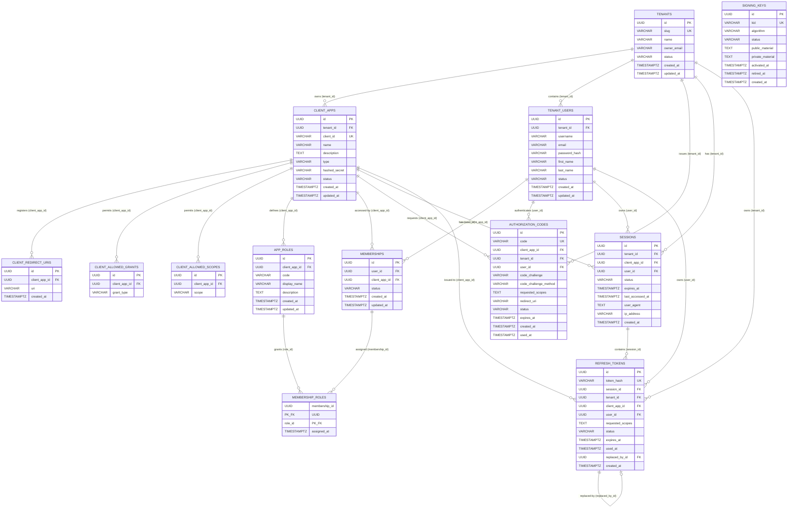
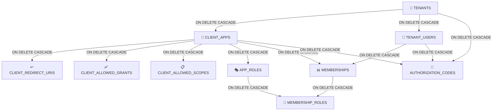

# Data Model — KeyGo Server

> Documentación del **diccionario de datos** y **modelo de entidades** (E/R) del sistema KeyGo Server.
>
> Fecha de actualización: **2026-03-29** | Estado: ✅ Sincronizado con migraciones V1–V19

---

## Tabla de contenidos

1. [Tablas activas (multi-tenancy)](#tablas-activas-multi-tenancy)
2. [Tablas legado (V1/V3)](#tablas-legado-v1v3)
3. [Tablas planificadas (fases futuras)](#tablas-planificadas-fases-futuras)
4. [Modelo E/R (Diagrama Mermaid)](#modelo-er-diagrama-mermaid)
5. [Relaciones de dependencia](#relaciones-de-dependencia)
6. [Guías de consulta común](#guías-de-consulta-común)
7. [Notas sobre enumeraciones](#notas-sobre-enumeraciones)
8. [Referencia rápida de constraints únicos](#referencia-rápida-de-constraints-únicos)

---

## Tablas activas (multi-tenancy)

> Estas tablas forman el núcleo del sistema. Todas implementadas en migraciones V4–V9.

### Tabla: `tenants` — V4

| Campo | Tipo | Clave | Nulable | Descripción |
|---|---|---|---|---|
| `id` | UUID | PK | NO | Identificador único del tenant (`uuid_generate_v4()`) |
| `slug` | VARCHAR(100) | UNIQUE | NO | Identificador URL-friendly (solo minúsculas, números y guiones). Mín. 3 chars. |
| `name` | VARCHAR(255) | | NO | Nombre legal/comercial del tenant |
| `owner_email` | VARCHAR(255) | | NO | Email del propietario/administrador del tenant |
| `status` | VARCHAR(20) | | NO | Estado: `ACTIVE`, `SUSPENDED`, `PENDING` |
| `created_at` | TIMESTAMPTZ | | NO | Marca de tiempo de creación (UTC) |
| `updated_at` | TIMESTAMPTZ | | NO | Marca de tiempo de última actualización (UTC — auto-actualizado por trigger) |

**Constraints:**
- `UNIQUE(slug)`, `slug ~ '^[a-z0-9][a-z0-9\-]*[a-z0-9]$'`, `char_length(slug) >= 3`
- `status IN ('ACTIVE', 'SUSPENDED', 'PENDING')`

**Reglas de negocio:**
- El `slug` es único globalmente; no puede repetirse entre tenants.
- Un tenant `SUSPENDED` no debe permitir operaciones normales (login, emisión de tokens).
- Toda entidad con `tenant_id` pertenece lógicamente a este tenant.

---

### Tabla: `client_apps` — V5

| Campo | Tipo | Clave | Nulable | Descripción |
|---|---|---|---|---|
| `id` | UUID | PK | NO | Identificador único de la aplicación cliente |
| `tenant_id` | UUID | FK | NO | Referencia al tenant propietario |
| `client_id` | VARCHAR(255) | UNIQUE | NO | ID OAuth2/OIDC único globalmente; usado en requests de autorización |
| `name` | VARCHAR(255) | | NO | Nombre legible de la aplicación |
| `description` | TEXT | | SÍ | Descripción opcional de la app |
| `type` | VARCHAR(20) | | NO | Tipo de cliente: `PUBLIC` (SPA, mobile) o `CONFIDENTIAL` (servidor backend) |
| `hashed_secret` | VARCHAR(255) | | SÍ | Hash del secret (solo si `CONFIDENTIAL`); nunca se expone en claro |
| `status` | VARCHAR(20) | | NO | Estado: `ACTIVE`, `SUSPENDED`, `PENDING` |
| `created_at` | TIMESTAMPTZ | | NO | Marca de tiempo de creación |
| `updated_at` | TIMESTAMPTZ | | NO | Marca de tiempo de última actualización |

**Constraints:**
- `type IN ('PUBLIC', 'CONFIDENTIAL')`
- `status IN ('ACTIVE', 'SUSPENDED', 'PENDING')`

**Reglas de negocio:**
- `type = PUBLIC` no debe tener `hashed_secret` (o ignorarlo en validación).
- `type = CONFIDENTIAL` requiere validar `hashed_secret` en algunos flows.
- Un cliente solo puede usar grants (`client_allowed_grants`) y scopes (`client_allowed_scopes`) registrados.

---

### Tabla: `client_redirect_uris` — V5

| Campo | Tipo | Clave | Nulable | Descripción |
|---|---|---|---|---|
| `id` | UUID | PK | NO | Identificador único |
| `client_app_id` | UUID | FK | NO | Referencia al cliente propietario |
| `uri` | VARCHAR(2048) | | NO | URI exacta permitida (sin wildcards) |
| `created_at` | TIMESTAMPTZ | | NO | Marca de tiempo de creación |

**Reglas de negocio:**
- La redirect URI en un `authorize` request debe coincidir exactamente con una entrada aquí.
- No se permiten wildcards; la validación es literal.
- Un cliente puede tener múltiples redirect URIs (dev, staging, producción).

---

### Tabla: `client_allowed_grants` — V5

| Campo | Tipo | Clave | Nulable | Descripción |
|---|---|---|---|---|
| `id` | UUID | PK | NO | Identificador único |
| `client_app_id` | UUID | FK | NO | Referencia al cliente propietario |
| `grant_type` | VARCHAR(50) | | NO | Tipo de grant permitido (p. ej. `authorization_code`, `client_credentials`, `refresh_token`) |

**Reglas de negocio:**
- Un cliente solo puede usar grants registrados aquí.
- El servidor debe validar contra esta tabla antes de emitir un token por ese flujo.

---

### Tabla: `client_allowed_scopes` — V5

| Campo | Tipo | Clave | Nulable | Descripción |
|---|---|---|---|---|
| `id` | UUID | PK | NO | Identificador único |
| `client_app_id` | UUID | FK | NO | Referencia al cliente propietario |
| `scope` | VARCHAR(100) | | NO | Scope permitido (p. ej. `openid`, `profile`, `email`, `custom:admin`) |

**Reglas de negocio:**
- Un cliente solo puede solicitar scopes registrados aquí.
- El servidor filtra los scopes autorizados contra esta lista.

---

### Tabla: `tenant_users` — V6

| Campo | Tipo | Clave | Nulable | Descripción |
|---|---|---|---|---|
| `id` | UUID | PK | NO | Identificador único del usuario |
| `tenant_id` | UUID | FK | NO | Referencia al tenant propietario |
| `username` | VARCHAR(100) | UNIQUE (tenant) | NO | Username único dentro del tenant |
| `email` | VARCHAR(255) | UNIQUE (tenant) | NO | Email único dentro del tenant |
| `password_hash` | VARCHAR(255) | | NO | Hash seguro de contraseña (BCrypt) |
| `first_name` | VARCHAR(100) | | SÍ | Nombre de pila |
| `last_name` | VARCHAR(100) | | SÍ | Apellido |
| `status` | VARCHAR(20) | | NO | Estado: `ACTIVE`, `SUSPENDED`, `PENDING` |
| `created_at` | TIMESTAMPTZ | | NO | Marca de tiempo de creación |
| `updated_at` | TIMESTAMPTZ | | NO | Marca de tiempo de última actualización |

**Constraints:**
- `UNIQUE(tenant_id, email)` — email único por tenant
- `UNIQUE(tenant_id, username)` — username único por tenant
- `status IN ('ACTIVE', 'SUSPENDED', 'PENDING')`
- FK: `tenant_id` → `tenants(id)` ON DELETE CASCADE

**Reglas de negocio:**
- Email y username son únicos por tenant, no globalmente.
- La contraseña nunca se almacena en claro; siempre como hash BCrypt.
- Un usuario `SUSPENDED` no puede autenticarse.

---

### Tabla: `app_roles` — V7 (renombrada en V10)

| Campo | Tipo | Clave | Nulable | Descripción |
|---|---|---|---|---|
| `id` | UUID | PK | NO | Identificador único del rol |
| `client_app_id` | UUID | FK | NO | Referencia a la aplicación propietaria del rol |
| `code` | VARCHAR(50) | UNIQUE (app) | NO | Código del rol en minúsculas (p. ej. `admin`, `user`, `viewer`). Patrón: `^[a-z][a-z0-9_-]*$` |
| `display_name` | VARCHAR(255) | | SÍ | Nombre legible del rol |
| `description` | TEXT | | SÍ | Descripción de responsabilidades/permisos |
| `created_at` | TIMESTAMPTZ | | NO | Marca de tiempo de creación |
| `updated_at` | TIMESTAMPTZ | | NO | Marca de tiempo de última actualización |

**Constraints:**
- `UNIQUE(client_app_id, code)` — código único dentro de la app
- `code ~ '^[a-z][a-z0-9_-]*$'` — solo minúsculas, números, guiones y underscores
- FK: `client_app_id` → `client_apps(id)` ON DELETE CASCADE

**Reglas de negocio:**
- Un rol siempre pertenece a una app específica; los roles no son globales.
- El `code` es el identificador funcional dentro de la app (p. ej. en JWT claims).
- Diferentes apps pueden tener roles con el mismo código, pero son entidades distintas.

---

### Tabla: `memberships` — V7 (renombrada en V10)

| Campo | Tipo | Clave | Nulable | Descripción |
|---|---|---|---|---|
| `id` | UUID | PK | NO | Identificador único de la membership |
| `user_id` | UUID | FK | NO | Referencia al usuario (`tenant_users`) |
| `client_app_id` | UUID | FK | NO | Referencia a la aplicación cliente |
| `status` | VARCHAR(20) | | NO | Estado: `ACTIVE`, `SUSPENDED`, `PENDING` |
| `created_at` | TIMESTAMPTZ | | NO | Marca de tiempo de creación |
| `updated_at` | TIMESTAMPTZ | | NO | Marca de tiempo de última actualización |

**Constraints:**
- `UNIQUE(user_id, client_app_id)` — no hay memberships duplicadas
- `status IN ('ACTIVE', 'SUSPENDED', 'PENDING')`
- FK: `user_id` → `tenant_users(id)` ON DELETE CASCADE
- FK: `client_app_id` → `client_apps(id)` ON DELETE CASCADE

**Reglas de negocio:**
- Una membership define si el usuario puede acceder a esa app.
- Un usuario **debe** tener membership `ACTIVE` en una app para autenticarse en ella.
- Estado `SUSPENDED` deniega temporalmente el login.
- `PENDING` = invitación pendiente de aceptación.

---

### Tabla: `membership_roles` — V7 (renombrada en V10)

> ⚠️ **PK compuesta** `(membership_id, role_id)` — NO hay columna `id` independiente. La columna FK al rol es `role_id` (no `app_role_id`).

| Campo | Tipo | Clave | Nulable | Descripción |
|---|---|---|---|---|
| `membership_id` | UUID | PK (parte) + FK | NO | Referencia a la membership |
| `role_id` | UUID | PK (parte) + FK | NO | Referencia al rol (`app_role`) |
| `assigned_at` | TIMESTAMPTZ | | NO | Marca de tiempo de asignación |

**Constraints:**
- PK compuesta: `(membership_id, role_id)`
- FK: `membership_id` → `memberships(id)` ON DELETE CASCADE
- FK: `role_id` → `app_roles(id)` ON DELETE CASCADE

**Reglas de negocio:**
- Una membership puede tener múltiples roles dentro de la misma app.
- El rol de una membership debe pertenecer a la misma app que la membership.
- Al revocar/eliminar una membership, se eliminan implícitamente todos sus roles (CASCADE).

---

### Tabla: `authorization_codes` — V8

| Campo | Tipo | Clave | Nulable | Descripción |
|---|---|---|---|---|
| `id` | UUID | PK | NO | Identificador único del código |
| `code` | VARCHAR(256) | UNIQUE | NO | Valor opaco del código de autorización |
| `client_app_id` | UUID | FK | NO | Referencia al cliente que lo solicitó |
| `tenant_id` | UUID | FK | NO | Referencia al tenant |
| `user_id` | UUID | FK | NO | Referencia al usuario autenticado |
| `code_challenge` | VARCHAR(256) | | NO | Challenge PKCE (valor hash SHA-256 o plain) |
| `code_challenge_method` | VARCHAR(10) | | NO | Método PKCE: `plain` o `S256` |
| `requested_scopes` | TEXT | | NO | Scopes solicitados (serializado) |
| `redirect_uri` | VARCHAR(2048) | | NO | URI de redirección autorizada |
| `status` | VARCHAR(20) | | NO | Estado: `pending`, `used`, `expired`, `revoked` |
| `expires_at` | TIMESTAMPTZ | | NO | Marca de tiempo de expiración (~10 min tras creación) |
| `created_at` | TIMESTAMPTZ | | NO | Marca de tiempo de emisión |
| `used_at` | TIMESTAMPTZ | | SÍ | Marca de tiempo de canje (se llena al marcar `used`) |

**Constraints:**
- `UNIQUE(code)`
- `code_challenge_method IN ('plain', 'S256')`
- `status IN ('pending', 'used', 'expired', 'revoked')`
- FK: `client_app_id` → `client_apps(id)` ON DELETE CASCADE
- FK: `tenant_id` → `tenants(id)` ON DELETE CASCADE
- FK: `user_id` → `tenant_users(id)` ON DELETE CASCADE

**Reglas de negocio:**
- Solo se puede canjear una vez: `pending` → `used` (inmutable después).
- Debe expirar rápidamente (~10 min). `expires_at > NOW()` se valida al canjear.
- El `client_app_id` que canjea debe ser el mismo que lo solicitó.
- Si PKCE fue usado en `/authorize`, se debe validar `code_verifier` contra `code_challenge`.

---

### Tabla: `signing_keys` — V9

| Campo | Tipo | Clave | Nulable | Descripción |
|---|---|---|---|---|
| `id` | UUID | PK | NO | Identificador único |
| `kid` | VARCHAR(100) | UNIQUE | NO | Key ID usado en el header `kid` del JWT |
| `algorithm` | VARCHAR(20) | | NO | Algoritmo de firma: `RS256`, `RS384`, `RS512` |
| `status` | VARCHAR(20) | | NO | Estado: `ACTIVE`, `RETIRED`, `REVOKED` |
| `public_material` | TEXT | | NO | Clave pública en formato PEM |
| `private_material` | TEXT | | SÍ | Clave privada en formato PEM (cifrada en reposo recomendada) |
| `activated_at` | TIMESTAMPTZ | | NO | Marca de tiempo de activación |
| `retired_at` | TIMESTAMPTZ | | SÍ | Marca de tiempo de retiro (`null` si sigue activa) |
| `created_at` | TIMESTAMPTZ | | NO | Marca de tiempo de creación |

**Constraints:**
- `UNIQUE(kid)`
- `status IN ('ACTIVE', 'RETIRED', 'REVOKED')`

**Reglas de negocio:**
- Debe existir al menos una clave `ACTIVE` para emitir tokens.
- Las claves `RETIRED` se mantienen para validación de tokens ya emitidos.
- La clave privada se almacena en DB en PEM cifrado — en producción debe migrar a KMS/bóveda.
- Solo una clave `ACTIVE` a la vez; al rotar, la anterior pasa a `RETIRED`.

---

## Tablas legado (V1/V3)

> Estas tablas existen en la DB por las migraciones iniciales pero **no se usan** en el sistema multi-tenancy actual. Se conservan por compatibilidad; no crear nuevos endpoints sobre ellas.

| Tabla | Migración | Descripción | Estado |
|---|---|---|---|
| `users` | V1 | Usuarios globales (sin tenant). Estructura diferente a `tenant_users`. | 🚧 Legado |
| `roles` | V1 | Roles globales del sistema. Sin relación con `app_role`. | 🚧 Legado |
| `user_roles` | V1 | Join table `users ↔ roles`. PK compuesta `(user_id, role_id)`. | 🚧 Legado |
| `permissions` | V1 | Permisos globales con acciones: `CREATE`, `READ`, `UPDATE`, `DELETE`, `EXECUTE`. | 🚧 Legado |
| `role_permissions` | V1 | Join table `roles ↔ permissions`. PK compuesta. | 🚧 Legado |
| `sessions` | V1 | Sesiones de usuario global (token JWT crudo, no multi-tenant). | 🚧 Legado |
| `audit_logs` | V1 | Log de auditoría global por acción + recurso + `user_id`. | 🚧 Legado |
| `oauth_providers` | V3 | Configuración de proveedores OAuth externos (Google, GitHub, etc.). | 🚧 Legado |
| `oauth_tokens` | V3 | Tokens de acceso de proveedores externos por usuario global. | 🚧 Legado |

---

## Tablas planificadas (fases futuras)

> Estas tablas están **documentadas en el diseño** pero aún **no tienen migración implementada**. Se incluyen aquí para referencia de diseño.

> ✅ Las tablas `sessions` y `refresh_tokens` (antes planificadas aquí) fueron implementadas en **V11** (`V11__add_refresh_tokens_and_sessions.sql`) durante la Fase 7. Ver diccionario completo en las secciones anteriores de este documento.

### Próximas tablas previstas (Fase 9+)

| Tabla | Descripción prevista | Migración |
|---|---|---|
| `token_blacklist` | Lista negra de JTI de access tokens revocados (opcionalmente en Redis) | `V12__...` |
| `audit_events` | Registro de eventos de auditoría por tenant (login, token emitido, revocación) | futura |

---

## Modelo E/R (Diagrama Mermaid)

> Solo tablas activas (V4–V11). Las tablas de legado se omiten para claridad.



---

## Relaciones de dependencia

### Jerarquía de cascade



**Implicaciones:**
- Si se elimina un **tenant**: se eliminan en cascada todas sus apps, usuarios y authorization codes.
- Si se elimina una **app**: se eliminan redirect URIs, grants, scopes, roles, memberships y codes asociados.
- Si se elimina un **usuario**: se eliminan sus memberships y authorization codes.
- `SIGNING_KEYS` no tiene FK hacia tenants — son claves globales del servidor.

---

## Guías de consulta común

### 1. Obtener todas las apps activas de un tenant

```sql
SELECT ca.* FROM client_apps ca
WHERE ca.tenant_id = :tenantId
  AND ca.status = 'ACTIVE';
```

### 2. Buscar usuario por email en un tenant

```sql
SELECT tu.* FROM tenant_users tu
WHERE tu.tenant_id = :tenantId
  AND tu.email = :email
  AND tu.status = 'ACTIVE';
```

### 3. Verificar si un usuario tiene membership activa en una app

```sql
SELECT COUNT(1) FROM memberships m
WHERE m.user_id = :userId
  AND m.client_app_id = :clientAppId
  AND m.status = 'ACTIVE';
-- Si count = 1, el usuario tiene acceso
```

### 4. Obtener roles asignados a un usuario en una app

```sql
SELECT ar.code, ar.display_name
FROM app_roles ar
JOIN membership_roles mr ON mr.role_id = ar.id
JOIN memberships m ON m.id = mr.membership_id
WHERE m.user_id = :userId
  AND ar.client_app_id = :clientAppId
  AND m.status = 'ACTIVE';
```

### 5. Listar todos los usuarios de un tenant

```sql
SELECT tu.* FROM tenant_users tu
WHERE tu.tenant_id = :tenantId
ORDER BY tu.created_at DESC;
```

### 6. Canjear authorization code (búsqueda + validación)

```sql
SELECT ac.* FROM authorization_codes ac
WHERE ac.code = :code
  AND ac.client_app_id = :clientAppId
  AND ac.status = 'pending'
  AND ac.expires_at > NOW();
```

### 7. Obtener claves de firma activas (JWKS)

```sql
SELECT id, kid, algorithm, public_material
FROM signing_keys
WHERE status = 'ACTIVE'
ORDER BY activated_at DESC;
```

### 8. Marcar authorization code como usado

```sql
UPDATE authorization_codes
SET status = 'used', used_at = NOW()
WHERE id = :id;
```

---

## Notas sobre enumeraciones

> Los valores de `status` en las tablas multi-tenancy siguen la convención que define cada CHECK constraint en la migración SQL correspondiente.

| Tabla | Campo | Valores permitidos | Convención |
|---|---|---|---|
| `tenants` | `status` | `ACTIVE`, `SUSPENDED`, `PENDING` | UPPERCASE |
| `client_apps` | `type` | `PUBLIC`, `CONFIDENTIAL` | UPPERCASE |
| `client_apps` | `status` | `ACTIVE`, `SUSPENDED`, `PENDING` | UPPERCASE |
| `tenant_users` | `status` | `ACTIVE`, `SUSPENDED`, `PENDING` | UPPERCASE |
| `memberships` | `status` | `ACTIVE`, `SUSPENDED`, `PENDING` | UPPERCASE |
| `authorization_codes` | `status` | `pending`, `used`, `expired`, `revoked` | **lowercase** |
| `authorization_codes` | `code_challenge_method` | `plain`, `S256` | mixto |
| `signing_keys` | `status` | `ACTIVE`, `RETIRED`, `REVOKED` | UPPERCASE |
| `app_role` | `code` | regex `^[a-z][a-z0-9_-]*$` | solo minúsculas |

> ⚠️ Los valores de `authorization_codes.status` son **minúsculas** (distinto al resto). Tener en cuenta en comparaciones de código Java.

---

## Referencia rápida de constraints únicos

| Tabla | Constraint | Descripción |
|---|---|---|
| `tenants` | `UNIQUE(slug)` | Slug global único |
| `client_apps` | `UNIQUE(client_id)` | Client ID único globalmente |
| `client_redirect_uris` | — | Sin constraint; múltiples URIs por app |
| `tenant_users` | `UNIQUE(tenant_id, email)` | Email único por tenant |
| `tenant_users` | `UNIQUE(tenant_id, username)` | Username único por tenant |
| `memberships` | `UNIQUE(user_id, client_app_id)` | No hay memberships duplicadas |
| `app_roles` | `UNIQUE(client_app_id, code)` | Código de rol único por app |
| `membership_roles` | PK `(membership_id, role_id)` | PK compuesta; sin columna `id` propia |
| `authorization_codes` | `UNIQUE(code)` | Authorization code único globalmente |
| `signing_keys` | `UNIQUE(kid)` | Key ID único globalmente |
| `refresh_tokens` | `UNIQUE(token_hash)` | Hash SHA-256 único globalmente (64 hex chars) |

---

## Tabla: `sessions` — V11

| Campo | Tipo | Clave | Nulable | Descripción |
|---|---|---|---|---|
| `id` | UUID | PK | NO | Identificador único de la sesión |
| `tenant_id` | UUID | FK → `tenants.id` | NO | Tenant de la sesión |
| `client_app_id` | UUID | FK → `client_apps.id` | NO | App cliente que inició la sesión |
| `user_id` | UUID | FK → `tenant_users.id` | NO | Usuario propietario de la sesión |
| `status` | VARCHAR(20) | — | NO | Estado: `ACTIVE`, `TERMINATED`, `EXPIRED` |
| `expires_at` | TIMESTAMPTZ | — | NO | Expiración de la sesión (configurado en 30 días) |
| `last_accessed_at` | TIMESTAMPTZ | — | NO | Último acceso (se actualiza en cada rotación de RT) |
| `user_agent` | TEXT | — | SÍ | User-agent del cliente (para auditoría) |
| `ip_address` | VARCHAR(64) | — | SÍ | IP de origen (para auditoría) |
| `created_at` | TIMESTAMPTZ | — | NO | Timestamp de creación (auto, `CURRENT_TIMESTAMP`) |

**Índices:** `idx_sessions_user_tenant(user_id, tenant_id)`, `idx_sessions_status(status)`

**Reglas de negocio:**
- Una sesión ACTIVE puede tener múltiples refresh tokens, pero solo uno es válido (ACTIVE) en un momento dado.
- Al terminar la sesión (`TERMINATED`), todos sus refresh tokens se revocan.
- El `last_accessed_at` se actualiza en cada rotación de refresh token exitosa.

---

## Tabla: `refresh_tokens` — V11

| Campo | Tipo | Clave | Nulable | Descripción |
|---|---|---|---|---|
| `id` | UUID | PK | NO | Identificador único del refresh token |
| `token_hash` | VARCHAR(64) | UNIQUE | NO | Hash SHA-256 (hex) del token plano — 64 caracteres |
| `session_id` | UUID | FK → `sessions.id` | NO | Sesión a la que pertenece este token |
| `tenant_id` | UUID | FK → `tenants.id` | NO | Tenant propietario |
| `client_app_id` | UUID | FK → `client_apps.id` | NO | App que recibió el token |
| `user_id` | UUID | FK → `tenant_users.id` | NO | Usuario propietario |
| `requested_scopes` | TEXT | — | NO | Scopes otorgados (espacio separado, e.g. `openid profile`) |
| `status` | VARCHAR(20) | — | NO | Estado: `ACTIVE`, `USED`, `EXPIRED`, `REVOKED` |
| `expires_at` | TIMESTAMPTZ | — | NO | Expiración del token (mismo que la sesión, 30 días) |
| `used_at` | TIMESTAMPTZ | — | SÍ | Cuándo fue canjeado (solo para estado `USED`) |
| `replaced_by_id` | UUID | FK → `refresh_tokens.id` | SÍ | Auto-referencia al nuevo RT que lo reemplazó |
| `created_at` | TIMESTAMPTZ | — | NO | Timestamp de creación (auto, `CURRENT_TIMESTAMP`) |

**Índices:** `idx_refresh_tokens_hash(token_hash)`, `idx_refresh_tokens_session(session_id)`, `idx_refresh_tokens_user_tenant(user_id, tenant_id)`, `idx_refresh_tokens_status(status)`

**Reglas de negocio:**
- El token plano (`raw`) **nunca se almacena** en DB; solo el hash SHA-256 determinista.
- El token plano se entrega al cliente una única vez al emitirlo. Si se pierde, debe re-autenticar.
- Al recibir un token en estado `USED` para rotación, se interpreta como posible ataque de replay.
- RFC 7009: la revocación es idempotente — si el token no existe o ya fue revocado, se responde 200.
- `replaced_by_id` permite trazar la cadena completa de rotación para auditoría.

---

## Tabla: `email_verifications` — V12

Almacena códigos de verificación de email generados durante el auto-registro de usuarios. La fila más reciente por usuario (mayor `created_at`) es el código activo.

| Columna | Tipo | FK | Nullable | Descripción |
|---|---|---|---|---|
| `id` | UUID PK | — | NO | Identificador único (`gen_random_uuid()`) |
| `tenant_user_id` | UUID | → `tenant_users.id` ON DELETE CASCADE | NO | Usuario al que pertenece el código |
| `code` | VARCHAR(10) | — | NO | Código numérico de 6 dígitos (generado con `SecureRandom`) |
| `expires_at` | TIMESTAMPTZ | — | NO | Expiración: 30 minutos desde `created_at` |
| `used_at` | TIMESTAMPTZ | — | SÍ | Timestamp de uso exitoso; `NULL` = no utilizado aún |
| `created_at` | TIMESTAMPTZ | — | NO | Timestamp de creación (`DEFAULT NOW()`) |

**Índices:** `idx_email_verifications_tenant_user_id(tenant_user_id)`, `idx_email_verifications_code(code)`

**Reglas de negocio:**
- Solo el registro con el mayor `created_at` es el código activo para un usuario.
- Un nuevo código solo se puede solicitar cuando el anterior ha expirado (`expires_at < NOW()`).
- Al verificar exitosamente: `used_at` se actualiza en `email_verifications` y `status` pasa a `ACTIVE` en `tenant_users`.
- Un código ya usado (`used_at IS NOT NULL`) no puede reutilizarse aunque no haya expirado.
- La fila se elimina en cascada si el `tenant_user` es eliminado.

---

## Tablas de billing — V16–V19

> Las tablas de billing son `app-scoped`: pertenecen a una `ClientApp`, no directamente a un tenant. Cada app puede tener su propio catálogo de planes y flujo de contratación independiente.

### Tabla: `app_plans` — V16

| Campo | Tipo | Clave | Nulable | Descripción |
|---|---|---|---|---|
| `id` | UUID | PK | NO | Identificador único |
| `client_app_id` | UUID | FK → `client_apps.id` ON DELETE CASCADE | NO | App propietaria del plan |
| `code` | VARCHAR(50) | UNIQUE (app) | NO | Código único del plan dentro de la app (e.g. `STARTER`, `PRO`) |
| `name` | VARCHAR(100) | — | NO | Nombre legible del plan |
| `description` | TEXT | — | SÍ | Descripción opcional |
| `subscriber_type` | VARCHAR(20) | — | NO | Tipo de suscriptor: `TENANT` (B2B) o `TENANT_USER` (B2C) |
| `status` | VARCHAR(20) | — | NO | Estado: `ACTIVE`, `INACTIVE` |
| `is_public` | BOOLEAN | — | NO | Si aparece en el catálogo público |
| `created_at` | TIMESTAMPTZ | — | NO | Timestamp de creación |
| `updated_at` | TIMESTAMPTZ | — | NO | Timestamp de última actualización |

**Constraints:** `UNIQUE(client_app_id, code)` | `CHECK(subscriber_type IN ('TENANT','TENANT_USER'))` | `CHECK(status IN ('ACTIVE','INACTIVE'))`

**Reglas de negocio:**
- Un plan con `is_public=false` no aparece en `GET /billing/catalog` pero puede asignarse manualmente.
- El `code` es el identificador funcional del plan en APIs y mensajes (no el UUID).
- Una app puede tener planes `TENANT` y `TENANT_USER` simultáneamente.

---

### Tabla: `app_plan_versions` — V16

Snapshots inmutables de precio y período. Las suscripciones apuntan a una versión específica; cambiar precios requiere crear una nueva versión.

| Campo | Tipo | Clave | Nulable | Descripción |
|---|---|---|---|---|
| `id` | UUID | PK | NO | Identificador único |
| `app_plan_id` | UUID | FK → `app_plans.id` ON DELETE RESTRICT | NO | Plan padre |
| `version` | VARCHAR(20) | UNIQUE (plan) | NO | Etiqueta de versión (e.g. `1.0`, `2.0-beta`) |
| `currency` | VARCHAR(3) | — | NO | Moneda ISO-4217 (default `MXN`) |
| `billing_period` | VARCHAR(20) | — | NO | Período: `MONTHLY`, `YEARLY`, `ONE_TIME` |
| `base_price` | NUMERIC(12,2) | — | NO | Precio base del período |
| `setup_fee` | NUMERIC(12,2) | — | NO | Tarifa de activación única |
| `trial_days` | INT | — | NO | Días de prueba gratuita (0 = sin prueba) |
| `effective_from` | DATE | — | NO | Fecha de inicio de vigencia |
| `effective_to` | DATE | — | SÍ | Fecha de fin de vigencia (`NULL` = sin vencimiento) |
| `status` | VARCHAR(20) | — | NO | Estado: `ACTIVE`, `INACTIVE`, `DEPRECATED` |
| `created_at` | TIMESTAMPTZ | — | NO | Timestamp de creación |

**Constraints:** `UNIQUE(app_plan_id, version)` | `CHECK(billing_period IN ('MONTHLY','YEARLY','ONE_TIME'))`

**Reglas de negocio:**
- Las versiones con `status=DEPRECATED` no pueden ser seleccionadas en nuevos contratos.
- Las suscripciones activas apuntando a una versión `DEPRECATED` no se afectan.
- `ON DELETE RESTRICT` en la FK impide eliminar un plan que tiene versiones.

---

### Tabla: `app_plan_entitlements` — V16

Límites y feature flags por versión de plan. Definen qué puede hacer el suscriptor dentro de los límites del plan.

| Campo | Tipo | Clave | Nulable | Descripción |
|---|---|---|---|---|
| `id` | UUID | PK | NO | Identificador único |
| `app_plan_version_id` | UUID | FK → `app_plan_versions.id` ON DELETE CASCADE | NO | Versión a la que pertenece |
| `metric_code` | VARCHAR(100) | UNIQUE (version) | NO | Código de métrica de negocio (e.g. `MAX_USERS`, `ALLOW_SSO`, `EVALUACIONES_POR_MES`) |
| `metric_type` | VARCHAR(20) | — | NO | Tipo: `QUOTA` (cuota numérica), `BOOLEAN` (habilitado/deshabilitado), `RATE` (rate limit) |
| `limit_value` | BIGINT | — | SÍ | Valor límite (`NULL` = ilimitado para QUOTA/RATE) |
| `period_type` | VARCHAR(20) | — | NO | Período de reset: `NONE`, `DAY`, `MONTH` |
| `enforcement_mode` | VARCHAR(20) | — | NO | Modo: `HARD` (bloquea) o `SOFT` (alerta pero permite) |
| `is_enabled` | BOOLEAN | — | NO | Si el entitlement está activo |

**Constraints:** `UNIQUE(app_plan_version_id, metric_code)` | `CHECK(metric_type IN ('QUOTA','BOOLEAN','RATE'))` | `CHECK(enforcement_mode IN ('HARD','SOFT'))`

---

### Tabla: `app_contracts` — V17

Representa el proceso de onboarding/checkout previo a una suscripción. Registra el progreso de verificación de email, pago y activación.

| Campo | Tipo | Clave | Nulable | Descripción |
|---|---|---|---|---|
| `id` | UUID | PK | NO | Identificador único del contrato |
| `client_app_id` | UUID | FK → `client_apps.id` ON DELETE RESTRICT | NO | App a la que pertenece el contrato |
| `selected_plan_version_id` | UUID | FK → `app_plan_versions.id` ON DELETE RESTRICT | NO | Versión del plan seleccionada |
| `billing_period` | VARCHAR(20) | — | NO | Período elegido: `MONTHLY`, `YEARLY`, `ONE_TIME` |
| `subscriber_type` | VARCHAR(20) | — | NO | Tipo: `TENANT` (B2B) o `TENANT_USER` (B2C) |
| `subscriber_tenant_id` | UUID | FK → `tenants.id` ON DELETE SET NULL | SÍ | FK al tenant creado en activación (B2B) |
| `subscriber_tenant_user_id` | UUID | FK → `tenant_users.id` ON DELETE SET NULL | SÍ | FK al usuario creado en activación (B2C) |
| `status` | VARCHAR(40) | — | NO | Estado del flujo de contratación (ver máquina de estados) |
| `contractor_email` | VARCHAR(255) | — | NO | Email del contratante |
| `contractor_first_name` | VARCHAR(100) | — | NO | Nombre del contratante |
| `contractor_last_name` | VARCHAR(100) | — | NO | Apellido del contratante |
| `company_name` | VARCHAR(200) | — | SÍ | Nombre de empresa (solo B2B) |
| `company_slug` | VARCHAR(100) | UNIQUE | SÍ | Slug de empresa → se convierte en `tenant.slug` al activar |
| `company_tax_id` | VARCHAR(100) | — | SÍ | RFC / Tax ID (solo B2B) |
| `company_address` | TEXT | — | SÍ | Dirección fiscal (solo B2B) |
| `email_verified_at` | TIMESTAMPTZ | — | SÍ | Timestamp de verificación de email |
| `payment_verified_at` | TIMESTAMPTZ | — | SÍ | Timestamp de confirmación de pago |
| `expires_at` | TIMESTAMPTZ | — | NO | TTL del contrato (configurable, default 24h) |
| `created_at` | TIMESTAMPTZ | — | NO | Timestamp de creación |
| `updated_at` | TIMESTAMPTZ | — | NO | Timestamp de última actualización |

**Constraints:**
- `UNIQUE(company_slug)` — slug globalmente único
- `CHECK(NOT (subscriber_tenant_id IS NOT NULL AND subscriber_tenant_user_id IS NOT NULL))` — solo un suscriptor

**Estados válidos:** `PENDING_EMAIL_VERIFICATION` → `PENDING_PAYMENT` → `READY_TO_ACTIVATE` → `ACTIVATED` | `CANCELLED` | `EXPIRED` | `FAILED`

---

### Tabla: `app_subscriptions` — V18

Relación activa entre un suscriptor y una versión de plan de una app. Exactamente uno de `subscriber_tenant_id` / `subscriber_tenant_user_id` debe ser no-null.

| Campo | Tipo | Clave | Nulable | Descripción |
|---|---|---|---|---|
| `id` | UUID | PK | NO | Identificador único |
| `client_app_id` | UUID | FK → `client_apps.id` ON DELETE RESTRICT | NO | App propietaria |
| `app_plan_version_id` | UUID | FK → `app_plan_versions.id` ON DELETE RESTRICT | NO | Versión del plan activo |
| `contract_id` | UUID | FK → `app_contracts.id` ON DELETE SET NULL | SÍ | Contrato origen |
| `subscriber_tenant_id` | UUID | FK → `tenants.id` ON DELETE RESTRICT | SÍ | Suscriptor B2B |
| `subscriber_tenant_user_id` | UUID | FK → `tenant_users.id` ON DELETE RESTRICT | SÍ | Suscriptor B2C |
| `status` | VARCHAR(20) | — | NO | Estado: `PENDING`, `ACTIVE`, `PAST_DUE`, `SUSPENDED`, `CANCELLED`, `EXPIRED` |
| `current_period_start` | TIMESTAMPTZ | — | NO | Inicio del período actual |
| `current_period_end` | TIMESTAMPTZ | — | NO | Fin del período actual |
| `cancel_at_period_end` | BOOLEAN | — | NO | Marcar cancelación al fin del período |
| `cancelled_at` | TIMESTAMPTZ | — | SÍ | Timestamp de cancelación efectiva |
| `next_billing_at` | TIMESTAMPTZ | — | SÍ | Próxima fecha de renovación |
| `auto_renew` | BOOLEAN | — | NO | Si renueva automáticamente |
| `created_at` | TIMESTAMPTZ | — | NO | Timestamp de creación |
| `updated_at` | TIMESTAMPTZ | — | NO | Timestamp de última actualización |

**Constraints:**
- `UNIQUE(client_app_id, subscriber_tenant_id)` — una suscripción B2B activa por app
- `UNIQUE(client_app_id, subscriber_tenant_user_id)` — una suscripción B2C activa por app
- `CHECK(NOT (subscriber_tenant_id IS NOT NULL AND subscriber_tenant_user_id IS NOT NULL))`

---

### Tabla: `payment_transactions` — V18

Una transacción de pago por evento de facturación (activación inicial, renovación, etc.).

| Campo | Tipo | Clave | Nulable | Descripción |
|---|---|---|---|---|
| `id` | UUID | PK | NO | Identificador único |
| `contract_id` | UUID | FK → `app_contracts.id` ON DELETE SET NULL | SÍ | Contrato asociado |
| `subscription_id` | UUID | FK → `app_subscriptions.id` ON DELETE SET NULL | SÍ | Suscripción asociada |
| `provider` | VARCHAR(50) | — | NO | Proveedor: `MANUAL`, `MOCK`, `MERCADOPAGO`, `STRIPE`, `OTHER` |
| `provider_reference` | VARCHAR(255) | — | SÍ | ID de referencia del PSP externo |
| `amount` | NUMERIC(12,2) | — | NO | Monto cobrado |
| `currency` | VARCHAR(3) | — | NO | Moneda ISO-4217 |
| `status` | VARCHAR(20) | — | NO | Estado: `PENDING`, `APPROVED`, `REJECTED`, `CANCELLED`, `EXPIRED` |
| `paid_at` | TIMESTAMPTZ | — | SÍ | Timestamp de pago exitoso |
| `raw_response` | JSONB | — | SÍ | Respuesta raw del PSP (auditoría) |
| `created_at` | TIMESTAMPTZ | — | NO | Timestamp de creación |

---

### Tabla: `invoices` — V19

Snapshot inmutable de una factura por período de suscripción. Los campos `*_snapshot` no se modifican retroactivamente.

| Campo | Tipo | Clave | Nulable | Descripción |
|---|---|---|---|---|
| `id` | UUID | PK | NO | Identificador único |
| `subscription_id` | UUID | FK → `app_subscriptions.id` ON DELETE RESTRICT | NO | Suscripción a la que pertenece |
| `invoice_number` | VARCHAR(50) | UNIQUE | NO | Número de factura (e.g. `INV-A1B2C3D4`) |
| `status` | VARCHAR(20) | — | NO | Estado: `DRAFT`, `ISSUED`, `PAID`, `VOID`, `OVERDUE` |
| `issue_date` | DATE | — | NO | Fecha de emisión |
| `due_date` | DATE | — | NO | Fecha de vencimiento |
| `period_start` | DATE | — | NO | Inicio del período facturado |
| `period_end` | DATE | — | NO | Fin del período facturado |
| `currency` | VARCHAR(3) | — | NO | Moneda |
| `subtotal` | NUMERIC(12,2) | — | NO | Subtotal sin impuestos |
| `tax_amount` | NUMERIC(12,2) | — | NO | Monto de impuestos |
| `total` | NUMERIC(12,2) | — | NO | Total a pagar |
| `billing_name_snapshot` | VARCHAR(300) | — | SÍ | Nombre del titular al momento de emisión |
| `billing_tax_id_snapshot` | VARCHAR(100) | — | SÍ | RFC/Tax ID al momento de emisión |
| `billing_address_snapshot` | TEXT | — | SÍ | Dirección al momento de emisión |
| `plan_name_snapshot` | VARCHAR(100) | — | SÍ | Nombre del plan al momento de emisión |
| `plan_version_snapshot` | VARCHAR(20) | — | SÍ | Versión del plan al momento de emisión |
| `pdf_url` | TEXT | — | SÍ | URL del PDF de la factura |
| `created_at` | TIMESTAMPTZ | — | NO | Timestamp de creación |

---

### Tabla: `usage_counters` — V19

Contadores atómicos de uso por suscriptor, métrica y período. Los incrementos se realizan con `UPDATE ... SET used_value = used_value + delta` para atomicidad PostgreSQL.

| Campo | Tipo | Clave | Nulable | Descripción |
|---|---|---|---|---|
| `id` | UUID | PK | NO | Identificador único |
| `client_app_id` | UUID | FK → `client_apps.id` ON DELETE CASCADE | NO | App propietaria |
| `subscriber_tenant_id` | UUID | FK → `tenants.id` ON DELETE CASCADE | SÍ | Suscriptor B2B |
| `subscriber_tenant_user_id` | UUID | FK → `tenant_users.id` ON DELETE CASCADE | SÍ | Suscriptor B2C |
| `metric_code` | VARCHAR(100) | — | NO | Código de métrica (e.g. `MAX_USERS`, `EVALUACIONES_POR_MES`) |
| `period_start` | TIMESTAMPTZ | — | NO | Inicio del período de la cuota |
| `period_end` | TIMESTAMPTZ | — | NO | Fin del período de la cuota |
| `used_value` | BIGINT | — | NO | Valor acumulado en el período (default 0) |
| `updated_at` | TIMESTAMPTZ | — | NO | Timestamp de última actualización |

**Constraints:**
- `UNIQUE(client_app_id, subscriber_tenant_id, metric_code, period_start, period_end)` (B2B)
- `UNIQUE(client_app_id, subscriber_tenant_user_id, metric_code, period_start, period_end)` (B2C)
- `CHECK(NOT (subscriber_tenant_id IS NOT NULL AND subscriber_tenant_user_id IS NOT NULL))`

--- (`V14__seed_initial_ui_tenants.sql`)

> V14 no agrega tablas ni columnas nuevas; define un dataset base idempotente para arrancar desarrollo UI y pruebas funcionales.

**Registros seed relevantes:**

| Tabla | Seed aplicado |
|---|---|
| `tenants` | `keygo`, `demo` |
| `client_apps` | `key-go-ui` (tenant `keygo`), `demo-ui` (tenant `demo`) |
| `tenant_users` | 3 usuarios en `keygo` (`keygo_admin`, `keygo_tenant_admin`, `keygo_user`) y 2 en `demo` (`demo_admin`, `demo_user`) |
| `app_roles` | `key-go-ui`: `admin`, `admin_tenant`, `user_tenant`; `demo-ui`: `demo_admin`, `demo_user` |
| `memberships` | 1 membership activa por usuario hacia su app correspondiente |
| `membership_roles` | Asignación rol↔membership para reflejar perfil admin/user por app |

**Nota:** Este seed no usa `users`/`user_roles` legacy; se basa solo en el modelo multi-tenant vigente (`tenant_users`, `memberships`, `app_roles`).

---

## Próximas migraciones

| Migración | Descripción | Estado |
|---|---|---|
| `V10__rename_membership_tables_to_plural.sql` | Renombrar `app_role`, `membership`, `membership_role` → `app_roles`, `memberships`, `membership_roles` | ✅ Aplicada (2026-03-22) |
| `V11__add_refresh_tokens_and_sessions.sql` | Tablas `sessions` + `refresh_tokens` para Fase 7 (refresh token flow, SHA-256 hash) | ✅ Aplicada (2026-03-22) |
| `V12__add_email_verifications.sql` | Tabla `email_verifications` para flujo de auto-registro con verificación de email | ✅ Aplicada (2026-03-23) |
| `V13__extend_tenant_user_profile.sql` | Extiende `tenant_users` con 6 campos OIDC de perfil canónico | ✅ Aplicada (2026-03-24) |
| `V14__seed_initial_ui_tenants.sql` | Seed base para UI: tenants/apps/usuarios/roles/memberships (`keygo`, `demo`) | ✅ Aplicada (2026-03-25) |
| `V15__reset_seed_user_passwords.sql` | Corrección de hashes BCrypt desconocidos de V2/V14; contraseñas conocidas para dev | ✅ Aplicada (2026-03-27) |
| `V16__add_billing_catalog.sql` | Tablas `app_plans`, `app_plan_versions`, `app_plan_entitlements` — catálogo de planes por app | ✅ Aplicada (2026-03-28) |
| `V17__add_billing_contracts.sql` | Tabla `app_contracts` — flujo self-service de contratación con verificación de email y pago | ✅ Aplicada (2026-03-28) |
| `V18__add_billing_subscriptions.sql` | Tablas `app_subscriptions`, `payment_transactions` — suscripciones activas y transacciones | ✅ Aplicada (2026-03-28) |
| `V19__add_billing_invoices_and_usage.sql` | Tablas `invoices`, `usage_counters` — facturas históricas y contadores de uso atómicos | ✅ Aplicada (2026-03-28) |
| `V20__...` | Próxima migración — sin definir aún | ⏳ Planificada |

> **Regla:** Nunca reutilizar ni editar migraciones aplicadas. La siguiente libre es `V20`.

---

**Última actualización:** 2026-03-29 | **Responsable:** AI Agent | **Sincronizado con:** Migraciones V1–V19
