# Entity Relationships & Data Flows — KeyGo Server

> Diagramas complementarios de **relaciones de entidades**, **flujos de datos** y **contextos de negocio**.
>
> Fecha de actualización: **2026-03-30** | Estado: ✅ Sincronizado con migraciones V1–V17 + diseño de datos v2

---

## Tabla de contenidos

1. [Relaciones por contexto de negocio](#relaciones-por-contexto-de-negocio)
2. [Flujos de autenticación (Authorization Code)](#flujos-de-autenticación-authorization-code)
3. [Flujos de token (refresh, revoke)](#flujos-de-token-refresh-revoke)
4. [Ciclo de vida de memberships y roles](#ciclo-de-vida-de-memberships-y-roles)
5. [Modelo de permisos y autorización](#modelo-de-permisos-y-autorización)

---

## Relaciones por contexto de negocio

### Contexto 1: Tenant Management

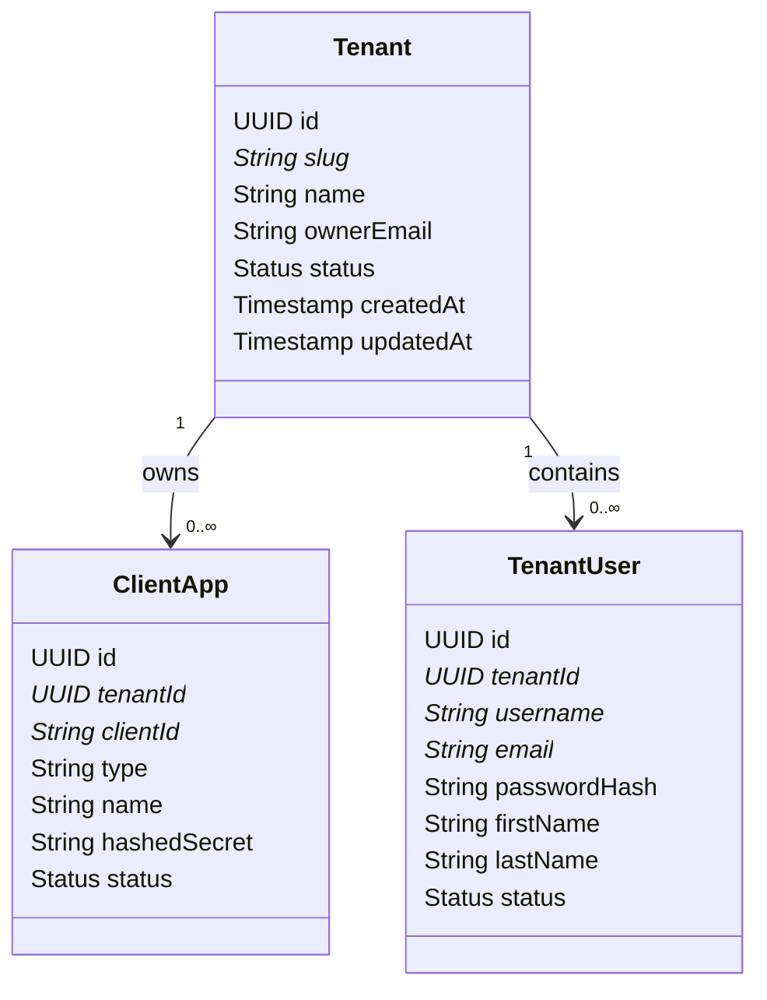
```mermaid
classDiagram
    class Tenant {
        UUID id
        String slug*
        String name
        String ownerEmail
        Status status
        Timestamp createdAt
        Timestamp updatedAt
    }

    class ClientApp {
        UUID id
        UUID tenantId*
        String clientId*
        String type
        String name
        String hashedSecret
        Status status
    }

    class TenantUser {
        UUID id
        UUID tenantId*
        String username*
        String email*
        String passwordHash
        String firstName
        String lastName
        Status status
    }

    Tenant "1" --> "0..∞" ClientApp : owns
    Tenant "1" --> "0..∞" TenantUser : contains
```

> Status válidos: `ACTIVE`, `SUSPENDED`, `PENDING` (todas las entidades de este contexto).  
> `ClientApp.type`: `PUBLIC` o `CONFIDENTIAL`.

**Invariante:** Todo usuario y app dentro de un tenant debe tener `tenant_id` consistente.

---

### Contexto 2: Client Application Management

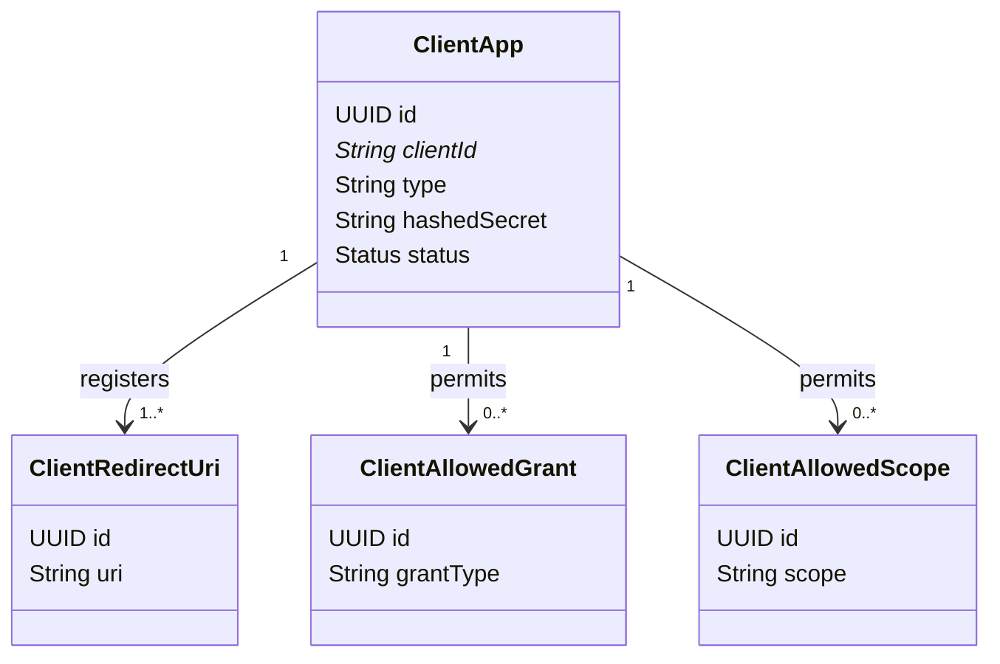
```mermaid
classDiagram
    class ClientApp {
        UUID id
        String clientId*
        String type
        String hashedSecret
        Status status
    }

    class ClientRedirectUri {
        UUID id
        String uri
    }

    class ClientAllowedGrant {
        UUID id
        String grantType
    }

    class ClientAllowedScope {
        UUID id
        String scope
    }

    ClientApp "1" --> "1..*" ClientRedirectUri : registers
    ClientApp "1" --> "0..*" ClientAllowedGrant : permits
    ClientApp "1" --> "0..*" ClientAllowedScope : permits
```

**Reglas:**
- Redirect URIs: validación exacta contra campo `uri` (sin wildcards).
- Client solo puede usar grants/scopes registrados en sus tablas.
- `hashedSecret` solo para tipo `CONFIDENTIAL`.

---

### Contexto 3: User Identity & Membership

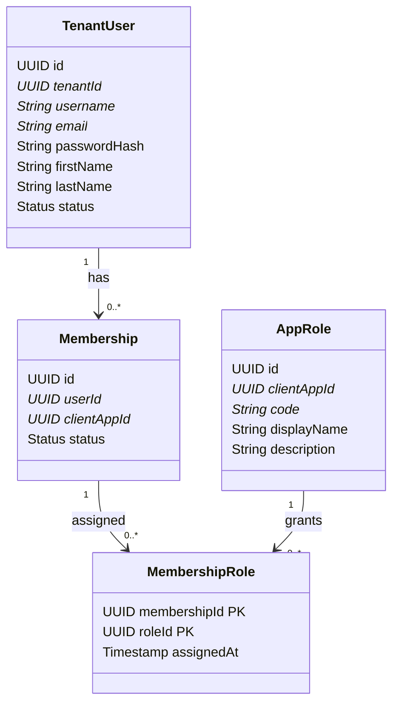
```mermaid
classDiagram
    class TenantUser {
        UUID id
        UUID tenantId*
        String username*
        String email*
        String passwordHash
        String firstName
        String lastName
        Status status
    }

    class Membership {
        UUID id
        UUID userId*
        UUID clientAppId*
        Status status
    }

    class AppRole {
        UUID id
        UUID clientAppId*
        String code*
        String displayName
        String description
    }

    class MembershipRole {
        UUID membershipId PK
        UUID roleId PK
        Timestamp assignedAt
    }

    TenantUser "1" --> "0..*" Membership : has
    Membership "1" --> "0..*" MembershipRole : assigned
    AppRole "1" --> "0..*" MembershipRole : grants
```

> Tablas en DB: `memberships`, `membership_roles`, `app_roles` (en V6 con nombres correctos desde la reestructuración).  
> ⚠️ `memberships` **sin columna `tenant_id`** (redundante — user_id implica el tenant).  
> ⚠️ `membership_roles` tiene **PK compuesta** `(membership_id, role_id)` — sin columna `id`.  
> ⚠️ `app_roles` no tiene columna `status` en la DB actual. El campo FK al rol es `role_id`.  
> Status de `Membership`: `ACTIVE`, `SUSPENDED`, `PENDING`.

**Invariantes:**
- Un usuario puede tener 0 o más memberships.
- Una membership = acceso potencial a una app.
- Una membership = 0 o más roles dentro de esa app.
- Roles son específicos por app.

---

### Contexto 4: Authorization & Token Lifecycle

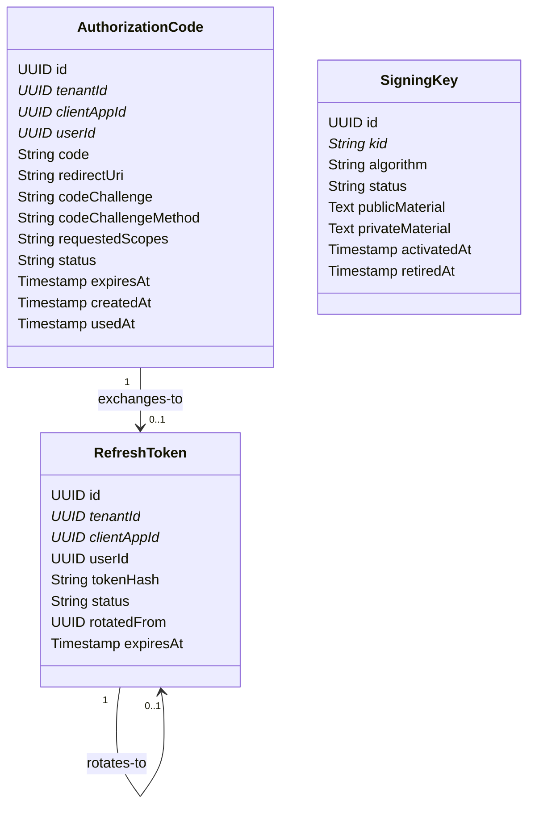
```mermaid
classDiagram
    class AuthorizationCode {
        UUID id
        UUID tenantId*
        UUID clientAppId*
        UUID userId*
        String code
        String redirectUri
        String codeChallenge
        String codeChallengeMethod
        String requestedScopes
        String status
        Timestamp expiresAt
        Timestamp createdAt
        Timestamp usedAt
    }

    class SigningKey {
        UUID id
        String kid*
        String algorithm
        String status
        Text publicMaterial
        Text privateMaterial
        Timestamp activatedAt
        Timestamp retiredAt
    }

    class RefreshToken {
        UUID id
        UUID tenantId*
        UUID clientAppId*
        UUID userId
        String tokenHash
        String status
        UUID rotatedFrom
        Timestamp expiresAt
    }

    AuthorizationCode "1" --> "0..1" RefreshToken : exchanges-to
    RefreshToken "1" --> "0..1" RefreshToken : rotates-to
```

> ⚠️ `authorization_codes.status` usa valores en **minúsculas**: `pending`, `used`, `expired`, `revoked`.  
> ⚠️ El campo es `requested_scopes` (no `scope_set`).  
> ✅ `RefreshToken` y `Session` existen en DB desde **V8** (`sessions` + `refresh_tokens`).  
> `SigningKey.status`: `ACTIVE`, `RETIRED`, `REVOKED` (UPPERCASE).

**Flujos:**
1. Authorization Code (`pending`) → validado + PKCE → marcado `used` → emite JWT (access_token + id_token).
2. RefreshToken (Fase 7) → renovable múltiples veces → nuevo AccessToken.
3. SigningKey (`ACTIVE`) → firma RS256 → expuesta en JWKS (`/.well-known/jwks.json`).

---

## Flujos de autenticación (Authorization Code)

### OAuth2 Authorization Code Flow + PKCE

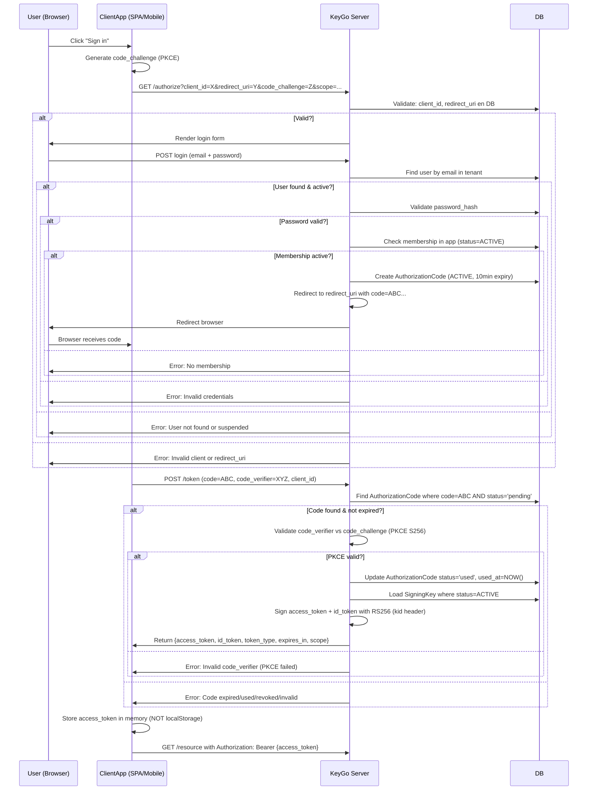
```mermaid
sequenceDiagram
    participant User as User (Browser)
    participant App as ClientApp (SPA/Mobile)
    participant KeyGo as KeyGo Server
    participant DB as DB

    User->>App: Click "Sign in"
    App->>App: Generate code_challenge (PKCE)
    App->>KeyGo: GET /authorize?client_id=X&redirect_uri=Y&code_challenge=Z&scope=...

    KeyGo->>DB: Validate: client_id, redirect_uri en DB
    alt Valid?
        KeyGo->>User: Render login form
        User->>KeyGo: POST login (email + password)
        KeyGo->>DB: Find user by email in tenant
        alt User found & active?
            KeyGo->>DB: Validate password_hash
            alt Password valid?
                KeyGo->>DB: Check membership in app (status=ACTIVE)
                alt Membership active?
                    KeyGo->>DB: Create AuthorizationCode (ACTIVE, 10min expiry)
                    KeyGo->>KeyGo: Redirect to redirect_uri with code=ABC...
                    KeyGo->>User: Redirect browser
                    User->>App: Browser receives code
                else
                    KeyGo->>User: Error: No membership
                end
            else
                KeyGo->>User: Error: Invalid credentials
            end
        else
            KeyGo->>User: Error: User not found or suspended
        end
    else
        KeyGo->>User: Error: Invalid client or redirect_uri
    end

    App->>KeyGo: POST /token (code=ABC, code_verifier=XYZ, client_id)
    KeyGo->>DB: Find AuthorizationCode where code=ABC AND status='pending'
    alt Code found & not expired?
        KeyGo->>KeyGo: Validate code_verifier vs code_challenge (PKCE S256)
        alt PKCE valid?
            KeyGo->>DB: Update AuthorizationCode status='used', used_at=NOW()
            KeyGo->>DB: Load SigningKey where status=ACTIVE
            KeyGo->>KeyGo: Sign access_token + id_token with RS256 (kid header)
            KeyGo->>App: Return {access_token, id_token, token_type, expires_in, scope}
        else
            KeyGo->>App: Error: Invalid code_verifier (PKCE failed)
        end
    else
        KeyGo->>App: Error: Code expired/used/revoked/invalid
    end

    App->>App: Store access_token in memory (NOT localStorage)
    App->>KeyGo: GET /resource with Authorization: Bearer {access_token}
```

---

### Verificación de memberships en login

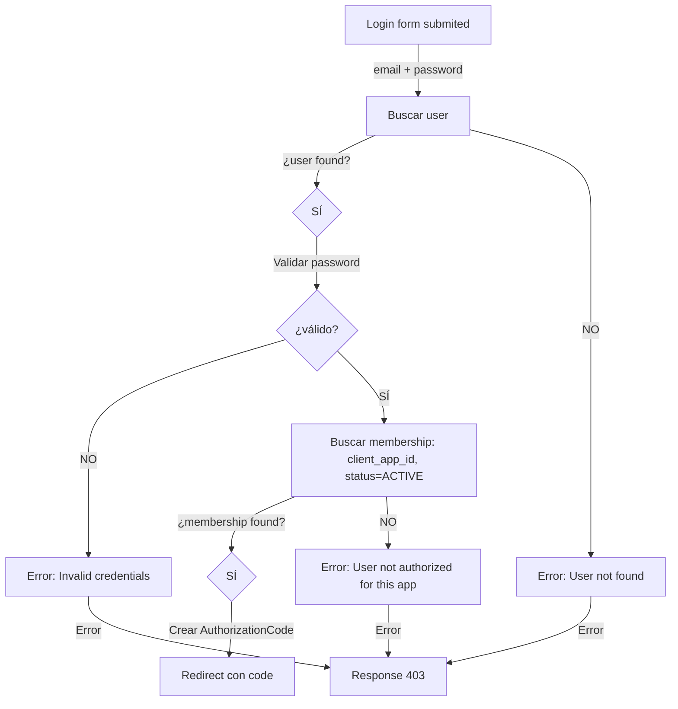
```mermaid
graph TD
    A["Login form submited"] -->|email + password| B["Buscar user"]
    B -->|¿user found?| C{SÍ}
    B -->|NO| D["Error: User not found"]
    C -->|Validar password| E{¿válido?}
    E -->|NO| F["Error: Invalid credentials"]
    E -->|SÍ| G["Buscar membership: client_app_id, status=ACTIVE"]
    G -->|¿membership found?| H{SÍ}
    G -->|NO| I["Error: User not authorized for this app"]
    H -->|Crear AuthorizationCode| J["Redirect con code"]
    I -->|Error| K["Response 403"]
    D -->|Error| K
    F -->|Error| K
```

---

## Flujos de token (refresh, revoke)

### Refresh Token Flow

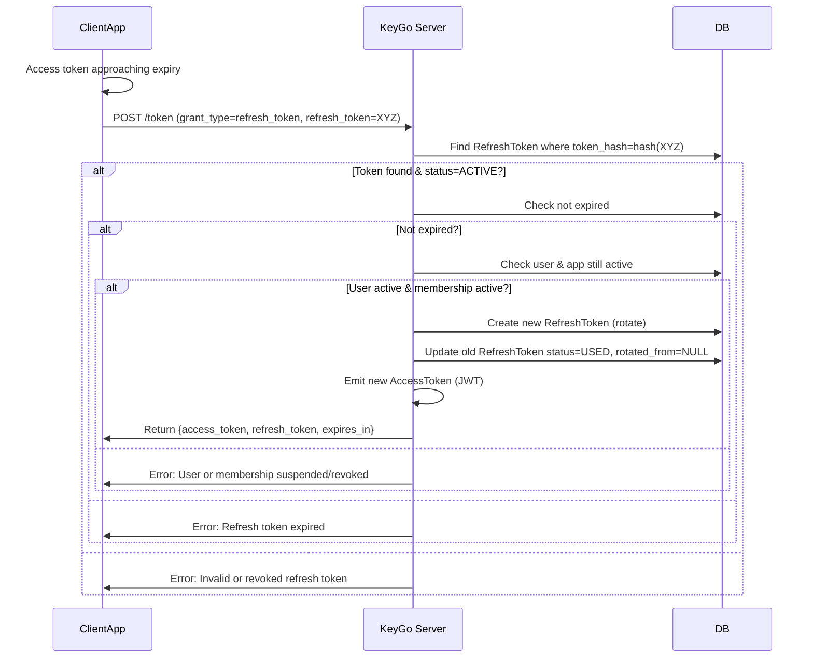
```mermaid
sequenceDiagram
    participant App as ClientApp
    participant KeyGo as KeyGo Server
    participant DB as DB

    App->>App: Access token approaching expiry
    App->>KeyGo: POST /token (grant_type=refresh_token, refresh_token=XYZ)

    KeyGo->>DB: Find RefreshToken where token_hash=hash(XYZ)
    alt Token found & status=ACTIVE?
        KeyGo->>DB: Check not expired
        alt Not expired?
            KeyGo->>DB: Check user & app still active
            alt User active & membership active?
                KeyGo->>DB: Create new RefreshToken (rotate)
                KeyGo->>DB: Update old RefreshToken status=USED, rotated_from=NULL
                KeyGo->>KeyGo: Emit new AccessToken (JWT)
                KeyGo->>App: Return {access_token, refresh_token, expires_in}
            else
                KeyGo->>App: Error: User or membership suspended/revoked
            end
        else
            KeyGo->>App: Error: Refresh token expired
        end
    else
        KeyGo->>App: Error: Invalid or revoked refresh token
    end
```

### Token Revocation

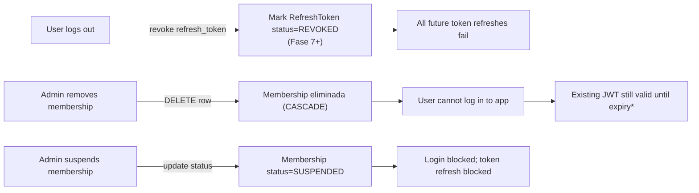
```mermaid
graph LR
    A["User logs out"] -->|revoke refresh_token| B["Mark RefreshToken status=REVOKED<br/>(Fase 7+)"]
    B --> C["All future token refreshes fail"]

    D["Admin removes membership"] -->|DELETE row| E["Membership eliminada (CASCADE)"]
    E --> F["User cannot log in to app"]
    F --> G["Existing JWT still valid until expiry*"]

    H["Admin suspends membership"] -->|update status| I["Membership status=SUSPENDED"]
    I --> J["Login blocked; token refresh blocked"]
```

**Nota:** Los access tokens (JWT firmados) no se revocan en DB; son válidos hasta su `exp`. Para revocación inmediata en Fase 9+, se implementará lista negra de `jti` con TTL en Redis (T-038).

---

## Flujo client_credentials (M2M — Fase 8)

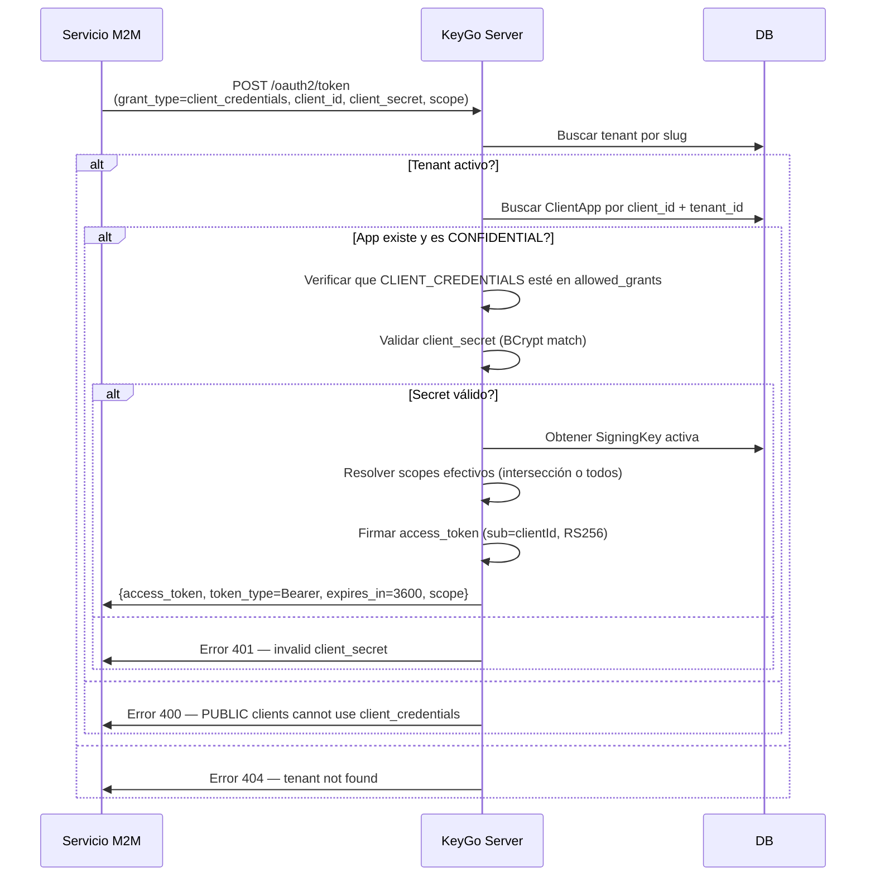
```mermaid
sequenceDiagram
    participant Service as Servicio M2M
    participant KeyGo as KeyGo Server
    participant DB as DB

    Service->>KeyGo: POST /oauth2/token<br/>(grant_type=client_credentials, client_id, client_secret, scope)
    KeyGo->>DB: Buscar tenant por slug
    alt Tenant activo?
        KeyGo->>DB: Buscar ClientApp por client_id + tenant_id
        alt App existe y es CONFIDENTIAL?
            KeyGo->>KeyGo: Verificar que CLIENT_CREDENTIALS esté en allowed_grants
            KeyGo->>KeyGo: Validar client_secret (BCrypt match)
            alt Secret válido?
                KeyGo->>DB: Obtener SigningKey activa
                KeyGo->>KeyGo: Resolver scopes efectivos (intersección o todos)
                KeyGo->>KeyGo: Firmar access_token (sub=clientId, RS256)
                KeyGo->>Service: {access_token, token_type=Bearer, expires_in=3600, scope}
            else
                KeyGo->>Service: Error 401 — invalid client_secret
            end
        else
            KeyGo->>Service: Error 400 — PUBLIC clients cannot use client_credentials
        end
    else
        KeyGo->>Service: Error 404 — tenant not found
    end
```

**Diferencias vs Authorization Code:**
- `sub` = `client_id` (no un `user_id`)
- Sin `id_token` (no hay usuario final)
- Sin `refresh_token` (el servicio puede solicitar uno nuevo directamente)
- Sin sesión ni membership — solo validación de app

---

## Ciclo de vida de memberships y roles

### Creación y transiciones de Membership

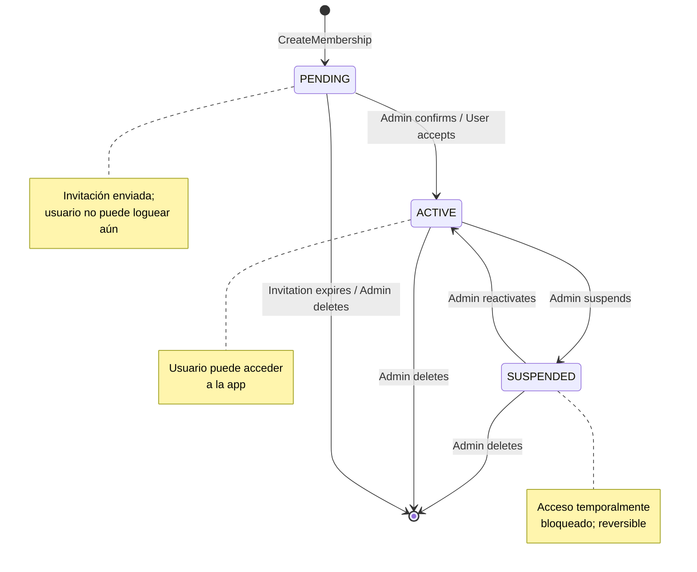
```mermaid
stateDiagram-v2
    [*] --> PENDING: CreateMembership
    PENDING --> ACTIVE: Admin confirms / User accepts
    ACTIVE --> SUSPENDED: Admin suspends
    SUSPENDED --> ACTIVE: Admin reactivates
    SUSPENDED --> [*]: Admin deletes
    ACTIVE --> [*]: Admin deletes
    PENDING --> [*]: Invitation expires / Admin deletes

    note right of PENDING
        Invitación enviada;
        usuario no puede loguear aún
    end note

    note right of ACTIVE
        Usuario puede acceder
        a la app
    end note

    note right of SUSPENDED
        Acceso temporalmente
        bloqueado; reversible
    end note
```

> ⚠️ Los estados válidos en DB son `ACTIVE`, `SUSPENDED`, `PENDING` (CHECK constraint en V7).  
> La eliminación física de la fila equivale a revocar el acceso permanentemente (CASCADE).  
> No existe estado `REVOKED` ni `INVITED` en la tabla `memberships` actual.

---

### Asignación de roles a un usuario en una app

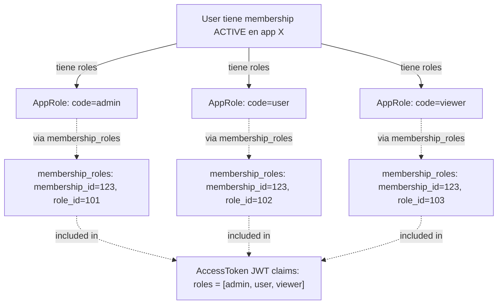
```mermaid
graph TD
    A["User tiene membership ACTIVE en app X"] -->|tiene roles| B["AppRole: code=admin"]
    A -->|tiene roles| C["AppRole: code=user"]
    A -->|tiene roles| D["AppRole: code=viewer"]

    E["membership_roles: membership_id=123, role_id=101"]
    F["membership_roles: membership_id=123, role_id=102"]
    G["membership_roles: membership_id=123, role_id=103"]

    B -.->|via membership_roles| E
    C -.->|via membership_roles| F
    D -.->|via membership_roles| G

    H["AccessToken JWT claims: roles = [admin, user, viewer]"]
    E -.->|included in| H
    F -.->|included in| H
    G -.->|included in| H
```

> ⚠️ `membership_roles` usa columna `role_id` (FK → `app_roles.id`), **no** `app_role_id`.

---

## Modelo de permisos y autorización

### Matriz de decisión para acceso a app

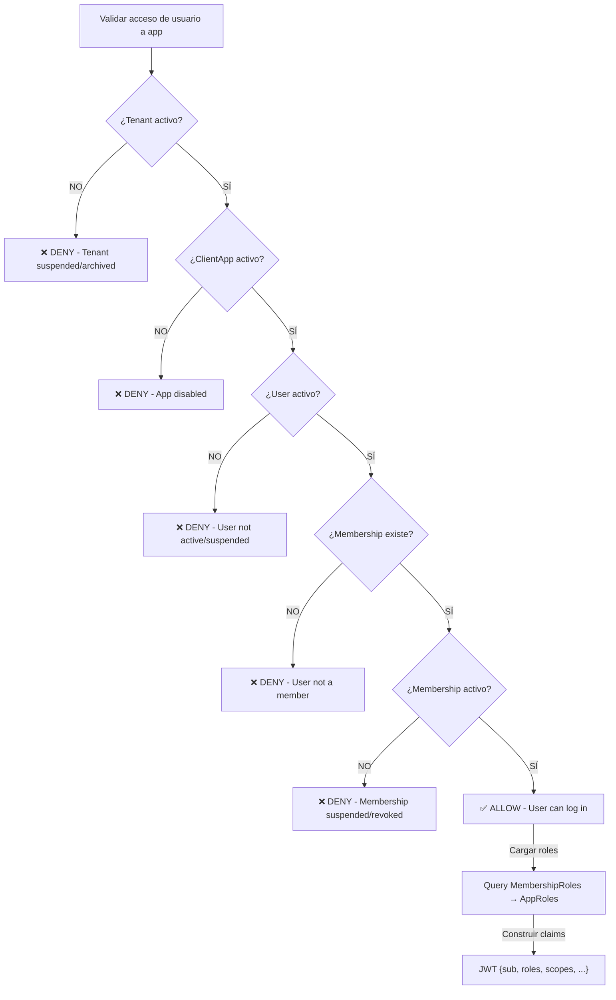
```mermaid
graph TD
    A["Validar acceso de usuario a app"] --> B{¿Tenant activo?}
    B -->|NO| C["❌ DENY - Tenant suspended/archived"]
    B -->|SÍ| D{¿ClientApp activo?}

    D -->|NO| E["❌ DENY - App disabled"]
    D -->|SÍ| F{¿User activo?}

    F -->|NO| G["❌ DENY - User not active/suspended"]
    F -->|SÍ| H{¿Membership existe?}

    H -->|NO| I["❌ DENY - User not a member"]
    H -->|SÍ| J{¿Membership activo?}

    J -->|NO| K["❌ DENY - Membership suspended/revoked"]
    J -->|SÍ| L["✅ ALLOW - User can log in"]

    L -->|Cargar roles| M["Query MembershipRoles → AppRoles"]
    M -->|Construir claims| N["JWT {sub, roles, scopes, ...}"]
```

---

### Flujo de validación en endpoint protegido

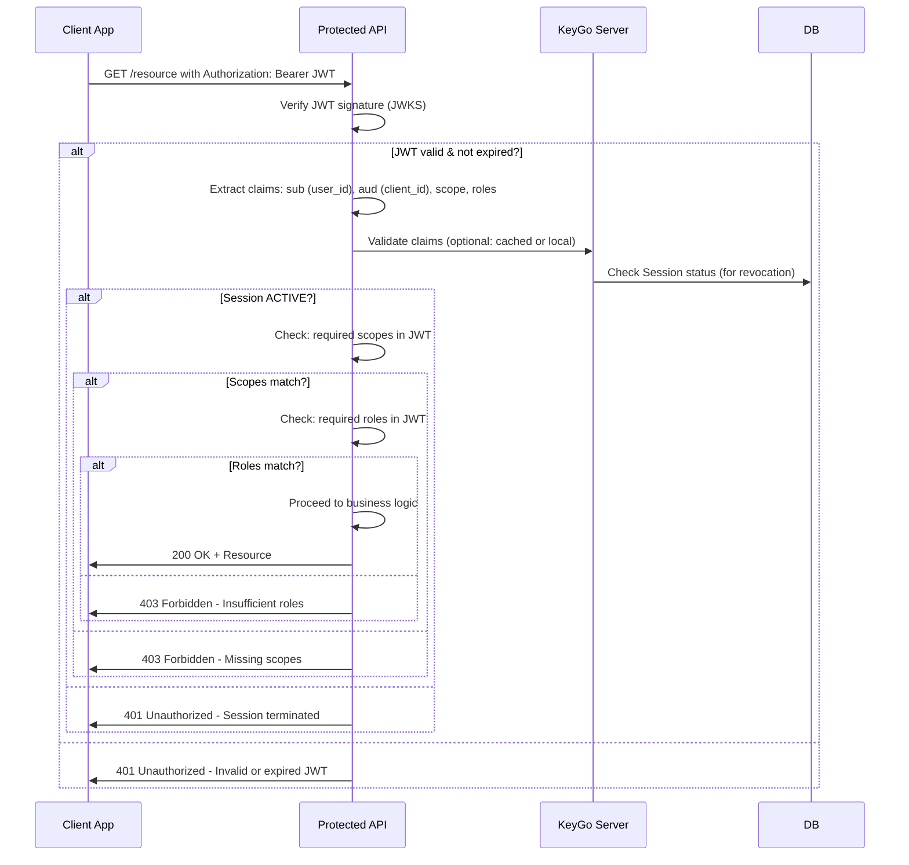
```mermaid
sequenceDiagram
    participant Client as Client App
    participant API as Protected API
    participant KeyGo as KeyGo Server
    participant DB as DB

    Client->>API: GET /resource with Authorization: Bearer JWT

    API->>API: Verify JWT signature (JWKS)
    alt JWT valid & not expired?
        API->>API: Extract claims: sub (user_id), aud (client_id), scope, roles
        API->>KeyGo: Validate claims (optional: cached or local)
        KeyGo->>DB: Check Session status (for revocation)
        alt Session ACTIVE?
            API->>API: Check: required scopes in JWT
            alt Scopes match?
                API->>API: Check: required roles in JWT
                alt Roles match?
                    API->>API: Proceed to business logic
                    API->>Client: 200 OK + Resource
                else
                    API->>Client: 403 Forbidden - Insufficient roles
                end
            else
                API->>Client: 403 Forbidden - Missing scopes
            end
        else
            API->>Client: 401 Unauthorized - Session terminated
        end
    else
        API->>Client: 401 Unauthorized - Invalid or expired JWT
    end
```

---

### Tabla de decisión: Transiciones permitidas de Membership Status

> Estados válidos en DB (V7 CHECK constraint): `ACTIVE`, `SUSPENDED`, `PENDING`.

| Estado actual | Acción admin | Nuevo estado | Reversible? |
|---|---|---|---|
| `PENDING` | Confirmar acceso | `ACTIVE` | Sí (puede regresar a `SUSPENDED`) |
| `PENDING` | Eliminar | *(borrado)* | ❌ No |
| `ACTIVE` | Suspender | `SUSPENDED` | Sí (reactivar a `ACTIVE`) |
| `ACTIVE` | Eliminar | *(borrado)* | ❌ No |
| `SUSPENDED` | Reactivar | `ACTIVE` | Sí |
| `SUSPENDED` | Eliminar | *(borrado)* | ❌ No |

> La "revocación permanente" se implementa eliminando la fila; la cascade en DB limpia `membership_roles`.

---

## Diagrama de capas lógicas de validación

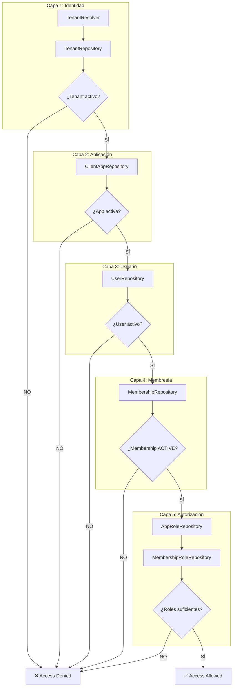
```mermaid
graph TB
    subgraph "Capa 1: Identidad"
        A["TenantResolver"]
        B["TenantRepository"]
        C{¿Tenant activo?}
    end

    subgraph "Capa 2: Aplicación"
        D["ClientAppRepository"]
        E{¿App activa?}
    end

    subgraph "Capa 3: Usuario"
        F["UserRepository"]
        G{¿User activo?}
    end

    subgraph "Capa 4: Membresía"
        H["MembershipRepository"]
        I{¿Membership ACTIVE?}
    end

    subgraph "Capa 5: Autorización"
        J["AppRoleRepository"]
        K["MembershipRoleRepository"]
        L{¿Roles suficientes?}
    end

    A --> B --> C -->|SÍ| D --> E -->|SÍ| F --> G -->|SÍ| H --> I -->|SÍ| J --> K --> L
    C -->|NO| M["❌ Access Denied"]
    E -->|NO| M
    G -->|NO| M
    I -->|NO| M
    L -->|NO| M
    L -->|SÍ| N["✅ Access Allowed"]
```

---

## Índices recomendados (por rendimiento)

> Los índices marcados con ✅ ya existen en las migraciones Flyway. Los marcados con 💡 son sugeridos adicionales.

```sql
-- ✅ Ya aplicados por migraciones (V3-V9 identidad; V10-V14 billing)
CREATE INDEX idx_tenants_slug ON tenants(slug);                                 -- V3
CREATE INDEX idx_tenants_status ON tenants(status);                             -- V3
CREATE INDEX idx_client_apps_tenant_id ON client_apps(tenant_id);               -- V4
CREATE INDEX idx_client_apps_client_id ON client_apps(client_id);               -- V4
CREATE INDEX idx_client_apps_status ON client_apps(status);                     -- V4
CREATE INDEX idx_tenant_users_tenant_id ON tenant_users(tenant_id);             -- V5
CREATE INDEX idx_tenant_users_email ON tenant_users(email);                     -- V5
CREATE INDEX idx_tenant_users_username ON tenant_users(username);               -- V5
CREATE INDEX idx_tenant_users_status ON tenant_users(status);                   -- V5
CREATE INDEX idx_app_roles_client_app_id ON app_roles(client_app_id);           -- V6
CREATE INDEX idx_app_roles_code ON app_roles(code);                             -- V6
CREATE INDEX idx_memberships_user_id ON memberships(user_id);                   -- V6
CREATE INDEX idx_memberships_client_app_id ON memberships(client_app_id);       -- V6
CREATE INDEX idx_memberships_status ON memberships(status);                     -- V6
CREATE INDEX idx_authorization_codes_code ON authorization_codes(code);                   -- V7
CREATE INDEX idx_authorization_codes_tenant_id ON authorization_codes(tenant_id);         -- V7
CREATE INDEX idx_authorization_codes_client_app_id ON authorization_codes(client_app_id); -- V7
CREATE INDEX idx_authorization_codes_user_id ON authorization_codes(user_id);             -- V7
CREATE INDEX idx_authorization_codes_status ON authorization_codes(status);               -- V7
CREATE INDEX idx_authorization_codes_expires_at ON authorization_codes(expires_at);       -- V7
CREATE INDEX idx_signing_keys_status ON signing_keys(status);                   -- V7
CREATE INDEX idx_sessions_user_tenant ON sessions(user_id, tenant_id);          -- V8
CREATE INDEX idx_sessions_status ON sessions(status);                           -- V8
CREATE INDEX idx_refresh_tokens_hash ON refresh_tokens(token_hash);             -- V8
CREATE INDEX idx_refresh_tokens_session ON refresh_tokens(session_id);          -- V8
CREATE INDEX idx_refresh_tokens_user_tenant ON refresh_tokens(user_id, tenant_id); -- V8
CREATE INDEX idx_refresh_tokens_status ON refresh_tokens(status);               -- V8

-- V9
CREATE INDEX idx_email_verifications_tenant_user_id ON email_verifications(tenant_user_id); -- V9
CREATE INDEX idx_email_verifications_code ON email_verifications(code);                      -- V9

-- 💡 Índices adicionales sugeridos para optimización
CREATE INDEX idx_client_apps_tenant_status ON client_apps(tenant_id, status);
CREATE INDEX idx_tenant_users_tenant_email ON tenant_users(tenant_id, email);
CREATE INDEX idx_tenant_users_tenant_username ON tenant_users(tenant_id, username);
CREATE INDEX idx_memberships_user_app ON memberships(user_id, client_app_id, status);
CREATE INDEX idx_authorization_codes_expires_status ON authorization_codes(expires_at, status);
```

### Contexto 6: Sesiones y Refresh Tokens (V8)

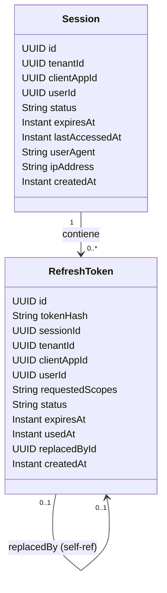
```mermaid
classDiagram
    class Session {
        UUID id
        UUID tenantId
        UUID clientAppId
        UUID userId
        String status
        Instant expiresAt
        Instant lastAccessedAt
        String userAgent
        String ipAddress
        Instant createdAt
    }
    class RefreshToken {
        UUID id
        String tokenHash
        UUID sessionId
        UUID tenantId
        UUID clientAppId
        UUID userId
        String requestedScopes
        String status
        Instant expiresAt
        Instant usedAt
        UUID replacedById
        Instant createdAt
    }
    Session "1" --> "0..*" RefreshToken : contiene
    RefreshToken "0..1" --> "0..1" RefreshToken : replacedBy (self-ref)
```

**Estados de Session:** `ACTIVE` → `TERMINATED` | `EXPIRED`  
**Estados de RefreshToken:** `ACTIVE` → `USED` (al rotar) | `REVOKED` (RFC 7009) | `EXPIRED`

---

### Contexto 7: Verificación de Email (V9)

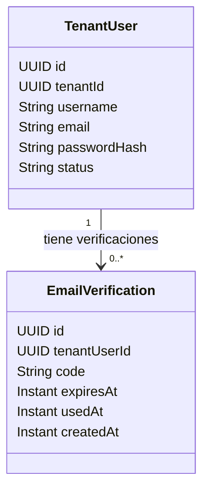
```mermaid
classDiagram
    class TenantUser {
        UUID id
        UUID tenantId
        String username
        String email
        String passwordHash
        String status
    }
    class EmailVerification {
        UUID id
        UUID tenantUserId
        String code
        Instant expiresAt
        Instant usedAt
        Instant createdAt
    }
    TenantUser "1" --> "0..*" EmailVerification : tiene verificaciones
```

**Relación clave:** Un `TenantUser` puede tener múltiples filas en `email_verifications` (una por cada código emitido). La fila con el mayor `created_at` es el código activo.

**Estados derivados de `EmailVerification`:**

| Condición | Estado efectivo |
|---|---|
| `expires_at > NOW()` AND `used_at IS NULL` | Activo — aún puede usarse para verificar |
| `expires_at <= NOW()` AND `used_at IS NULL` | Expirado — solicitar nuevo código |
| `used_at IS NOT NULL` | Utilizado — verificación completada |

**Flujo de transición de `TenantUser.status`:**

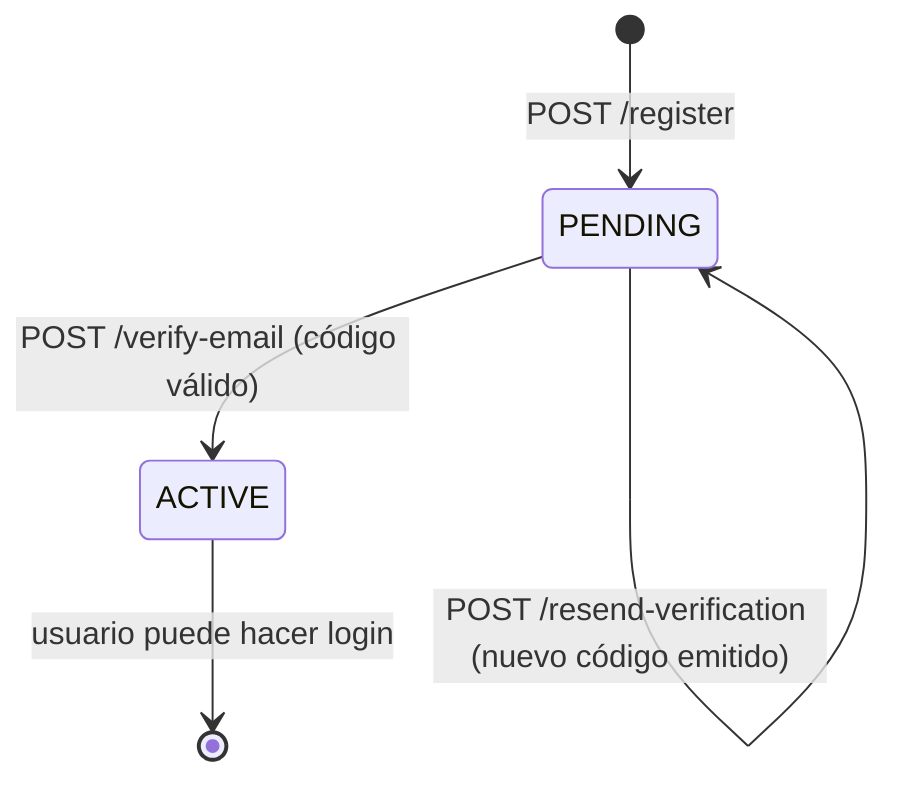
```mermaid
stateDiagram-v2
    [*] --> PENDING : POST /register
    PENDING --> ACTIVE : POST /verify-email (código válido)
    PENDING --> PENDING : POST /resend-verification (nuevo código emitido)
    ACTIVE --> [*] : usuario puede hacer login
```

**Índices:** `idx_email_verifications_tenant_user_id` (para buscar por usuario), `idx_email_verifications_code` (para buscar por código).

---

### Contexto 8: Seed base para UI (V15)

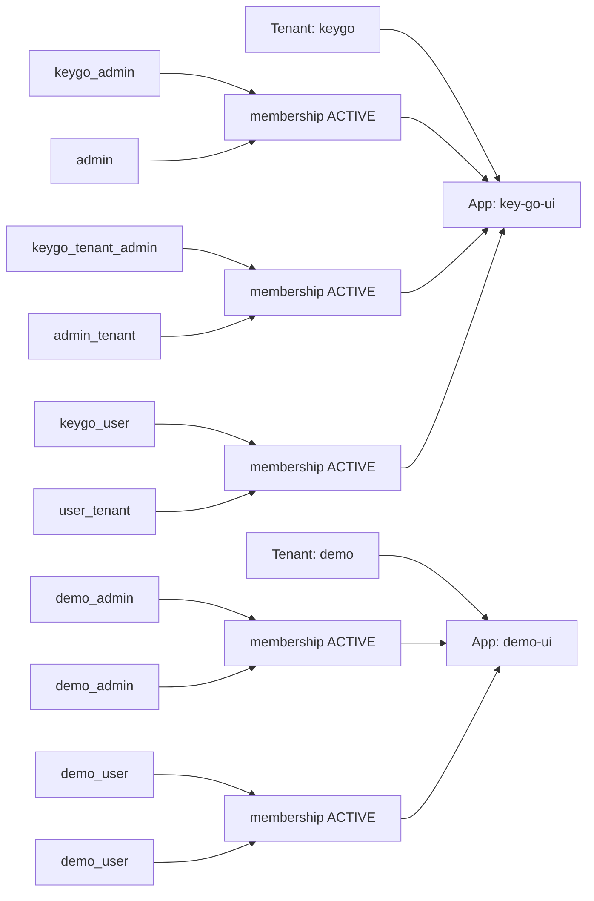
```mermaid
flowchart LR
    T1["Tenant: keygo"] --> A1["App: key-go-ui"]
    T2["Tenant: demo"] --> A2["App: demo-ui"]

    U1["keygo_admin"] --> M1["membership ACTIVE"] --> A1
    U2["keygo_tenant_admin"] --> M2["membership ACTIVE"] --> A1
    U3["keygo_user"] --> M3["membership ACTIVE"] --> A1

    U4["demo_admin"] --> M4["membership ACTIVE"] --> A2
    U5["demo_user"] --> M5["membership ACTIVE"] --> A2

    R1["admin"] --> M1
    R2["admin_tenant"] --> M2
    R3["user_tenant"] --> M3

    R4["demo_admin"] --> M4
    R5["demo_user"] --> M5
```

**Objetivo operativo:** permitir pruebas tempranas de UI con dos tenants y jerarquías de rol independientes por app.

**Aclaración:** V15 es migración de seed, no de schema. No agrega nuevas entidades; solo registra datos iniciales idempotentes en tablas existentes.

---

### Contexto 9: Billing — Catálogo de planes (V10)

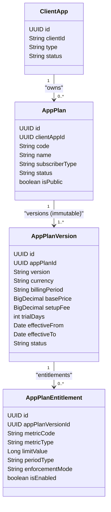
```mermaid
classDiagram
    class ClientApp {
        UUID id
        String clientId
        String type
        String status
    }

    class AppPlan {
        UUID id
        UUID clientAppId
        String code
        String name
        String subscriberType
        String status
        boolean isPublic
    }

    class AppPlanVersion {
        UUID id
        UUID appPlanId
        String version
        String currency
        String billingPeriod
        BigDecimal basePrice
        BigDecimal setupFee
        int trialDays
        Date effectiveFrom
        Date effectiveTo
        String status
    }

    class AppPlanEntitlement {
        UUID id
        UUID appPlanVersionId
        String metricCode
        String metricType
        Long limitValue
        String periodType
        String enforcementMode
        boolean isEnabled
    }

    ClientApp "1" --> "0..*" AppPlan : "owns"
    AppPlan "1" --> "1..*" AppPlanVersion : "versions (immutable)"
    AppPlanVersion "1" --> "0..*" AppPlanEntitlement : "entitlements"
```

**Reglas:**
- `AppPlan.subscriberType` (`TENANT` / `TENANT_USER`) se conserva en el modelo v2 **solo para validar compatibilidad** entre el plan seleccionado y el perfil del contratante. Ya **no determina** qué entidades se crean al activar un contrato (eso lo gestiona `Contractor`).
- Las versiones son inmutables: cambiar el precio requiere crear una nueva versión.
- `ON DELETE RESTRICT` en `AppPlanVersion → AppPlan` impide borrar un plan con versiones.
- `ON DELETE CASCADE` en `AppPlanEntitlement → AppPlanVersion` elimina entitlements al eliminar la versión.

---

### Contexto 10: Billing — Contratos y suscripciones (v2)

> ⚡ **Modelo v2 (2026-03-30):** El suscriptor ya no es un `Tenant` o `TenantUser` creado al activar.
> Es siempre un `Contractor` con cuenta en el tenant del proveedor. Los tenants se crean manualmente
> después, dentro del límite `MAX_TENANTS` del plan activo.

```mermaid
classDiagram
    class Contractor {
        UUID id
        UUID tenantUserId
        String status
        OffsetDateTime createdAt
    }

    class AppContract {
        UUID id
        UUID clientAppId
        UUID contractorId
        UUID selectedPlanVersionId
        String billingPeriod
        String status
        String contractorEmail
        String contractorFirstName
        String contractorLastName
        String companyName
        String companyTaxId
        String companyAddress
        boolean emailVerified
        boolean paymentVerified
        OffsetDateTime expiresAt
    }

    class AppSubscription {
        UUID id
        UUID clientAppId
        UUID appPlanVersionId
        UUID contractId
        UUID contractorId
        String status
        OffsetDateTime currentPeriodStart
        OffsetDateTime currentPeriodEnd
        boolean cancelAtPeriodEnd
        boolean autoRenew
    }

    class PaymentTransaction {
        UUID id
        UUID contractId
        UUID subscriptionId
        String provider
        BigDecimal amount
        String status
        OffsetDateTime paidAt
    }

    class TenantUser {
        UUID id
        UUID tenantId
        String email
        String status
    }

    class Tenant {
        UUID id
        UUID contractorId
        String slug
        String status
    }

    Contractor "1" --> "1" TenantUser : "cuenta en tenant proveedor (1:1 UNIQUE)"
    Contractor "1" --> "0..*" AppContract : "historial (solo 1 ACTIVE)"
    Contractor "1" --> "0..*" AppSubscription : "suscripto a"
    Contractor "1" --> "0..*" Tenant : "crea (dentro del límite MAX_TENANTS)"
    AppContract "1" --> "0..1" AppSubscription : "origina (al activar)"
    AppSubscription "1" --> "0..*" PaymentTransaction : "tiene transacciones"
    AppContract "1" --> "0..*" PaymentTransaction : "genera"
```

> **Columnas eliminadas respecto al modelo v1:**  
> `AppContract`: ~~`subscriberType`~~ ~~`companySlug`~~ ~~`subscriberTenantId`~~ ~~`subscriberTenantUserId`~~  
> `AppSubscription`: ~~`subscriberTenantId`~~ ~~`subscriberTenantUserId`~~

**Estados del contrato (modelo v2):**
```mermaid
stateDiagram-v2
    [*] --> PENDING_EMAIL_VERIFICATION : POST /billing/contracts

    PENDING_EMAIL_VERIFICATION --> PENDING_PAYMENT : email verificado\n(crea TenantUser + Contractor si es nuevo)
    PENDING_EMAIL_VERIFICATION --> EXPIRED : TTL superado
    PENDING_EMAIL_VERIFICATION --> CANCELLED : cancelación manual

    PENDING_PAYMENT --> READY_TO_ACTIVATE : pago aprobado
    PENDING_PAYMENT --> EXPIRED : TTL superado
    PENDING_PAYMENT --> CANCELLED : cancelación manual

    READY_TO_ACTIVATE --> ACTIVE : POST /activate → crea suscripción + factura
    READY_TO_ACTIVATE --> FAILED : error en activación

    ACTIVE --> SUPERSEDED : upgrade/downgrade (nuevo contrato activado)
    ACTIVE --> FINALIZED : período terminó sin renovación
    ACTIVE --> CANCELLED : cancelación manual

    ACTIVE --> [*]
    SUPERSEDED --> [*]
    FINALIZED --> [*]
    EXPIRED --> [*]
    CANCELLED --> [*]
    FAILED --> [*]
```

> **Invariante DB:** `UNIQUE(contractor_id) WHERE status = 'ACTIVE'` en `app_contracts` garantiza que solo puede haber un contrato `ACTIVE` por contratante en cualquier momento.

**Estados de la suscripción:**
```mermaid
stateDiagram-v2
    [*] --> PENDING : creación
    PENDING --> ACTIVE : activación exitosa
    ACTIVE --> PAST_DUE : pago fallido en renovación
    ACTIVE --> CANCELLED : cancel_at_period_end=true al fin del período
    ACTIVE --> EXPIRED : período finalizado sin renovación
    PAST_DUE --> ACTIVE : pago recuperado
    PAST_DUE --> SUSPENDED : umbral de días sin pago
    SUSPENDED --> CANCELLED : sin resolución
    CANCELLED --> [*]
    EXPIRED --> [*]
```

---

### Contexto 11: Billing — Facturas y uso (V13)

```mermaid
classDiagram
    class AppSubscription {
        UUID id
        String status
        OffsetDateTime currentPeriodStart
        OffsetDateTime currentPeriodEnd
    }

    class Invoice {
        UUID id
        UUID subscriptionId
        String invoiceNumber
        String status
        Date issueDate
        Date dueDate
        BigDecimal subtotal
        BigDecimal taxAmount
        BigDecimal total
        String planVersionSnapshot
        String billingNameSnapshot
    }

    class UsageCounter {
        UUID id
        UUID clientAppId
        UUID contractorId
        String metricCode
        OffsetDateTime periodStart
        OffsetDateTime periodEnd
        Long usedValue
    }

    class ClientApp {
        UUID id
        String clientId
    }

    AppSubscription "1" --> "0..*" Invoice : "genera por período"
    ClientApp "1" --> "0..*" UsageCounter : "acumula uso"
```

**Reglas de negocio:**
- Una `Invoice` es un snapshot inmutable: los campos `*_snapshot` no se modifican retroactivamente.
- El `invoice_number` es único globalmente (formato `INV-XXXXXXXX`).
- Los `UsageCounter` se incrementan atómicamente con `UPDATE ... SET used_value = used_value + delta`.
- `UsageCounter.contractor_id` identifica unívocamente al suscriptor (modelo v2); no hay columnas polimórficas.
- La métrica `MAX_TENANTS` no usa `UsageCounter`; se evalúa directamente con `COUNT(*) FROM tenants WHERE contractor_id = :id AND status != 'DELETED'`.

---

## Contexto 9b: Modelo de Contratación — Billing v2

> Introducido en el modelo v2 (2026-03-30). El `Contractor` es la entidad central de billing.
> Todo suscriptor de planes es un `Contractor` con cuenta en el tenant del proveedor.

```mermaid
classDiagram
    class TenantUser {
        UUID id
        UUID tenantId
        String email
        String username
        UserStatus status
    }

    class Contractor {
        UUID id
        UUID tenantUserId
        ContractorStatus status
    }

    class AppContract {
        UUID id
        UUID contractorId
        UUID clientAppId
        UUID selectedPlanVersionId
        String billingPeriod
        ContractStatus status
        String contractorEmail
        String contractorFirstName
        String contractorLastName
        String companyName
        String companyTaxId
        String companyAddress
        String verificationCode
        OffsetDateTime emailVerifiedAt
        OffsetDateTime paymentVerifiedAt
        OffsetDateTime expiresAt
    }

    class AppSubscription {
        UUID id
        UUID contractorId
        UUID clientAppId
        UUID appPlanVersionId
        UUID contractId
        SubscriptionStatus status
        OffsetDateTime currentPeriodStart
        OffsetDateTime currentPeriodEnd
        Boolean cancelAtPeriodEnd
    }

    class Tenant {
        UUID id
        String slug
        UUID contractorId
        TenantStatus status
    }

    class AppPlanVersion {
        UUID id
        UUID appPlanId
        String version
        BigDecimal basePrice
        String billingPeriod
    }

    TenantUser "1" --> "1" Contractor : "representa (UNIQUE)"
    Contractor "1" --> "0..*" AppContract : "historial de contratos\n(solo 1 ACTIVE)"
    Contractor "1" --> "0..*" Tenant : "crea (dentro del límite MAX_TENANTS)"
    Contractor "1" --> "0..*" AppSubscription : "suscripto a"
    AppContract "1" --> "1" AppPlanVersion : "selecciona"
    AppSubscription "1" --> "1" AppPlanVersion : "usa versión"
    AppSubscription "1" --> "0..1" AppContract : "originada en"
```

### Flujo de creación del Contractor

```mermaid
sequenceDiagram
    participant K as KeyGo Server
    participant DB as Base de datos

    Note over K,DB: POST /billing/contracts → Estado inicial
    K->>DB: INSERT app_contracts (contractor_id=NULL, status=PENDING_EMAIL_VERIFICATION)

    Note over K,DB: POST /billing/contracts/{id}/verify-email
    K->>DB: Si contratante NUEVO: INSERT tenant_users (en tenant proveedor, status=PENDING)
    K->>DB: Si contratante NUEVO: INSERT contractors (tenant_user_id, status=PENDING)
    K->>DB: UPDATE app_contracts SET contractor_id=:id, status=PENDING_PAYMENT

    Note over K,DB: POST /billing/contracts/{id}/activate
    K->>DB: UPDATE tenant_users SET status=ACTIVE
    K->>DB: UPDATE contractors SET status=ACTIVE
    K->>DB: INSERT app_subscriptions (contractor_id, status=ACTIVE)
    K->>DB: INSERT invoices (subscription_id, ...)
    K->>DB: UPDATE app_contracts SET status=ACTIVE

    Note over K,DB: Upgrade de plan (later)
    K->>DB: UPDATE app_contracts SET status=SUPERSEDED WHERE status=ACTIVE AND contractor_id=:id
    K->>DB: UPDATE app_subscriptions SET cancel_at_period_end=true WHERE contractor_id=:id
    K->>DB: INSERT app_subscriptions (contractor_id, new plan, status=ACTIVE)
    K->>DB: UPDATE new_contract SET status=ACTIVE
```

### Relación Contractor ↔ Tenant (creación post-contratación)

```mermaid
graph TD
    C["Contractor\n(tenant_user en proveedor keygo)"]
    AC["AppContract ACTIVE\n(plan: TEAM, MAX_TENANTS=5)"]
    T1["Tenant A\ncontractor_id=C"]
    T2["Tenant B\ncontractor_id=C"]
    T3["Tenant C\ncontractor_id=C"]

    C -->|"contrato vigente"| AC
    C -->|"crea (1/5)"| T1
    C -->|"crea (2/5)"| T2
    C -->|"crea (3/5)"| T3

    style AC fill:#d4edda,stroke:#28a745
```

**Invariante de límite:**
```sql
-- Verificar antes de permitir crear un nuevo tenant
SELECT COUNT(*) FROM tenants
WHERE contractor_id = :contractorId
  AND status != 'DELETED'
-- Si resultado >= entitlement.limit_value (MAX_TENANTS) → rechazar
```

---

**Última actualización:** 2026-03-30 | **Responsable:** AI Agent | **Estado:** ✅ Sincronizado con migraciones V1–V17 + diseño de datos v2


