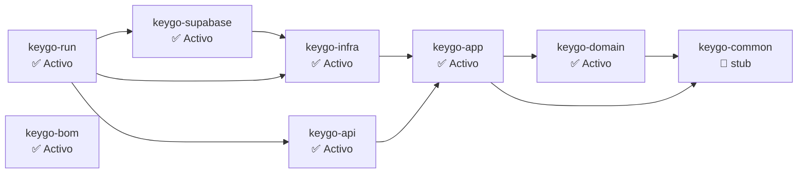
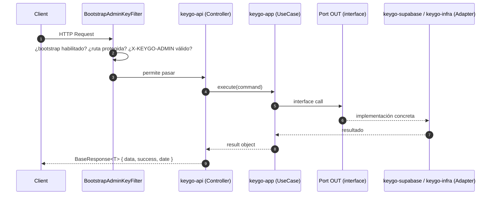
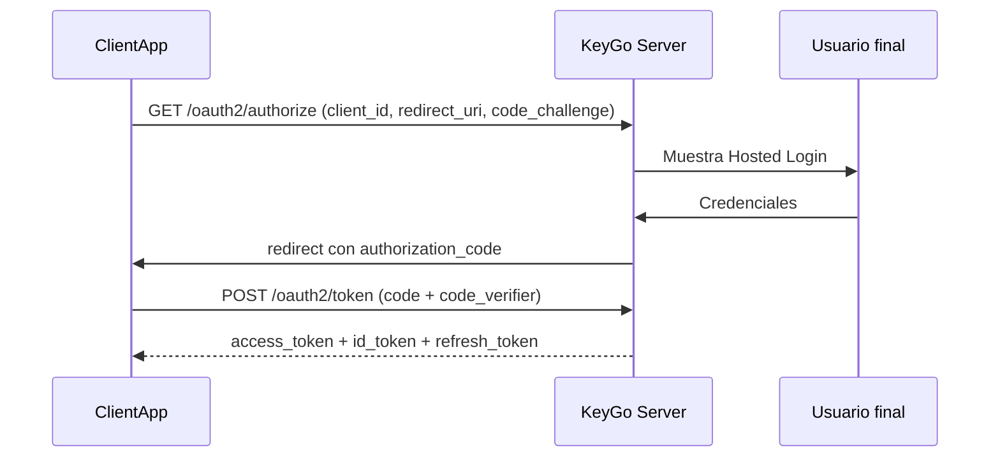
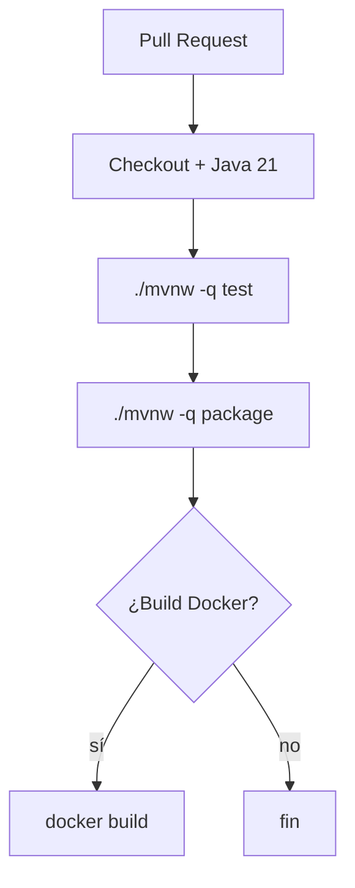

# Arquitectura de KeyGo Server

> **Documento canónico de arquitectura.** Fusiona `ARCHITECTURE.md` (raíz) y `docs/arch/keygo_server_architecture.md`.  
> **Última actualización:** 2026-03-22

---

## 1. Objetivo

**KeyGo Server** es el núcleo backend de un SaaS de autenticación e identidad (IAM) para pymes y aplicaciones de terceros. Opera como **Authorization Server OAuth 2.0 / OpenID Connect (OIDC)** con Hosted Login.

Su propósito es:
- autenticar usuarios finales,
- autenticar aplicaciones cliente (ClientApp),
- emitir y validar tokens (JWT asimétrico),
- centralizar identidad por tenant,
- y administrar acceso por aplicación.

---

## 2. Alcance MVP

### Incluye

- Authorization Code + PKCE
- Client Credentials
- Refresh Tokens con rotación
- JWT asimétrico (RS256) + JWKS
- Tenant Console
- Hosted Login
- Self-service básico de usuario
- Control plane lógico para operación de plataforma

### No incluye inicialmente

- MFA, SAML, SCIM
- ABAC / policy engine avanzado
- Billing completo
- Workflows complejos de aprobación

---

## 3. Principios de diseño

| Principio | Descripción |
|---|---|
| **SaaS real** | Consumible por apps externas como servicio de identidad central |
| **Multi-tenant desde MVP** | No es una mejora futura — es parte del corazón del diseño |
| **Estándares primero** | OAuth2/OIDC como base de interoperabilidad |
| **Identidades separadas** | `User` y `ClientApp` no se modelan como la misma entidad con un flag |
| **Clean Architecture** | El dominio no depende de Spring, JPA ni detalles de infraestructura |
| **Modular Monolith primero** | Backend único, modular internamente; extracción de componentes si el crecimiento lo justifica |

---

## 4. Resumen técnico

- Build: Maven multi-módulo (monorepo).
- Runtime: Spring Boot 4.x (arranque en `keygo-run`).
- Arquitectura lógica: **Hexagonal / Ports & Adapters**.
- Persistencia: `keygo-supabase` con Spring Data JPA + Flyway + PostgreSQL (perfil `supabase`).
- `context-path`: `/keygo-server` (todos los endpoints lo incluyen).

---

## 5. Módulos y dependencias

### Mapa de módulos



### Responsabilidades por módulo

| Módulo | Rol | Estado |
|---|---|---|
| **keygo-domain** | Dominio puro. Sin Spring. Entidades: `AuthorizationCode`, `Tenant`, `ClientApp`, `Auth`, `SigningKey`. | ✅ Activo |
| **keygo-app** | Usecases + puertos (interfaces OUT). | ✅ Activo |
| **keygo-infra** | JWT signer (RSA/Nimbus), JWKS builder, `PkceVerifier`. | ✅ Activo |
| **keygo-api** | REST controllers + DTOs + error handlers. | ✅ Activo |
| **keygo-supabase** | JPA/Flyway + entidades JPA + repos de Supabase. Migraciones V1–V10. | ✅ Activo |
| **keygo-run** | Main + wiring + `application.yml`. | ✅ Activo |
| **keygo-bom** | Gestión de versiones de dependencias. | ✅ Activo |
| **keygo-common** | Utilidades compartidas (stub vacío). | 🚧 Stub |

### Regla de dependencias

```
domain  ←  app  ←  infra
                ←  api
                ←  supabase
                       ↑
                      run (cablea todo)
```

> **Regla de oro:** `keygo-domain` **nunca** puede depender de Spring ni de ningún otro módulo del proyecto.

---

## 6. Modelo conceptual

| Concepto | Descripción |
|---|---|
| **Tenant** | Empresa cliente que usa KeyGo. Tiene `slug` único. |
| **ClientApp** | Aplicación registrada dentro de un tenant (web, SPA, mobile o backend). |
| **User** | Identidad única del usuario dentro del tenant. |
| **Membership** | Relación entre un usuario y una app específica del tenant. |
| **AppRole / MembershipRole** | Roles que el usuario tiene dentro de una app concreta. |
| **AuthorizationCode** | Artefacto temporal con PKCE y expiración corta. |
| **RefreshToken** | Persistido con hash, con rotación obligatoria y revocable. |
| **SigningKey** | Clave RSA activa + historial; soporte a JWKS y rotación. |

### Regla central del sistema

> Un usuario existe **una sola vez por tenant**.  
> Si accede a varias apps del mismo tenant, no se duplican credenciales — solo se crea una **membership** por app.

---

## 7. Estrategia multi-tenant

**Estrategia:** Single database + shared schema + `tenant_id` en todas las tablas relevantes.

| Beneficio | Detalle |
|---|---|
| Menor complejidad operativa | Un solo esquema de migraciones Flyway |
| Mayor velocidad a mercado | Sin overhead de provisioning por tenant |
| Menor costo de infraestructura | — |

**Resolución de tenant:** por **slug** en URL path (`/api/v1/tenants/{slug}/...`).

> Evolución futura opcional: RLS en PostgreSQL, schema por tenant, o database por tenant para enterprise.

---

## 8. Flujo HTTP típico



> ✅ **T-001 resuelto (2026-03-21):** `BootstrapAdminKeyFilter` usa `request.getServletPath()`
> (sin context-path) para el matching de prefijos. Ver [`docs/api/BOOTSTRAP_FILTER.md`](../api/BOOTSTRAP_FILTER.md).

---

## 9. Flujos de autenticación

### 9.1. Authorization Code + PKCE (usuario final)



### 9.2. Client Credentials (machine-to-machine)

Integraciones backend-backend, jobs programados o automatizaciones sin usuario final.

### 9.3. Refresh Token

Sesiones largas, renovación de access token, revocación y rotación de refresh token.

---

## 10. Claims del access_token JWT

| Claim | Valor |
|---|---|
| `iss` | Issuer (URL del servidor) |
| `sub` | `user_id` |
| `tid` | `tenant_id` |
| `cid` | `client_id` |
| `roles` | Roles del usuario en la app |
| `scp` | Scopes autorizados |

> La app consumidora puede resolver autorización local sin consultar a KeyGo en cada request.

---

## 11. Convención de respuestas API

Todas las respuestas REST usan `BaseResponse<T>` como envelope:

```java
// Respuesta exitosa
BaseResponse.<MyData>builder()
    .data(data)
    .success(ResponseHelper.message(ResponseCode.RESOURCE_RETRIEVED))
    .build();

// Respuesta de error — vía GlobalExceptionHandler
BaseResponse.<Void>builder()
    .failure(ResponseHelper.message(ResponseCode.AUTHENTICATION_REQUIRED))
    .build();
```

| Campo | Descripción |
|---|---|
| `date` | Timestamp automático |
| `success` / `failure` | `MessageResponse` con código y mensaje |
| `data` | Payload tipado `<T>` |

Los `ResponseCode` son independientes del HTTP status code.

---

## 12. Configuración y perfiles

### keygo-run: `application.yml`

- `server.servlet.context-path` → `/${keygo.info.name}` (típicamente `/keygo-server`)
- `spring.profiles.active` → desde `SPRING_PROFILES_ACTIVE`
- `keygo.bootstrap.*` → `admin-key` y prefijos para rutas protegidas
- Maven resource filtering con `@project.*@` para interpolar versión/nombre

### keygo-supabase: perfil `supabase`

`application-supabase.yml` contiene:
- `spring.datasource.*` (PostgreSQL)
- `spring.jpa.ddl-auto: validate`
- `spring.flyway.*` (migraciones V1–V10)

**Para habilitar DB:** incluir `supabase` en `SPRING_PROFILES_ACTIVE`.

```bash
export SPRING_PROFILES_ACTIVE="supabase,local"
export SUPABASE_URL="jdbc:postgresql://localhost:5432/keygo"
export SUPABASE_USER="postgres"
export SUPABASE_PASSWORD="postgres"
```

---

## 13. Seguridad

### Bootstrap Admin Key

- Intención: proteger `/api/**` con header `X-KEYGO-ADMIN`.
- El valor por defecto (`changeMe`) es **solo para dev** — nunca en producción.
- Actuator (`/actuator/**`) y endpoints OIDC (`/.well-known/**`) son públicos.
- Ver [`docs/api/BOOTSTRAP_FILTER.md`](../api/BOOTSTRAP_FILTER.md) para configuración detallada.

### Actuator

`management.endpoints.web.exposure.include: "*"` expone todos los endpoints en desarrollo.  
En producción, restringir a `health,info`.

---

## 14. Planos del sistema

| Plano | Usuarios | Responsabilidades |
|---|---|---|
| **Tenant Plane** | Admin del tenant | Apps, usuarios, memberships, roles, auditoría del tenant |
| **Auth Plane** | Usuarios finales + integraciones OAuth | Login, token exchange, userinfo, refresh/revoke |
| **Control Plane** | Equipo KeyGo | Tenants, soporte, configuración global, auditoría global |

---

## 15. Roles del sistema

### Platform roles
`PLATFORM_OWNER`, `PLATFORM_ADMIN`, `PLATFORM_SUPPORT`, `PLATFORM_READONLY`

### Tenant roles
`TENANT_OWNER`, `TENANT_ADMIN`, `TENANT_MANAGER`, `TENANT_READONLY`

### Roles por app
Modelados vía `Membership` + `AppRole`. El mismo usuario puede tener distintos roles según la app.

---

## 16. Infra local: DB + herramientas

`keygo-supabase/docker-compose.yml` levanta:
- `postgres:15-alpine` en puerto `5432` (DB `keygo`)
- `dpage/pgadmin4` en puerto `5050`

```bash
# Levantar
cd keygo-supabase && ./scripts/dev-start.sh

# Detener
cd keygo-supabase && ./scripts/dev-stop.sh
```

---

## 17. Testing

| Tipo | Módulos | Herramientas |
|---|---|---|
| Unit | domain, app, api, run | JUnit 5 + AssertJ + Mockito (sin Spring) |
| Integration | supabase | Testcontainers PostgreSQL |
| API | api, run | `@SpringBootTest` + MockMvc |

```bash
./mvnw test                    # todos los módulos
./mvnw -pl keygo-api test      # solo api
./mvnw -pl keygo-supabase test # solo supabase (con Testcontainers)
```

---

## 18. CI/CD (propuesto)



---

## Documentos relacionados

| Documento | Descripción |
|---|---|
| [`docs/design/DOMAIN_MODEL.md`](DOMAIN_MODEL.md) | Modelo de dominio detallado |
| [`docs/design/IMPLEMENTATION_PLAN.md`](IMPLEMENTATION_PLAN.md) | Fases de implementación (0–11) |
| [`docs/design/API_SURFACE.md`](API_SURFACE.md) | Superficie de API del MVP |
| [`docs/api/BOOTSTRAP_FILTER.md`](../api/BOOTSTRAP_FILTER.md) | Filtro de seguridad Bootstrap |
| [`docs/api/AUTH_FLOW.md`](../api/AUTH_FLOW.md) | Flujo OAuth2/OIDC detallado |
| [`docs/data/DATA_MODEL.md`](../data/DATA_MODEL.md) | Modelo de datos + Flyway |
| [`AGENTS.md`](../../AGENTS.md) | Quick-start para agentes AI |

