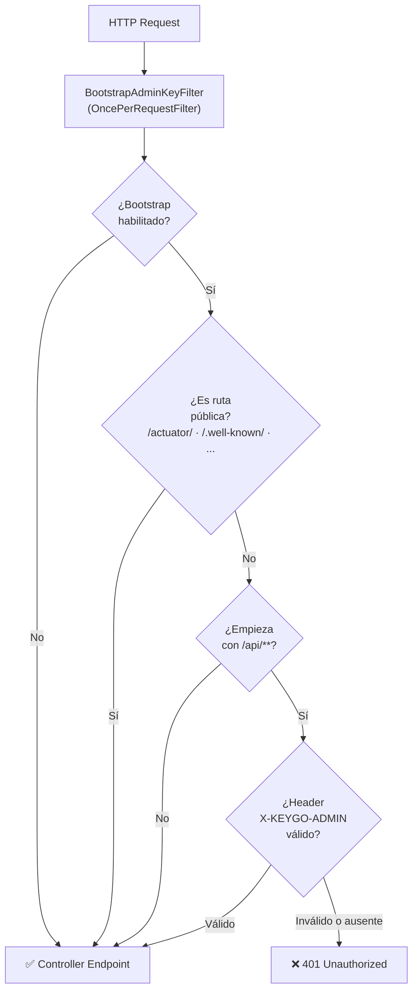
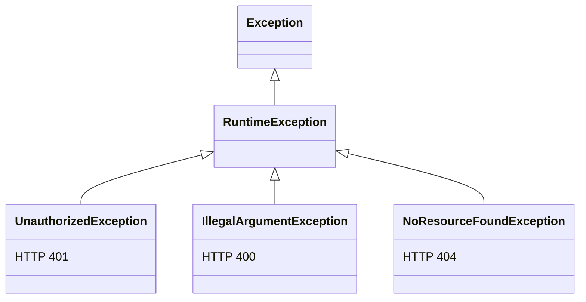

# Bootstrap Admin Key Filter - Security Documentation
# Filtro de Clave de Administrador Bootstrap - Documentación de Seguridad

**Date / Fecha**: 2026-02-12  
**Version**: 1.0  
**Author / Autor**: cmartinezs

## ⚠️ Known Issue: context-path / Problema Conocido: context-path

El filtro usa `request.getRequestURI()`, que **incluye** el `context-path` del servidor.

Con `server.servlet.context-path=/keygo-server` (configuración actual), todos los URIs
que el filtro recibe tienen el prefijo `/keygo-server/`:

| Path solicitado | URI en el filtro | ¿Coincide con el prefijo configurado? |
|---|---|---|
| `/keygo-server/actuator/health` | `/keygo-server/actuator/health` | ❌ No coincide con `/actuator/` |
| `/keygo-server/api/v1/service/info` | `/keygo-server/api/v1/service/info` | ❌ No coincide con `/api/` |

**Resultado actual:** Con `context-path` activo, **ninguna regla del filtro aplica** — todas las
peticiones pasan sin autenticación (como si `bootstrap.enabled=false`).

### Fix recomendado / Recommended Fix

Reemplazar `request.getRequestURI()` por `request.getServletPath()`, que devuelve el path
**sin** el context-path:

```java
// Antes (incorrecto con context-path)
String requestPath = request.getRequestURI();

// Después (correcto)
String requestPath = request.getServletPath();
```

Los tests unitarios actuales pasan porque usan mocks con paths directos (sin context-path),
por lo que no detectan este problema en entornos reales.

---

## Overview / Descripción General

The Bootstrap Admin Key Filter provides authentication and authorization for API endpoints using a configurable admin key. It implements a `OncePerRequestFilter` to intercept HTTP requests and validate admin credentials before allowing access to protected resources.

El Filtro de Clave de Administrador Bootstrap proporciona autenticación y autorización para endpoints de API usando una clave de administrador configurable. Implementa un `OncePerRequestFilter` para interceptar solicitudes HTTP y validar credenciales de administrador antes de permitir acceso a recursos protegidos.

## Architecture / Arquitectura

### Components / Componentes

1. **BootstrapAdminKeyFilter** (keygo-run)
   - OncePerRequestFilter implementation
   - Path-based authentication
   - Integrates with KeyGoBootstrapProperties

2. **GlobalExceptionHandler** (keygo-api)
   - @RestControllerAdvice
   - Uniform exception handling
   - Standardized error responses

3. **UnauthorizedException** (keygo-api)
   - Custom exception for authentication failures
   - @ResponseStatus(UNAUTHORIZED)

## Security Model / Modelo de Seguridad

### Path Protection / Protección de Rutas

| Path Pattern | Protection | Auth Required | Description |
|--------------|-----------|---------------|-------------|
| `/actuator/**` | Public | No | Health checks, metrics |
| `/service/info**` | Public | No | Service information |
| `/api/**` | Protected | Yes | API endpoints |
| Other paths | Unprotected | No | Default behavior |

### Authentication Flow / Flujo de Autenticación



## Configuration / Configuración

### application.yml

```yaml
keygo:
  bootstrap:
    enabled: true                          # Enable/disable filter
    admin-key: "${KEYGO_ADMIN_KEY:changeMe}"  # Admin key for authentication
```

### Environment Variables / Variables de Entorno

```bash
# Recommended for production
export KEYGO_ADMIN_KEY="your-secure-random-key-here"
```

## Usage / Uso

### Making Authenticated Requests / Realizar Solicitudes Autenticadas

```bash
# Without header - Returns 401
curl -X GET http://localhost:8080/keygo-server/api/v1/response-codes

# With valid header - Returns 200
curl -X GET http://localhost:8080/keygo-server/api/v1/response-codes \
  -H "X-KEYGO-ADMIN: your-admin-key"
```

### Public Endpoints / Endpoints Públicos

```bash
# No authentication required / Sin autenticación requerida
curl -X GET http://localhost:8080/keygo-server/actuator/health
```

> ⚠️ **Nota:** El endpoint `GET /api/v1/service/info` (ServiceInfoController) está bajo `/api/`
> y por lo tanto el filtro lo considera **protegido**, no público.
> El prefijo `/service/info` configurado en `keygo.bootstrap.service-info-path-prefix`
> actualmente **no coincide** con ningún path real del sistema.

## Error Handling / Manejo de Errores

### Unified Error Response / Respuesta de Error Unificada

All errors return a standardized `BaseResponse` structure:

```json
{
  "date": "2026-02-12T15:30:00",
  "failure": {
    "code": "AUTHENTICATION_REQUIRED",
    "message": "Authentication is required"
  }
}
```

### Exception Hierarchy / Jerarquía de Excepciones



### Error Mapping / Mapeo de Errores

| HTTP Status | ResponseCode | Handler |
|-------------|--------------|---------|
| 401 | AUTHENTICATION_REQUIRED | GlobalExceptionHandler |
| 403 | INSUFFICIENT_PERMISSIONS | GlobalExceptionHandler |
| 404 | RESOURCE_NOT_FOUND | GlobalExceptionHandler |
| 400 | INVALID_INPUT | GlobalExceptionHandler |
| 500 | OPERATION_FAILED | GlobalExceptionHandler |

## Implementation Details / Detalles de Implementación

### Filter Execution Order / Orden de Ejecución del Filtro

The filter runs on every request (OncePerRequestFilter):

1. Check if bootstrap is enabled
2. Check if path is public
3. Check if path starts with `/api/`
4. Validate `X-KEYGO-ADMIN` header
5. Continue or return 401

### Header Validation / Validación del Header

```java
private boolean validateAdminKey(HttpServletRequest request) {
    String providedKey = request.getHeader("X-KEYGO-ADMIN");
    
    if (providedKey == null || providedKey.isBlank()) {
        return false;
    }
    
    String expectedKey = bootstrapProperties.getAdminKey();
    
    if (expectedKey == null || expectedKey.isBlank()) {
        return false;
    }
    
    return providedKey.equals(expectedKey);
}
```

## Testing / Pruebas

### Test Coverage / Cobertura de Pruebas

**Total Tests / Pruebas Totales**: 76  
- keygo-api: 33 tests ✓
- keygo-run: 43 tests ✓

#### BootstrapAdminKeyFilter Tests (13 tests)

- ✓ Allow request when bootstrap disabled
- ✓ Allow actuator paths without auth
- ✓ Allow service/info paths without auth
- ✓ Allow API paths with valid admin key
- ✓ Reject API paths with missing admin key
- ✓ Reject API paths with invalid admin key
- ✓ Reject API paths with blank admin key
- ✓ Allow non-API paths without auth
- ✓ Handle null admin key in properties
- ✓ Handle blank admin key in properties
- ✓ (3 escenarios adicionales: variantes edge case y bootstrap deshabilitado)

#### GlobalExceptionHandler Tests (6 tests)

- ✓ Handle UnauthorizedException
- ✓ Handle NoResourceFoundException
- ✓ Handle IllegalArgumentException
- ✓ Handle generic Exception
- ✓ All handlers return non-null response
- ✓ All handlers have failure message

#### ResponseCodeController Tests (7 tests)

- ✓ Retrieve response codes catalog with correct structure

#### ServiceInfoController Tests (4 tests)

- ✓ Get service info returns expected data wrapped in BaseResponse

#### ResponseCode Tests (7 tests)

- ✓ All enum codes have valid code and message values

#### ResponseHelper Tests (5 tests)

- ✓ Build MessageResponse from ResponseCode
- ✓ Build MessageResponse with custom message
- ✓ Build MessageResponse from string code

#### UnauthorizedException Tests (4 tests)

- ✓ Exception creation and message propagation

#### ApplicationConfig Tests (4 tests) — keygo-run

- ✓ Bean wiring for GetServiceInfoUseCase

#### ServiceInfoProperties Tests (8 tests) — keygo-run

- ✓ Properties read from application.yml via @ConfigurationProperties

#### KeyGoBootstrapProperties Tests (18 tests) — keygo-run

- ✓ Default values testing
- ✓ Getters and setters testing
- ✓ Validation: enabled=false with null/blank adminKey is valid
- ✓ Validation: enabled=true with valid adminKey is valid
- ✓ Validation: enabled=true with null/empty/blank adminKey is invalid

## Security Considerations / Consideraciones de Seguridad

### Best Practices / Mejores Prácticas

1. **Strong Admin Key / Clave de Administrador Fuerte**
   ```bash
   # Generate secure random key
   openssl rand -base64 32
   ```

2. **Environment Variables / Variables de Entorno**
   - Never commit admin keys to version control
   - Use environment variables or secret management
   - Nunca commitear claves en control de versiones
   - Usar variables de entorno o gestión de secretos

3. **HTTPS Only / Solo HTTPS**
   - Always use HTTPS in production
   - Admin key transmitted in plain text header
   - Siempre usar HTTPS en producción
   - Clave transmitida en texto plano en header

4. **Disable After Bootstrap / Deshabilitar Después del Arranque**
   ```yaml
   keygo:
     bootstrap:
       enabled: false  # Disable after initial setup
   ```

5. **Rotate Keys Regularly / Rotar Claves Regularmente**
   - Change admin key periodically
   - Update environment variables
   - Cambiar clave periódicamente
   - Actualizar variables de entorno

### Attack Vectors / Vectores de Ataque

| Attack | Mitigation |
|--------|-----------|
| Brute Force | Rate limiting (future), strong key |
| Man-in-the-Middle | HTTPS only |
| Key Exposure | Environment variables, secrets management |
| Replay Attacks | Consider adding timestamp validation (future) |

## Performance / Rendimiento

- **Filter Impact**: Minimal (simple string comparison)
- **Public Paths**: No validation overhead
- **Cached Properties**: Admin key loaded once from configuration

## Future Enhancements / Mejoras Futuras

1. **Rate Limiting / Limitación de Tasa**
   - Prevent brute force attacks
   - Prevenir ataques de fuerza bruta

2. **Token-Based Auth / Autenticación Basada en Tokens**
   - JWT tokens
   - Token expiration
   - Expiración de tokens

3. **Audit Logging / Registro de Auditoría**
   - Track authentication attempts
   - Failed login monitoring
   - Rastrear intentos de autenticación
   - Monitorear inicios de sesión fallidos

4. **Multiple Admin Keys / Múltiples Claves de Administrador**
   - Role-based access
   - Key rotation without downtime
   - Acceso basado en roles
   - Rotación sin tiempo de inactividad

## Related Documentation / Documentación Relacionada

- [Bootstrap Properties Documentation](BOOTSTRAP_PROPERTIES.md)
- [Response Codes Guide](../keygo-api/RESPONSE_CODES_GUIDE.md)
- [API Documentation](../README.md)

## Troubleshooting / Solución de Problemas

### Common Issues / Problemas Comunes

**401 on all API requests**
```bash
# Check if bootstrap is enabled
grep "enabled:" keygo-run/target/classes/application.yml

# Check if admin key is configured
echo $KEYGO_ADMIN_KEY
```

**Filter not working**
```bash
# Ensure filter is registered (check logs)
# BootstrapAdminKeyFilter should be @Component
```

**Public paths blocked / Rutas públicas bloqueadas**
```bash
# Verify path patterns configured
grep "path-prefix" keygo-run/src/main/resources/application.yml

# Note: with context-path active, the filter effectively does NOT apply (see Known Issue above)
# Nota: con context-path activo, el filtro NO aplica efectivamente (ver Problema Conocido arriba)
```

## Conclusion / Conclusión

The Bootstrap Admin Key Filter provides a simple yet effective authentication mechanism for API endpoints. Combined with the unified error handling system, it ensures consistent security and error responses across the application.

El Filtro de Clave de Administrador Bootstrap proporciona un mecanismo de autenticación simple pero efectivo para endpoints de API. Combinado con el sistema unificado de manejo de errores, asegura respuestas consistentes de seguridad y errores en toda la aplicación.

