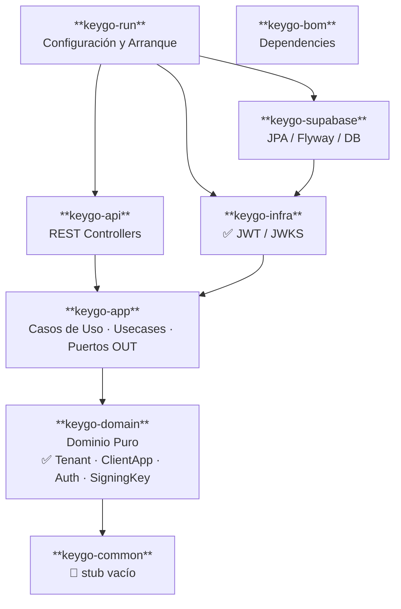
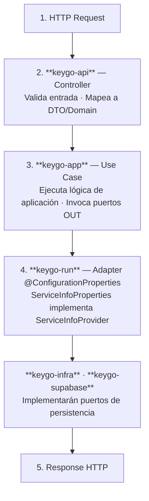
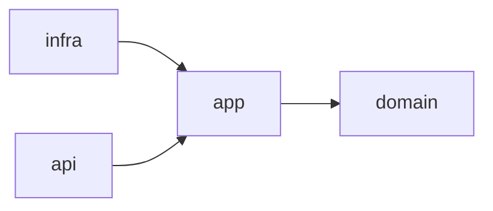

# Arquitectura de KeyGo Server

## Visión General

KeyGo Server está construido siguiendo los principios de **Arquitectura Hexagonal** (también conocida como Ports & Adapters), lo que permite mantener la lógica de negocio independiente de frameworks y tecnologías específicas.

## Diagrama de Arquitectura

> ℹ️ `keygo-common` es el único módulo que permanece como stub vacío.
> El resto de los módulos están activos con implementación.

## Módulos

### keygo-domain (Núcleo)
**Propósito**: Contendrá la lógica de negocio pura sin dependencias externas.

**Contenido actual:**
- **Entidades**: Objetos de negocio con identidad (User, Application, Service, etc.)
- **Value Objects**: Objetos inmutables (Email, Password, Token, etc.)
- **Reglas de Negocio**: Validaciones y lógica del dominio
- **Eventos de Dominio**: Eventos que ocurren en el negocio

**Principios:**
- ❌ Sin dependencias de frameworks
- ❌ Sin anotaciones de infraestructura
- ✅ Java puro
- ✅ Independiente de tecnología

### keygo-app (Aplicación)
**Propósito**: Orquesta los casos de uso del sistema.

**Contenido:**
- **Casos de Uso**: Servicios de aplicación que implementan funcionalidades
- **Puertos (Interfaces)**: Contratos para entrada y salida
  - Puertos de entrada (Use Cases)
  - Puertos de salida (Repositories, Services)
- **DTOs internos**: Objetos de transferencia entre capas

**Dependencias:**
- ✅ keygo-domain

### keygo-infra (Infraestructura)
**Propósito**: Implementaciones técnicas y adaptadores externos.

> 🚧 **Estado actual:** módulo vacío — estructura reservada para adaptadores futuros.
> La persistencia actual (JPA/Flyway) vive en `keygo-supabase`, no en este módulo.

**Contenido previsto:**
- **Adaptadores de Persistencia**: Implementaciones de repositorios genéricos
- **Adaptadores de Seguridad**: JWT, OAuth2, etc.
- **Adaptadores de APIs Externas**: Clientes HTTP, SMTP, etc.
- **Configuración**: Beans de Spring, configuraciones

**Dependencias:**
- ✅ keygo-app (implementará los puertos)

### keygo-api (API REST)
**Propósito**: Exponer la funcionalidad via REST API.

**Contenido:**
- **Controllers**: Endpoints REST
- **DTOs de API**: Request/Response objects
- **Mappers**: Conversión entre DTOs de API y objetos de dominio
- **Validaciones**: Bean Validation
- **Exception Handlers**: Manejo de errores HTTP

**Dependencias:**
- ✅ keygo-app (invoca casos de uso)

### keygo-common (Común)
**Propósito**: Utilidades compartidas entre módulos.

> 🚧 **Estado actual:** módulo vacío — estructura reservada para utilidades transversales futuras.

**Contenido previsto:**
- **Excepciones base**: Jerarquía de excepciones
- **Utilidades**: Helpers, constantes
- **Anotaciones**: Anotaciones personalizadas
- **Interfaces genéricas**: Contratos comunes

**Dependencias:**
- ❌ Sin dependencias de otros módulos

### keygo-bom (Bill of Materials)
**Propósito**: Gestión centralizada de versiones de dependencias.

**Contenido:**
- **Dependencias versionadas**: Spring Boot, Libraries, etc.
- **Plugin management**: Versiones de plugins Maven

### keygo-run (Ejecución)
**Propósito**: Punto de entrada y configuración de la aplicación.

**Contenido:**
- **Main class**: Clase principal de Spring Boot (`KeyGoRunner`)
- **Configuración de beans**: Wiring de dependencias (`ApplicationConfig`)
- **Filtros**: `BootstrapAdminKeyFilter` — autenticación por header `X-KEYGO-ADMIN`
- **Application properties**: `application.yml` con resource filtering Maven
- **Perfiles**: `supabase` para habilitar DB

**Dependencias:**
- ✅ keygo-api
- ✅ keygo-infra
- ✅ keygo-supabase

### keygo-supabase (Integración Supabase/DB)
**Propósito**: Integración con Supabase/PostgreSQL mediante JPA y Flyway.

**Contenido:**
- **Entidades JPA**: `UserEntity`, `RoleEntity`, `PermissionEntity`
- **Repositorios**: `UserRepository`, `RoleRepository`
- **Configuración**: `SupabaseJpaConfig`, `SupabaseProperties`
- **Migraciones**: Scripts Flyway en `classpath:db/migration`
- **Scripts**: `scripts/*.sh` para gestión local (dev-start, dev-stop, migrate, etc.)
- **Docker Compose**: PostgreSQL 15 + PgAdmin en `docker-compose.yml`

**Dependencias:**
- ✅ keygo-infra

> ℹ️ Se activa con el perfil `supabase` (`SPRING_PROFILES_ACTIVE=supabase`).
> La imagen Docker de producción **no incluye** este módulo — debe añadirse si se requiere DB.

## Flujo de una Request (estado actual)

> ℹ️ **Estado actual:** `keygo-infra` implementa firma JWT/JWKS. `keygo-supabase` implementa
> repositorios JPA conectados a puertos de `keygo-app`. `keygo-domain` contiene las entidades
> de dominio puras (Tenant, ClientApp, Auth, SigningKey).

## Principios de Diseño

### 1. Dependency Rule
Las dependencias apuntan hacia adentro (hacia el dominio).

### 2. Separation of Concerns
Cada módulo tiene una responsabilidad clara y única.

### 3. Testability
- Domain: 100% testeable con tests unitarios puros
- App: Testeable con mocks de puertos
- Infra/API: Tests de integración

### 4. Independence
- El dominio es independiente de frameworks
- La aplicación es independiente de tecnología
- Los adaptadores son intercambiables

## Tecnologías

- **Framework**: Spring Boot 4.0.3
- **Java**: 21
- **Persistencia**: Spring Data JPA/Hibernate + PostgreSQL (módulo `keygo-supabase`)
- **Migraciones**: Flyway
- **Seguridad**: Filtro de clave admin bootstrap (`BootstrapAdminKeyFilter`)
- **API**: REST + `BaseResponse<T>` como envelope estándar
- **Tests**: JUnit 5 + Mockito + AssertJ + Testcontainers
- **Build**: Maven (wrapper incluido `./mvnw`)

## Referencias

- [ARCHITECTURE.md (raíz)](../../ARCHITECTURE.md) — visión operacional actualizada con Mermaid, flujos y CI/CD
- [Hexagonal Architecture](https://alistair.cockburn.us/hexagonal-architecture/)
- [Clean Architecture](https://blog.cleancoder.com/uncle-bob/2012/08/13/the-clean-architecture.html)
- [Domain-Driven Design](https://martinfowler.com/bliki/DomainDrivenDesign.html)

