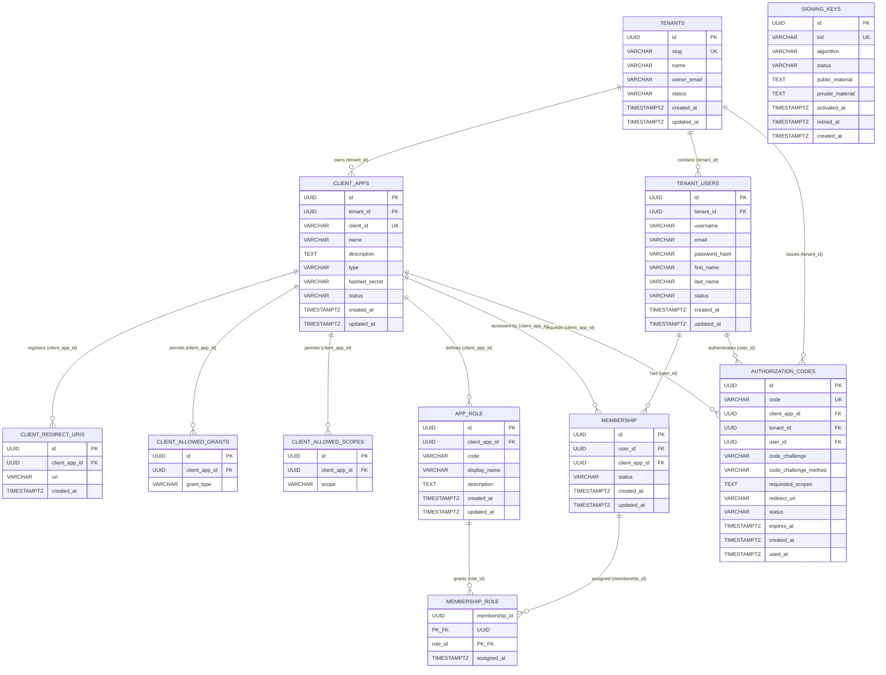
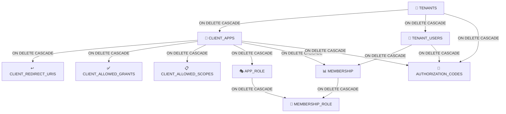

# Data Model — KeyGo Server

> Documentación del **diccionario de datos** y **modelo de entidades** (E/R) del sistema KeyGo Server.
>
> Fecha de actualización: **2026-03-22** | Estado: ✅ Sincronizado con migraciones V1–V9

---

## Tabla de contenidos

1. [Tablas activas (multi-tenancy)](#tablas-activas-multi-tenancy)
2. [Tablas legado (V1/V3)](#tablas-legado-v1v3)
3. [Tablas planificadas (fases futuras)](#tablas-planificadas-fases-futuras)
4. [Modelo E/R (Diagrama Mermaid)](#modelo-er-diagrama-mermaid)
5. [Relaciones de dependencia](#relaciones-de-dependencia)
6. [Guías de consulta común](#guías-de-consulta-común)
7. [Notas sobre enumeraciones](#notas-sobre-enumeraciones)
8. [Referencia rápida de constraints únicos](#referencia-rápida-de-constraints-únicos)

---

## Tablas activas (multi-tenancy)

> Estas tablas forman el núcleo del sistema. Todas implementadas en migraciones V4–V9.

### Tabla: `tenants` — V4

| Campo | Tipo | Clave | Nulable | Descripción |
|---|---|---|---|---|
| `id` | UUID | PK | NO | Identificador único del tenant (`uuid_generate_v4()`) |
| `slug` | VARCHAR(100) | UNIQUE | NO | Identificador URL-friendly (solo minúsculas, números y guiones). Mín. 3 chars. |
| `name` | VARCHAR(255) | | NO | Nombre legal/comercial del tenant |
| `owner_email` | VARCHAR(255) | | NO | Email del propietario/administrador del tenant |
| `status` | VARCHAR(20) | | NO | Estado: `ACTIVE`, `SUSPENDED`, `PENDING` |
| `created_at` | TIMESTAMPTZ | | NO | Marca de tiempo de creación (UTC) |
| `updated_at` | TIMESTAMPTZ | | NO | Marca de tiempo de última actualización (UTC — auto-actualizado por trigger) |

**Constraints:**
- `UNIQUE(slug)`, `slug ~ '^[a-z0-9][a-z0-9\-]*[a-z0-9]$'`, `char_length(slug) >= 3`
- `status IN ('ACTIVE', 'SUSPENDED', 'PENDING')`

**Reglas de negocio:**
- El `slug` es único globalmente; no puede repetirse entre tenants.
- Un tenant `SUSPENDED` no debe permitir operaciones normales (login, emisión de tokens).
- Toda entidad con `tenant_id` pertenece lógicamente a este tenant.

---

### Tabla: `client_apps` — V5

| Campo | Tipo | Clave | Nulable | Descripción |
|---|---|---|---|---|
| `id` | UUID | PK | NO | Identificador único de la aplicación cliente |
| `tenant_id` | UUID | FK | NO | Referencia al tenant propietario |
| `client_id` | VARCHAR(255) | UNIQUE | NO | ID OAuth2/OIDC único globalmente; usado en requests de autorización |
| `name` | VARCHAR(255) | | NO | Nombre legible de la aplicación |
| `description` | TEXT | | SÍ | Descripción opcional de la app |
| `type` | VARCHAR(20) | | NO | Tipo de cliente: `PUBLIC` (SPA, mobile) o `CONFIDENTIAL` (servidor backend) |
| `hashed_secret` | VARCHAR(255) | | SÍ | Hash del secret (solo si `CONFIDENTIAL`); nunca se expone en claro |
| `status` | VARCHAR(20) | | NO | Estado: `ACTIVE`, `SUSPENDED`, `PENDING` |
| `created_at` | TIMESTAMPTZ | | NO | Marca de tiempo de creación |
| `updated_at` | TIMESTAMPTZ | | NO | Marca de tiempo de última actualización |

**Constraints:**
- `type IN ('PUBLIC', 'CONFIDENTIAL')`
- `status IN ('ACTIVE', 'SUSPENDED', 'PENDING')`

**Reglas de negocio:**
- `type = PUBLIC` no debe tener `hashed_secret` (o ignorarlo en validación).
- `type = CONFIDENTIAL` requiere validar `hashed_secret` en algunos flows.
- Un cliente solo puede usar grants (`client_allowed_grants`) y scopes (`client_allowed_scopes`) registrados.

---

### Tabla: `client_redirect_uris` — V5

| Campo | Tipo | Clave | Nulable | Descripción |
|---|---|---|---|---|
| `id` | UUID | PK | NO | Identificador único |
| `client_app_id` | UUID | FK | NO | Referencia al cliente propietario |
| `uri` | VARCHAR(2048) | | NO | URI exacta permitida (sin wildcards) |
| `created_at` | TIMESTAMPTZ | | NO | Marca de tiempo de creación |

**Reglas de negocio:**
- La redirect URI en un `authorize` request debe coincidir exactamente con una entrada aquí.
- No se permiten wildcards; la validación es literal.
- Un cliente puede tener múltiples redirect URIs (dev, staging, producción).

---

### Tabla: `client_allowed_grants` — V5

| Campo | Tipo | Clave | Nulable | Descripción |
|---|---|---|---|---|
| `id` | UUID | PK | NO | Identificador único |
| `client_app_id` | UUID | FK | NO | Referencia al cliente propietario |
| `grant_type` | VARCHAR(50) | | NO | Tipo de grant permitido (p. ej. `authorization_code`, `client_credentials`, `refresh_token`) |

**Reglas de negocio:**
- Un cliente solo puede usar grants registrados aquí.
- El servidor debe validar contra esta tabla antes de emitir un token por ese flujo.

---

### Tabla: `client_allowed_scopes` — V5

| Campo | Tipo | Clave | Nulable | Descripción |
|---|---|---|---|---|
| `id` | UUID | PK | NO | Identificador único |
| `client_app_id` | UUID | FK | NO | Referencia al cliente propietario |
| `scope` | VARCHAR(100) | | NO | Scope permitido (p. ej. `openid`, `profile`, `email`, `custom:admin`) |

**Reglas de negocio:**
- Un cliente solo puede solicitar scopes registrados aquí.
- El servidor filtra los scopes autorizados contra esta lista.

---

### Tabla: `tenant_users` — V6

| Campo | Tipo | Clave | Nulable | Descripción |
|---|---|---|---|---|
| `id` | UUID | PK | NO | Identificador único del usuario |
| `tenant_id` | UUID | FK | NO | Referencia al tenant propietario |
| `username` | VARCHAR(100) | UNIQUE (tenant) | NO | Username único dentro del tenant |
| `email` | VARCHAR(255) | UNIQUE (tenant) | NO | Email único dentro del tenant |
| `password_hash` | VARCHAR(255) | | NO | Hash seguro de contraseña (BCrypt) |
| `first_name` | VARCHAR(100) | | SÍ | Nombre de pila |
| `last_name` | VARCHAR(100) | | SÍ | Apellido |
| `status` | VARCHAR(20) | | NO | Estado: `ACTIVE`, `SUSPENDED`, `PENDING` |
| `created_at` | TIMESTAMPTZ | | NO | Marca de tiempo de creación |
| `updated_at` | TIMESTAMPTZ | | NO | Marca de tiempo de última actualización |

**Constraints:**
- `UNIQUE(tenant_id, email)` — email único por tenant
- `UNIQUE(tenant_id, username)` — username único por tenant
- `status IN ('ACTIVE', 'SUSPENDED', 'PENDING')`
- FK: `tenant_id` → `tenants(id)` ON DELETE CASCADE

**Reglas de negocio:**
- Email y username son únicos por tenant, no globalmente.
- La contraseña nunca se almacena en claro; siempre como hash BCrypt.
- Un usuario `SUSPENDED` no puede autenticarse.

---

### Tabla: `app_role` — V7

| Campo | Tipo | Clave | Nulable | Descripción |
|---|---|---|---|---|
| `id` | UUID | PK | NO | Identificador único del rol |
| `client_app_id` | UUID | FK | NO | Referencia a la aplicación propietaria del rol |
| `code` | VARCHAR(50) | UNIQUE (app) | NO | Código del rol en minúsculas (p. ej. `admin`, `user`, `viewer`). Patrón: `^[a-z][a-z0-9_-]*$` |
| `display_name` | VARCHAR(255) | | SÍ | Nombre legible del rol |
| `description` | TEXT | | SÍ | Descripción de responsabilidades/permisos |
| `created_at` | TIMESTAMPTZ | | NO | Marca de tiempo de creación |
| `updated_at` | TIMESTAMPTZ | | NO | Marca de tiempo de última actualización |

**Constraints:**
- `UNIQUE(client_app_id, code)` — código único dentro de la app
- `code ~ '^[a-z][a-z0-9_-]*$'` — solo minúsculas, números, guiones y underscores
- FK: `client_app_id` → `client_apps(id)` ON DELETE CASCADE

**Reglas de negocio:**
- Un rol siempre pertenece a una app específica; los roles no son globales.
- El `code` es el identificador funcional dentro de la app (p. ej. en JWT claims).
- Diferentes apps pueden tener roles con el mismo código, pero son entidades distintas.

---

### Tabla: `membership` — V7

> ⚠️ **Nombre en singular** (`membership`, no `memberships`). La tabla NO tiene columna `tenant_id`.

| Campo | Tipo | Clave | Nulable | Descripción |
|---|---|---|---|---|
| `id` | UUID | PK | NO | Identificador único de la membership |
| `user_id` | UUID | FK | NO | Referencia al usuario (`tenant_users`) |
| `client_app_id` | UUID | FK | NO | Referencia a la aplicación cliente |
| `status` | VARCHAR(20) | | NO | Estado: `ACTIVE`, `SUSPENDED`, `PENDING` |
| `created_at` | TIMESTAMPTZ | | NO | Marca de tiempo de creación |
| `updated_at` | TIMESTAMPTZ | | NO | Marca de tiempo de última actualización |

**Constraints:**
- `UNIQUE(user_id, client_app_id)` — no hay memberships duplicadas
- `status IN ('ACTIVE', 'SUSPENDED', 'PENDING')`
- FK: `user_id` → `tenant_users(id)` ON DELETE CASCADE
- FK: `client_app_id` → `client_apps(id)` ON DELETE CASCADE

**Reglas de negocio:**
- Una membership define si el usuario puede acceder a esa app.
- Un usuario **debe** tener membership `ACTIVE` en una app para autenticarse en ella.
- Estado `SUSPENDED` deniega temporalmente el login.
- `PENDING` = invitación pendiente de aceptación.

---

### Tabla: `membership_role` — V7

> ⚠️ **PK compuesta** `(membership_id, role_id)` — NO hay columna `id` independiente. La columna FK al rol es `role_id` (no `app_role_id`).

| Campo | Tipo | Clave | Nulable | Descripción |
|---|---|---|---|---|
| `membership_id` | UUID | PK (parte) + FK | NO | Referencia a la membership |
| `role_id` | UUID | PK (parte) + FK | NO | Referencia al rol (`app_role`) |
| `assigned_at` | TIMESTAMPTZ | | NO | Marca de tiempo de asignación |

**Constraints:**
- PK compuesta: `(membership_id, role_id)`
- FK: `membership_id` → `membership(id)` ON DELETE CASCADE
- FK: `role_id` → `app_role(id)` ON DELETE CASCADE

**Reglas de negocio:**
- Una membership puede tener múltiples roles dentro de la misma app.
- El rol de una membership debe pertenecer a la misma app que la membership.
- Al revocar/eliminar una membership, se eliminan implícitamente todos sus roles (CASCADE).

---

### Tabla: `authorization_codes` — V8

| Campo | Tipo | Clave | Nulable | Descripción |
|---|---|---|---|---|
| `id` | UUID | PK | NO | Identificador único del código |
| `code` | VARCHAR(256) | UNIQUE | NO | Valor opaco del código de autorización |
| `client_app_id` | UUID | FK | NO | Referencia al cliente que lo solicitó |
| `tenant_id` | UUID | FK | NO | Referencia al tenant |
| `user_id` | UUID | FK | NO | Referencia al usuario autenticado |
| `code_challenge` | VARCHAR(256) | | NO | Challenge PKCE (valor hash SHA-256 o plain) |
| `code_challenge_method` | VARCHAR(10) | | NO | Método PKCE: `plain` o `S256` |
| `requested_scopes` | TEXT | | NO | Scopes solicitados (serializado) |
| `redirect_uri` | VARCHAR(2048) | | NO | URI de redirección autorizada |
| `status` | VARCHAR(20) | | NO | Estado: `pending`, `used`, `expired`, `revoked` |
| `expires_at` | TIMESTAMPTZ | | NO | Marca de tiempo de expiración (~10 min tras creación) |
| `created_at` | TIMESTAMPTZ | | NO | Marca de tiempo de emisión |
| `used_at` | TIMESTAMPTZ | | SÍ | Marca de tiempo de canje (se llena al marcar `used`) |

**Constraints:**
- `UNIQUE(code)`
- `code_challenge_method IN ('plain', 'S256')`
- `status IN ('pending', 'used', 'expired', 'revoked')`
- FK: `client_app_id` → `client_apps(id)` ON DELETE CASCADE
- FK: `tenant_id` → `tenants(id)` ON DELETE CASCADE
- FK: `user_id` → `tenant_users(id)` ON DELETE CASCADE

**Reglas de negocio:**
- Solo se puede canjear una vez: `pending` → `used` (inmutable después).
- Debe expirar rápidamente (~10 min). `expires_at > NOW()` se valida al canjear.
- El `client_app_id` que canjea debe ser el mismo que lo solicitó.
- Si PKCE fue usado en `/authorize`, se debe validar `code_verifier` contra `code_challenge`.

---

### Tabla: `signing_keys` — V9

| Campo | Tipo | Clave | Nulable | Descripción |
|---|---|---|---|---|
| `id` | UUID | PK | NO | Identificador único |
| `kid` | VARCHAR(100) | UNIQUE | NO | Key ID usado en el header `kid` del JWT |
| `algorithm` | VARCHAR(20) | | NO | Algoritmo de firma: `RS256`, `RS384`, `RS512` |
| `status` | VARCHAR(20) | | NO | Estado: `ACTIVE`, `RETIRED`, `REVOKED` |
| `public_material` | TEXT | | NO | Clave pública en formato PEM |
| `private_material` | TEXT | | SÍ | Clave privada en formato PEM (cifrada en reposo recomendada) |
| `activated_at` | TIMESTAMPTZ | | NO | Marca de tiempo de activación |
| `retired_at` | TIMESTAMPTZ | | SÍ | Marca de tiempo de retiro (`null` si sigue activa) |
| `created_at` | TIMESTAMPTZ | | NO | Marca de tiempo de creación |

**Constraints:**
- `UNIQUE(kid)`
- `status IN ('ACTIVE', 'RETIRED', 'REVOKED')`

**Reglas de negocio:**
- Debe existir al menos una clave `ACTIVE` para emitir tokens.
- Las claves `RETIRED` se mantienen para validación de tokens ya emitidos.
- La clave privada se almacena en DB en PEM cifrado — en producción debe migrar a KMS/bóveda.
- Solo una clave `ACTIVE` a la vez; al rotar, la anterior pasa a `RETIRED`.

---

## Tablas legado (V1/V3)

> Estas tablas existen en la DB por las migraciones iniciales pero **no se usan** en el sistema multi-tenancy actual. Se conservan por compatibilidad; no crear nuevos endpoints sobre ellas.

| Tabla | Migración | Descripción | Estado |
|---|---|---|---|
| `users` | V1 | Usuarios globales (sin tenant). Estructura diferente a `tenant_users`. | 🚧 Legado |
| `roles` | V1 | Roles globales del sistema. Sin relación con `app_role`. | 🚧 Legado |
| `user_roles` | V1 | Join table `users ↔ roles`. PK compuesta `(user_id, role_id)`. | 🚧 Legado |
| `permissions` | V1 | Permisos globales con acciones: `CREATE`, `READ`, `UPDATE`, `DELETE`, `EXECUTE`. | 🚧 Legado |
| `role_permissions` | V1 | Join table `roles ↔ permissions`. PK compuesta. | 🚧 Legado |
| `sessions` | V1 | Sesiones de usuario global (token JWT crudo, no multi-tenant). | 🚧 Legado |
| `audit_logs` | V1 | Log de auditoría global por acción + recurso + `user_id`. | 🚧 Legado |
| `oauth_providers` | V3 | Configuración de proveedores OAuth externos (Google, GitHub, etc.). | 🚧 Legado |
| `oauth_tokens` | V3 | Tokens de acceso de proveedores externos por usuario global. | 🚧 Legado |

---

## Tablas planificadas (fases futuras)

> Estas tablas están **documentadas en el diseño** pero aún **no tienen migración implementada**. Se incluyen aquí para referencia de diseño.

### Tabla: `refresh_tokens` — Planificada (Fase 7+)

| Campo | Tipo | Clave | Nulable | Descripción |
|---|---|---|---|---|
| `id` | UUID | PK | NO | Identificador único |
| `tenant_id` | UUID | FK | NO | Referencia al tenant |
| `client_app_id` | UUID | FK | NO | Referencia al cliente propietario |
| `user_id` | UUID | FK | SÍ | Referencia al usuario (nullable para M2M flows futuros) |
| `token_hash` | VARCHAR(500) | UNIQUE | NO | Hash del token (nunca en claro) |
| `status` | VARCHAR(20) | | NO | Estado: `ACTIVE`, `USED`, `REVOKED`, `EXPIRED` |
| `rotated_from` | UUID | FK | SÍ | Referencia al token anterior si fue rotado |
| `created_at` | TIMESTAMPTZ | | NO | Marca de tiempo de emisión |
| `expires_at` | TIMESTAMPTZ | | NO | Marca de tiempo de expiración |

**Reglas de negocio (diseño):**
- Token nunca en claro, solo hash.
- Al rotar: token anterior → `USED`, nuevo vinculado via `rotated_from`.
- Token revocado no puede renovarse.

**Próxima migración:** `V10__add_refresh_tokens.sql`

### Tabla: `tenant_sessions` — Planificada (Fase 8+)

> Diferente a la tabla `sessions` de V1 (que es legado global). Esta nueva tabla sería multi-tenant.

| Campo | Tipo | Clave | Nulable | Descripción |
|---|---|---|---|---|
| `id` | UUID | PK | NO | Identificador único de sesión |
| `tenant_id` | UUID | FK | NO | Referencia al tenant |
| `user_id` | UUID | FK | NO | Referencia al usuario (`tenant_users`) |
| `client_app_id` | UUID | FK | NO | Referencia a la app donde se autenticó |
| `status` | VARCHAR(20) | | NO | Estado: `ACTIVE`, `TERMINATED`, `EXPIRED` |
| `created_at` | TIMESTAMPTZ | | NO | Marca de tiempo de inicio |
| `last_seen_at` | TIMESTAMPTZ | | NO | Última actividad |
| `device_info` | JSON | | SÍ | Información del dispositivo |
| `ip_address` | VARCHAR(45) | | SÍ | IP de origen (IPv4 o IPv6) |

---

## Modelo E/R (Diagrama Mermaid)

> Solo tablas activas (V4–V9). Las tablas de legado se omiten para claridad.



---

## Relaciones de dependencia

### Jerarquía de cascade



**Implicaciones:**
- Si se elimina un **tenant**: se eliminan en cascada todas sus apps, usuarios y authorization codes.
- Si se elimina una **app**: se eliminan redirect URIs, grants, scopes, roles, memberships y codes asociados.
- Si se elimina un **usuario**: se eliminan sus memberships y authorization codes.
- `SIGNING_KEYS` no tiene FK hacia tenants — son claves globales del servidor.

---

## Guías de consulta común

### 1. Obtener todas las apps activas de un tenant

```sql
SELECT ca.* FROM client_apps ca
WHERE ca.tenant_id = :tenantId
  AND ca.status = 'ACTIVE';
```

### 2. Buscar usuario por email en un tenant

```sql
SELECT tu.* FROM tenant_users tu
WHERE tu.tenant_id = :tenantId
  AND tu.email = :email
  AND tu.status = 'ACTIVE';
```

### 3. Verificar si un usuario tiene membership activa en una app

```sql
SELECT COUNT(1) FROM membership m
WHERE m.user_id = :userId
  AND m.client_app_id = :clientAppId
  AND m.status = 'ACTIVE';
-- Si count = 1, el usuario tiene acceso
```

### 4. Obtener roles asignados a un usuario en una app

```sql
SELECT ar.code, ar.display_name
FROM app_role ar
JOIN membership_role mr ON mr.role_id = ar.id
JOIN membership m ON m.id = mr.membership_id
WHERE m.user_id = :userId
  AND ar.client_app_id = :clientAppId
  AND m.status = 'ACTIVE';
```

### 5. Listar todos los usuarios de un tenant

```sql
SELECT tu.* FROM tenant_users tu
WHERE tu.tenant_id = :tenantId
ORDER BY tu.created_at DESC;
```

### 6. Canjear authorization code (búsqueda + validación)

```sql
SELECT ac.* FROM authorization_codes ac
WHERE ac.code = :code
  AND ac.client_app_id = :clientAppId
  AND ac.status = 'pending'
  AND ac.expires_at > NOW();
```

### 7. Obtener claves de firma activas (JWKS)

```sql
SELECT id, kid, algorithm, public_material
FROM signing_keys
WHERE status = 'ACTIVE'
ORDER BY activated_at DESC;
```

### 8. Marcar authorization code como usado

```sql
UPDATE authorization_codes
SET status = 'used', used_at = NOW()
WHERE id = :id;
```

---

## Notas sobre enumeraciones

> Los valores de `status` en las tablas multi-tenancy siguen la convención que define cada CHECK constraint en la migración SQL correspondiente.

| Tabla | Campo | Valores permitidos | Convención |
|---|---|---|---|
| `tenants` | `status` | `ACTIVE`, `SUSPENDED`, `PENDING` | UPPERCASE |
| `client_apps` | `type` | `PUBLIC`, `CONFIDENTIAL` | UPPERCASE |
| `client_apps` | `status` | `ACTIVE`, `SUSPENDED`, `PENDING` | UPPERCASE |
| `tenant_users` | `status` | `ACTIVE`, `SUSPENDED`, `PENDING` | UPPERCASE |
| `membership` | `status` | `ACTIVE`, `SUSPENDED`, `PENDING` | UPPERCASE |
| `authorization_codes` | `status` | `pending`, `used`, `expired`, `revoked` | **lowercase** |
| `authorization_codes` | `code_challenge_method` | `plain`, `S256` | mixto |
| `signing_keys` | `status` | `ACTIVE`, `RETIRED`, `REVOKED` | UPPERCASE |
| `app_role` | `code` | regex `^[a-z][a-z0-9_-]*$` | solo minúsculas |

> ⚠️ Los valores de `authorization_codes.status` son **minúsculas** (distinto al resto). Tener en cuenta en comparaciones de código Java.

---

## Referencia rápida de constraints únicos

| Tabla | Constraint | Descripción |
|---|---|---|
| `tenants` | `UNIQUE(slug)` | Slug global único |
| `client_apps` | `UNIQUE(client_id)` | Client ID único globalmente |
| `client_redirect_uris` | — | Sin constraint; múltiples URIs por app |
| `tenant_users` | `UNIQUE(tenant_id, email)` | Email único por tenant |
| `tenant_users` | `UNIQUE(tenant_id, username)` | Username único por tenant |
| `membership` | `UNIQUE(user_id, client_app_id)` | No hay memberships duplicadas |
| `app_role` | `UNIQUE(client_app_id, code)` | Código de rol único por app |
| `membership_role` | PK `(membership_id, role_id)` | PK compuesta; sin columna `id` propia |
| `authorization_codes` | `UNIQUE(code)` | Authorization code único globalmente |
| `signing_keys` | `UNIQUE(kid)` | Key ID único globalmente |

---

## Próximas migraciones

| Migración | Descripción | Estado |
|---|---|---|
| `V10__add_refresh_tokens.sql` | Tabla `refresh_tokens` para Fase 7 (refresh token flow) | ⏳ Planificada |
| `V11__add_tenant_sessions.sql` | Tabla `tenant_sessions` multi-tenancy para Fase 8 | ⏳ Planificada |

> **Regla:** Nunca reutilizar ni editar migraciones aplicadas. La siguiente libre es `V10`.

---

**Última actualización:** 2026-03-22 | **Responsable:** AI Agent | **Sincronizado con:** Migraciones V1–V9
