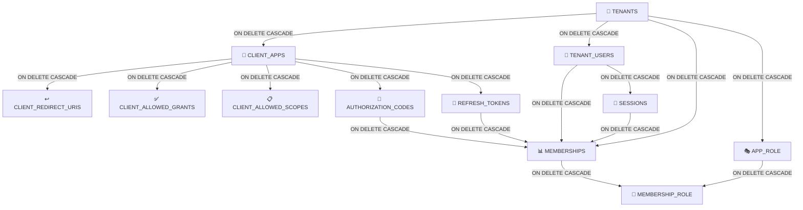

# Data Model — KeyGo Server

> Documentación del **diccionario de datos** y **modelo de entidades** (E/R) del sistema KeyGo Server.
>
> Fecha de actualización: **2026-03-22**

---

## Tabla de contenidos

1. [Diccionario de datos](#diccionario-de-datos)
2. [Modelo E/R (Diagrama Mermaid)](#modelo-er-diagrama-mermaid)
3. [Relaciones de dependencia](#relaciones-de-dependencia)
4. [Guías de consulta común](#guías-de-consulta-común)

---

## Diccionario de datos

### Tabla: `tenants`

| Campo | Tipo | Clave | Nulable | Descripción |
|---|---|---|---|---|
| `id` | UUID | PK | NO | Identificador único del tenant |
| `slug` | VARCHAR(100) | UNIQUE | NO | Identificador URL amigable; único globalmente. Se usa en rutas como `/tenants/{slug}` |
| `name` | VARCHAR(255) | | NO | Nombre legal/comercial del tenant |
| `status` | ENUM | | NO | Estado: `ACTIVE`, `SUSPENDED`, `ARCHIVED` |
| `created_at` | TIMESTAMP | | NO | Marca de tiempo de creación (UTC) |
| `updated_at` | TIMESTAMP | | NO | Marca de tiempo de última actualización (UTC) |

**Reglas de negocio:**
- El `slug` es único globalmente; no puede repetirse entre tenants.
- Un tenant suspendido (`SUSPENDED`) no debe permitir operaciones normales (login, token issuance).
- Toda entidad que tenga `tenant_id` pertenece lógicamente a este tenant.

---

### Tabla: `client_apps`

| Campo | Tipo | Clave | Nulable | Descripción |
|---|---|---|---|---|
| `id` | UUID | PK | NO | Identificador único de la aplicación cliente |
| `tenant_id` | UUID | FK | NO | Referencia al tenant propietario |
| `client_id` | VARCHAR(100) | UNIQUE+INDEX | NO | ID OAuth2/OIDC único dentro del tenant; usado en requests de autorización |
| `client_type` | ENUM | | NO | Tipo de cliente: `PUBLIC` (SPA, mobile) o `CONFIDENTIAL` (servidor backend) |
| `display_name` | VARCHAR(255) | | NO | Nombre legible de la aplicación |
| `client_secret` | VARCHAR(500) | | SÍ | Hash seguro del secret (si es CONFIDENTIAL); nunca se expone, solo se valida |
| `status` | ENUM | | NO | Estado: `ACTIVE`, `DISABLED`, `ROTATION_REQUIRED` |
| `created_at` | TIMESTAMP | | NO | Marca de tiempo de creación |
| `updated_at` | TIMESTAMP | | NO | Marca de tiempo de última actualización |

**Reglas de negocio:**
- El `client_id` es único dentro del tenant.
- `client_type = PUBLIC` no debe tener `client_secret` (o no validarlo).
- `client_type = CONFIDENTIAL` debe validar `client_secret` en algunos flows.
- Un cliente solo puede usar grants (`ALLOWED_GRANT`) y scopes (`ALLOWED_SCOPE`) explícitamente registrados.

---

### Tabla: `client_redirect_uris`

| Campo | Tipo | Clave | Nulable | Descripción |
|---|---|---|---|---|
| `id` | UUID | PK | NO | Identificador único de la redirect URI |
| `client_app_id` | UUID | FK | NO | Referencia al cliente propietario |
| `redirect_uri` | VARCHAR(2000) | | NO | URI exacta permitida (sin wildcards) |
| `created_at` | TIMESTAMP | | NO | Marca de tiempo de creación |

**Reglas de negocio:**
- La redirect URI en un `authorize` request debe coincidir exactamente con una entrada aquí.
- No se permiten wildcards; la validación es literal.
- Un cliente puede tener múltiples redirect URIs (p. ej. desarrollo, staging, producción).

---

### Tabla: `client_allowed_grants`

| Campo | Tipo | Clave | Nulable | Descripción |
|---|---|---|---|---|
| `id` | UUID | PK | NO | Identificador único |
| `client_app_id` | UUID | FK | NO | Referencia al cliente propietario |
| `grant_type` | ENUM | | NO | Tipo de grant permitido: `AUTHORIZATION_CODE`, `CLIENT_CREDENTIALS`, `REFRESH_TOKEN`, etc. |
| `created_at` | TIMESTAMP | | NO | Marca de tiempo de registro |

**Reglas de negocio:**
- Un cliente solo puede usar grants que estén registrados aquí.
- El servidor debe validar contra esta tabla antes de emitir un token via ese flujo.

---

### Tabla: `client_allowed_scopes`

| Campo | Tipo | Clave | Nulable | Descripción |
|---|---|---|---|---|
| `id` | UUID | PK | NO | Identificador único |
| `client_app_id` | UUID | FK | NO | Referencia al cliente propietario |
| `scope` | VARCHAR(100) | | NO | Scope permitido (p. ej. `openid`, `profile`, `email`, `custom:admin`) |
| `created_at` | TIMESTAMP | | NO | Marca de tiempo de registro |

**Reglas de negocio:**
- Un cliente solo puede solicitar scopes que estén aquí.
- El servidor filtra `authorized_scopes` contra esta lista en base a consentimiento del usuario.

---

### Tabla: `tenant_users`

| Campo | Tipo | Clave | Nulable | Descripción |
|---|---|---|---|---|
| `id` | UUID | PK | NO | Identificador único del usuario |
| `tenant_id` | UUID | FK | NO | Referencia al tenant propietario |
| `email` | VARCHAR(255) | UNIQUE (tenant_id, email) | NO | Email único dentro del tenant |
| `username` | VARCHAR(100) | UNIQUE (tenant_id, username) | SÍ | Username opcional; único dentro del tenant si se usa |
| `display_name` | VARCHAR(255) | | SÍ | Nombre completo legible |
| `password_hash` | VARCHAR(500) | | NO | Hash seguro de contraseña (Bcrypt, Argon2, etc.) |
| `status` | ENUM | | NO | Estado: `ACTIVE`, `INVITED`, `LOCKED`, `SUSPENDED` |
| `created_at` | TIMESTAMP | | NO | Marca de tiempo de creación |
| `updated_at` | TIMESTAMP | | NO | Marca de tiempo de última actualización |

**Reglas de negocio:**
- Email y username son únicos por tenant, no globalmente.
- Un usuario existe una sola vez por tenant (no hay duplicados).
- Un usuario con status `SUSPENDED` no puede autenticarse.
- La contraseña nunca se almacena en claro; siempre como hash.

---

### Tabla: `memberships`

| Campo | Tipo | Clave | Nulable | Descripción |
|---|---|---|---|---|
| `id` | UUID | PK | NO | Identificador único de la membership |
| `tenant_id` | UUID | FK | NO | Referencia al tenant (desnormalizado para consultas rápidas) |
| `user_id` | UUID | FK | NO | Referencia al usuario |
| `client_app_id` | UUID | FK | NO | Referencia a la aplicación cliente |
| `status` | ENUM | | NO | Estado: `ACTIVE`, `INVITED`, `SUSPENDED`, `REVOKED` |
| `created_at` | TIMESTAMP | | NO | Marca de tiempo de creación |
| `updated_at` | TIMESTAMP | | NO | Marca de tiempo de última actualización |

**Constraints:**
- UNIQUE (`tenant_id`, `user_id`, `client_app_id`) — no hay memberships duplicadas
- FK: `user_id` → `tenant_users(id)` ON DELETE CASCADE
- FK: `client_app_id` → `client_apps(id)` ON DELETE CASCADE

**Reglas de negocio:**
- Una membership define si el usuario puede acceder a esa app.
- Un usuario **debe** tener membership activa en una app para poder autenticarse en ella.
- Estado `REVOKED` o `SUSPENDED` deniega login en esa app.
- Múltiples memberships del mismo usuario en diferentes apps son normales.

---

### Tabla: `app_role`

| Campo | Tipo | Clave | Nulable | Descripción |
|---|---|---|---|---|
| `id` | UUID | PK | NO | Identificador único del rol |
| `tenant_id` | UUID | FK | NO | Referencia al tenant (desnormalizado) |
| `client_app_id` | UUID | FK | NO | Referencia a la aplicación propietaria del rol |
| `code` | VARCHAR(100) | UNIQUE (client_app_id, code) | NO | Código del rol (p. ej. `ADMIN`, `USER`, `VIEWER`) |
| `name` | VARCHAR(255) | | NO | Nombre legible del rol |
| `description` | TEXT | | SÍ | Descripción de responsabilidades/permisos |
| `status` | ENUM | | NO | Estado: `ACTIVE`, `DISABLED` |
| `created_at` | TIMESTAMP | | NO | Marca de tiempo de creación |
| `updated_at` | TIMESTAMP | | NO | Marca de tiempo de última actualización |

**Constraints:**
- UNIQUE (`client_app_id`, `code`) — el código del rol es único dentro de la app

**Reglas de negocio:**
- Un rol siempre pertenece a una app específica; roles no son globales.
- El `code` es el identificador funcional dentro de la app (p. ej. en JWT claims).
- Diferentes apps pueden tener roles con el mismo código, pero son entidades distintas.

---

### Tabla: `membership_role`

| Campo | Tipo | Clave | Nulable | Descripción |
|---|---|---|---|---|
| `id` | UUID | PK | NO | Identificador único |
| `membership_id` | UUID | FK | NO | Referencia a la membership |
| `app_role_id` | UUID | FK | NO | Referencia al rol |
| `assigned_at` | TIMESTAMP | | NO | Marca de tiempo de asignación |

**Constraints:**
- UNIQUE (`membership_id`, `app_role_id`) — no hay asignaciones duplicadas
- FK: `membership_id` → `memberships(id)` ON DELETE CASCADE
- FK: `app_role_id` → `app_role(id)` ON DELETE CASCADE

**Reglas de negocio:**
- Una membership puede tener múltiples roles dentro de la misma app.
- El rol de una membership debe pertenecer a la misma app.
- Al revocar una membership, se revoca implícitamente todos sus roles.

---

### Tabla: `authorization_codes`

| Campo | Tipo | Clave | Nulable | Descripción |
|---|---|---|---|---|
| `id` | UUID | PK | NO | Identificador único del código |
| `tenant_id` | UUID | FK | NO | Referencia al tenant |
| `client_app_id` | UUID | FK | NO | Referencia al cliente que lo solicitó |
| `user_id` | UUID | FK | NO | Referencia al usuario autenticado |
| `code` | VARCHAR(500) | UNIQUE | NO | Valor opaco del código (alfanumérico) |
| `redirect_uri` | VARCHAR(2000) | | NO | URI de redirección autorizada |
| `scope_set` | TEXT | | NO | Scopes autorizados (serializado, p. ej. JSON) |
| `code_challenge` | VARCHAR(500) | | SÍ | Challenge PKCE (S256 hash) |
| `code_challenge_method` | ENUM | | SÍ | Método PKCE: `S256`, `PLAIN` |
| `status` | ENUM | | NO | Estado: `ACTIVE`, `CONSUMED`, `EXPIRED`, `REVOKED` |
| `created_at` | TIMESTAMP | | NO | Marca de tiempo de emisión |
| `expires_at` | TIMESTAMP | | NO | Marca de tiempo de expiración (típicamente 10 min) |

**Reglas de negocio:**
- Solo se puede canjear una vez (status → `CONSUMED`).
- Debe expirar rápidamente (~10 minutos).
- El `client_app_id` que canjea debe ser el mismo que lo solicitó.
- Si PKCE fue usado en `authorize`, debe validarse el `code_verifier` contra `code_challenge`.

---

### Tabla: `refresh_tokens`

| Campo | Tipo | Clave | Nulable | Descripción |
|---|---|---|---|---|
| `id` | UUID | PK | NO | Identificador único |
| `tenant_id` | UUID | FK | NO | Referencia al tenant |
| `client_app_id` | UUID | FK | NO | Referencia al cliente propietario |
| `user_id` | UUID | FK | SÍ | Referencia al usuario (nullable para M2M flows en futuro) |
| `token_hash` | VARCHAR(500) | UNIQUE | NO | Hash del token (nunca se almacena en claro) |
| `status` | ENUM | | NO | Estado: `ACTIVE`, `USED`, `REVOKED`, `EXPIRED` |
| `rotated_from` | UUID | FK | SÍ | Referencia a token anterior si fue rotado |
| `created_at` | TIMESTAMP | | NO | Marca de tiempo de emisión |
| `expires_at` | TIMESTAMP | | NO | Marca de tiempo de expiración |

**Reglas de negocio:**
- El token nunca se almacena en claro, solo su hash.
- Al rotar, el token anterior se marca `USED` y el nuevo se vincula via `rotated_from`.
- Un token revocado no puede renovarse.
- El contexto (tenant, client, user) debe ser consistente en cada renovación.

---

### Tabla: `sessions`

| Campo | Tipo | Clave | Nulable | Descripción |
|---|---|---|---|---|
| `id` | UUID | PK | NO | Identificador único de sesión |
| `tenant_id` | UUID | FK | NO | Referencia al tenant |
| `user_id` | UUID | FK | NO | Referencia al usuario dueño |
| `client_app_id` | UUID | FK | NO | Referencia a la app donde se autenticó |
| `status` | ENUM | | NO | Estado: `ACTIVE`, `TERMINATED`, `EXPIRED` |
| `created_at` | TIMESTAMP | | NO | Marca de tiempo de inicio |
| `last_seen_at` | TIMESTAMP | | NO | Última actividad (para cálculo de expiración) |
| `device_info` | JSON | | SÍ | Información del dispositivo (User-Agent, etc.) |
| `ip_address` | VARCHAR(45) | | SÍ | Dirección IP de origen (IPv4 o IPv6) |

**Reglas de negocio:**
- Una sesión terminada no puede emitir nuevos tokens.
- Se usa para auditoría y para soporte a "logout everywhere".

---

### Tabla: `signing_keys`

| Campo | Tipo | Clave | Nulable | Descripción |
|---|---|---|---|---|
| `id` | UUID | PK | NO | Identificador único |
| `kid` | VARCHAR(100) | UNIQUE | NO | Key ID usado en el header `kid` del JWT |
| `algorithm` | VARCHAR(50) | | NO | Algoritmo de firma (p. ej. `RS256`, `ES256`) |
| `status` | ENUM | | NO | Estado: `ACTIVE`, `RETIRED`, `REVOKED` |
| `public_material` | TEXT | | NO | PEM codificado de la clave pública |
| `private_material_ref` | VARCHAR(500) | | SÍ | Referencia a almacenamiento seguro (bóveda, KMS) |
| `activated_at` | TIMESTAMP | | NO | Marca de tiempo de activación |
| `retired_at` | TIMESTAMP | | SÍ | Marca de tiempo de retiro (si aplica) |

**Reglas de negocio:**
- Debe existir al menos una clave `ACTIVE` para emitir tokens.
- Las claves retiradas se mantienen para validación de tokens antiguos.
- La clave privada nunca debe almacenarse en la DB; usar KMS o bóveda segura.

---

## Modelo E/R (Diagrama Mermaid)

```mermaid
erDiagram
    TENANTS ||--o{ CLIENT_APPS : owns
    TENANTS ||--o{ TENANT_USERS : "contains"
    TENANTS ||--o{ MEMBERSHIPS : "context"
    TENANTS ||--o{ APP_ROLE : "defines"
    TENANTS ||--o{ AUTHORIZATION_CODES : "issues"
    TENANTS ||--o{ REFRESH_TOKENS : "maintains"
    TENANTS ||--o{ SESSIONS : "tracks"

    CLIENT_APPS ||--o{ CLIENT_REDIRECT_URIS : "registers"
    CLIENT_APPS ||--o{ CLIENT_ALLOWED_GRANTS : "permits"
    CLIENT_APPS ||--o{ CLIENT_ALLOWED_SCOPES : "permits"
    CLIENT_APPS ||--o{ MEMBERSHIPS : "accessed-by"
    CLIENT_APPS ||--o{ APP_ROLE : "defines"
    CLIENT_APPS ||--o{ AUTHORIZATION_CODES : "requests"
    CLIENT_APPS ||--o{ REFRESH_TOKENS : "issues"
    CLIENT_APPS ||--o{ SESSIONS : "hosts"

    TENANT_USERS ||--o{ MEMBERSHIPS : "has"
    TENANT_USERS ||--o{ AUTHORIZATION_CODES : "authenticates"
    TENANT_USERS ||--o{ REFRESH_TOKENS : "owns"
    TENANT_USERS ||--o{ SESSIONS : "participates"

    MEMBERSHIPS ||--o{ MEMBERSHIP_ROLE : "assigned"
    APP_ROLE ||--o{ MEMBERSHIP_ROLE : "grants"

    TENANTS : UUID id PK
    TENANTS : VARCHAR slug UK
    TENANTS : VARCHAR name
    TENANTS : ENUM status
    TENANTS : TIMESTAMP created_at
    TENANTS : TIMESTAMP updated_at

    CLIENT_APPS : UUID id PK
    CLIENT_APPS : UUID tenant_id FK
    CLIENT_APPS : VARCHAR client_id
    CLIENT_APPS : ENUM client_type
    CLIENT_APPS : VARCHAR display_name
    CLIENT_APPS : VARCHAR client_secret
    CLIENT_APPS : ENUM status
    CLIENT_APPS : TIMESTAMP created_at
    CLIENT_APPS : TIMESTAMP updated_at

    CLIENT_REDIRECT_URIS : UUID id PK
    CLIENT_REDIRECT_URIS : UUID client_app_id FK
    CLIENT_REDIRECT_URIS : VARCHAR redirect_uri
    CLIENT_REDIRECT_URIS : TIMESTAMP created_at

    CLIENT_ALLOWED_GRANTS : UUID id PK
    CLIENT_ALLOWED_GRANTS : UUID client_app_id FK
    CLIENT_ALLOWED_GRANTS : ENUM grant_type
    CLIENT_ALLOWED_GRANTS : TIMESTAMP created_at

    CLIENT_ALLOWED_SCOPES : UUID id PK
    CLIENT_ALLOWED_SCOPES : UUID client_app_id FK
    CLIENT_ALLOWED_SCOPES : VARCHAR scope
    CLIENT_ALLOWED_SCOPES : TIMESTAMP created_at

    TENANT_USERS : UUID id PK
    TENANT_USERS : UUID tenant_id FK
    TENANT_USERS : VARCHAR email
    TENANT_USERS : VARCHAR username
    TENANT_USERS : VARCHAR display_name
    TENANT_USERS : VARCHAR password_hash
    TENANT_USERS : ENUM status
    TENANT_USERS : TIMESTAMP created_at
    TENANT_USERS : TIMESTAMP updated_at

    MEMBERSHIPS : UUID id PK
    MEMBERSHIPS : UUID tenant_id FK
    MEMBERSHIPS : UUID user_id FK
    MEMBERSHIPS : UUID client_app_id FK
    MEMBERSHIPS : ENUM status
    MEMBERSHIPS : TIMESTAMP created_at
    MEMBERSHIPS : TIMESTAMP updated_at

    APP_ROLE : UUID id PK
    APP_ROLE : UUID tenant_id FK
    APP_ROLE : UUID client_app_id FK
    APP_ROLE : VARCHAR code
    APP_ROLE : VARCHAR name
    APP_ROLE : TEXT description
    APP_ROLE : ENUM status
    APP_ROLE : TIMESTAMP created_at
    APP_ROLE : TIMESTAMP updated_at

    MEMBERSHIP_ROLE : UUID id PK
    MEMBERSHIP_ROLE : UUID membership_id FK
    MEMBERSHIP_ROLE : UUID app_role_id FK
    MEMBERSHIP_ROLE : TIMESTAMP assigned_at

    AUTHORIZATION_CODES : UUID id PK
    AUTHORIZATION_CODES : UUID tenant_id FK
    AUTHORIZATION_CODES : UUID client_app_id FK
    AUTHORIZATION_CODES : UUID user_id FK
    AUTHORIZATION_CODES : VARCHAR code
    AUTHORIZATION_CODES : VARCHAR redirect_uri
    AUTHORIZATION_CODES : TEXT scope_set
    AUTHORIZATION_CODES : VARCHAR code_challenge
    AUTHORIZATION_CODES : ENUM code_challenge_method
    AUTHORIZATION_CODES : ENUM status
    AUTHORIZATION_CODES : TIMESTAMP created_at
    AUTHORIZATION_CODES : TIMESTAMP expires_at

    REFRESH_TOKENS : UUID id PK
    REFRESH_TOKENS : UUID tenant_id FK
    REFRESH_TOKENS : UUID client_app_id FK
    REFRESH_TOKENS : UUID user_id FK
    REFRESH_TOKENS : VARCHAR token_hash
    REFRESH_TOKENS : ENUM status
    REFRESH_TOKENS : UUID rotated_from FK
    REFRESH_TOKENS : TIMESTAMP created_at
    REFRESH_TOKENS : TIMESTAMP expires_at

    SESSIONS : UUID id PK
    SESSIONS : UUID tenant_id FK
    SESSIONS : UUID user_id FK
    SESSIONS : UUID client_app_id FK
    SESSIONS : ENUM status
    SESSIONS : TIMESTAMP created_at
    SESSIONS : TIMESTAMP last_seen_at
    SESSIONS : JSON device_info
    SESSIONS : VARCHAR ip_address

    SIGNING_KEYS : UUID id PK
    SIGNING_KEYS : VARCHAR kid UK
    SIGNING_KEYS : VARCHAR algorithm
    SIGNING_KEYS : ENUM status
    SIGNING_KEYS : TEXT public_material
    SIGNING_KEYS : VARCHAR private_material_ref
    SIGNING_KEYS : TIMESTAMP activated_at
    SIGNING_KEYS : TIMESTAMP retired_at
```

---

## Relaciones de dependencia

### Jerarquía de cascade



**Implicaciones:**
- Si se elimina un tenant: se eliminan en cascada todas sus apps, usuarios, memberships, roles, autorización codes y sesiones.
- Si se elimina una app: se eliminan sus redirect URIs, grants, scopes, memberships y sus authorization codes asociados.
- Si se elimina un usuario: se eliminan sus memberships y sesiones.

---

## Guías de consulta común

### 1. Obtener todas las apps de un tenant

```sql
SELECT ca.* FROM client_apps ca
WHERE ca.tenant_id = :tenantId
  AND ca.status = 'ACTIVE';
```

### 2. Obtener memberships activas de un usuario en un tenant

```sql
SELECT m.* FROM memberships m
WHERE m.tenant_id = :tenantId
  AND m.user_id = :userId
  AND m.status = 'ACTIVE';
```

### 3. Verificar si un usuario puede acceder a una app

```sql
SELECT COUNT(1) FROM memberships m
WHERE m.tenant_id = :tenantId
  AND m.user_id = :userId
  AND m.client_app_id = :clientAppId
  AND m.status = 'ACTIVE';
-- Si count = 1, el usuario tiene acceso
```

### 4. Obtener roles asignados a un usuario en una app

```sql
SELECT ar.* FROM app_role ar
JOIN membership_role mr ON mr.app_role_id = ar.id
JOIN memberships m ON m.id = mr.membership_id
WHERE m.tenant_id = :tenantId
  AND m.user_id = :userId
  AND ar.client_app_id = :clientAppId
  AND ar.status = 'ACTIVE'
  AND m.status = 'ACTIVE';
```

### 5. Listar todos los usuarios de un tenant

```sql
SELECT tu.* FROM tenant_users tu
WHERE tu.tenant_id = :tenantId
  AND tu.status != 'DELETED'
ORDER BY tu.created_at DESC;
```

### 6. Contar sesiones activas de un usuario

```sql
SELECT COUNT(1) FROM sessions s
WHERE s.user_id = :userId
  AND s.status = 'ACTIVE';
```

### 7. Encontrar authorization codes no consumidos y válidos

```sql
SELECT ac.* FROM authorization_codes ac
WHERE ac.tenant_id = :tenantId
  AND ac.client_app_id = :clientAppId
  AND ac.code = :authCode
  AND ac.status = 'ACTIVE'
  AND ac.expires_at > NOW();
```

### 8. Obtener JWKS (public keys activas)

```sql
SELECT id, kid, algorithm, public_material FROM signing_keys
WHERE status = 'ACTIVE'
ORDER BY activated_at DESC;
```

---

## Notas sobre enumeraciones (ENUM)

| Enumeración | Valores | Descripción |
|---|---|---|
| `tenant_status` | `ACTIVE`, `SUSPENDED`, `ARCHIVED` | Estado operativo del tenant |
| `client_type` | `PUBLIC`, `CONFIDENTIAL` | Tipo de aplicación cliente |
| `client_app_status` | `ACTIVE`, `DISABLED`, `ROTATION_REQUIRED` | Estado de la aplicación cliente |
| `grant_type` | `AUTHORIZATION_CODE`, `CLIENT_CREDENTIALS`, `REFRESH_TOKEN`, `PASSWORD`, `IMPLICIT` | Tipos de grant OAuth2 permitidos |
| `user_status` | `ACTIVE`, `INVITED`, `LOCKED`, `SUSPENDED` | Estado del usuario |
| `membership_status` | `ACTIVE`, `INVITED`, `SUSPENDED`, `REVOKED` | Estado de acceso a la app |
| `role_status` | `ACTIVE`, `DISABLED` | Estado del rol |
| `auth_code_status` | `ACTIVE`, `CONSUMED`, `EXPIRED`, `REVOKED` | Estado del código de autorización |
| `refresh_token_status` | `ACTIVE`, `USED`, `REVOKED`, `EXPIRED` | Estado del token de refresco |
| `session_status` | `ACTIVE`, `TERMINATED`, `EXPIRED` | Estado de la sesión |
| `signing_key_status` | `ACTIVE`, `RETIRED`, `REVOKED` | Estado de la clave de firma |
| `pkce_method` | `S256`, `PLAIN` | Método de PKCE (SHA256 o Plain Text) |

---

## Referencia rápida de constraints únicos

| Tabla | Constraint | Descripción |
|---|---|---|
| `tenants` | `UNIQUE(slug)` | Slug global único |
| `client_apps` | `UNIQUE(tenant_id, client_id)` | Client ID único por tenant |
| `client_redirect_uris` | — | Sin constraint de unicidad; múltiples URIs por app |
| `tenant_users` | `UNIQUE(tenant_id, email)` | Email único por tenant |
| `tenant_users` | `UNIQUE(tenant_id, username)` | Username único por tenant (si se usa) |
| `memberships` | `UNIQUE(tenant_id, user_id, client_app_id)` | No hay memberships duplicadas |
| `app_role` | `UNIQUE(client_app_id, code)` | Código de rol único por app |
| `membership_role` | `UNIQUE(membership_id, app_role_id)` | No hay asignaciones duplicadas |
| `authorization_codes` | `UNIQUE(code)` | Authorization code único globalmente |
| `refresh_tokens` | `UNIQUE(token_hash)` | Token hash único |
| `signing_keys` | `UNIQUE(kid)` | Key ID único globalmente |

---

**Última actualización:** 2026-03-22 | **Responsable:** AI Agent | **Estado:** ✅ Completo

