# Entity Relationships & Data Flows — KeyGo Server

> Diagramas complementarios de **relaciones de entidades**, **flujos de datos** y **contextos de negocio**.
>
> Fecha de actualización: **2026-03-22**

---

## Tabla de contenidos

1. [Relaciones por contexto de negocio](#relaciones-por-contexto-de-negocio)
2. [Flujos de autenticación (Authorization Code)](#flujos-de-autenticación-authorization-code)
3. [Flujos de token (refresh, revoke)](#flujos-de-token-refresh-revoke)
4. [Ciclo de vida de memberships y roles](#ciclo-de-vida-de-memberships-y-roles)
5. [Modelo de permisos y autorización](#modelo-de-permisos-y-autorización)

---

## Relaciones por contexto de negocio

### Contexto 1: Tenant Management

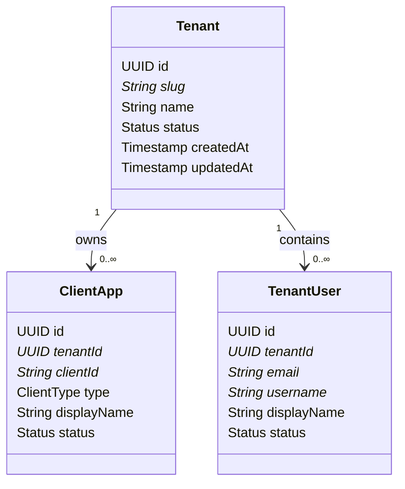

**Invariante:** Todo usuario y app dentro de un tenant debe tener `tenant_id` consistente.

---

### Contexto 2: Client Application Management

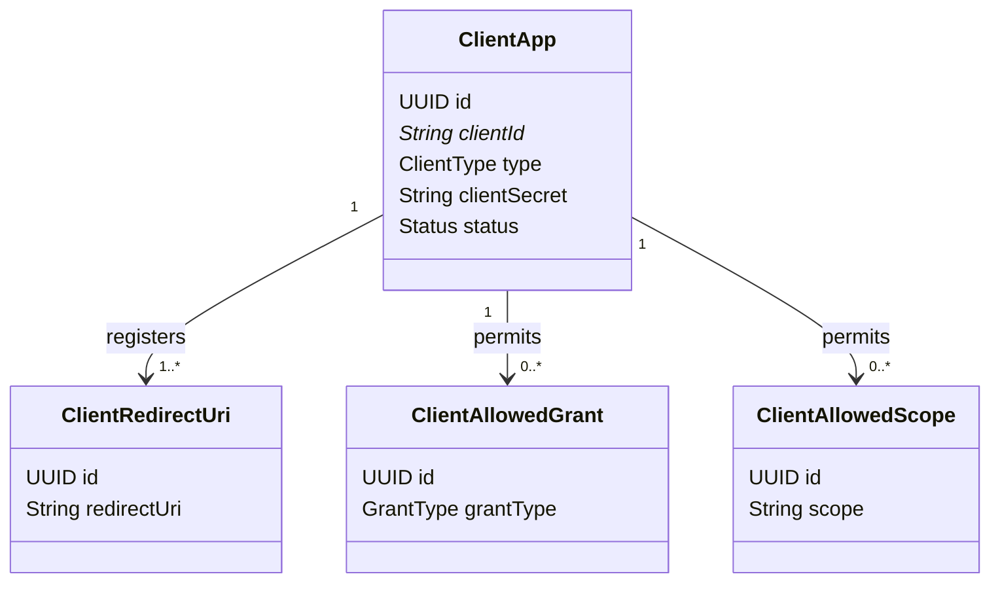

**Reglas:**
- Redirect URIs validación exacta (sin wildcards).
- Client solo puede usar grants/scopes registrados aquí.
- Secret solo para tipo `CONFIDENTIAL`.

---

### Contexto 3: User Identity & Membership

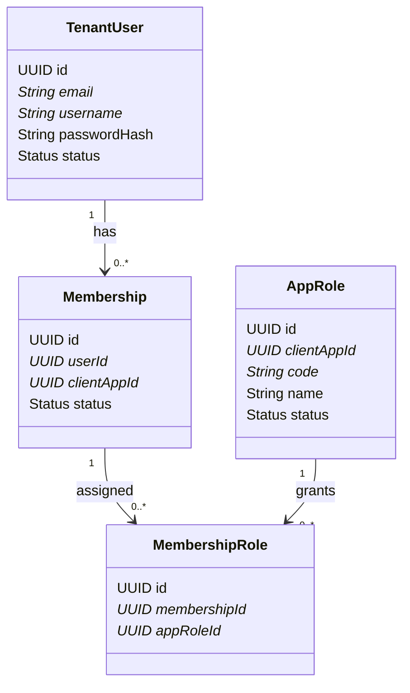

**Invariantes:**
- Un usuario puede tener 0 o más memberships.
- Una membership = acceso potencial a una app.
- Una membership = 0 o más roles dentro de esa app.
- Roles son específicos por app.

---

### Contexto 4: Authorization & Token Lifecycle

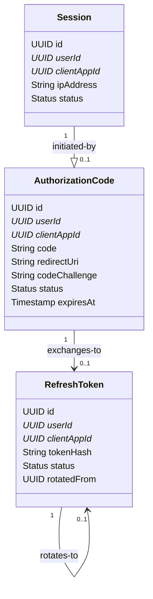

**Flujos:**
1. Authorization Code → canjeable una sola vez → RefreshToken + AccessToken.
2. RefreshToken → renovable múltiples veces → nuevo AccessToken.
3. Session → trazabilidad de login exitoso.

---

## Flujos de autenticación (Authorization Code)

### OAuth2 Authorization Code Flow + PKCE

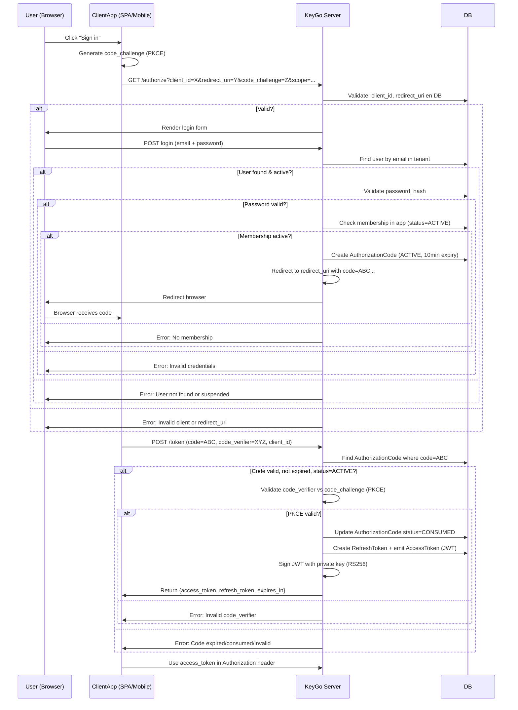

---

### Verificación de memberships en login

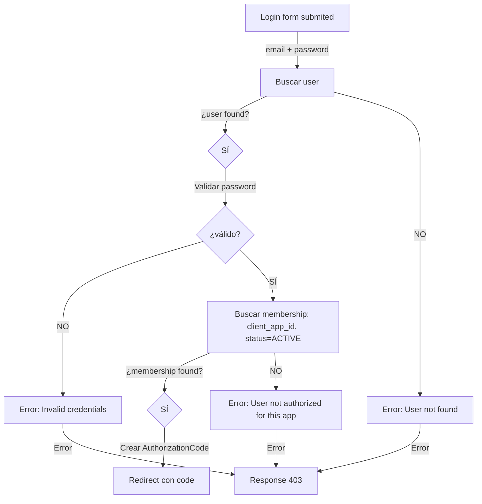

---

## Flujos de token (refresh, revoke)

### Refresh Token Flow

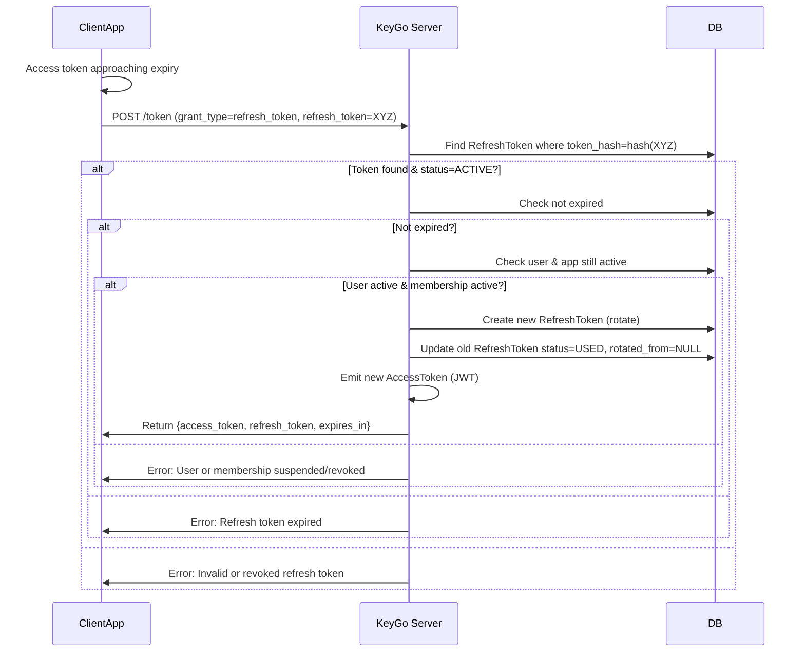

### Token Revocation

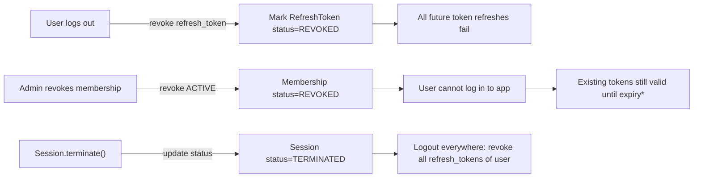

**Nota:** Los access tokens (JWT firmados) no se revocan en DB; solo se revisan en el siguiente refresh. Para revocación inmediata, usar `Session` + lista negra opcional.

---

## Ciclo de vida de memberships y roles

### Creación y transiciones de Membership

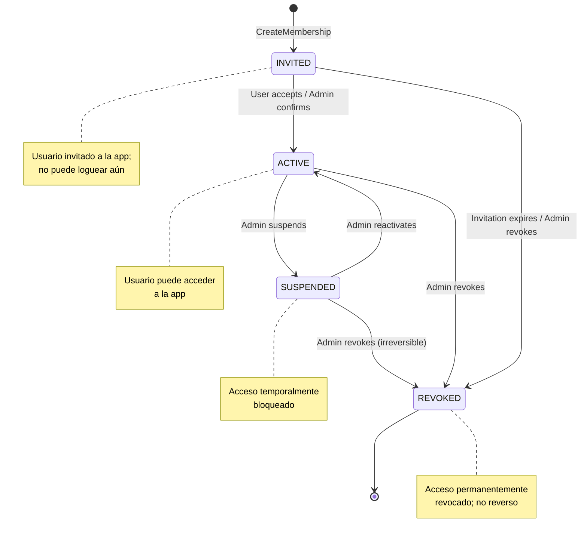

---

### Asignación de roles a un usuario en una app

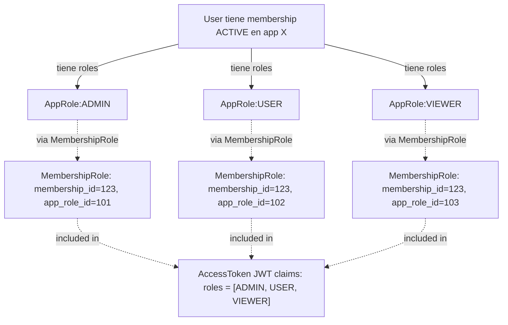

---

## Modelo de permisos y autorización

### Matriz de decisión para acceso a app

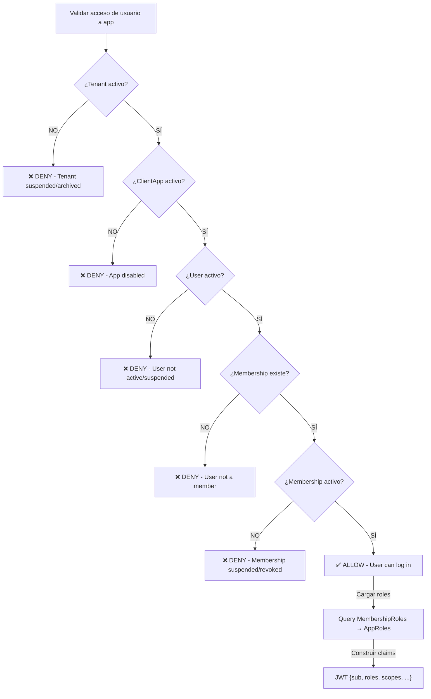

---

### Flujo de validación en endpoint protegido

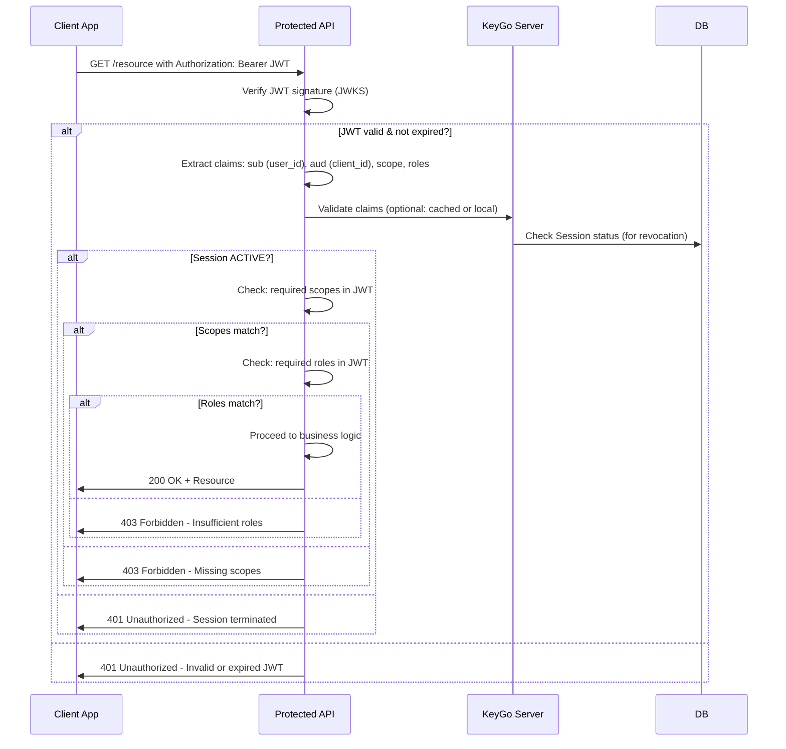

---

### Tabla de decisión: Transiciones permitidas de Membership Status

| Estado actual | Acción admin | Nuevo estado | Reversible? |
|---|---|---|---|
| `INVITED` | Confirmar | `ACTIVE` | Sí (volver a INVITED o REVOKED) |
| `INVITED` | Revocar | `REVOKED` | ❌ No |
| `ACTIVE` | Suspender | `SUSPENDED` | Sí (reactivar a ACTIVE) |
| `ACTIVE` | Revocar | `REVOKED` | ❌ No |
| `SUSPENDED` | Reactivar | `ACTIVE` | Sí (volver a SUSPENDED o REVOKED) |
| `SUSPENDED` | Revocar | `REVOKED` | ❌ No |
| `REVOKED` | *Ninguna* | `REVOKED` | ❌ No (permanente) |

---

## Diagrama de capas lógicas de validación

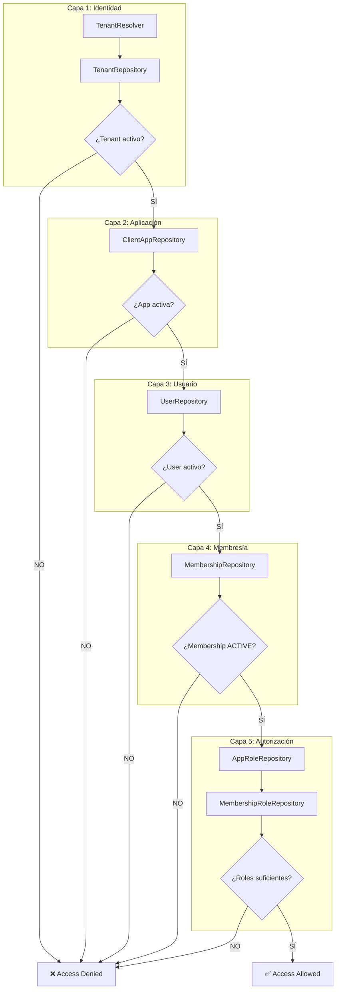

---

## Índices recomendados (por rendimiento)

```sql
-- Búsqueda rápida por tenant + recurso
CREATE INDEX idx_client_apps_tenant_id ON client_apps(tenant_id, status);
CREATE INDEX idx_tenant_users_tenant_id ON tenant_users(tenant_id, status);
CREATE INDEX idx_memberships_tenant_user_app ON memberships(tenant_id, user_id, client_app_id);
CREATE INDEX idx_memberships_app_status ON memberships(client_app_id, status);
CREATE INDEX idx_app_role_client_app_id ON app_role(client_app_id, status);

-- Búsqueda rápida de tokens
CREATE INDEX idx_authorization_codes_code ON authorization_codes(code);
CREATE INDEX idx_authorization_codes_expires ON authorization_codes(expires_at, status);
CREATE INDEX idx_refresh_tokens_hash ON refresh_tokens(token_hash);
CREATE INDEX idx_refresh_tokens_user_app ON refresh_tokens(user_id, client_app_id, status);

-- Búsqueda rápida de sesiones
CREATE INDEX idx_sessions_user_status ON sessions(user_id, status);
CREATE INDEX idx_sessions_tenant_user ON sessions(tenant_id, user_id);

-- Email/username lookup
CREATE INDEX idx_tenant_users_email ON tenant_users(tenant_id, email);
CREATE INDEX idx_tenant_users_username ON tenant_users(tenant_id, username);

-- JWKS lookup
CREATE INDEX idx_signing_keys_status ON signing_keys(status);
```

---

**Última actualización:** 2026-03-22 | **Responsable:** AI Agent | **Estado:** ✅ Completo

