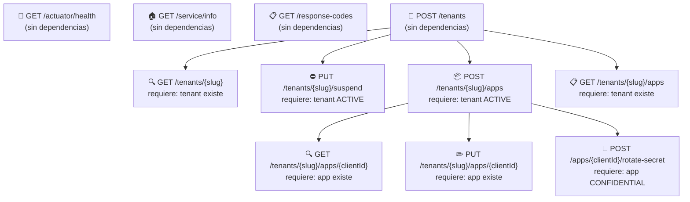

# Guía de Pruebas con Postman — KeyGo Server

> **Público objetivo:** Perfil de QA / Testing que necesita verificar los endpoints REST de KeyGo Server
> usando Postman (o herramientas compatibles como Bruno, Insomnia, curl).

---

## Índice

1. [Requisitos previos](#1-requisitos-previos)
2. [Configuración inicial](#2-configuración-inicial)
   - [Con acceso al código fuente](#21-con-acceso-al-código-fuente)
   - [Sin acceso al código fuente](#22-sin-acceso-al-código-fuente)
3. [Importar la colección en Postman](#3-importar-la-colección-en-postman)
4. [Estructura de respuesta (BaseResponse)](#4-estructura-de-respuesta-baseresponse)
5. [Headers requeridos](#5-headers-requeridos)
6. [Mapa de endpoints y dependencias](#6-mapa-de-endpoints-y-dependencias)
7. [Orden de ejecución recomendado](#7-orden-de-ejecución-recomendado)
   - [Fase 0 — Smoke test del servidor](#fase-0--smoke-test-del-servidor)
   - [Fase 1 — Plataforma e información](#fase-1--plataforma-e-información)
   - [Fase 2 — Gestión de Tenants (flujo completo)](#fase-2--gestión-de-tenants-flujo-completo)
   - [Fase 3 — Gestión de Aplicaciones Cliente](#fase-3--gestión-de-aplicaciones-cliente)
   - [Fase 4 — Escenarios de error y validación](#fase-4--escenarios-de-error-y-validación)
8. [Referencia rápida de endpoints](#8-referencia-rápida-de-endpoints)
9. [Variables de entorno en Postman](#9-variables-de-entorno-en-postman)
10. [Consejos para ejecutar la colección completa](#10-consejos-para-ejecutar-la-colección-completa)
11. [Solución de problemas frecuentes](#11-solución-de-problemas-frecuentes)

---

## 1. Requisitos previos

| Requisito | Versión mínima | Notas |
|---|---|---|
| Postman | 10.x o superior | También compatible con Bruno, Insomnia |
| KeyGo Server corriendo | cualquier | Ver sección de configuración |
| Colección Postman | v2.1.0 | `postman/KeyGo-Server.postman_collection.json` |
| Entorno Postman | — | `postman/KeyGo-Server-Local.postman_environment.json` |

> **Base de datos opcional:** Si el perfil `supabase` está activo, los datos persisten entre
> reinicios del servidor. Sin él, el servidor puede usar almacenamiento en memoria
> (los datos se pierden al reiniciar).

---

## 2. Configuración inicial

### 2.1 Con acceso al código fuente

Si tenés acceso al repositorio, podés verificar o ajustar estos valores directamente:

#### Variables de entorno de la aplicación

| Variable de entorno | Dónde buscarla | Valor por defecto (dev) | Descripción |
|---|---|---|---|
| `KEYGO_ADMIN_KEY` | `keygo-run/src/main/resources/application.yml` → `keygo.bootstrap.admin-key` | `changeMe` | Clave maestra del sistema |
| `PORT` | `application.yml` → `server.port` | `8080` | Puerto HTTP |
| `SPRING_PROFILES_ACTIVE` | Variable de entorno del proceso | `default` | Perfil activo (ej: `supabase,local`) |
| `SUPABASE_URL` | Solo si perfil `supabase` activo | — | URL JDBC de PostgreSQL |
| `SUPABASE_USER` | Solo si perfil `supabase` activo | `postgres` | Usuario de BD |
| `SUPABASE_PASSWORD` | Solo si perfil `supabase` activo | `postgres` | Contraseña de BD |

#### Verificar en `application.yml`

```yaml
# keygo-run/src/main/resources/application.yml
server:
  port: "${PORT:8080}"            # ← puerto del servidor
  servlet:
    context-path: "/${keygo.info.name}"   # ← context-path = /keygo-server

keygo:
  bootstrap:
    enabled: true
    admin-key: "${KEYGO_ADMIN_KEY:changeMe}"  # ← valor del header X-KEYGO-ADMIN
```

#### Levantar el servidor localmente

```bash
# Sin base de datos (modo default)
./mvnw spring-boot:run -pl keygo-run

# Con base de datos Supabase (requiere Docker)
cd keygo-supabase && ./scripts/dev-start.sh
export SPRING_PROFILES_ACTIVE="supabase,local"
export SUPABASE_URL="jdbc:postgresql://localhost:5432/keygo"
export SUPABASE_USER="postgres"
export SUPABASE_PASSWORD="postgres"
./mvnw spring-boot:run -pl keygo-run
```

---

### 2.2 Sin acceso al código fuente

Si **no** tenés acceso al repositorio, solicitá al equipo de desarrollo o DevOps la siguiente información antes de comenzar las pruebas:

| Información a solicitar | Para qué sirve |
|---|---|
| **URL base del servidor** | Ej: `http://192.168.1.100:8080` o URL de staging |
| **Valor de `KEYGO_ADMIN_KEY`** | Header `X-KEYGO-ADMIN` — sin esto no funcionan las rutas protegidas |
| **¿Está activo el perfil `supabase`?** | Determina si los datos persisten entre pruebas |
| **¿El `BootstrapAdminKeyFilter` está habilitado?** | Si `keygo.bootstrap.enabled=false`, todas las rutas son públicas |
| **¿Hay datos de prueba pre-cargados?** | Afecta las pruebas de "listar" que esperan resultados |
| **Versión desplegada** | Para saber si aplican limitaciones conocidas (ver sección Bugs conocidos) |

> ⚠️ **Bug conocido (versión actual):** El filtro `BootstrapAdminKeyFilter` tiene un problema
> con el `context-path`. Actualmente **no valida** el header `X-KEYGO-ADMIN` aunque esté
> configurado. Igual se recomienda enviarlo para pruebas de compatibilidad futura.

---

## 3. Importar la colección en Postman

### Paso a paso

1. Abrir Postman.
2. Hacer clic en **Import** (botón superior izquierdo).
3. Seleccionar la pestaña **File** y arrastrar (o buscar) los dos archivos:
   - `postman/KeyGo-Server.postman_collection.json`
   - `postman/KeyGo-Server-Local.postman_environment.json`
4. Confirmar la importación.
5. En la esquina superior derecha de Postman, seleccionar el entorno **"KeyGo Server — Local"** en el selector de entornos.
6. Abrir el entorno y verificar / ajustar las variables:

| Variable | Valor por defecto | Ajustar si... |
|---|---|---|
| `baseUrl` | `http://localhost:8080` | El servidor corre en otro host/puerto |
| `contextPath` | `keygo-server` | Nunca debería cambiar |
| `adminKey` | `changeMe` | El equipo provee una clave diferente |
| `tenantSlug` | *(vacío)* | Se llena automáticamente al crear un tenant |
| `tenantName` | `Acme Corp` | Cambiar al nombre de tenant de prueba deseado |
| `tenantOwnerEmail` | `admin@acme.com` | Cambiar al email de prueba deseado |
| `clientId` | *(vacío)* | Se llena automáticamente al crear una app cliente |

---

## 4. Estructura de respuesta (BaseResponse)

Todos los endpoints de KeyGo Server devuelven una estructura estándar llamada `BaseResponse<T>`:

```json
{
  "date": "2026-03-21T14:30:00",
  "success": {
    "code": "TENANT_CREATED",
    "message": "Tenant created successfully"
  },
  "data": { ... }
}
```

En caso de error:

```json
{
  "date": "2026-03-21T14:30:00",
  "failure": {
    "code": "RESOURCE_NOT_FOUND",
    "message": "Requested resource was not found"
  }
}
```

**Reglas de validación aplicables a toda respuesta:**

- Siempre tiene `date`.
- Si es éxito: tiene `success` (con `code` y `message`) y generalmente `data`.
- Si es error: tiene `failure` (con `code` y `message`). **Nunca** tiene `data` ni `success`.
- `Content-Type` siempre es `application/json`.
- Tiempo de respuesta esperado: < 3 segundos.

### Catálogo de códigos de respuesta relevantes

| Código | Tipo | HTTP esperado | Escenario |
|---|---|---|---|
| `SERVICE_INFO_RETRIEVED` | SUCCESS | 200 | GET /service/info |
| `RESPONSE_CODES_RETRIEVED` | SUCCESS | 200 | GET /response-codes |
| `TENANT_CREATED` | SUCCESS | 201 | POST /tenants |
| `TENANT_RETRIEVED` | SUCCESS | 200 | GET /tenants/{slug} |
| `TENANT_SUSPENDED` | SUCCESS | 200 | PUT /tenants/{slug}/suspend |
| `CLIENT_APP_CREATED` | SUCCESS | 201 | POST /tenants/{slug}/apps |
| `CLIENT_APP_LIST_RETRIEVED` | SUCCESS | 200 | GET /tenants/{slug}/apps |
| `CLIENT_APP_RETRIEVED` | SUCCESS | 200 | GET /tenants/{slug}/apps/{id} |
| `CLIENT_APP_UPDATED` | SUCCESS | 200 | PUT /tenants/{slug}/apps/{id} |
| `CLIENT_APP_SECRET_ROTATED` | SUCCESS | 200 | POST /tenants/{slug}/apps/{id}/rotate-secret |
| `INVALID_INPUT` | FAILURE | 400 | Campos inválidos o faltantes |
| `AUTHENTICATION_REQUIRED` | FAILURE | 401 | Header X-KEYGO-ADMIN ausente/inválido |
| `BUSINESS_RULE_VIOLATION` | FAILURE | 403 | Regla de negocio violada (ej: suspender tenant ya suspendido) |
| `RESOURCE_NOT_FOUND` | FAILURE | 404 | Recurso no encontrado |
| `OPERATION_FAILED` | FAILURE | 500 | Error interno del servidor |

---

## 5. Headers requeridos

### Rutas protegidas (`/api/**`)

```
X-KEYGO-ADMIN: <valor de KEYGO_ADMIN_KEY>
```

La colección configura este header a nivel de colección, por lo que se aplica automáticamente.
Las rutas que **no** lo necesitan tienen `auth: noauth` configurado explícitamente.

### Endpoints de Client Apps (adicional)

```
X-Tenant-Slug: <slug del tenant>
```

Los endpoints de apps cliente requieren este header **además** de `X-KEYGO-ADMIN`.

### Content-Type para requests con body

```
Content-Type: application/json
```

---

## 6. Mapa de endpoints y dependencias

El siguiente diagrama muestra qué endpoints dependen de qué recursos para funcionar correctamente:



> **Regla clave:** Si listás (`GET /apps`) antes de crear al menos una app, el array `data`
> vendrá vacío — lo cual es un comportamiento correcto, no un error. Creá primero, listá después.

---

## 7. Orden de ejecución recomendado

### Fase 0 — Smoke test del servidor

> **Objetivo:** Verificar que el servidor está levantado y responde antes de ejecutar cualquier prueba.

| # | Request | Método | URL | Auth | Resultado esperado |
|---|---|---|---|---|---|
| 0.1 | Health Check | GET | `/actuator/health` | Ninguna | 200 `{"status":"UP"}` |
| 0.2 | Actuator — Endpoints | GET | `/actuator` | Ninguna | 200 con `_links` |

**¿Qué verificar?**
- Status 200 en ambas requests.
- `"status": "UP"` en Health Check.
- Si falla: el servidor no está corriendo o la URL/puerto son incorrectos.

---

### Fase 1 — Plataforma e información

> **Objetivo:** Validar los endpoints de información del sistema.
> **Dependencias:** Solo necesita el servidor corriendo.

| # | Request | Método | URL | Auth | Resultado esperado |
|---|---|---|---|---|---|
| 1.1 | Service Info | GET | `/api/v1/service/info` | Ninguna | 200 + `SERVICE_INFO_RETRIEVED` |
| 1.2 | Response Codes Catalog | GET | `/api/v1/response-codes` | `X-KEYGO-ADMIN` | 200 + `RESPONSE_CODES_RETRIEVED` |

**¿Qué verificar en 1.1 (Service Info)?**
- `data.title` tiene un valor no vacío (ej: `"KeyGo Server"`).
- `data.name` coincide con el nombre del artefacto.
- `data.version` tiene la versión desplegada.

**¿Qué verificar en 1.2 (Response Codes)?**
- `data.successCodes` es un array no vacío.
- `data.failureCodes` es un array no vacío.
- Cada código tiene `code`, `message` y `type` (`"SUCCESS"` o `"FAILURE"`).

---

### Fase 2 — Gestión de Tenants (flujo completo)

> **Objetivo:** Probar el ciclo de vida completo de un tenant: creación → consulta → suspensión.
> **Dependencias:** Ninguna (los tenants no dependen de otros recursos).

#### 2.1 Crear tenant

| # | Request | Método | URL | Auth | Resultado esperado |
|---|---|---|---|---|---|
| 2.1 | **POST Create Tenant** | POST | `/api/v1/tenants` | `X-KEYGO-ADMIN` | **201** + `TENANT_CREATED` |

**Body de ejemplo:**
```json
{
  "name": "Acme Corp",
  "slug": "acme-corp",
  "ownerEmail": "admin@acme.com"
}
```

> ⚠️ **El slug debe ser único.** La colección genera automáticamente un slug con timestamp
> (`acme-corp-<timestamp>`) para evitar conflictos entre ejecuciones. La variable
> `{{tenantSlug}}` se guarda automáticamente en el entorno.

**¿Qué verificar?**
- HTTP 201 Created.
- `data.status` es `"ACTIVE"`.
- `data.id` es un UUID no vacío.
- `data.slug` coincide con el slug enviado.
- La variable `tenantSlug` en el entorno Postman se actualizó automáticamente.

---

#### 2.2 Consultar tenant

| # | Request | Método | URL | Auth | Resultado esperado |
|---|---|---|---|---|---|
| 2.2 | **GET Tenant by Slug** | GET | `/api/v1/tenants/{{tenantSlug}}` | `X-KEYGO-ADMIN` | **200** + `TENANT_RETRIEVED` |

> **Dependencia:** Ejecutar **2.1** primero. Si `tenantSlug` está vacío en el entorno, esta
> request usará un slug nulo y fallará con 404.

**¿Qué verificar?**
- HTTP 200 OK.
- `data.slug` coincide exactamente con `{{tenantSlug}}`.
- `data.status` es `"ACTIVE"`.
- Todos los campos: `id`, `name`, `slug`, `ownerEmail`, `status`.

---

#### 2.3 Suspender tenant

| # | Request | Método | URL | Auth | Resultado esperado |
|---|---|---|---|---|---|
| 2.3 | **PUT Suspend Tenant** | PUT | `/api/v1/tenants/{{tenantSlug}}/suspend` | `X-KEYGO-ADMIN` | **200** + `TENANT_SUSPENDED` |

> **Dependencia:** Ejecutar **2.1** primero. El tenant debe estar en estado `ACTIVE`.

**¿Qué verificar?**
- HTTP 200 OK.
- `data.status` es `"SUSPENDED"`.

---

#### 2.4 Verificar estado post-suspensión

| # | Request | Método | URL | Auth | Resultado esperado |
|---|---|---|---|---|---|
| 2.4 | **GET Tenant (suspendido)** | GET | `/api/v1/tenants/{{tenantSlug}}` | `X-KEYGO-ADMIN` | **200** con `status: SUSPENDED` |

> **Dependencia:** Ejecutar **2.3** primero.

**¿Qué verificar?**
- `data.status` es `"SUSPENDED"` (confirma que la suspensión persistió).

---

### Fase 3 — Gestión de Aplicaciones Cliente

> **Objetivo:** Probar el ciclo de vida completo de una app cliente OAuth2.
> **Dependencia crítica:** Debe existir un tenant en estado `ACTIVE` con su `slug` en la
> variable `{{tenantSlug}}`. Si el tenant fue suspendido en la Fase 2, **crear un tenant nuevo**
> (repetir paso 2.1) antes de continuar esta fase.

> ⚠️ **Importante:** Los endpoints de Client Apps requieren **dos headers** simultáneamente:
> `X-KEYGO-ADMIN` (colección) y `X-Tenant-Slug: {{tenantSlug}}` (por request).

#### 3.1 Listar apps (antes de crear — lista vacía)

| # | Request | Método | URL | Auth | Resultado esperado |
|---|---|---|---|---|---|
| 3.1 | **GET List Client Apps (vacío)** | GET | `/api/v1/tenants/{{tenantSlug}}/apps` | Admin + Tenant header | **200** + array vacío `[]` |

> **¿Por qué ejecutar esto primero?** Para demostrar que el endpoint funciona correctamente
> cuando no hay datos, y comparar luego de crear apps.

**¿Qué verificar?**
- HTTP 200 OK.
- `data` es un array vacío `[]`.
- `success.code` es `CLIENT_APP_LIST_RETRIEVED`.

---

#### 3.2 Crear app cliente

| # | Request | Método | URL | Auth | Resultado esperado |
|---|---|---|---|---|---|
| 3.2 | **POST Create Client App** | POST | `/api/v1/tenants/{{tenantSlug}}/apps` | Admin + Tenant header | **201** + `CLIENT_APP_CREATED` |

**Body de ejemplo:**
```json
{
  "name": "My Test App",
  "description": "App creada desde Postman",
  "type": "CONFIDENTIAL",
  "redirectUris": ["https://myapp.example.com/callback"],
  "grants": ["AUTHORIZATION_CODE", "REFRESH_TOKEN"],
  "scopes": ["openid", "profile", "email"]
}
```

**Valores válidos:**
- `type`: `CONFIDENTIAL` o `PUBLIC`
- `grants`: `AUTHORIZATION_CODE`, `REFRESH_TOKEN`, `CLIENT_CREDENTIALS`, `IMPLICIT`
- `scopes`: strings libres (convención OAuth2: `openid`, `profile`, `email`, etc.)

**¿Qué verificar?**
- HTTP 201 Created.
- `data.clientId` es un string no vacío (se guarda automáticamente en `{{clientId}}`).
- `data.clientSecret` está presente — **este es el único momento en que se muestra en texto plano**.
- La variable `clientId` en el entorno se actualizó automáticamente.

> 🔐 **IMPORTANTE:** El `clientSecret` solo se devuelve en la creación y en la rotación.
> Guardalo en un lugar seguro. No hay forma de recuperarlo después.

---

#### 3.3 Listar apps (con datos)

| # | Request | Método | URL | Auth | Resultado esperado |
|---|---|---|---|---|---|
| 3.3 | **GET List Client Apps** | GET | `/api/v1/tenants/{{tenantSlug}}/apps` | Admin + Tenant header | **200** + array con ≥1 app |

**¿Qué verificar?**
- HTTP 200 OK.
- `data` es un array con al menos un elemento.
- El elemento contiene `clientId`, `name`, `type`, `status`.
- El `clientId` del primer elemento coincide con `{{clientId}}`.

---

#### 3.4 Obtener app específica

| # | Request | Método | URL | Auth | Resultado esperado |
|---|---|---|---|---|---|
| 3.4 | **GET Get Client App** | GET | `/api/v1/tenants/{{tenantSlug}}/apps/{{clientId}}` | Admin + Tenant header | **200** + `CLIENT_APP_RETRIEVED` |

**¿Qué verificar?**
- HTTP 200 OK.
- `data.clientId` coincide con `{{clientId}}`.
- Los campos `name`, `type`, `redirectUris`, `grants`, `scopes` están presentes.
- `clientSecret` **no** aparece en esta respuesta (ya fue guardado en el momento de creación).

---

#### 3.5 Actualizar app cliente

| # | Request | Método | URL | Auth | Resultado esperado |
|---|---|---|---|---|---|
| 3.5 | **PUT Update Client App** | PUT | `/api/v1/tenants/{{tenantSlug}}/apps/{{clientId}}` | Admin + Tenant header | **200** + `CLIENT_APP_UPDATED` |

**Body de ejemplo:**
```json
{
  "name": "My Updated App",
  "description": "Descripción actualizada",
  "redirectUris": [
    "https://myapp.example.com/callback",
    "https://myapp.example.com/callback2"
  ],
  "grants": ["AUTHORIZATION_CODE", "REFRESH_TOKEN"],
  "scopes": ["openid", "profile"]
}
```

**¿Qué verificar?**
- HTTP 200 OK.
- `data.name` es `"My Updated App"`.
- `data.redirectUris` contiene las 2 URIs actualizadas.

---

#### 3.6 Rotar el client secret

| # | Request | Método | URL | Auth | Resultado esperado |
|---|---|---|---|---|---|
| 3.6 | **POST Rotate Client Secret** | POST | `/api/v1/tenants/{{tenantSlug}}/apps/{{clientId}}/rotate-secret` | Admin + Tenant header | **200** + `CLIENT_APP_SECRET_ROTATED` |

**¿Qué verificar?**
- HTTP 200 OK.
- `data.clientSecret` es un string no vacío y **diferente** al original.
- `data.clientId` coincide con `{{clientId}}`.

> 🔄 Después de rotar el secret, el anterior queda inválido. Si hay aplicaciones usando el
> secret anterior, dejarán de funcionar hasta que se actualice en su configuración.

---

### Fase 4 — Escenarios de error y validación

> **Objetivo:** Verificar que el sistema maneja correctamente los casos negativos.
> **Dependencias:** La mayoría son independientes; algunos requieren estado previo.

| # | Request | Método | Escenario | HTTP esperado | Código esperado |
|---|---|---|---|---|---|
| 4.1 | POST /tenants | POST | Body vacío `{}` | **400** | `INVALID_INPUT` |
| 4.2 | POST /tenants | POST | Slug inválido (`-slug-`)  | **400** | `INVALID_INPUT` |
| 4.3 | POST /tenants | POST | Email mal formado | **400** | `INVALID_INPUT` |
| 4.4 | GET /tenants/{slug} | GET | Slug inexistente | **404** | `RESOURCE_NOT_FOUND` |
| 4.5 | PUT /tenants/{slug}/suspend | PUT | Slug inexistente | **404** | `RESOURCE_NOT_FOUND` |
| 4.6 | PUT /tenants/{slug}/suspend | PUT | Tenant ya suspendido | **403** | `BUSINESS_RULE_VIOLATION` |
| 4.7 | GET /api/v1/ruta-no-existe | GET | Ruta inexistente | **404** | `RESOURCE_NOT_FOUND` |

#### Detalle de cada escenario

**4.1 — Body vacío:**
```json
{}
```
Verificar: `failure.code = "INVALID_INPUT"` y ausencia de `success` y `data`.

**4.2 — Slug inválido (empieza/termina con guión):**
```json
{
  "name": "Test",
  "slug": "-slug-invalido-",
  "ownerEmail": "test@example.com"
}
```
El slug solo acepta: letras minúsculas, números y guiones intermedios (regex: `^[a-z0-9][a-z0-9\-]*[a-z0-9]$`).

**4.3 — Email mal formado:**
```json
{
  "name": "Test",
  "slug": "test-valido",
  "ownerEmail": "no-es-un-email"
}
```

**4.4 y 4.5 — Recurso inexistente:**
Usar slug literal `no-existe-este-tenant`.

**4.6 — Tenant ya suspendido:**
> **Prerequisito:** El tenant debe estar suspendido (ejecutar 2.3 primero).
Llamar a `PUT /tenants/{{tenantSlug}}/suspend` por segunda vez sobre el mismo tenant.

---

## 8. Referencia rápida de endpoints

| Nº | Método | Ruta completa | Auth | Body | Descripción |
|---|---|---|---|---|---|
| 1 | GET | `/keygo-server/actuator/health` | Ninguna | — | Health check del servidor |
| 2 | GET | `/keygo-server/actuator` | Ninguna | — | Lista endpoints actuator |
| 3 | GET | `/keygo-server/api/v1/service/info` | Ninguna | — | Información del servicio |
| 4 | GET | `/keygo-server/api/v1/response-codes` | Admin | — | Catálogo de códigos de respuesta |
| 5 | POST | `/keygo-server/api/v1/tenants` | Admin | JSON | Crear tenant |
| 6 | GET | `/keygo-server/api/v1/tenants/{slug}` | Admin | — | Obtener tenant por slug |
| 7 | PUT | `/keygo-server/api/v1/tenants/{slug}/suspend` | Admin | — | Suspender tenant |
| 8 | POST | `/keygo-server/api/v1/tenants/{slug}/apps` | Admin + Tenant | JSON | Crear app cliente |
| 9 | GET | `/keygo-server/api/v1/tenants/{slug}/apps` | Admin + Tenant | — | Listar apps del tenant |
| 10 | GET | `/keygo-server/api/v1/tenants/{slug}/apps/{clientId}` | Admin + Tenant | — | Obtener app específica |
| 11 | PUT | `/keygo-server/api/v1/tenants/{slug}/apps/{clientId}` | Admin + Tenant | JSON | Actualizar app |
| 12 | POST | `/keygo-server/api/v1/tenants/{slug}/apps/{clientId}/rotate-secret` | Admin + Tenant | — | Rotar client secret |
| 13 | GET | `/keygo-server/swagger-ui/index.html` | Ninguna | — | Swagger UI interactiva |
| 14 | GET | `/keygo-server/v3/api-docs` | Ninguna | — | OpenAPI JSON spec |

> **Base local:** `http://localhost:8080`
> **URL completa de ejemplo:** `http://localhost:8080/keygo-server/api/v1/tenants`

---

## 9. Variables de entorno en Postman

La colección usa variables que se propagan automáticamente entre requests:

| Variable | Scope | Cómo se setea | Usada en |
|---|---|---|---|
| `baseUrl` | Entorno | Manual | Todas las requests |
| `contextPath` | Entorno | Manual (siempre `keygo-server`) | Todas las requests |
| `adminKey` | Entorno | Manual | Header `X-KEYGO-ADMIN` |
| `tenantSlug` | Entorno | **Automático** — script test de POST /tenants | Requests de Tenants y Client Apps |
| `tenantName` | Entorno | Manual | Body de POST /tenants |
| `tenantOwnerEmail` | Entorno | Manual | Body de POST /tenants |
| `clientId` | Entorno | **Automático** — script test de POST /apps | Requests de Client Apps específicas |
| `fullBaseUrl` | Colección | **Automático** — pre-request script de colección | URL de todas las requests |

### Flujo automático de variables

```
POST /tenants (201 Created)
    → script test guarda body.data.slug → pm.environment.set('tenantSlug', slug)

POST /tenants/{slug}/apps (201 Created)
    → script test guarda body.data.clientId → pm.environment.set('clientId', clientId)
```

Si ejecutás las requests en orden, no necesitás copiar/pegar valores manualmente.

---

## 10. Consejos para ejecutar la colección completa

### Usar Collection Runner

1. Hacer clic derecho sobre la colección **"KeyGo Server API"** en el panel izquierdo.
2. Seleccionar **Run collection**.
3. En el diálogo, asegurarse de que el entorno **"KeyGo Server — Local"** esté seleccionado.
4. **Ordenar las carpetas** en el orden correcto:
   1. 🏥 Actuator
   2. 🏠 Platform
   3. 🏢 Tenants
   4. 📦 Client Apps
   5. ⚠️ Escenarios de Error
5. Dejar el delay entre requests en **100ms** para evitar condiciones de carrera.
6. Hacer clic en **Run**.

### Ejecutar con Newman (CLI)

Si necesitás integrar en CI/CD o ejecutar desde terminal:

```bash
# Instalar Newman
npm install -g newman

# Ejecutar la colección completa
newman run postman/KeyGo-Server.postman_collection.json \
  --environment postman/KeyGo-Server-Local.postman_environment.json \
  --reporters cli,json \
  --reporter-json-export results/newman-report.json
```

### Ejecutar una sola carpeta

```bash
newman run postman/KeyGo-Server.postman_collection.json \
  --environment postman/KeyGo-Server-Local.postman_environment.json \
  --folder "🏢 Tenants"
```

---

## 11. Solución de problemas frecuentes

### ❌ `ECONNREFUSED` — No se puede conectar al servidor

**Causa:** El servidor no está corriendo o el puerto/host es incorrecto.
**Solución:**
1. Verificar que el servidor está levantado (ver sección 2.1).
2. Confirmar que `baseUrl` en el entorno Postman es correcto.
3. Ejecutar `GET /actuator/health` primero.

---

### ❌ `404 Not Found` en todos los endpoints

**Causa probable:** El `contextPath` no está incluido en la URL.
**Solución:** Todas las URLs deben incluir `/keygo-server/`. Verificar que `contextPath = keygo-server` en el entorno.

---

### ❌ `tenantSlug` está vacío en el entorno

**Causa:** El `POST Create Tenant` no fue ejecutado, o falló.
**Solución:**
1. Ejecutar `POST Create Tenant` exitosamente (debe responder 201).
2. Verificar en Postman → Environments que `tenantSlug` tiene un valor.
3. Si querés usar un tenant existente, setearlo manualmente en el entorno.

---

### ❌ `clientId` está vacío en el entorno

**Causa:** `POST Create Client App` no fue ejecutado o falló.
**Solución:**
1. Asegurarse de que `tenantSlug` tiene un tenant ACTIVE (no suspendido).
2. Ejecutar `POST Create Client App` exitosamente (debe responder 201).
3. Verificar que `clientId` se actualizó en el entorno.

---

### ❌ `POST Create Client App` responde 404

**Causa:** El tenant con ese slug no existe, o fue suspendido.
**Solución:**
1. Crear un tenant nuevo con `POST Create Tenant`.
2. Usar el nuevo `tenantSlug` para crear la app.

---

### ❌ `PUT Suspend Tenant` responde 403

**Causa:** El tenant ya fue suspendido previamente.
**Comportamiento esperado:** Es correcto — es la regla de negocio.
**Si no es lo esperado:** Crear un tenant nuevo y repetir el flujo.

---

### ❌ Los tests de la colección fallan pero la respuesta se ve correcta

**Causa:** Puede haber una discrepancia entre el `code` esperado en el script y el valor real.
**Solución:** Ir a `GET /response-codes` para ver el catálogo real de códigos en la versión
desplegada y comparar con los esperados en los scripts `pm.test()`.

---

### ❌ Header `X-KEYGO-ADMIN` siempre aceptado aunque sea incorrecto

**Causa:** Bug conocido en `BootstrapAdminKeyFilter` — usa `getRequestURI()` en lugar de
`getServletPath()`, por lo que el filtro no valida el header correctamente con `context-path`
activo. Actualmente **todas las rutas son efectivamente públicas** en la versión actual.
**Impacto en pruebas:** Las pruebas de autenticación (401) no pueden ejecutarse hasta que se
corrija el bug. Enviar el header igual para preparar las pruebas futuras.

---

*Documento generado: 2026-03-21 | Versión de la API: 1.0-SNAPSHOT*

