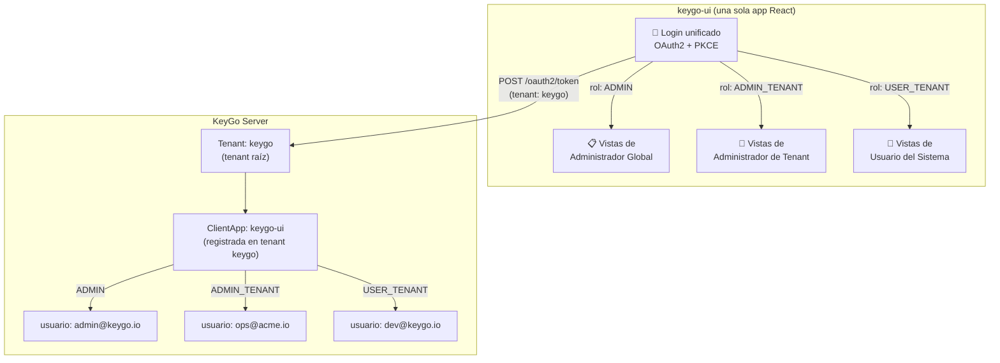
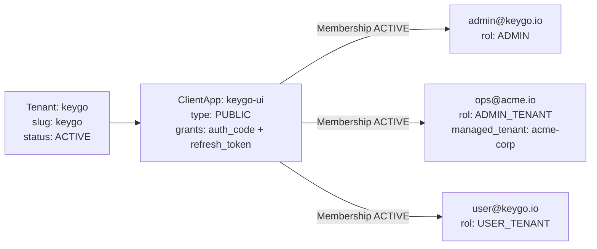
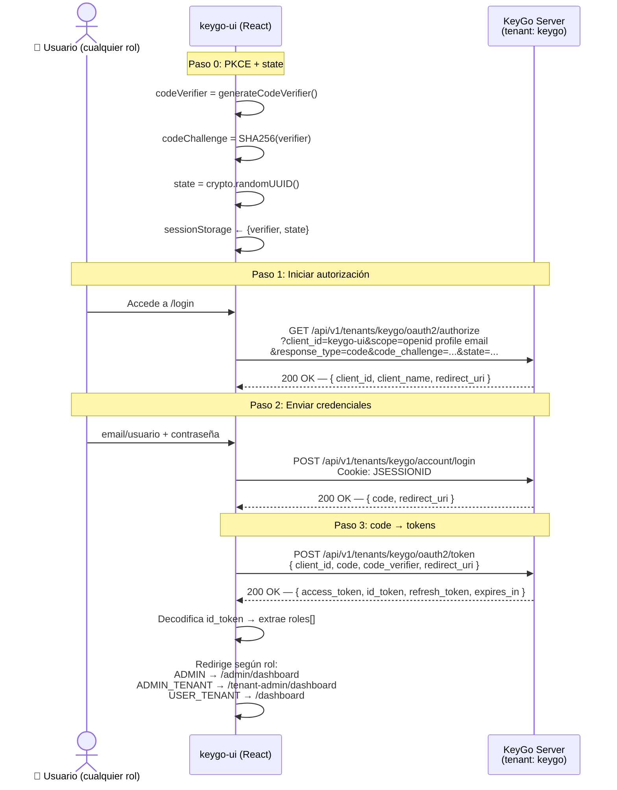
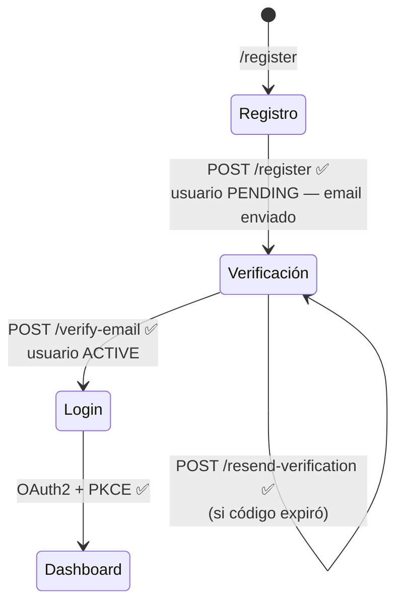

# Manual del Desarrollador Frontend — `keygo-ui`

> **Audiencia:** Desarrolladores frontend que implementan la interfaz de usuario de KeyGo usando React.
> **Versión del backend:** KeyGo Server 1.0-SNAPSHOT (Fases 0-8 completadas, Fase 9 en curso).
> **Fecha:** 2026-03-23
> **Estado:** Documento vivo — se actualiza conforme avanza el backend.

---

## Tabla de contenidos

1. [Visión general y modelo unificado](#1-visión-general-y-modelo-unificado)
2. [Stack tecnológico recomendado](#2-stack-tecnológico-recomendado)
3. [Estructura del proyecto](#3-estructura-del-proyecto)
4. [Prerequisito: el tenant `keygo` y la ClientApp `keygo-ui`](#4-prerequisito-el-tenant-keygo-y-la-clientapp-keygo-ui)
5. [Convenciones fundamentales del backend](#5-convenciones-fundamentales-del-backend)
6. [Flujo de autenticación OAuth2/PKCE — login único para todos los roles](#6-flujo-de-autenticación-oauth2pkce--login-único-para-todos-los-roles)
7. [Gestión de roles y routing condicional](#7-gestión-de-roles-y-routing-condicional)
8. [Vistas del rol `ADMIN` — Administrador Global de KeyGo](#8-vistas-del-rol-admin--administrador-global-de-keygo)
9. [Vistas del rol `ADMIN_TENANT` — Administrador de Tenant](#9-vistas-del-rol-admin_tenant--administrador-de-tenant)
10. [Vistas del rol `USER_TENANT` — Usuario del sistema](#10-vistas-del-rol-user_tenant--usuario-del-sistema)
11. [Perfil de usuario — compartido por todos los roles](#11-perfil-de-usuario--compartido-por-todos-los-roles)
12. [Gestión segura de tokens](#12-gestión-segura-de-tokens)
13. [Interceptores HTTP y manejo de errores](#13-interceptores-http-y-manejo-de-errores)
14. [Inventario de endpoints — disponibles vs. pendientes](#14-inventario-de-endpoints--disponibles-vs-pendientes)
15. [Guía de mocking para features pendientes](#15-guía-de-mocking-para-features-pendientes)
16. [Checklist de seguridad](#16-checklist-de-seguridad)
17. [Comandos de verificación del backend](#17-comandos-de-verificación-del-backend)
18. [Referencias](#18-referencias)

---

## 1. Visión general y modelo unificado

### 1.1. Una sola app, un solo login

`keygo-ui` es **una única aplicación React** registrada como `ClientApp` en el tenant raíz `keygo`.
Todos los usuarios —sin importar si son administradores globales, administradores de tenant o usuarios del sistema— se autentican a través del **mismo flujo OAuth2/PKCE** contra ese tenant.

Lo que cambia según el usuario es su **rol dentro de la app `keygo-ui`**, determinado por los claims del JWT.



### 1.2. Los tres roles

| Rol | ¿Quién es? | ¿Qué gestiona? |
|---|---|---|
| `ADMIN` | Operador del SaaS KeyGo | Todos los tenants, configuración global de la plataforma |
| `ADMIN_TENANT` | Administrador de una organización | Su tenant: apps, usuarios, memberships, roles |
| `USER_TENANT` | Cualquier usuario registrado en keygo-ui | Su perfil, contraseña, sesiones activas |

### 1.3. Modelo de autenticación — estado actual vs. objetivo

| Aspecto | Estado actual (backend) | Estado objetivo |
|---|---|---|
| Login | OAuth2/PKCE ✅ | OAuth2/PKCE ✅ |
| Roles en JWT | Roles básicos en claim `roles` — ⏳ pendiente | Claims ricos: `roles`, `managed_tenant` ⏳ |
| Protección endpoints admin | Header `X-KEYGO-ADMIN` | JWT con rol `ADMIN` / `ADMIN_TENANT` ⏳ |
| Validación de rol en backend | No implementada | `@PreAuthorize` / filtro por rol ⏳ |

> ⚠️ **Compatibilidad temporal:** Mientras el backend no valide JWT para los endpoints admin, el frontend
> debe pasar también el header `X-KEYGO-ADMIN`. Esto es transparente para el usuario — el access_token
> se usa para autorizar las vistas en el frontend, y el header se agrega automáticamente por el
> interceptor HTTP. Ver [sección 13](#13-interceptores-http-y-manejo-de-errores).

---

## 2. Stack tecnológico recomendado

| Capa | Herramienta | Versión | Justificación |
|---|---|---|---|
| Bundler | **Vite** | 6.x | Build ultra rápido, HMR nativo, ESModules |
| Framework | **React** | 19.x | Ecosistema maduro, concurrent features |
| Lenguaje | **TypeScript** | 5.x | Tipado estricto para DTOs y ResponseCodes |
| Router | **React Router** | 7.x | Layouts anidados por rol, rutas tipadas, loaders |
| Estado global | **Zustand** | 5.x | Liviano, sin boilerplate, tokens en memoria |
| Fetching / caché | **TanStack Query** | 5.x | Invalidación automática, loading/error states |
| Formularios | **React Hook Form + Zod** | latest | Validación declarativa e inferida desde tipos |
| HTTP | **Axios** | 1.x | Interceptores para `Authorization`, `X-KEYGO-ADMIN` |
| Estilos | **Tailwind CSS v4 + shadcn/ui** | latest | Accesibilidad, headless, personalizable |
| JWT (browser) | **jose** | 5.x | Verificación RS256 con JWKS + decodificación de claims |
| PKCE | **Web Crypto API** | nativo | Sin dependencias externas para SHA-256 + Base64URL |
| Testing | **Vitest + Testing Library + MSW** | latest | Mocks de API sin levantar servidor |

---

## 3. Estructura del proyecto

Una sola aplicación con layouts y rutas diferenciadas por rol:

```
keygo-ui/
├── src/
│   ├── auth/
│   │   ├── pkce.ts            # generateCodeVerifier, generateCodeChallenge, generateState
│   │   ├── tokenStore.ts      # Zustand store: accessToken, idToken, refreshToken, roles
│   │   ├── roleGuard.tsx      # <RoleGuard> y <AuthGuard> para proteger rutas
│   │   ├── refresh.ts         # Silent refresh automático (80% del TTL)
│   │   ├── jwksVerify.ts      # Verificación RS256 con jose + JWKS + decodeIdToken
│   │   └── logout.ts          # POST /oauth2/revoke + limpiar store
│   │
│   ├── api/
│   │   ├── client.ts          # Instancia Axios base + interceptores + constantes
│   │   ├── tenants.ts         # Endpoints de Control Plane (ADMIN)
│   │   ├── clientApps.ts      # Endpoints de ClientApps (ADMIN_TENANT)
│   │   ├── users.ts           # Endpoints de Usuarios (ADMIN_TENANT)
│   │   ├── memberships.ts     # Endpoints de Memberships y Roles (ADMIN_TENANT)
│   │   └── userinfo.ts        # Endpoint UserInfo (todos)
│   │
│   ├── layouts/
│   │   ├── RootLayout.tsx         # Shell principal (topbar, sidebar adaptativo)
│   │   ├── AdminLayout.tsx        # Layout extendido para ADMIN
│   │   ├── TenantAdminLayout.tsx  # Layout para ADMIN_TENANT (provee ctx del tenant)
│   │   └── UserLayout.tsx         # Layout mínimo para USER_TENANT
│   │
│   ├── pages/
│   │   ├── login/
│   │   │   ├── LoginPage.tsx        # Formulario de credenciales (Pasos 0, 1 y 2)
│   │   │   └── CallbackPage.tsx     # Intercambio code → token (Paso 3) + routing por rol
│   │   ├── register/
│   │   │   ├── RegisterPage.tsx     # Auto-registro (público)
│   │   │   ├── VerifyEmailPage.tsx  # Verificar código recibido por email
│   │   │   └── ResendPage.tsx       # Reenviar código si expiró
│   │   ├── admin/                   # Solo accesible con rol ADMIN
│   │   │   ├── DashboardPage.tsx
│   │   │   ├── TenantsPage.tsx      # ⏳ Listar tenants (mock)
│   │   │   ├── CreateTenantPage.tsx
│   │   │   └── TenantDetailPage.tsx
│   │   ├── tenant-admin/            # Accesible con ADMIN o ADMIN_TENANT
│   │   │   ├── DashboardPage.tsx
│   │   │   ├── AppsPage.tsx
│   │   │   ├── UsersPage.tsx
│   │   │   └── MembershipsPage.tsx
│   │   ├── user/
│   │   │   └── DashboardPage.tsx    # Dashboard para USER_TENANT
│   │   └── shared/                  # Todos los roles autenticados
│   │       ├── ProfilePage.tsx
│   │       ├── ChangePasswordPage.tsx  # ⏳ pendiente
│   │       └── SessionsPage.tsx        # ⏳ pendiente
│   │
│   ├── components/
│   │   ├── BaseResponseHandler.tsx   # Manejo centralizado de BaseResponse<T>
│   │   ├── RoleAwareNav.tsx          # Sidebar/menú adaptativo por rol
│   │   ├── PendingFeatureBadge.tsx   # Badge "Próximamente"
│   │   └── SecretRevealModal.tsx     # clientSecret — mostrar solo una vez
│   │
│   ├── hooks/
│   │   ├── useCurrentUser.ts    # UserInfo desde tokenStore + GET /userinfo
│   │   ├── useHasRole.ts        # Comprueba rol del JWT
│   │   └── useManagedTenant.ts  # Slug del tenant que gestiona el ADMIN_TENANT
│   │
│   ├── types/
│   │   ├── base.ts       # BaseResponse<T>, MessageResponse
│   │   ├── tenant.ts     # TenantData, CreateTenantRequest
│   │   ├── clientapp.ts  # ClientAppData, CreateClientAppRequest
│   │   ├── user.ts       # TenantUserData, CreateUserRequest
│   │   ├── auth.ts       # TokenData, UserInfoData, KeyGoJwtClaims
│   │   └── roles.ts      # AppRole enum (ADMIN | ADMIN_TENANT | USER_TENANT)
│   │
│   ├── mocks/
│   │   ├── handlers.ts   # MSW — handlers para endpoints pendientes
│   │   └── browser.ts    # setupWorker de MSW
│   │
│   ├── router.tsx        # Definición de rutas + guardias por rol
│   ├── App.tsx
│   └── main.tsx
│
├── .env.local            # Variables de entorno locales (NO commitear)
├── vite.config.ts
└── package.json
```

---

## 4. Prerequisito: el tenant `keygo` y la ClientApp `keygo-ui`

Antes de que cualquier usuario pueda acceder a `keygo-ui`, el backend debe tener configurado el tenant
raíz y la app. Esto se hace **una sola vez** al inicializar el entorno.

### 4.1. Estructura requerida en el backend



### 4.2. Script de bootstrap

```bash
BASE="http://localhost:8080/keygo-server/api/v1"
KEY="changeMe"

# 1. Crear tenant raíz "keygo"
curl -s -X POST "$BASE/tenants" \
  -H "X-KEYGO-ADMIN: $KEY" -H "Content-Type: application/json" \
  -d '{"slug":"keygo","name":"KeyGo Platform"}' | jq .

# 2. Crear la ClientApp keygo-ui (PUBLIC — SPA, sin client_secret)
RESP=$(curl -s -X POST "$BASE/tenants/keygo/apps" \
  -H "X-KEYGO-ADMIN: $KEY" -H "Content-Type: application/json" \
  -d '{
    "name": "KeyGo UI",
    "clientType": "PUBLIC",
    "allowedGrants": ["authorization_code","refresh_token"],
    "allowedScopes": ["openid","profile","email"],
    "redirectUris": ["http://localhost:5173/callback"]
  }')
CLIENT_ID=$(echo $RESP | jq -r '.data.clientId')
echo "CLIENT_ID: $CLIENT_ID"   # Usa este valor en VITE_CLIENT_ID

# 3. Crear usuario administrador global
USER_RESP=$(curl -s -X POST "$BASE/tenants/keygo/users" \
  -H "X-KEYGO-ADMIN: $KEY" -H "Content-Type: application/json" \
  -d '{"email":"admin@keygo.io","username":"admin","password":"Admin1234!","displayName":"KeyGo Admin"}')
USER_ID=$(echo $USER_RESP | jq -r '.data.id')

# 4. Crear membership del admin en keygo-ui
curl -s -X POST "$BASE/tenants/keygo/apps/$CLIENT_ID/memberships" \
  -H "X-KEYGO-ADMIN: $KEY" -H "Content-Type: application/json" \
  -d "{\"userId\":\"$USER_ID\"}" | jq .

# 5. Crear los tres roles en keygo-ui
curl -s -X POST "$BASE/tenants/keygo/apps/$CLIENT_ID/roles" \
  -H "X-KEYGO-ADMIN: $KEY" -H "Content-Type: application/json" \
  -d '{"code":"ADMIN","name":"Administrador Global"}' | jq .

curl -s -X POST "$BASE/tenants/keygo/apps/$CLIENT_ID/roles" \
  -H "X-KEYGO-ADMIN: $KEY" -H "Content-Type: application/json" \
  -d '{"code":"ADMIN_TENANT","name":"Administrador de Tenant"}' | jq .

curl -s -X POST "$BASE/tenants/keygo/apps/$CLIENT_ID/roles" \
  -H "X-KEYGO-ADMIN: $KEY" -H "Content-Type: application/json" \
  -d '{"code":"USER_TENANT","name":"Usuario del Sistema"}' | jq .
```

### 4.3. Variables de entorno del frontend

```bash
# .env.local — NO commitear este archivo
VITE_KEYGO_BASE=http://localhost:8080/keygo-server
VITE_TENANT_SLUG=keygo
VITE_CLIENT_ID=keygo-ui                         # clientId devuelto en el paso 2 del bootstrap
VITE_REDIRECT_URI=http://localhost:5173/callback

# Temporal — compatibilidad con backend actual (X-KEYGO-ADMIN)
# Retirar cuando el backend valide JWT en endpoints admin
VITE_ADMIN_KEY=changeMe

# MSW — mocks para endpoints pendientes (solo desarrollo)
VITE_MOCK_ENABLED=true
VITE_MOCK_ROLE=ADMIN          # ADMIN | ADMIN_TENANT | USER_TENANT
VITE_MOCK_MANAGED_TENANT=acme-corp
```

---

## 5. Convenciones fundamentales del backend

### 5.1. Envelope `BaseResponse<T>`

```typescript
// src/types/base.ts
export interface MessageResponse {
  code: string;
  message: string;
}

export interface BaseResponse<T = void> {
  date: string;
  success?: MessageResponse;
  failure?: MessageResponse;
  data?: T;
  debug?: MessageResponse;
  throwable?: string;
}
```

### 5.2. Roles — enum

```typescript
// src/types/roles.ts
export const AppRole = {
  ADMIN:        'ADMIN',
  ADMIN_TENANT: 'ADMIN_TENANT',
  USER_TENANT:  'USER_TENANT',
} as const;

export type AppRoleValue = typeof AppRole[keyof typeof AppRole];
```

### 5.3. Claims del JWT de KeyGo

```typescript
// src/types/auth.ts
export interface KeyGoJwtClaims {
  sub:                 string;    // UUID del TenantUser
  email:               string;
  name?:               string;
  preferred_username?: string;
  iss:                 string;    // "http://localhost:8080/keygo-server"
  aud:                 string;    // "keygo-ui"
  iat:                 number;
  exp:                 number;
  scope:               string;
  // ⏳ Pendientes de implementación en backend:
  roles?:              string[];  // ["ADMIN"] | ["ADMIN_TENANT"] | ["USER_TENANT"]
  managed_tenant?:     string;    // Solo ADMIN_TENANT — slug del tenant gestionado
}
```

### 5.4. URLs base

```typescript
// src/api/client.ts — constantes
export const KEYGO_BASE = import.meta.env.VITE_KEYGO_BASE;
export const API_V1     = `${KEYGO_BASE}/api/v1`;
export const TENANT     = import.meta.env.VITE_TENANT_SLUG ?? 'keygo';
export const CLIENT_ID  = import.meta.env.VITE_CLIENT_ID  ?? 'keygo-ui';

export const tenantUrl = (slug: string) => `${API_V1}/tenants/${slug}`;
export const appUrl    = (slug: string, clientId: string) =>
  `${tenantUrl(slug)}/apps/${clientId}`;
export const keygoUrl  = tenantUrl(TENANT);   // Atajo para tenant keygo
```

---

## 6. Flujo de autenticación OAuth2/PKCE — login único para todos los roles

Todos los usuarios pasan por el mismo flujo de 3 pasos contra el tenant `keygo`.

### 6.1. Diagrama del flujo



### 6.2. Utilidades PKCE

```typescript
// src/auth/pkce.ts
export function generateCodeVerifier(): string {
  const arr = new Uint8Array(64);
  crypto.getRandomValues(arr);
  return btoa(String.fromCharCode(...arr))
    .replace(/\+/g, '-').replace(/\//g, '_').replace(/=/g, '');
}

export async function generateCodeChallenge(verifier: string): Promise<string> {
  const data   = new TextEncoder().encode(verifier);
  const digest = await crypto.subtle.digest('SHA-256', data);
  return btoa(String.fromCharCode(...new Uint8Array(digest)))
    .replace(/\+/g, '-').replace(/\//g, '_').replace(/=/g, '');
}

export const generateState = () => crypto.randomUUID();
```

### 6.3. LoginPage — Pasos 0, 1 y 2

```typescript
// src/pages/login/LoginPage.tsx
import { useState, useEffect } from 'react';
import { generateCodeVerifier, generateCodeChallenge, generateState } from '@/auth/pkce';
import { API_V1, TENANT, CLIENT_ID } from '@/api/client';

export function LoginPage() {
  const [clientName, setClientName] = useState('KeyGo');
  const [error, setError]           = useState<string | null>(null);
  const [loading, setLoading]       = useState(false);
  const redirectUri = import.meta.env.VITE_REDIRECT_URI;

  // Pasos 0 y 1 al montar
  useEffect(() => {
    (async () => {
      const verifier  = generateCodeVerifier();
      const challenge = await generateCodeChallenge(verifier);
      const state     = generateState();
      sessionStorage.setItem('pkce_code_verifier', verifier);
      sessionStorage.setItem('oauth_state', state);

      const params = new URLSearchParams({
        client_id: CLIENT_ID, redirect_uri: redirectUri,
        scope: 'openid profile email', response_type: 'code',
        code_challenge: challenge, code_challenge_method: 'S256', state,
      });

      const res  = await fetch(
        `${API_V1}/tenants/${TENANT}/oauth2/authorize?${params}`,
        { credentials: 'include' }   // ← cookie JSESSIONID
      );
      const body = await res.json();
      if (body.success) setClientName(body.data?.client_name ?? 'KeyGo');
      else setError(body.failure?.message ?? 'Error al iniciar sesión');
    })();
  }, []);

  // Paso 2: enviar credenciales
  const handleSubmit = async (e: React.FormEvent<HTMLFormElement>) => {
    e.preventDefault();
    setLoading(true);
    setError(null);
    const fd = new FormData(e.currentTarget);
    const res = await fetch(`${API_V1}/tenants/${TENANT}/account/login`, {
      method: 'POST', credentials: 'include',
      headers: { 'Content-Type': 'application/json' },
      body: JSON.stringify({
        emailOrUsername: fd.get('emailOrUsername'),
        password: fd.get('password'),
      }),
    });
    const body = await res.json();
    setLoading(false);
    if (!res.ok || body.failure) { setError(body.failure?.message ?? 'Credenciales inválidas'); return; }

    // El backend devuelve el code en JSON (no hace redirect 302 aún)
    const { code } = body.data;
    const state    = sessionStorage.getItem('oauth_state');
    window.location.href = `${redirectUri}?code=${code}&state=${state}`;
  };

  return (
    <div className="min-h-screen flex items-center justify-center">
      <form onSubmit={handleSubmit} className="w-full max-w-sm space-y-4 p-8 rounded-xl shadow">
        <h1 className="text-2xl font-bold text-center">Iniciar sesión en {clientName}</h1>
        {error && <p className="text-destructive text-sm">{error}</p>}
        <input name="emailOrUsername" type="text" placeholder="Email o usuario" required className="input" />
        <input name="password" type="password" placeholder="Contraseña" required className="input" />
        <button type="submit" disabled={loading} className="btn btn-primary w-full">
          {loading ? 'Iniciando...' : 'Iniciar sesión'}
        </button>
        <p className="text-center text-sm">
          ¿No tienes cuenta? <a href="/register" className="underline text-primary">Regístrate</a>
        </p>
        <p className="text-center text-sm">
          <a href="#" className="text-muted-foreground cursor-not-allowed" title="Próximamente">
            ¿Olvidaste tu contraseña?
          </a>
        </p>
      </form>
    </div>
  );
}
```

### 6.4. CallbackPage — Paso 3 + routing por rol

```typescript
// src/pages/login/CallbackPage.tsx
import { useEffect } from 'react';
import { useNavigate } from 'react-router-dom';
import { useTokenStore } from '@/auth/tokenStore';
import { decodeIdToken } from '@/auth/jwksVerify';
import { scheduleRefresh } from '@/auth/refresh';
import { API_V1, TENANT, CLIENT_ID } from '@/api/client';
import { AppRole } from '@/types/roles';

export function CallbackPage() {
  const navigate      = useNavigate();
  const { setTokens } = useTokenStore();

  useEffect(() => {
    const params     = new URLSearchParams(window.location.search);
    const code       = params.get('code');
    const state      = params.get('state');
    const savedState = sessionStorage.getItem('oauth_state');
    const verifier   = sessionStorage.getItem('pkce_code_verifier');

    if (!code || state !== savedState || !verifier) {
      navigate('/login?error=invalid_state'); return;
    }

    (async () => {
      const res  = await fetch(`${API_V1}/tenants/${TENANT}/oauth2/token`, {
        method: 'POST', headers: { 'Content-Type': 'application/json' },
        body: JSON.stringify({
          client_id: CLIENT_ID, code, code_verifier: verifier,
          redirect_uri: import.meta.env.VITE_REDIRECT_URI,
        }),
      });
      const body = await res.json();
      if (body.failure) { navigate(`/login?error=${encodeURIComponent(body.failure.message)}`); return; }

      const { access_token, id_token, refresh_token, expires_in } = body.data;
      const claims = decodeIdToken(id_token);
      const roles  = (claims.roles as string[]) ?? [];

      setTokens({ accessToken: access_token, idToken: id_token, refreshToken: refresh_token, expiresIn: expires_in, roles });
      scheduleRefresh(TENANT, CLIENT_ID, expires_in);

      sessionStorage.removeItem('pkce_code_verifier');
      sessionStorage.removeItem('oauth_state');

      // Redirigir según rol (mayor privilegio primero)
      if (roles.includes(AppRole.ADMIN))             navigate('/admin/dashboard');
      else if (roles.includes(AppRole.ADMIN_TENANT)) navigate('/tenant-admin/dashboard');
      else                                            navigate('/dashboard');
    })();
  }, []);

  return (
    <div className="min-h-screen flex items-center justify-center">
      <p>Procesando autenticación...</p>
    </div>
  );
}
```

### 6.5. Token Store (Zustand — en memoria)

```typescript
// src/auth/tokenStore.ts
import { create } from 'zustand';
import type { AppRoleValue } from '@/types/roles';

interface TokenState {
  accessToken:     string | null;
  idToken:         string | null;
  refreshToken:    string | null;
  expiresAt:       number | null;
  roles:           AppRoleValue[];
  isAuthenticated: boolean;

  setTokens: (t: {
    accessToken: string; idToken: string;
    refreshToken?: string; expiresIn: number; roles: string[];
  }) => void;
  clearTokens: () => void;
  hasRole:     (role: AppRoleValue) => boolean;
}

export const useTokenStore = create<TokenState>((set, get) => ({
  accessToken: null, idToken: null, refreshToken: null,
  expiresAt: null, roles: [], isAuthenticated: false,

  setTokens: ({ accessToken, idToken, refreshToken, expiresIn, roles }) =>
    set({ accessToken, idToken, refreshToken: refreshToken ?? null,
          expiresAt: Date.now() + expiresIn * 1000,
          roles: roles as AppRoleValue[], isAuthenticated: true }),

  clearTokens: () =>
    set({ accessToken: null, idToken: null, refreshToken: null,
          expiresAt: null, roles: [], isAuthenticated: false }),

  hasRole: (role) => get().roles.includes(role),
}));
```

---

## 7. Gestión de roles y routing condicional

### 7.1. Hook `useHasRole`

```typescript
// src/hooks/useHasRole.ts
import { useTokenStore } from '@/auth/tokenStore';
import { AppRole } from '@/types/roles';

export function useHasRole(...roles: AppRole[]): boolean {
  const { roles: userRoles } = useTokenStore();
  return roles.some(r => userRoles.includes(r));
}
```

### 7.2. Hook `useManagedTenant` (ADMIN_TENANT)

```typescript
// src/hooks/useManagedTenant.ts
import { useTokenStore } from '@/auth/tokenStore';
import { decodeIdToken } from '@/auth/jwksVerify';
import { TENANT } from '@/api/client';

/**
 * Retorna el slug del tenant que gestiona el ADMIN_TENANT.
 * Lee el claim `managed_tenant` del id_token.
 * ⏳ Este claim es pendiente de implementación en backend.
 */
export function useManagedTenant(): string {
  const { idToken } = useTokenStore();
  if (!idToken) return TENANT;
  try {
    const claims = decodeIdToken(idToken);
    return (claims as Record<string, unknown>).managed_tenant as string ?? TENANT;
  } catch {
    return TENANT;
  }
}
```

### 7.3. Guardias de ruta

```typescript
// src/auth/roleGuard.tsx
import { Navigate } from 'react-router-dom';
import { useTokenStore } from './tokenStore';
import type { AppRoleValue } from '@/types/roles';

export function RoleGuard({ children, roles, redirectTo = '/dashboard' }:
  { children: React.ReactNode; roles: AppRoleValue[]; redirectTo?: string }) {
  const { isAuthenticated, hasRole } = useTokenStore();
  if (!isAuthenticated)              return <Navigate to="/login" replace />;
  if (!roles.some(r => hasRole(r))) return <Navigate to={redirectTo} replace />;
  return <>{children}</>;
}

export function AuthGuard({ children }: { children: React.ReactNode }) {
  const { isAuthenticated } = useTokenStore();
  return isAuthenticated ? <>{children}</> : <Navigate to="/login" replace />;
}
```

### 7.4. Router completo

```typescript
// src/router.tsx
import { createBrowserRouter, Navigate } from 'react-router-dom';
import { RoleGuard, AuthGuard } from '@/auth/roleGuard';
import { AppRole } from '@/types/roles';

export const router = createBrowserRouter([
  // ── Públicas ──────────────────────────────────────────────────────────────
  { path: '/login',               element: <LoginPage /> },
  { path: '/callback',            element: <CallbackPage /> },
  { path: '/register',            element: <RegisterPage /> },
  { path: '/verify-email',        element: <VerifyEmailPage /> },
  { path: '/resend-verification', element: <ResendPage /> },

  // ── Protegidas (cualquier rol) ─────────────────────────────────────────────
  {
    path: '/',
    element: <AuthGuard><RootLayout /></AuthGuard>,
    children: [
      // Compartidas por todos los roles
      { path: 'profile',         element: <ProfilePage /> },
      { path: 'change-password', element: <ChangePasswordPage /> },   // ⏳
      { path: 'sessions',        element: <SessionsPage /> },          // ⏳
      { path: 'dashboard',       element: <UserLayout><UserDashboard /></UserLayout> },

      // ── Rol ADMIN ────────────────────────────────────────────────────────
      {
        path: 'admin',
        element: <RoleGuard roles={[AppRole.ADMIN]}><AdminLayout /></RoleGuard>,
        children: [
          { index: true,                   element: <AdminDashboard /> },
          { path: 'dashboard',             element: <AdminDashboard /> },
          { path: 'tenants',               element: <TenantsPage /> },       // ⏳ mock
          { path: 'tenants/new',           element: <CreateTenantPage /> },
          { path: 'tenants/:slug',         element: <TenantDetailPage /> },
        ],
      },

      // ── Rol ADMIN o ADMIN_TENANT ─────────────────────────────────────────
      {
        path: 'tenant-admin',
        element: (
          <RoleGuard roles={[AppRole.ADMIN, AppRole.ADMIN_TENANT]}>
            <TenantAdminLayout />
          </RoleGuard>
        ),
        children: [
          { index: true,                              element: <TenantAdminDashboard /> },
          { path: 'dashboard',                        element: <TenantAdminDashboard /> },
          { path: 'apps',                             element: <AppsPage /> },
          { path: 'apps/new',                         element: <AppsPage action="create" /> },
          { path: 'apps/:clientId',                   element: <AppsPage action="detail" /> },
          { path: 'apps/:clientId/edit',              element: <AppsPage action="edit" /> },
          { path: 'apps/:clientId/rotate-secret',     element: <AppsPage action="rotate" /> },
          { path: 'apps/:clientId/roles',             element: <AppsPage action="roles" /> },
          { path: 'apps/:clientId/memberships',       element: <MembershipsPage /> },
          { path: 'apps/:clientId/memberships/new',   element: <MembershipsPage action="create" /> },
          { path: 'users',                            element: <UsersPage /> },
          { path: 'users/new',                        element: <UsersPage action="create" /> },
          { path: 'users/:userId',                    element: <UsersPage action="detail" /> },
          { path: 'users/:userId/edit',               element: <UsersPage action="edit" /> },
          { path: 'users/:userId/reset-password',     element: <UsersPage action="reset-password" /> },
        ],
      },
    ],
  },
  { path: '*', element: <Navigate to="/login" replace /> },
]);
```

### 7.5. Menú adaptativo por rol

```typescript
// src/components/RoleAwareNav.tsx
import { useHasRole } from '@/hooks/useHasRole';
import { AppRole } from '@/types/roles';
import { NavLink } from 'react-router-dom';

export function RoleAwareNav() {
  const isAdmin       = useHasRole(AppRole.ADMIN);
  const isTenantAdmin = useHasRole(AppRole.ADMIN, AppRole.ADMIN_TENANT);

  return (
    <nav>
      {/* Todos los roles */}
      <NavLink to="/profile">Mi Perfil</NavLink>
      <NavLink to="/change-password">Cambiar contraseña</NavLink>
      <NavLink to="/sessions">Mis sesiones</NavLink>

      {/* ADMIN o ADMIN_TENANT */}
      {isTenantAdmin && (
        <section>
          <h4>Administración del Tenant</h4>
          <NavLink to="/tenant-admin/apps">Aplicaciones</NavLink>
          <NavLink to="/tenant-admin/users">Usuarios</NavLink>
          <NavLink to="/tenant-admin/dashboard">Dashboard</NavLink>
        </section>
      )}

      {/* Solo ADMIN */}
      {isAdmin && (
        <section>
          <h4>Control de Plataforma</h4>
          <NavLink to="/admin/tenants">Tenants</NavLink>
          <NavLink to="/admin/dashboard">Dashboard Global</NavLink>
        </section>
      )}
    </nav>
  );
}
```

---

## 8. Vistas del rol `ADMIN` — Administrador Global de KeyGo

El `ADMIN` tiene acceso completo: puede gestionar cualquier tenant (accediendo a las vistas de
`tenant-admin` con cualquier slug), y tiene además las vistas de control de plataforma.

### 8.1. Dashboard Global — `GET /service/info` ✅

```typescript
// src/pages/admin/DashboardPage.tsx
export function AdminDashboard() {
  const { data } = useQuery({
    queryKey: ['service-info'],
    queryFn:  () => apiClient.get<BaseResponse<ServiceInfoData>>('/service/info')
      .then(r => r.data.data),
  });
  return (
    <div>
      <h1>Panel de Control — KeyGo Platform</h1>
      <StatGrid items={[
        { label: 'Versión', value: data?.version },
        { label: 'Entorno', value: data?.environment },
        { label: 'Estado',  value: data?.status },
      ]} />
    </div>
  );
}
```

**Endpoint:** `GET /api/v1/service/info` — ✅ Disponible

---

### 8.2. Listar tenants ⏳ PENDIENTE BACKEND

> **Endpoint esperado:** `GET /api/v1/tenants` — No implementado (**F-033**)
> Usar mock de MSW durante el desarrollo (ver sección 15).

---

### 8.3. Crear tenant — `POST /api/v1/tenants` ✅

```typescript
interface CreateTenantRequest { slug: string; name: string; }
interface TenantData {
  id: string; slug: string; name: string;
  status: 'ACTIVE' | 'SUSPENDED' | 'PENDING'; createdAt: string;
}

const createTenant = (data: CreateTenantRequest) =>
  apiClient.post<BaseResponse<TenantData>>('/tenants', data).then(r => r.data);
```

**Validación frontend:** `slug` → `/^[a-z0-9-]{3,63}$/`

---

### 8.4. Ver / Suspender tenant ✅

```typescript
const getTenant     = (slug: string) =>
  apiClient.get<BaseResponse<TenantData>>(`/tenants/${slug}`).then(r => r.data.data);

const suspendTenant = (slug: string) =>
  apiClient.put<BaseResponse<TenantData>>(`/tenants/${slug}/suspend`);
```

**Endpoints:** `GET /api/v1/tenants/{slug}` ✅ · `PUT /api/v1/tenants/{slug}/suspend` ✅

---

### 8.5. Reactivar tenant ⏳ / Auditoría global ⏳

> `PUT /api/v1/tenants/{slug}/activate` — No implementado  
> `GET /api/v1/platform/audit` — No implementado (**F-034**)

---

## 9. Vistas del rol `ADMIN_TENANT` — Administrador de Tenant

El `ADMIN_TENANT` gestiona **su tenant**, cuyo slug proviene del claim `managed_tenant` del JWT
(o el ADMIN puede elegir cualquier tenant navegando manualmente).

### 9.1. Contexto del tenant gestionado

```typescript
// src/layouts/TenantAdminLayout.tsx
import { useManagedTenant } from '@/hooks/useManagedTenant';
import { Outlet, createContext, useContext } from 'react';

export const TenantCtx = createContext({ tenantSlug: 'keygo' });
export const useTenantCtx = () => useContext(TenantCtx);

export function TenantAdminLayout() {
  const tenantSlug = useManagedTenant();
  return (
    <TenantCtx.Provider value={{ tenantSlug }}>
      <div className="layout">
        <Sidebar />
        <main><Outlet /></main>
      </div>
    </TenantCtx.Provider>
  );
}
```

### 9.2. Aplicaciones (ClientApps)

```typescript
// src/api/clientApps.ts
export interface ClientAppData {
  id: string; clientId: string; name: string;
  clientType: 'PUBLIC' | 'CONFIDENTIAL';
  status: 'ACTIVE' | 'INACTIVE';
  allowedGrants: string[]; allowedScopes: string[]; redirectUris: string[];
}

export interface CreateClientAppRequest {
  name: string; clientType: 'PUBLIC' | 'CONFIDENTIAL';
  allowedGrants: ('authorization_code' | 'refresh_token' | 'client_credentials')[];
  allowedScopes: string[]; redirectUris: string[];
  accessPolicy?: 'OPEN_JOIN' | 'CLOSED_APP';
}

export const listApps     = (slug: string) =>
  apiClient.get<BaseResponse<ClientAppData[]>>(`/tenants/${slug}/apps`).then(r => r.data.data ?? []);

export const createApp    = (slug: string, data: CreateClientAppRequest) =>
  apiClient.post<BaseResponse<ClientAppData & { clientSecret: string }>>(`/tenants/${slug}/apps`, data);
  // ⚠️ clientSecret — mostrar UNA SOLA VEZ con <SecretRevealModal />

export const getApp       = (slug: string, clientId: string) =>
  apiClient.get<BaseResponse<ClientAppData>>(`/tenants/${slug}/apps/${clientId}`);

export const updateApp    = (slug: string, clientId: string, data: Partial<CreateClientAppRequest>) =>
  apiClient.put<BaseResponse<ClientAppData>>(`/tenants/${slug}/apps/${clientId}`, data);

export const rotateSecret = (slug: string, clientId: string) =>
  apiClient.post<BaseResponse<{ clientId: string; clientSecret: string }>>(
    `/tenants/${slug}/apps/${clientId}/rotate-secret`
  );
  // ⚠️ Nuevo clientSecret — mostrar UNA SOLA VEZ
```

**Endpoints ✅:** `GET`, `POST`, `GET/{clientId}`, `PUT/{clientId}`, `POST/{clientId}/rotate-secret`

---

### 9.3. Usuarios

```typescript
// src/api/users.ts
export interface TenantUserData {
  id: string; email: string; username: string;
  displayName?: string; status: 'ACTIVE' | 'SUSPENDED' | 'PENDING';
  emailVerified: boolean; createdAt: string;
}

export const listUsers     = (slug: string) =>
  apiClient.get<BaseResponse<TenantUserData[]>>(`/tenants/${slug}/users`);
export const getUser       = (slug: string, userId: string) =>
  apiClient.get<BaseResponse<TenantUserData>>(`/tenants/${slug}/users/${userId}`);
export const createUser    = (slug: string, data: Omit<TenantUserData, 'id'|'createdAt'|'emailVerified'> & { password: string }) =>
  apiClient.post<BaseResponse<TenantUserData>>(`/tenants/${slug}/users`, data);
export const updateUser    = (slug: string, userId: string, data: { displayName?: string; username?: string }) =>
  apiClient.put<BaseResponse<TenantUserData>>(`/tenants/${slug}/users/${userId}`, data);
export const resetPassword = (slug: string, userId: string, newPassword: string) =>
  apiClient.post<BaseResponse<void>>(`/tenants/${slug}/users/${userId}/reset-password`, { newPassword });
```

**Disponibles ✅:** `GET`, `POST`, `GET/{userId}`, `PUT/{userId}`, `POST/{userId}/reset-password`  
**Pendientes ⏳:** `PUT/{userId}/suspend` (T-033) · `PUT/{userId}/activate` (T-033) · `GET/{userId}/sessions` (T-037)

---

### 9.4. Memberships y roles

```typescript
// src/api/memberships.ts
export const listMemberships  = (slug: string, clientId: string) =>
  apiClient.get(`/tenants/${slug}/apps/${clientId}/memberships`);
export const createMembership = (slug: string, clientId: string, userId: string) =>
  apiClient.post(`/tenants/${slug}/apps/${clientId}/memberships`, { userId });
export const revokeMembership = (slug: string, clientId: string, membershipId: string) =>
  apiClient.delete(`/tenants/${slug}/apps/${clientId}/memberships/${membershipId}`);
export const createRole       = (slug: string, clientId: string, code: string, name: string) =>
  apiClient.post(`/tenants/${slug}/apps/${clientId}/roles`, { code, name });
```

**Disponibles ✅:** `GET/POST memberships` · `DELETE membership` · `POST roles`  
**Pendientes ⏳:** `GET roles` · `PUT/DELETE roles/{id}` · `POST memberships/{id}/roles`

---

## 10. Vistas del rol `USER_TENANT` — Usuario del sistema

### 10.1. Dashboard de usuario (`/dashboard`) ✅

```typescript
// src/pages/user/DashboardPage.tsx
import { useCurrentUser } from '@/hooks/useCurrentUser';

export function UserDashboard() {
  const { user } = useCurrentUser();
  return (
    <div>
      <h1>Bienvenido, {user?.name ?? user?.preferred_username}</h1>
      <QuickLinks items={[
        { href: '/profile',         label: 'Mi Perfil',          icon: '👤' },
        { href: '/change-password', label: 'Cambiar contraseña', icon: '🔑', disabled: true },
        { href: '/sessions',        label: 'Mis sesiones',       icon: '🖥️', disabled: true },
      ]} />
    </div>
  );
}
```

---

### 10.2. Auto-registro (`/register`) ✅

```typescript
// El auto-registro crea un usuario en tenant=keygo, app=keygo-ui
const register = (data: { email: string; username: string; password: string; displayName?: string }) =>
  fetch(`${API_V1}/tenants/${TENANT}/apps/${CLIENT_ID}/register`, {
    method: 'POST', headers: { 'Content-Type': 'application/json' },
    body: JSON.stringify(data),
  }).then(r => r.json() as Promise<BaseResponse<void>>);
```

**Endpoint:** `POST /api/v1/tenants/keygo/apps/keygo-ui/register` — ✅ Disponible (público)

**Flujo:**



---

### 10.3. Verificación de email ✅

```typescript
const verifyEmail = (email: string, code: string) =>
  fetch(`${API_V1}/tenants/${TENANT}/apps/${CLIENT_ID}/verify-email`, {
    method: 'POST', headers: { 'Content-Type': 'application/json' },
    body: JSON.stringify({ email, code }),
  }).then(r => r.json());

const resendVerification = (email: string) =>
  fetch(`${API_V1}/tenants/${TENANT}/apps/${CLIENT_ID}/resend-verification`, {
    method: 'POST', headers: { 'Content-Type': 'application/json' },
    body: JSON.stringify({ email }),
  }).then(r => r.json());
```

> **Regla de negocio:** El reenvío solo funciona si el código anterior expiró (TTL: 30 min).

---

### 10.4. Olvidé mi contraseña ⏳ PENDIENTE BACKEND

> **Endpoints esperados:**
> - `POST /api/v1/tenants/keygo/account/forgot-password` (**F-030**)
> - `POST /api/v1/tenants/keygo/account/reset-password` (**F-030**)
>
> Mostrar link en `/login` pero redirigir a una página con mensaje "Disponible próximamente".

---

## 11. Perfil de usuario — compartido por todos los roles

### 11.1. Hook `useCurrentUser`

```typescript
// src/hooks/useCurrentUser.ts
import { useQuery } from '@tanstack/react-query';
import { useTokenStore } from '@/auth/tokenStore';
import { decodeIdToken } from '@/auth/jwksVerify';
import { apiClient, TENANT } from '@/api/client';
import type { BaseResponse } from '@/types/base';

export interface UserInfoData {
  sub: string; email: string; name?: string;
  preferred_username?: string; tenant_id: string;
  client_id: string; roles: string[]; scope: string;
}

export function useCurrentUser() {
  const { idToken, isAuthenticated } = useTokenStore();
  const localClaims = idToken ? decodeIdToken(idToken) : null;

  const { data: userInfo } = useQuery({
    queryKey: ['userinfo', TENANT],
    enabled:  isAuthenticated,
    staleTime: 5 * 60 * 1000,
    queryFn:  () => apiClient
      .get<BaseResponse<UserInfoData>>(`/tenants/${TENANT}/userinfo`)
      .then(r => r.data.data),
  });

  return {
    user:  userInfo ?? localClaims,
    roles: userInfo?.roles ?? (localClaims?.roles as string[] ?? []),
  };
}
```

**Endpoint:** `GET /api/v1/tenants/keygo/userinfo` — ✅ Disponible

---

### 11.2. Página de perfil (`/profile`) ✅

```typescript
// src/pages/shared/ProfilePage.tsx
export function ProfilePage() {
  const { user, roles } = useCurrentUser();
  const isAdmin         = useHasRole(AppRole.ADMIN);
  const isTenantAdmin   = useHasRole(AppRole.ADMIN_TENANT);

  return (
    <div className="max-w-xl mx-auto space-y-6">
      <h1>Mi Perfil</h1>
      <section className="card">
        <dl>
          <dt>Nombre</dt>  <dd>{user?.name ?? '—'}</dd>
          <dt>Email</dt>   <dd>{user?.email}</dd>
          <dt>Usuario</dt> <dd>{user?.preferred_username}</dd>
          <dt>Roles</dt>
          <dd>
            {roles.map(r => (
              <span key={r} className="badge">
                {r === AppRole.ADMIN        && '👑 Administrador Global'}
                {r === AppRole.ADMIN_TENANT && '🏢 Admin de Tenant'}
                {r === AppRole.USER_TENANT  && '👤 Usuario'}
              </span>
            ))}
          </dd>
        </dl>
      </section>
      <section className="card space-y-2">
        <a href="/change-password" className="btn btn-secondary" aria-disabled>
          Cambiar contraseña <PendingFeatureBadge />
        </a>
        <a href="/sessions" className="btn btn-secondary" aria-disabled>
          Mis sesiones <PendingFeatureBadge />
        </a>
        {isTenantAdmin && <a href="/tenant-admin/dashboard" className="btn btn-outline">Ir a administración →</a>}
        {isAdmin       && <a href="/admin/dashboard"        className="btn btn-outline">Ir al panel global →</a>}
      </section>
    </div>
  );
}
```

---

### 11.3. Cambiar contraseña ⏳ / Mis sesiones ⏳

> `POST /api/v1/tenants/keygo/account/change-password` — No implementado (**F-030**)  
> `GET /api/v1/tenants/keygo/account/sessions` — No implementado (**T-037**)

---

## 12. Gestión segura de tokens

| Dato | Almacenamiento | Razón |
|---|---|---|
| `access_token` | Memoria (Zustand) | Nunca `localStorage` — riesgo XSS |
| `id_token` | Memoria (Zustand) | Ídem |
| `refresh_token` | Memoria (Zustand) o `sessionStorage` | Memoria es más seguro; `sessionStorage` sobrevive recarga |
| `pkce_code_verifier` | `sessionStorage` — eliminar tras el canje | Solo vive segundos |
| `oauth_state` | `sessionStorage` — eliminar tras callback | Anti-CSRF |
| `VITE_ADMIN_KEY` | Variable de build (`.env.local`) | Nunca en código fuente |

### 12.1. Silent refresh

```typescript
// src/auth/refresh.ts
import { useTokenStore } from './tokenStore';
import { decodeIdToken } from './jwksVerify';
import { API_V1, TENANT, CLIENT_ID } from '@/api/client';

let timer: ReturnType<typeof setTimeout> | null = null;

export function scheduleRefresh(tenant: string, clientId: string, expiresIn: number) {
  if (timer) clearTimeout(timer);
  timer = setTimeout(async () => {
    const { refreshToken, setTokens, clearTokens } = useTokenStore.getState();
    if (!refreshToken) return;
    try {
      const res  = await fetch(`${API_V1}/tenants/${tenant}/oauth2/token`, {
        method: 'POST', headers: { 'Content-Type': 'application/json' },
        body: JSON.stringify({ grant_type: 'refresh_token', refresh_token: refreshToken, client_id: clientId }),
      });
      const body = await res.json();
      if (body.failure) throw new Error();
      const { access_token, id_token, refresh_token: newRT, expires_in } = body.data;
      const roles = (decodeIdToken(id_token).roles as string[]) ?? [];
      setTokens({ accessToken: access_token, idToken: id_token, refreshToken: newRT, expiresIn: expires_in, roles });
      scheduleRefresh(tenant, clientId, expires_in);
    } catch {
      clearTokens();
      window.location.href = '/login';
    }
  }, expiresIn * 0.8 * 1000);
}
```

### 12.2. Logout

```typescript
// src/auth/logout.ts
export async function logout() {
  const { refreshToken, clearTokens } = useTokenStore.getState();
  if (refreshToken) {
    await fetch(`${API_V1}/tenants/${TENANT}/oauth2/revoke`, {
      method: 'POST', headers: { 'Content-Type': 'application/json' },
      body: JSON.stringify({ token: refreshToken, client_id: CLIENT_ID }),
    }).catch(() => {});
  }
  clearTokens();
  window.location.href = '/login';
}
```

**Endpoint:** `POST /api/v1/tenants/keygo/oauth2/revoke` — ✅ Disponible

---

## 13. Interceptores HTTP y manejo de errores

### 13.1. Cliente Axios unificado

```typescript
// src/api/client.ts
import axios from 'axios';
import { useTokenStore } from '@/auth/tokenStore';

export const KEYGO_BASE = import.meta.env.VITE_KEYGO_BASE;
export const API_V1     = `${KEYGO_BASE}/api/v1`;
export const TENANT     = import.meta.env.VITE_TENANT_SLUG ?? 'keygo';
export const CLIENT_ID  = import.meta.env.VITE_CLIENT_ID  ?? 'keygo-ui';

export const apiClient = axios.create({ baseURL: API_V1 });

apiClient.interceptors.request.use((config) => {
  const { accessToken } = useTokenStore.getState();

  // 1. Bearer token (rutas que lo requieren — ej: /userinfo)
  if (accessToken) config.headers.Authorization = `Bearer ${accessToken}`;

  // 2. X-KEYGO-ADMIN — compatibilidad temporal
  //    Retirar este bloque cuando el backend valide JWT en endpoints admin
  const adminKey = import.meta.env.VITE_ADMIN_KEY;
  if (adminKey) config.headers['X-KEYGO-ADMIN'] = adminKey;

  config.headers['Content-Type'] = 'application/json';
  return config;
});

apiClient.interceptors.response.use(
  (res) => res,
  (err) => {
    if (err.response?.status === 401) {
      useTokenStore.getState().clearTokens();
      window.location.href = '/login';
    }
    return Promise.reject(err);
  }
);
```

> **Migración futura:** cuando el backend valide JWT en los endpoints admin, eliminar el bloque
> `X-KEYGO-ADMIN` del interceptor. El resto del frontend no cambia.

### 13.2. Manejo centralizado de `BaseResponse<T>`

```typescript
// src/components/BaseResponseHandler.tsx
export function BaseResponseHandler<T>({ response, isLoading, children }:
  { response?: BaseResponse<T>; isLoading: boolean; children: (d: T) => React.ReactNode }) {
  if (isLoading)         return <div className="animate-pulse">Cargando...</div>;
  if (!response)         return null;
  if (response.failure)  return <div className="alert-error">{response.failure.code}: {response.failure.message}</div>;
  if (!response.data)    return null;
  return <>{children(response.data)}</>;
}
```

---

## 14. Inventario de endpoints — disponibles vs. pendientes

### 14.1. Autenticación (tenant: `keygo`, todos los roles)

| Caso de uso | Método | Endpoint | Estado |
|---|---|---|---|
| OIDC Discovery | GET | `/api/v1/tenants/keygo/.well-known/openid-configuration` | ✅ |
| JWKS | GET | `/api/v1/tenants/keygo/.well-known/jwks.json` | ✅ |
| Iniciar autorización | GET | `/api/v1/tenants/keygo/oauth2/authorize` | ✅ |
| Login (credenciales) | POST | `/api/v1/tenants/keygo/account/login` | ✅ |
| Obtener tokens (auth_code) | POST | `/api/v1/tenants/keygo/oauth2/token` | ✅ |
| Renovar token (refresh) | POST | `/api/v1/tenants/keygo/oauth2/token` | ✅ |
| Revocar / Logout | POST | `/api/v1/tenants/keygo/oauth2/revoke` | ✅ |
| UserInfo | GET | `/api/v1/tenants/keygo/userinfo` | ✅ |
| Auto-registro | POST | `/api/v1/tenants/keygo/apps/keygo-ui/register` | ✅ |
| Verificar email | POST | `/api/v1/tenants/keygo/apps/keygo-ui/verify-email` | ✅ |
| Reenviar código | POST | `/api/v1/tenants/keygo/apps/keygo-ui/resend-verification` | ✅ |
| Olvidé contraseña | POST | `/api/v1/tenants/keygo/account/forgot-password` | ⏳ F-030 |
| Reset contraseña | POST | `/api/v1/tenants/keygo/account/reset-password` | ⏳ F-030 |
| Cambiar contraseña | POST | `/api/v1/tenants/keygo/account/change-password` | ⏳ F-030 |
| Mis sesiones | GET | `/api/v1/tenants/keygo/account/sessions` | ⏳ T-037 |
| Cerrar sesión remota | DELETE | `/api/v1/tenants/keygo/account/sessions/{id}` | ⏳ T-037 |

### 14.2. Control de plataforma — rol `ADMIN`

| Caso de uso | Método | Endpoint | Estado |
|---|---|---|---|
| Info del servicio | GET | `/api/v1/service/info` | ✅ |
| Crear tenant | POST | `/api/v1/tenants` | ✅ |
| Ver tenant | GET | `/api/v1/tenants/{slug}` | ✅ |
| Suspender tenant | PUT | `/api/v1/tenants/{slug}/suspend` | ✅ |
| Listar tenants | GET | `/api/v1/tenants` | ⏳ F-033 |
| Reactivar tenant | PUT | `/api/v1/tenants/{slug}/activate` | ⏳ |
| Auditoría global | GET | `/api/v1/platform/audit` | ⏳ F-034 |

### 14.3. Gestión de tenant — rol `ADMIN` o `ADMIN_TENANT`

| Caso de uso | Método | Endpoint | Estado |
|---|---|---|---|
| Crear app | POST | `/api/v1/tenants/{slug}/apps` | ✅ |
| Listar apps | GET | `/api/v1/tenants/{slug}/apps` | ✅ |
| Ver app | GET | `/api/v1/tenants/{slug}/apps/{clientId}` | ✅ |
| Actualizar app | PUT | `/api/v1/tenants/{slug}/apps/{clientId}` | ✅ |
| Rotar secret | POST | `/api/v1/tenants/{slug}/apps/{clientId}/rotate-secret` | ✅ |
| Crear usuario | POST | `/api/v1/tenants/{slug}/users` | ✅ |
| Listar usuarios | GET | `/api/v1/tenants/{slug}/users` | ✅ |
| Ver usuario | GET | `/api/v1/tenants/{slug}/users/{userId}` | ✅ |
| Editar usuario | PUT | `/api/v1/tenants/{slug}/users/{userId}` | ✅ |
| Reset contraseña (admin) | POST | `/api/v1/tenants/{slug}/users/{userId}/reset-password` | ✅ |
| Crear membership | POST | `/api/v1/tenants/{slug}/apps/{clientId}/memberships` | ✅ |
| Listar memberships | GET | `/api/v1/tenants/{slug}/apps/{clientId}/memberships` | ✅ |
| Revocar membership | DELETE | `/api/v1/tenants/{slug}/apps/{clientId}/memberships/{id}` | ✅ |
| Crear rol | POST | `/api/v1/tenants/{slug}/apps/{clientId}/roles` | ✅ |
| Listar roles | GET | `/api/v1/tenants/{slug}/apps/{clientId}/roles` | ⏳ |
| Editar rol | PUT | `/api/v1/tenants/{slug}/apps/{clientId}/roles/{roleId}` | ⏳ |
| Eliminar rol | DELETE | `/api/v1/tenants/{slug}/apps/{clientId}/roles/{roleId}` | ⏳ |
| Asignar roles a membership | POST | `/api/v1/tenants/{slug}/apps/{clientId}/memberships/{id}/roles` | ⏳ |
| Suspender usuario | PUT | `/api/v1/tenants/{slug}/users/{userId}/suspend` | ⏳ T-033 |
| Activar usuario | PUT | `/api/v1/tenants/{slug}/users/{userId}/activate` | ⏳ T-033 |

---

## 15. Guía de mocking para features pendientes

### 15.1. Simular claims de rol en el JWT

```typescript
// src/auth/jwksVerify.ts
import { decodeJwt } from 'jose';
import type { KeyGoJwtClaims } from '@/types/auth';

export function decodeIdToken(idToken: string): KeyGoJwtClaims {
  const real = decodeJwt(idToken) as KeyGoJwtClaims;

  // ⏳ Mock de roles hasta que el backend los incluya en el JWT
  if (import.meta.env.DEV && !real.roles) {
    return {
      ...real,
      roles:          [import.meta.env.VITE_MOCK_ROLE ?? 'USER_TENANT'],
      managed_tenant:  import.meta.env.VITE_MOCK_MANAGED_TENANT,
    };
  }
  return real;
}
```

### 15.2. Handlers MSW

```typescript
// src/mocks/handlers.ts
import { http, HttpResponse } from 'msw';
const B = `${import.meta.env.VITE_KEYGO_BASE}/api/v1`;

export const handlers = [
  // Listar tenants (F-033)
  http.get(`${B}/tenants`, () => HttpResponse.json({
    date: new Date().toISOString(),
    success: { code: 'RESOURCE_RETRIEVED', message: 'OK' },
    data: {
      content: [
        { id: 'uuid-1', slug: 'keygo',     name: 'KeyGo Platform', status: 'ACTIVE',    createdAt: '2026-01-01T00:00:00Z' },
        { id: 'uuid-2', slug: 'acme-corp', name: 'Acme Corp',      status: 'ACTIVE',    createdAt: '2026-01-15T10:00:00Z' },
        { id: 'uuid-3', slug: 'test-co',   name: 'Test Company',   status: 'SUSPENDED', createdAt: '2026-02-20T08:30:00Z' },
      ],
      totalElements: 3, page: 0, size: 20, totalPages: 1,
    },
  })),

  // Reactivar tenant
  http.put(`${B}/tenants/:slug/activate`, ({ params }) => HttpResponse.json({
    date: new Date().toISOString(),
    success: { code: 'RESOURCE_UPDATED', message: 'Tenant activated' },
    data: { slug: params.slug, status: 'ACTIVE' },
  })),

  // Listar roles de app
  http.get(`${B}/tenants/:slug/apps/:clientId/roles`, () => HttpResponse.json({
    date: new Date().toISOString(),
    success: { code: 'RESOURCE_RETRIEVED', message: 'OK' },
    data: [
      { id: 'r1', code: 'ADMIN',        name: 'Administrador Global' },
      { id: 'r2', code: 'ADMIN_TENANT', name: 'Admin de Tenant' },
      { id: 'r3', code: 'USER_TENANT',  name: 'Usuario' },
    ],
  })),

  // Suspender / Activar usuario (T-033)
  http.put(`${B}/tenants/:slug/users/:userId/suspend`, () => HttpResponse.json({
    date: new Date().toISOString(),
    success: { code: 'RESOURCE_UPDATED', message: 'User suspended' },
    data: { status: 'SUSPENDED' },
  })),
  http.put(`${B}/tenants/:slug/users/:userId/activate`, () => HttpResponse.json({
    date: new Date().toISOString(),
    success: { code: 'RESOURCE_UPDATED', message: 'User activated' },
    data: { status: 'ACTIVE' },
  })),

  // Cambiar contraseña (F-030)
  http.post(`${B}/tenants/:slug/account/change-password`, () => HttpResponse.json({
    date: new Date().toISOString(),
    success: { code: 'OPERATION_SUCCESSFUL', message: 'Password changed' },
  })),

  // Olvidé contraseña (F-030)
  http.post(`${B}/tenants/:slug/account/forgot-password`, () => HttpResponse.json({
    date: new Date().toISOString(),
    success: { code: 'OPERATION_SUCCESSFUL', message: 'Recovery email sent' },
  })),

  // Mis sesiones (T-037)
  http.get(`${B}/tenants/:slug/account/sessions`, () => HttpResponse.json({
    date: new Date().toISOString(),
    success: { code: 'RESOURCE_RETRIEVED', message: 'OK' },
    data: [
      { id: 's1', status: 'ACTIVE', createdAt: '2026-03-23T10:00:00Z',
        userAgent: 'Chrome/124', ip: '192.168.1.1', current: true },
      { id: 's2', status: 'ACTIVE', createdAt: '2026-03-22T08:00:00Z',
        userAgent: 'Firefox/124', ip: '10.0.0.5', current: false },
    ],
  })),
];
```

```typescript
// src/mocks/browser.ts
import { setupWorker } from 'msw/browser';
import { handlers }    from './handlers';
export const worker = setupWorker(...handlers);
```

```typescript
// src/main.tsx
async function prepare() {
  if (import.meta.env.DEV && import.meta.env.VITE_MOCK_ENABLED === 'true') {
    const { worker } = await import('./mocks/browser');
    await worker.start({ onUnhandledRequest: 'bypass' });
  }
}
prepare().then(() =>
  ReactDOM.createRoot(document.getElementById('root')!).render(
    <React.StrictMode>
      <QueryClientProvider client={queryClient}>
        <RouterProvider router={router} />
      </QueryClientProvider>
    </React.StrictMode>
  )
);
```

---

## 16. Checklist de seguridad

### PKCE y flujo OAuth2

| ☑ | Control | Implementación |
|---|---|---|
| ☑ | PKCE `S256` siempre | `code_challenge_method: 'S256'` |
| ☑ | `state` aleatorio por sesión | `crypto.randomUUID()` |
| ☑ | Verificar `state` en callback | Comparar con `sessionStorage` antes de procesar |
| ☑ | Cookie de sesión entre Pasos 1 y 2 | `credentials: 'include'` en `fetch` |
| ☑ | Limpiar `sessionStorage` tras el canje | Eliminar `pkce_code_verifier` y `oauth_state` |
| ☑ | `redirect_uri` exacta — sin wildcards | Coincidencia exacta con el backend |
| ☑ | App `PUBLIC` para SPA | Sin `client_secret` en código del browser |

### Tokens y almacenamiento

| ☑ | Control | Implementación |
|---|---|---|
| ☑ | `access_token` solo en memoria | Zustand — nunca `localStorage` |
| ☑ | Nuevo `refresh_token` tras cada rotación | Reemplazar inmediatamente, descartar el anterior |
| ☑ | Silent refresh al 80% del TTL | `scheduleRefresh` |
| ☑ | Revocar refresh token al logout | `POST /oauth2/revoke` antes de limpiar |
| ☑ | HTTPS en producción | Configurar en proxy reverso |

### Roles y datos sensibles

| ☑ | Control | Implementación |
|---|---|---|
| ☑ | Rutas protegidas con `<RoleGuard />` | Redirige si el rol no es suficiente |
| ☑ | `VITE_ADMIN_KEY` no commiteado | `.env.local` en `.gitignore` |
| ☑ | `clientSecret` mostrado una sola vez | `<SecretRevealModal />` con botón de copiar |
| ☑ | No loguear tokens en consola | Nunca `console.log(accessToken)` |
| ☑ | Rate limiting en formularios | Debounce 500ms + botón deshabilitado en submit |

---

## 17. Comandos de verificación del backend

```bash
# Iniciar DB
cd keygo-supabase && ./scripts/dev-start.sh

# Iniciar servidor
export SPRING_PROFILES_ACTIVE="supabase,local"
export SUPABASE_URL="jdbc:postgresql://localhost:5432/keygo"
export SUPABASE_USER="postgres"
export SUPABASE_PASSWORD="postgres"
export KEYGO_ADMIN_KEY="changeMe"
./mvnw spring-boot:run -pl keygo-run

# Verificar
curl -H "X-KEYGO-ADMIN: changeMe" \
     http://localhost:8080/keygo-server/api/v1/service/info | jq .

# OIDC Discovery del tenant keygo
curl http://localhost:8080/keygo-server/api/v1/tenants/keygo/.well-known/openid-configuration | jq .

# Swagger UI
open http://localhost:8080/keygo-server/swagger-ui/index.html

# Tests
./mvnw test && ./mvnw clean package

# Iniciar frontend
cd keygo-ui && pnpm install && pnpm dev   # http://localhost:5173
```

---

## 18. Referencias

| Documento | Ruta | Relevancia |
|---|---|---|
| Flujo de Autenticación | `docs/api/AUTH_FLOW.md` | Flujo OAuth2/PKCE completo con diagramas |
| Superficie API | `docs/design/API_SURFACE.md` | Contratos de todos los endpoints por plano |
| Códigos de Respuesta | `docs/api/RESPONSE_CODES.md` | Filosofía y códigos del envelope `BaseResponse` |
| Roadmap | `ROADMAP.md` | Propuestas T-NNN y F-NNN — features pendientes |
| AGENTS.md | `AGENTS.md` | Inventario de endpoints y estado del backend |
| Swagger UI | `http://localhost:8080/keygo-server/swagger-ui/index.html` | Exploración interactiva |
| Colección Postman | `postman/KeyGo-Server.postman_collection.json` | Requests con scripts de test |
| Signing & JWKS | `docs/operations/SIGNING_AND_JWKS.md` | Configuración de claves RSA |

---

*Manual generado por AI Agent — KeyGo Server 2026-03-23*
*Actualizar cuando se implementen endpoints marcados ⏳ o cuando cambien la estructura de roles/claims.*

